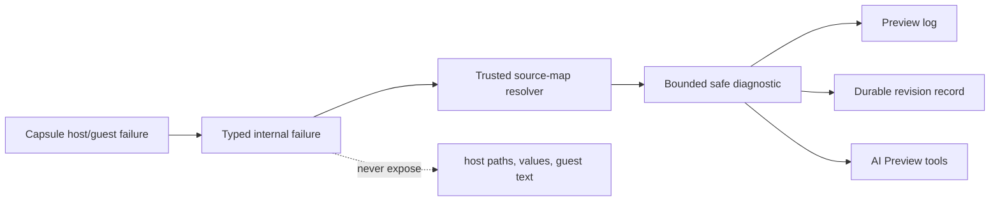

# B71 - Preview: actionable Capsule guest runtime diagnostics
[Overview](../BASED.md)

Replace generic `GUEST_EXCEPTION` failures with bounded diagnostics that name
the rejected operation or capability and, when available, map the failure to a
`widget://` source location.

## Context

The GitHub Repository Snapshot investigation isolated a repeatable runtime
failure:

1. A minimal plain DOM revision mounted successfully.
2. Adding the generated server-function import and initial call failed.
3. Deferring the call until a button click still failed before interaction.

This places the fault at UI module loading or generated server-function binding,
but Preview reported only:

```text
GUEST_EXCEPTION: The Widget Preview guest runtime failed.
The browser sandbox host rejected the operation.
```

There was no operation, capability, module, guest stack, or `widget://`
location. Browser console entries were duplicated opaque objects.

The normalization boundary in
[`fn.preview-diagnostic.ts`](../../packages/ui-ai-chat/src/canvas-extension/fn.preview-diagnostic.ts)
already accepts safe `capability`, `operation`, `file`, `line`, and `column`
fields, but it can only preserve fields supplied by the runtime. Related
boundaries include:

- [`CapsuleWidgetHostCoordinator.ts`](../../packages/ui-ai-chat/src/widget-runtime/CapsuleWidgetHostCoordinator.ts)
  for Capsule event/error mapping;
- [`fn.runtime-diagnostic-source.ts`](../../packages/ui-ai-chat/src/widget-runtime/fn.runtime-diagnostic-source.ts)
  for authoring source metadata;
- [`diagnostic-schema.ts`](../../packages/widget-contract/src/diagnostic-schema.ts)
  for the bounded public diagnostic contract;
- [`PreviewPortalRuntime.ts`](../../packages/ui-ai-chat/src/canvas-extension/PreviewPortalRuntime.ts)
  for durable report/reconcile and visible logs;
- [`WidgetDraftController.ts`](../../packages/service-agent/src/widget-drafts/WidgetDraftController.ts)
  for durable diagnostics and AI-safe authoring results.

## Plan



### 1. Reproduce the server-function binding failure

- Add a plain DOM fixture whose UI imports a generated server function,
  registers it in a click handler, mounts, and does not invoke it.
- Assert the current pre-fix failure occurs before the click.
- Add controls for:
  - the same UI without the server import;
  - the import with no retained binding if tree-shaking removes it;
  - a successful supported server-function invocation.
- Record the Capsule API group, bridge operation, generated module identity,
  artifact hash, and failure phase in bounded test diagnostics.

### 2. Preserve a typed runtime failure through every boundary

- Inspect the Capsule host event/error contract and stop collapsing structured
  errors to opaque `Object` or generic `Error` messages.
- Preserve safe code, category/origin, capability, operation, phase, artifact
  generation, and generated module coordinates through
  `CapsuleWidgetHostCoordinator`.
- Deduplicate the duplicate browser-console/report path by diagnostic
  fingerprint and exact Preview revision.
- Keep fail-closed behavior when data is malformed or untrusted.

### 3. Map generated locations to authored widget source

- Retain source maps as trusted authoring metadata alongside the Preview
  construction; never expose host filesystem paths.
- Resolve generated module/line/column to normalized
  `widget://ui/...` or `widget://server/...` locations before creating the
  public diagnostic.
- If Capsule does not expose the required generated location or rejected
  operation, make the smallest upstream Capsule contract change and pin it with
  a compatibility test.
- Omit unavailable coordinates rather than inventing them.

### 4. Produce actionable, bounded messages

- Extend safe code-specific messages for server-function bridge initialization,
  capability denial, channel rejection, and unsupported guest operations.
- Include attempted revision, phase, capability/operation, mapped source
  location, retryability, and occurrence count.
- Add a short safe remediation category such as “generated binding/platform
  failure; widget source edits are unlikely to help” when evidence supports it.
- Never forward arbitrary guest strings, repository responses, secrets,
  environment values, host paths, dependency source, or unbounded stacks.

### 5. Verify product and agent presentation

- Assert Preview logs show one actionable diagnostic with revision and mapped
  location.
- Assert reload retains the same normalized record and occurrence count.
- Assert Chat/Preview tools receive the bounded structured fields while normal
  browser console output is not duplicated.
- Cover malicious diagnostic fields, huge stacks, invalid paths, cross-revision
  reports, and source-map failures.
- Add a regression that catches the exact server-function binding boundary
  discovered in the investigation.

## TODOS

- [ ] Add the server-function import/binding runtime reproduction.
- [x] Preserve typed Capsule errors through host coordination.
- [x] Add trusted generated-to-`widget://` source mapping.
- [ ] Add safe actionable messages and remediation categories.
- [x] Deduplicate console/report emissions by revision and fingerprint.
- [ ] Add security, reload, and end-to-end diagnostic regressions.

## Acceptance criteria

- The reproduction no longer ends with only generic `GUEST_EXCEPTION`.
- A rejected operation or capability is named when the runtime knows it.
- A valid authoring location is reported as `widget://...` when mapping data is
  available.
- Diagnostics remain bounded, safe, durable, revision-specific, and
  deduplicated.
- The agent can distinguish a platform/bridge failure from a widget-source
  error and avoids unrelated speculative edits.
- No host path, secret, arbitrary guest text, or unbounded stack reaches the UI
  or AI context.

## NOTES

- This task improves diagnostic content. Cross-surface readiness and
  publication gating belong to [`B70`](./B70.md).
- AI access to the result belongs to [`A103`](../a/A103.md).
- Do not weaken Capsule isolation to improve diagnostics.

### LOGS

- 2026-07-31: Created after manual bisection showed that retaining the generated
  server-function binding fails before user interaction while the minimal DOM
  revision mounts.
- 2026-08-04: Validated against current code. Core fixed under A99 (Capsule
  0.10.2); task remains open with narrowed scope.
  - `capsule-mount-error-v2` consumed and typed errors preserved end to end:
    [`fn.error.ts`](../../packages/capsule-omnidraw/src/host/fn.error.ts:214)
    `fnMapCapsuleMountError` keeps category/capsuleCode/capability/operation;
    coordinator gates by artifact hash + lifecycle/runtime generation
    ([`CapsuleWidgetHostCoordinator.ts`](../../packages/ui-ai-chat/src/widget-runtime/CapsuleWidgetHostCoordinator.ts:252));
    pinned contract test
    `packages/capsule-omnidraw/tests/capsule-runtime-location-contract.test.ts`.
  - Verified generated-to-`widget://` mapping implemented: source-map envelope
    binds source revision + Capsule hash
    ([`fn.source-map-artifact.ts`](../../packages/capsule-omnidraw/src/build/fn.source-map-artifact.ts:22));
    browser re-verifies digest/envelope/revision before parsing
    ([`fx.decode-and-verify-source-map-artifact.ts`](../../packages/ui-ai-chat/src/widget-runtime/fx.decode-and-verify-source-map-artifact.ts:34));
    mapper emits only allowlisted `widget://` locations
    ([`fn.runtime-diagnostic-source.ts`](../../packages/ui-ai-chat/src/widget-runtime/fn.runtime-diagnostic-source.ts:31)).
  - Dedup by fingerprint + exact revision with durable occurrenceCount:
    [`WidgetDraftController.ts`](../../packages/service-agent/src/widget-drafts/WidgetDraftController.ts:830);
    opaque duplicated console entries replaced by one bounded diagnostic.
  - STILL OPEN: (1) the server-function import/binding runtime reproduction
    fixture and its dedicated regression (acceptance criterion 1 is
    unverifiable without it); (2) code-specific messages exist only for four
    codes ([`fn.preview-diagnostic.ts`](../../packages/ui-ai-chat/src/canvas-extension/fn.preview-diagnostic.ts:106))
    - none for server-function bridge init, channel rejection, or capability
    denial; (3) no safe remediation category in
    [`diagnostic-schema.ts`](../../packages/widget-contract/src/diagnostic-schema.ts:11);
    (4) `retryability` hard-coded to `'unknown'`
    (fn.preview-diagnostic.ts:189).

---
