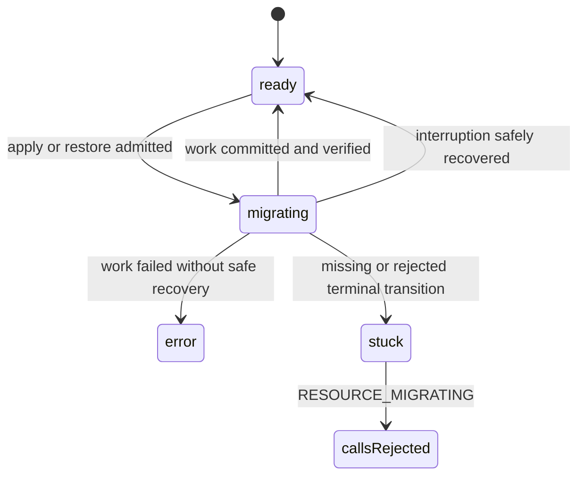

# B72 - db resources: migration can leave calls stuck on `RESOURCE_MIGRATING`
[Overview](../BASED.md)

Investigate and fix the intermittent DB-resource lifecycle failure where normal
calls continue returning `RESOURCE_MIGRATING` after database migration work
should have completed.

## Context

The CLI repeatedly surfaced this API failure while invoking a resource:

```text
RESOURCE_ERROR: Resource is not ready for calls.
data.code: RESOURCE_MIGRATING
```

The outer `RESOURCE_ERROR` is created by
[`api.resource-error.ts`](../../packages/api/src/resource/api.resource-error.ts),
while the safe inner code originates from the durable resource status checked
by
[`ResourceStoreService.ts`](../../packages/resource-runtime/src/local/ResourceStoreService.ts).
The failure may be correct during an active migration, but it must not persist
after the migration has succeeded, failed, or been recovered.

The lifecycle crosses several independently persisted and in-memory states:

- [`DbResourceCoordinator.ts`](../../packages/resource-runtime/src/local/DbResourceCoordinator.ts)
  creates and executes apply records, drains consumers, and reconciles
  interrupted work;
- [`ResourceManager.ts`](../../packages/resource-runtime/src/local/ResourceManager.ts)
  gates calls and changes the catalog resource from `ready` to `migrating`;
- [`ResourceService.ts`](../../apps/cli/src/services/ResourceService.ts)
  composes the coordinator and adapts catalog state changes to the durable
  control store;
- [`ResourceControlStoreTurso.ts`](../../packages/service-db/src/ResourceControlStoreTurso.ts)
  persists compare-and-set resource status transitions.

Initial reading shows a leading hypothesis: successful
`coordinateResourceMigration` work sets `status: "migrating"` before running
the operation, but its visible success path does not restore `status: "ready"`.
Startup reconciliation may later repair the catalog state, which would explain
why the problem appears intermittent. This must be reproduced and checked
against apply, restore, failure, cancellation, shutdown, and restart paths
before changing lifecycle behavior.

## Plan



### 1. Capture exact failure evidence

- Reproduce the issue with a disposable DB resource through the same CLI/API
  composition as the report.
- Record bounded identifiers and timestamps for the resource, draft, apply,
  placement epoch, drain lease, and process lifetime.
- At each phase, inspect the resource catalog row, apply/draft records,
  physical migration evidence, active-use state, and emitted error code.
- Determine whether the repeated errors happen during active work or after all
  apply/recovery work is terminal.

### 2. Prove every lifecycle transition

- Trace `ready -> migrating -> ready|error` across the coordinator, manager,
  durable control store, and physical DB operation.
- Exercise successful apply, failed apply, successful restore, failed restore,
  drain timeout, process close, and crash/restart at each durable boundary.
- Test concurrent calls and concurrent apply attempts so an old completion
  cannot overwrite a newer lifecycle state.
- Confirm whether compare-and-set failures, detached-task shutdown, or startup
  reconciliation can leave catalog status inconsistent with apply records.

### 3. Repair the proven ownership gap

- Give one lifecycle owner responsibility for writing each terminal resource
  state after physical work and verification complete.
- Make terminal transitions compare-and-set against the exact admitted
  migration/apply generation; do not let stale work mark newer work ready.
- Keep calls fail-closed with `RESOURCE_MIGRATING` only while coordinated work
  is genuinely active.
- On interruption, reconcile from durable apply and physical backup evidence;
  never infer success solely from a stale catalog status.
- Preserve the original safe failure on unrecoverable work and avoid automatic
  retries of non-idempotent migration SQL.

### 4. Improve bounded diagnostics

- Include safe resource/apply correlation and lifecycle phase in server logs
  without exposing SQL, parameters, filesystem paths, or native error objects.
- Preserve `RESOURCE_MIGRATING` as the inner stable code for an active
  migration, while ensuring callers can distinguish transient active work from
  a terminal migration failure through the control/status API.
- Avoid noisy repeated stack traces for the same expected transient gate.

### 5. Add regression coverage

- Add a deterministic success test proving the first post-migration call is
  admitted without restarting the process.
- Add failure and interruption tests proving no resource remains indefinitely
  `migrating` when there is no active apply or recovery work.
- Add concurrency tests for stale completions and compare-and-set conflicts.
- Cover startup reconciliation from each persisted intermediate boundary.
- Run resource-runtime, service-db, CLI/API, type, functional-core, and
  architecture verification.

## TODOS

- [ ] Reproduce the reported repeated `RESOURCE_MIGRATING` failure end to end.
- [ ] Correlate catalog, apply, draft, drain, and physical migration state.
- [ ] Prove the missing or rejected terminal transition and its restart behavior.
- [ ] Implement exact-generation terminal lifecycle ownership.
- [ ] Add bounded diagnostics without leaking resource contents.
- [ ] Add success, failure, interruption, restart, and concurrency regressions.
- [ ] Run affected verification and record the root cause and results.

## Acceptance criteria

- A successful migration returns the resource to `ready` before its completion
  is reported, and a call made immediately afterward succeeds without restart.
- Failed or interrupted work reaches a durable `error`, recovered, or retryable
  state backed by apply and physical evidence; it cannot remain orphaned in
  `migrating`.
- `RESOURCE_MIGRATING` is returned only while matching migration work is
  actively owned or being reconciled.
- Concurrent or stale migration completions cannot overwrite newer resource
  state.
- Restart recovery is deterministic for every persisted apply phase and does
  not rerun non-idempotent SQL blindly.
- Logs identify the lifecycle phase and safe correlation IDs without exposing
  SQL, parameters, paths, or native errors.

## NOTES

- A UI mockup is not useful for this backend lifecycle investigation.
- This task concerns per-resource DB structure apply/restore lifecycle, not the
  control database's embedded startup migrations handled by
  [`DbServiceTurso`](../../packages/service-db/src/DbServiceTurso/DbServiceTurso.ts).
- Do not hide the bug with client-side retries. A retry policy can be considered
  only after the authoritative lifecycle reaches correct terminal states.

### LOGS

- 2026-08-02: Created from repeated CLI/API `RESOURCE_ERROR` responses carrying
  `data.code = RESOURCE_MIGRATING`. Initial source tracing identified the
  success transition out of `ResourceManager.coordinateResourceMigration` as
  the first hypothesis to reproduce.

---
