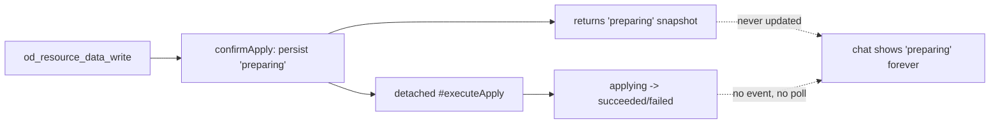

# B75 - db resource tool: apply reported stuck in `preparing` though it succeeded
[Overview](../BASED.md)

`od_resource_data_write` on a `db` resource always reports
`applyStatus: "preparing"` even when the apply succeeded milliseconds later.
Nothing ever re-reports the terminal status, so the model, the chat transcript,
and the user all believe the database is stuck. Reload does not help because the
frozen tool result is all the chat ever shows.

## Context

Reported flow: create KV store (works, results show committed entries) -> create
SQL db -> write sample data -> tool result says `staged: true,
applyStatus: "preparing"`, assistant tells the user the change is "awaiting its
durable apply step", and the user concludes the db is broken. Reload shows the
same stale transcript.

Verified against the live `.omnidraw/main.db`: both `db_resource_apply_runs`
rows are `succeeded` (22ms and 37ms after creation), the draft is `applied`,
and the physical `data.db` contains the written table and rows. The apply works;
the reporting is broken.

Root cause, in [`DbResourceCoordinator.ts`](../../packages/resource-runtime/src/local/DbResourceCoordinator.ts)
(`confirmApply`, lines 358-373):

1. `createFromDraft` persists the apply row as `preparing`.
2. `#track(this.#executeApply(...))` (line 371) runs the real apply as a
   detached fire-and-forget task.
3. `confirmApply` returns the `preparing` snapshot immediately (line 372),
   before the task runs.

[`tool.resources.ts`](../../packages/service-agent/src/tools/tool.resources.ts)
(`executeDbWriteBatch`, lines 253-285) copies that snapshot straight into the
tool result (`applyStatus: apply.status`, line 273), and
[`resource-tools.test.ts`](../../packages/service-agent/tests/resource-tools.test.ts:511)
locks `"preparing"` in as the expected output. KV writes commit synchronously,
so only the db path misreports.

No completion signal exists anywhere downstream:

- the resource API contract
  ([`contract.ts`](../../packages/api/src/resource/contract.ts)) has no
  apply-status event/subscription (canvas, widget, agent, notification domains
  all have one);
- `packages/ui-ai-chat` never re-queries `dbApplies.get`; tool results render as
  plain collapsed text and nothing parses `applyStatus`;
- [`DbResourcePage.tsx`](../../apps/frontend/src/feature/db-resource/DbResourcePage.tsx)
  polls (lines 521-530) only after the page's own confirm button; `loadMeta`
  (lines 180-217) fetches apply runs once and never resumes polling;
- `apps/widget-debug-tools` wires resource tools without a `resourceService`,
  so the lab cannot reproduce or verify this path.

Secondary wedge risk: `#executeApply`'s terminal failure write is
`.catch(() => null)` (line 521). If that write is lost, the row stays
`preparing`, `#requireNoActiveApply` (lines 651-654) blocks every future write
with `DB_RESOURCE_APPLY_IN_PROGRESS`, and only a full server restart heals it
via `reconcileStartup` (lines 449-472) - page reloads never re-run it because
the tenant `ResourceService` is pooled.

## Plan

### 1. Make the tool report the real outcome

- After `confirmDbApply`, poll `dbApplies.get` (bounded: short interval, ~5s
  deadline) until the run reaches a terminal status
  (`succeeded`/`failed`/`recovered`) and return that status plus warnings.
- Keep the fast path: the apply normally finishes in tens of milliseconds, so
  one or two polls suffice.
- On timeout, return the last known status explicitly as non-terminal instead
  of implying completion.
- Update `resource-tools.test.ts` to expect the terminal status.

### 2. Self-heal stale non-terminal runs

- When `confirmApply`/`previewDbApply`/`getApply` observes a `preparing` or
  `applying` run older than a small grace window with no live owner, run the
  same `#reconcileApply` logic used by `reconcileStartup` instead of only
  failing with `DB_RESOURCE_APPLY_IN_PROGRESS`.
- Stop swallowing `#executeApply`'s terminal write failure
  (`.catch(() => null)`): log bounded diagnostics and leave the row
  reconcilable.

### 3. Let the frontend observe completion

- Resume `pollApply` on `DbResourcePage` load for any non-terminal run found by
  `loadMeta`, so reload converges to the true state.
- Out of scope unless it falls out naturally: a resource apply-status event in
  the API contract. Record as follow-up if skipped.

### 4. Verification

- Unit: coordinator await/reconcile behavior; tool result mapping.
- Integration: chat-path db write reports `succeeded`; forced failure reports
  `failed`; wedged `preparing` row self-heals without restart.
- Manual: reproduce the reported chat session (create db, write data, confirm
  the model-visible result says `succeeded` and the db page shows rows without
  reload).
- Run service-agent, resource-runtime, service-db, and api tests plus lint and
  typecheck.

## TODOS

- [ ] Poll `dbApplies.get` in the db write tool path and return terminal status.
- [ ] Update `resource-tools.test.ts` expectations.
- [ ] Lazy-reconcile stale `preparing`/`applying` runs on demand.
- [ ] Replace `.catch(() => null)` on the terminal write with logged escalation.
- [ ] Resume apply polling on `DbResourcePage` load for non-terminal runs.
- [ ] Add unit/integration regressions for success, failure, and wedged rows.
- [ ] Reproduce the original chat session and confirm correct reporting.
- [ ] Run affected tests, lint, and typecheck; record results.

## NOTES

- A mockup image is not useful; this is a backend reporting/lifecycle bug.
- Do not fix this in the chat UI by parsing `applyStatus` - the tool result
  itself must become truthful.
- `apps/widget-debug-tools` cannot exercise this path today (no
  `resourceService` wired); consider wiring it so the lab can regression-test
  resource writes, or cover via service-level integration tests instead.
- Related: B72 (migration lifecycle stuck on `RESOURCE_MIGRATING`) - same
  coordinator family, different lifecycle state.

### LOGS

- 2026-08-03: Created from a chat session where `od_resource_data_write` on a
  new SQL db returned `applyStatus: "preparing"` and the user reported the db
  stuck even after reload. Live DB inspection showed the apply succeeded in
  22ms; root cause traced to `DbResourceCoordinator.confirmApply` returning the
  pre-execution snapshot and the absence of any completion signal to chat or
  frontend.

---
