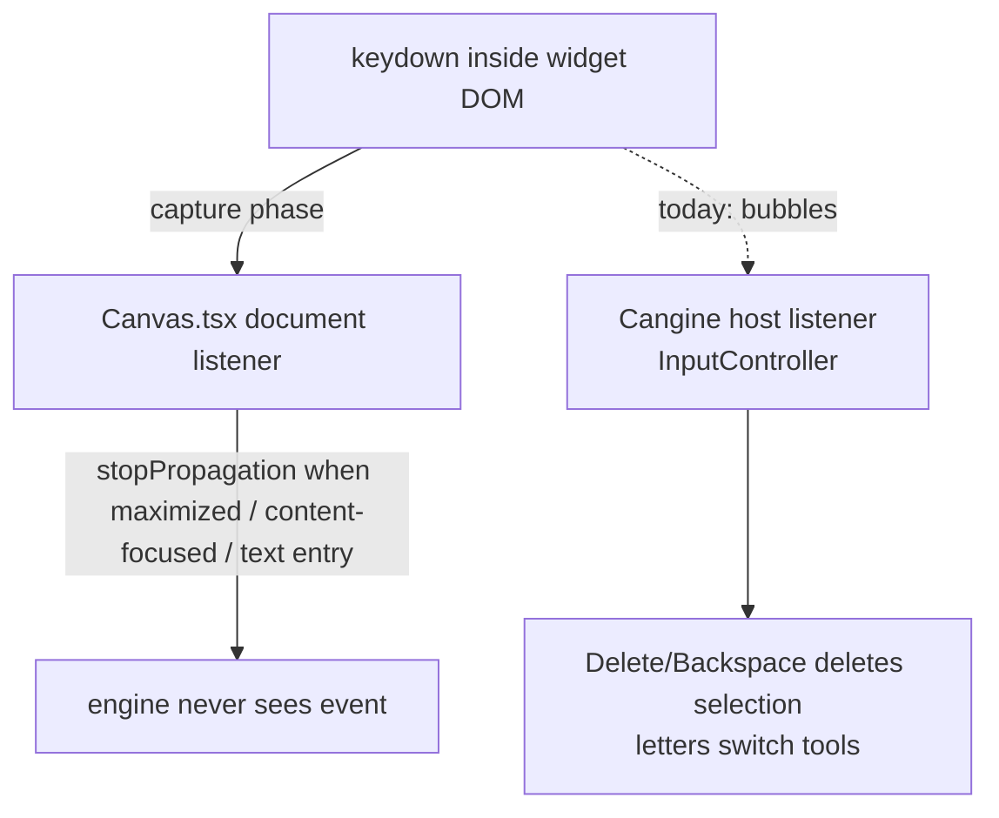

# B76 - widgets: focused/maximized widget keys leak into canvas shortcuts
[Overview](../BASED.md)

> Superseded by [B80](B80.md) (2026-08-06): same bug, re-investigated against
> cangine 0.6.1 with an executable plan (runtime `stopRouting` input gate,
> auto-focus, selector fix). The root-cause analysis below remains accurate.

Keyboard events typed inside a focused widget still trigger canvas shortcuts.
Worst case: Backspace/Delete in maximized (fullscreen) widget mode deletes the
widget itself; typing `v/h/r/o/p/t/c/a/w/e` switches the active canvas tool.

## Context

Widgets are plain DOM, not iframes. Cangine renders widget portals as
`
` inside the canvas host element
(`node_modules/@omnidraw/cangine/dist/portals/HtmlPortalManager.js`, mounted by
`packages/ui-ai-chat/src/canvas-extension/PreviewPortalRuntime.ts`). Every
keydown inside a widget therefore bubbles up to the host element where two
keyboard systems listen:

1. **Solid host shortcuts** — `packages/canvas/src/components/Canvas.tsx:343`
   `handleKeyboardShortcut`, registered capture-phase on `document`
   (`Canvas.tsx:710-713`). Has guards at `Canvas.tsx:370-378` (repeat,
   maximized-widget shell, widget-content-focused, text-entry target). Mostly fine.

2. **Cangine engine shortcuts (broken)** — the engine listens bubble-phase on
   the host element with **no target/editable filtering**
   (`node_modules/@omnidraw/cangine/dist/input/InputController.js`).
   `dist/editor/standard-tools.js` maps `Delete/Backspace → EDITOR_COMMAND_DELETE_SELECTION`
   and `v/h/r/o/p/t/c/a/w/e → setActiveTool`. The only swallow guard is in
   `WidgetInteractionController` (`#a`): it consumes key-down/key-up only when
   `contentNodeId !== null` (widget is `"content-focused"`).

Why maximized mode is unprotected:

- `dist/editor/standard-session.js` `resolveWidgetMode` returns `"maximized"`
  for a maximized widget, never `"content-focused"`, so the standard-tools
  guard does not match.
- `packages/canvas/src/runtime.ts:760-773` actively calls
  `session.widgets.clearContentFocus()` when a widget is maximized, disabling
  the `WidgetInteractionController` swallow too.
- The maximized widget stays selected, so Backspace deletes the widget itself.

Secondary latent bug: `Canvas.tsx:98-102` `isWidgetContentTarget` matches
`[data-omnidraw-portal-id]`, but the engine stamps
`data-vibecanvas-portal-id`. The guard never matches real widget DOM (masked
only because `isTextEntryTarget` catches input/textarea/contentEditable).

Related: [A105](../../tasks/a/A105.md) (exclusive maximized-widget shell).

## Plan

Fix repo-side (engine `@omnidraw/cangine` ships prebuilt here; engine fix is a
separate release):

1. In `Canvas.tsx` capture-phase keydown (and keyup) path: when
   `shellState().kind === 'maximized-widget'`, `event.stopPropagation()` for
   all keys so the engine never receives them. Escape must still flow to the
   existing `handleMaximizedEscape` (`Canvas.tsx:424`) and
   `scheduleMaximizedEscapeFallback` (`Canvas.tsx:439`) so fullscreen exit
   keeps working (stop propagation to the engine, but still run the local
   restore logic).
2. Same capture path: `stopPropagation` when
   `activeRuntime?.widgetContentFocused()` and target is inside a widget
   portal, or when `isTextEntryTarget(event.target)` — this covers engine
   shortcuts too, not only toolbar contribution shortcuts.
3. Fix `isWidgetContentTarget` (`Canvas.tsx:100`) to match
   `data-vibecanvas-portal-id` (or stamp `data-omnidraw-portal-id` in
   `PreviewPortalRuntime`).
4. Add regression tests in `packages/canvas/tests/components/`:
   - Backspace in maximized widget must not delete the widget.
   - `v`/`h` keydown inside maximized widget must not switch active tool.
   - Typing in an input inside a content-focused widget must not switch tools.
5. Follow-up (not this task): fix inside `@omnidraw/cangine` — swallow keys
   when `maximizedNodeId !== null` in `WidgetInteractionController` and add an
   editable-target check in `InputController`.

## TODOS

- [ ] capture-phase key suppression for maximized-widget shell (keep Escape working)
- [ ] capture-phase suppression for content-focused widget targets and text-entry targets
- [ ] fix `isWidgetContentTarget` portal attribute selector
- [ ] regression tests for delete/tool-key leaks
- [ ] verify: `bun run --cwd packages/canvas typecheck && bun run --cwd packages/canvas test`

## NOTES

- Engine key path inspects no DOM target at all; repo-side capture
  stopPropagation is the only seam that works without a Cangine release.
- `Canvas.tsx:371` already early-returns toolbar shortcuts in maximized mode,
  but that does not stop the engine's host-level listener.

### LOGS

- 2026-08-04: investigated keydown leak; root-caused to Cangine engine
  host-level keydown listener with no maximized/editable guard; wrote task.
