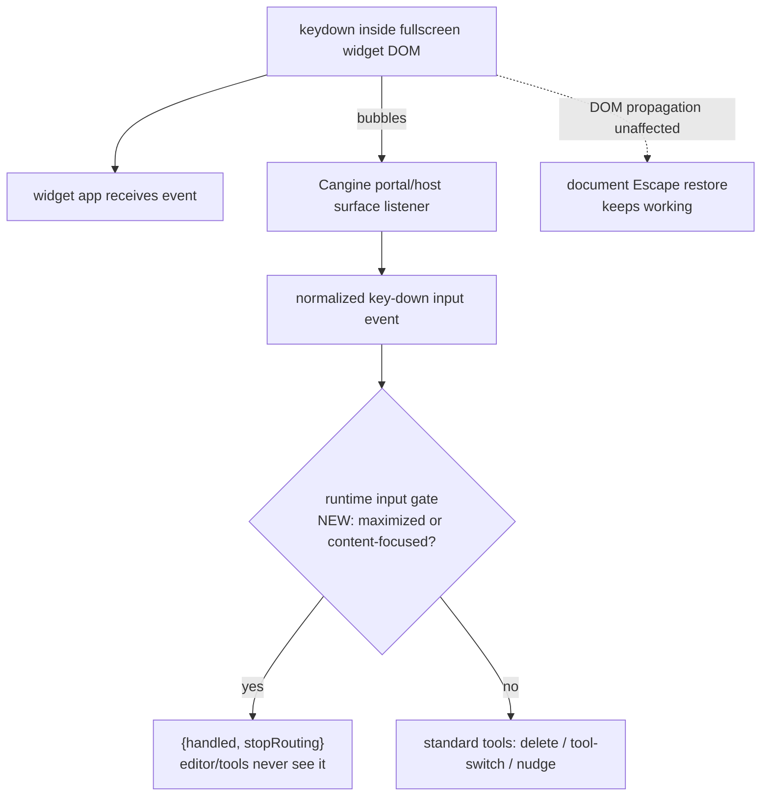

# B80 - widgets: fullscreen widget keyboard leaks to canvas shortcuts
[Overview](../BASED.md)

With a widget in fullscreen (maximized) mode, keys typed into the widget still
drive the canvas: `r`/`o`/... switch tools, arrows nudge the frame, Ctrl/Cmd+Z
or +D run canvas commands, and worst, Backspace/Delete deletes the maximized
widget itself. The widget should own all input while fullscreen, and focus
should move into it automatically.

## Context

Supersedes [B76](B76.md) (same bug, re-investigated against the current
code; B76 is marked dropped). Violates the A105 acceptance criterion "Canvas
operations and shortcuts cannot run while the maximized widget owns the shell"
([A105](../a/A105.md)) — A105 suppressed the host overlays and Canvas.tsx
shortcuts, but not the Cangine engine key path.

Widgets are plain DOM, not iframes. Cangine mounts each portal as
`
` (content host, `tabIndex = -1`, this is
the `host` passed to `registerPortal({ mount({ host }) })`), optionally wrapped
in a `data-vibecanvas-widget-shell` element that is registered as an engine
input surface (`node_modules/@omnidraw/cangine/dist/portals/HtmlPortalManager.js`).
Every keydown inside a widget therefore reaches Cangine's `InputController`,
which listens bubble-phase on every surface with **no target/editable
filtering** (`dist/input/InputController.js`) and dispatches normalized
`key-down`/`key-up` events to subscribers in registration order.

Why maximized mode is unprotected (verified on cangine 0.6.1):

1. The only engine key guard is `WidgetInteractionController.#a`
   (`dist/editor/WidgetInteractionController.js`): it returns
   `{handled, stopPropagation}` for key events only when
   `contentNodeId !== null` (contained content-focus mode).
2. Maximized mode never matches that guard:
   - `createStandardEditorSession` resolves widget mode as `"maximized"`
     (never `"content-focused"`) for the maximized node
     (`dist/editor/standard-session.js`).
   - `packages/canvas/src/runtime.ts` `projectShell` actively calls
     `session.widgets.clearContentFocus()` when the maximized widget holds
     content focus (A105's "implicit content interaction" design).
3. So `CanvasEditor` + standard tools receive every key:
   `dist/editor/standard-tools.js` maps `Delete/Backspace →
   EDITOR_COMMAND_DELETE_SELECTION` (the maximized widget stays selected, so it
   dies), letters `v/h/r/o/p/t/c/a/w/e → setActiveTool`, arrows → selection
   nudge, Ctrl/Cmd+Z/Y/A/G/D/C → commands.
4. `packages/canvas/src/components/Canvas.tsx` `handleKeyboardShortcut`
   (document capture listener) already early-returns in `maximized-widget`
   shell, so host-side contribution shortcuts (`c` chat etc.) are safe — but it
   does not (and cannot, without killing widget-target dispatch) stop the
   engine path above.
5. Latent guard bug: `Canvas.tsx` `isWidgetContentTarget` matches
   `[data-omnidraw-portal-id]`, but Cangine stamps
   `data-vibecanvas-portal-id` — so the content-focused guard for
   contribution shortcuts only works via `isTextEntryTarget`
   (input/textarea/contentEditable).
6. Nothing moves DOM focus into the widget on maximize, so even harmless keys
   don't reach the widget app until the user clicks inside.

Key seams discovered:

- `TInputDisposition.stopRouting` (`dist/types.d.ts`): "Stops later normalized
  subscribers without stopping the source event." Returning
  `{ handled: true, stopRouting: true }` from an early `engine.input.subscribe`
  listener blocks the editor/tools while the DOM event keeps bubbling — so
  Canvas.tsx document-level Escape restore (`handleMaximizedEscape`,
  `scheduleMaximizedEscapeFallback`) keeps working.
- Subscriber order is registration order: session controllers only subscribe in
  `session.attach()` (widgets before editor), and `runtime.ts` calls
  `editorSession.attach()` late in `boot()` — a runtime interceptor installed
  before `attach()` runs first.
- The Cangine portal content host already has `tabIndex = -1`, so the runtime
  can programmatically focus it (generic auto-focus without touching widget
  internals); `engine.scene.get(nodeId)?.portal?.portalId` +
  `config.container.querySelector('[data-vibecanvas-portal-id="..."]')`.

## Plan

All fixes are repo-side; no Cangine release required.

### 1. Runtime keyboard gate (`packages/canvas/src/runtime.ts`)

- In `buildRuntime` boot, after `createStandardEditorSession` and **before
  `editorSession.attach()`**, subscribe an interceptor to `engine.input`;
  retain the release handle with the other `release*` handles and dispose it in
  `shutdown` (before session teardown).
- For `key-down`/`key-up` events only, return
  `{ handled: true, stopRouting: true }` when
  `editorSession.widgets.state.maximizedNodeId !== null`.
- Also swallow when `widgets.state.contentNodeId !== null` as defense in depth
  (mirrors the engine's own content-focus guard and covers races around
  subscription order).
- Do not use `stopPropagation` in the disposition: that also calls native
  `stopPropagation` on the source DOM event and would break the document-level
  Escape restore path.
- Verify during implementation whether `wheel` should be gated the same way
  (maximized wheel currently pans/zooms the hidden camera behind the widget).

### 2. Auto-focus the fullscreen widget (`packages/canvas/src/runtime.ts`)

- In `projectShell`, on transition into `maximized-widget`: if the active
  element is not already inside the maximized widget's portal, focus the portal
  content host (`engine.scene.get(maximizedNodeId)?.portal?.portalId` →
  `config.container.querySelector('[data-vibecanvas-portal-id="..."]')`,
  `focus({ preventScroll: true })`).
- On transition out (restore/invalidation), if focus is still inside the
  departed portal, return it to the canvas surface (`engine.input.focus()`) so
  canvas shortcuts work immediately.
- Extensions may refine focus within their own content later (e.g. AI Chat
  composer) — the runtime owns only the generic fallback.

### 3. Canvas.tsx guard fix (`packages/canvas/src/components/Canvas.tsx`)

- Fix `isWidgetContentTarget` to match `[data-vibecanvas-portal-id]` so
  contribution shortcuts and trace redaction recognize real widget DOM inside
  content-focused widgets. Keep the existing maximized early-return unchanged.

### 4. Tests

- `packages/canvas/tests/runtime.test.ts` (mock engine exposes
  `input.subscribe` via `runtimeState.inputListener`):
  - maximized + `key-down` (e.g. Backspace) → disposition
    `{handled: true, stopRouting: true}`; no swallow when not maximized and not
    content-focused; swallow when content-focused.
  - focus movement on shell transitions (jsdom focus assertions).
- `packages/canvas/tests/components/` (extend
  `Canvas.ai-chat-shortcut.test.ts` patterns): contribution shortcuts
  suppressed for events targeted inside `data-vibecanvas-portal-id` while
  content-focused; maximized behavior stays intact.
- Run: `bun run --cwd packages/canvas typecheck && bun run --cwd packages/canvas test`,
  plus ui-ai-chat tests.

### 5. Versioning

- `packages/canvas/src/` behavior change → bump `@omnidraw/canvas`
  `0.6.1 → 0.6.2` (patch), update the pin in
  `scripts/architecture-boundaries.test.ts`, and refresh `bun.lock`.
  Note: bun 1.3.x does not resync workspace `version` fields in `bun.lock` on
  version-only bumps — update the entry directly and validate with
  `bun install --frozen-lockfile` (see A112 log).
- `@omnidraw/ui-ai-chat` stays unversioned unless its `src/` changes.

### Out of scope

- Upstream Cangine fix (swallow keys in `WidgetInteractionController` when
  `maximizedNodeId !== null`; editable-target filtering in `InputController`)
  — separate engine release, can delete the runtime gate afterwards.
- Space+drag pan while maximized (navigation key tracker is DOM-level).
- Pointer-policy audit for maximized content (A105 browser QA passed there).

## TODOS

- [ ] runtime input gate swallowing key-down/key-up (stopRouting) while maximized or content-focused
- [ ] auto-focus maximized portal content host; restore canvas focus on exit
- [ ] fix `isWidgetContentTarget` selector to `data-vibecanvas-portal-id`
- [ ] runtime + component regression tests (Backspace/letter/nudge leaks, focus)
- [ ] verify wheel leak while maximized (gate or document as separate bug)
- [ ] bump `@omnidraw/canvas` to 0.6.2, lockfile + architecture pin
- [ ] manual check: fullscreen AI Chat — typing/Backspace/arrows/Cmd+Z reach chat only; Escape restores; canvas shortcuts work after restore

## NOTES

- Cangine dispatch iterates `engine.input` subscribers in registration order;
  the gate must subscribe before `editorSession.attach()` to run first.
- `stopRouting` (not `stopPropagation`) keeps the native DOM event alive so
  Canvas.tsx Escape restore and widget-owned key handlers keep working.
- Cangine still stamps `data-vibecanvas-*` attributes post-rename; treat the
  attribute name as an engine contract detail when implementing.
- The maximized widget remains in `editor.state.selectedNodeIds` (only the
  transform overlay is suppressed) — that is why Backspace deletes it today.

### LOGS

- 2026-08-06: re-investigated on cangine 0.6.1; confirmed root cause matches
  B76, discovered the `stopRouting` input-disposition seam, portal
  `tabIndex=-1` auto-focus path, and session attach-order guarantee; wrote
  task and superseded B76.
