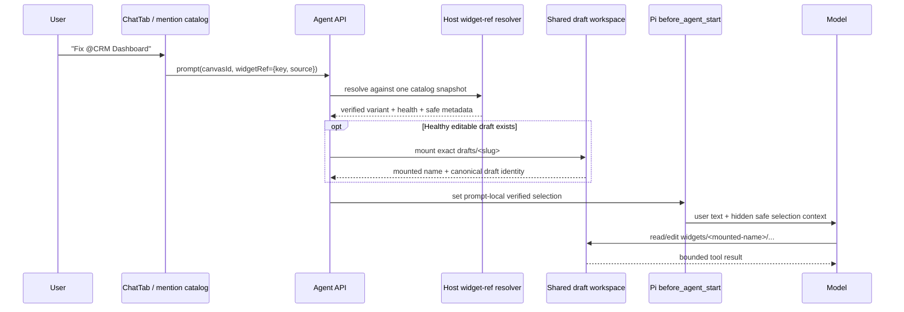

# B83 - AI chat: resolve widget mentions to one safe authoring target
[Overview](../BASED.md)

Make `@widget` mentions reach the agent as verified, prompt-local context and
mount the intended editable draft when one exists. The UI and API already
send `{ name, source }` widget references, but `AgentService` rejects every
non-empty list with `OPERATION_UNAVAILABLE` before Pi receives the prompt.

This is implementation order **2 of 5**. It depends on [D10](../d/D10.md)'s
source/build generation model and provides target identity to
[B84](B84.md) and [A119](../a/A119.md).

## Context

### The current request dies at the service boundary

1. [`fn.mention-catalog.ts`](../../packages/ui-ai-chat/src/chat/mention-catalog/fn.mention-catalog.ts)
   projects each healthy catalog variant to a stable mention target:
   `widget:<source>:<widgetKey>`.
2. [`ChatTab.tsx`](../../packages/ui-ai-chat/src/chat/components/tabs/ChatTab.tsx)
   sends widget mentions as `widgetRefs: [{ name, source }]`.
3. [`contract.ts`](../../packages/api/src/agent/contract.ts) validates up to 16
   strict draft/published refs.
4. [`AgentService.ts`](../../packages/service-agent/src/AgentService.ts) throws
   `OPERATION_UNAVAILABLE: Filesystem widget mention resolution is not
   configured.` for every non-empty `widgetRefs` array.
5. The Pi session never starts the turn, so the agent cannot inspect, edit, or
   diagnose the mentioned widget.

### A mention is not just display text

The mention must establish four separate facts without conflating them:

- **Catalog identity:** the exact `widgetKey` and requested `draft` or
  `published` variant from a current catalog snapshot.
- **Editable target:** a mutable draft mounted under
  `workspace/widgets/<manifest name>` when a healthy draft exists.
- **Runtime context:** the current canvas identity, needed later to distinguish
  a definition from a concrete canvas instance.
- **LLM context:** bounded safe metadata stating what the user selected. A Pi
  custom transcript entry alone is insufficient because `appendEntry` does
  not participate in LLM context.

[`llm.pi.extensions.md`](../../docs/external/llm.pi.extensions.md) documents
that `before_agent_start` can inject a model-visible custom message or adjust
the system prompt for one turn, while `appendEntry` persists extension state
without adding LLM context. Use those contracts deliberately.

### Canvas scope is currently discarded

AI Chat is rendered by the canvas extension with a real
`context.config.canvasId`, but `AgentService.#ensureChatMetadata` creates chat
metadata with `canvasId: null`. The existing `widgetId` in the chat API is the
AI-chat canvas node ID; it is not the mentioned widget definition and cannot
stand in for the target widget instance.

### Draft and published variants have different authority

The current filesystem-first widget model in
[`llm.widget-system.md`](../../docs/internal/llm.widget-system.md) has mutable
source only under `drafts/<slug>/`. A published folder is an immutable runtime
publication. A published mention may identify what the user is talking about,
but it must never mount the published folder as writable source.

## Fixed decisions

1. Resolve widget refs server-side against one pinned/refreshed catalog
   snapshot immediately before prompting. Never trust the label or source
   variant merely because the browser sent it.
2. Preserve the existing public identity shape `{ name: widgetKey, source }`
   unless an implementation proves a contract extension is necessary. Labels
   remain presentation only.
3. A healthy draft mention mounts that exact shared draft into the chat
   workspace before the LLM turn starts.
4. A published mention identifies the current immutable publication. If the
   same widget key has a healthy draft, the host may additionally mount that
   draft and must tell the model that edits affect the draft, not the published
   runtime. A published-only entry remains read-only and returns an actionable
   result; it is never copied from `published/` as if runtime files were source.
5. The current canvas ID is authenticated host context. Pass and persist it at
   connect/create time; do not infer it from prompt text.
6. Prompt-local mention context and the chat's active editable target have
   different lifetimes:
   - each turn reports only refs explicitly submitted with that prompt;
   - one unambiguous editable target may remain active for mentionless
     continuations such as “continue”;
   - an explicit new single target replaces the active target;
   - multiple refs are comparison context and do not silently select one for
     mutation.
7. Unknown, stale, unhealthy, source-mismatched, or ambiguous refs fail before
   the LLM turn with a safe typed error. Do not silently fall back to a widget
   with the same display label.
8. Use a host-owned Pi extension hook (`before_agent_start`) for bounded
   selection context. Do not concatenate hidden instructions into the user's
   visible text and do not claim `appendEntry` is model-visible.
9. Widget mention resolution does not itself approve a resource operation or
   publish a draft. [B84](B84.md) separately lets the agent receive an exact
   resource ID from an authoritative resource result and write it into the
   mounted draft's `omnidraw.json`.

## Plan



### 1. Carry authenticated canvas context into the chat session

- Extend the canvas-to-chat composition so connect/new-session/prompt calls
  have the current `canvasId` as host-owned scope.
- Validate that the AI-chat `widgetId` belongs to that canvas before accepting
  it when the existing canvas query boundary can prove this cheaply.
- Persist the real canvas ID in chat metadata instead of `null` on first
  creation. On reconnect, reject a conflicting canvas scope rather than moving
  one chat silently between canvases.
- Historical chats with no canvas ID remain readable. They can edit a
  mentioned draft but cannot perform instance-scoped repair until attached to
  a verified canvas context.
- Do not treat a widget mention as a concrete widget-instance binding target.
  Resource identity is definition-level manifest configuration under
  [B84](B84.md), not per-instance canvas state.

### 2. Add one injected filesystem catalog resolver

Define a service-agent port implemented by the CLI/widget catalog composition.
Given the submitted refs, it must:

- deduplicate exact `{ widgetKey, source }` pairs while preserving stable
  prompt order;
- reject more than the contract limit and impossible keys defensively;
- pin one catalog generation/digest for the complete resolution;
- return bounded safe fields only: widget key, variant, manifest display name,
  health, draft availability, publication availability, and current resource
  requirement summaries;
- keep host paths, release bytes, unrelated resource IDs, and catalog internals
  out of this mention resolver's model-facing projection; B84 owns the separate
  authoritative resource-result contract;
- distinguish `WIDGET_REFERENCE_STALE`, `WIDGET_REFERENCE_UNHEALTHY`,
  `WIDGET_DRAFT_UNAVAILABLE`, and `WIDGET_REFERENCE_AMBIGUOUS`.

Do not call the browser catalog and then trust its old answer. The server
catalog is the decision authority.

### 3. Mount editable targets safely

- For a verified draft ref, call the existing shared-draft mount path and
  verify manifest name/slug after resolving the symlink target.
- For a verified published ref with a healthy matching draft, mount only the
  draft and label the selection as `requestedVariant: published,
  editableVariant: draft`.
- For published-only refs, allow bounded catalog/file inspection through
  existing read APIs if available, but do not point `WidgetWorkspace` at the
  immutable published folder and do not synthesize source from `dist/`.
- Pin the catalog identity and observed source/build generation while mounting.
  External editors remain allowed; if files change afterward, D10 marks the
  accepted build stale rather than pretending the mount locked the repository.
- Record one unambiguous active mount in the existing active-widget custom
  state. Flush it durably so reconnect and continuation use the same target.

### 4. Inject prompt-local selection context through Pi

Add an inline host extension when creating each agent session. Immediately
before `session.prompt`:

- provide the extension an immutable one-turn selection snapshot;
- have `before_agent_start` inject a non-user custom message containing a
  bounded machine-readable summary;
- clear that one-turn snapshot after injection or aborted prompt start;
- include `canvasId`, explicitly mentioned widget refs, the active editable
  target, mounted display path, and safe manifest requirement summaries;
- never include absolute paths, resource IDs, secret values, or untrusted
  widget file content in this widget-selection message; B84's separate
  authoritative resource result may give the scoped agent the exact ID it must
  write into `omnidraw.json`;
- mark the message hidden/non-display if Pi supports it while keeping it in LLM
  context and persisted consistently enough for history replay.

Example model-visible meaning, not a required serialized format:

```text
Host selection for this turn:
- canvas: current verified canvas
- explicitly mentioned: published widget crm-dashboard
- editable target: draft crm-dashboard at widgets/CRM Dashboard
- publication is unchanged until the user publishes
```

### 5. Define continuation, multiple-target, and branch behavior

- No widget refs on the next prompt means “no new explicit selection,” not
  “unmount and forget the active widget.”
- Exactly one editable ref updates the active target.
- Multiple refs all enter prompt-local comparison context. They may all be
  mounted readably, but mutation tools still require an exact mounted name.
  B84 has no host binding reconciliation; the agent may edit a resource ID only
  in an exact mounted target manifest.
- Editing/resending a historical user message must not reuse selection
  metadata from an abandoned branch accidentally. Store prompt selection
  metadata keyed to the Pi/user entry and ensure tree navigation restores the
  active branch's state or requires a fresh selection.
- Cancellation before `before_agent_start` clears the queued selection. A
  later prompt cannot inherit it by accident.

### 6. Update the system prompt precisely

Update [`prompt.tools.md`](../../packages/service-agent/src/prompts/prompt.tools.md)
and the assembled prompt tests to say:

- a verified widget mention may mount a mutable draft before the turn;
- published runtime folders are immutable and edits go to a matching draft;
- the mounted draft's `omnidraw.json` is editable through `read`, `edit`,
  `patch`, and Bash;
- after any source/config edit, run the portable offline check and build before
  claiming or presenting a new Preview generation;
- only user-controlled Publish changes the published runtime;
- a widget mention does not select or bind resources by itself;
- prompt-local host selection context is authoritative over labels written in
  user prose.

Remove the now-false “filesystem widget mention resolution is not configured”
behavior and any test that expects unconditional rejection.

### 7. Add causal regression tests

Test each boundary separately, then one service-level trace:

1. mention catalog emits stable draft and published refs;
2. API accepts valid refs and rejects malformed keys/source values;
3. resolver rejects stale generation identity and unhealthy variants;
4. draft mention mounts the exact shared draft before `session.prompt`;
5. published mention never makes `published/<slug>` writable;
6. safe selection reaches the model through `before_agent_start`;
7. `appendEntry` alone is not used as proof of model visibility;
8. a mentionless continuation retains the active editable target but has an
   empty explicit-mention list;
9. multiple widget refs do not silently choose a mutation target;
10. canceled, edited, or branched prompts do not leak stale selection context;
11. chat metadata stores the verified canvas ID and rejects a conflicting
    reconnect.

## Test plan

```sh
bun test packages/ui-ai-chat/tests/chat/mention-catalog packages/ui-ai-chat/tests/chat/ChatComposer/ChatComposer.mentions.test.ts
bun test packages/api/src/agent/contract.test.ts packages/api/src/agent/forwarding.test.ts
bun test packages/service-agent/tests/prompt-chat.test.ts packages/service-agent/tests/widget-shared-draft-root.test.ts
bun test packages/ui-ai-chat/tests/chat/index.render.test.ts packages/ui-ai-chat/tests/chat/tabs/ChatTab.render.test.ts
```

Add a focused Pi-extension test that records the messages seen by the model
adapter; checking transcript custom entries is not enough. Run service-agent,
API, and UI package typechecks afterward.

## TODOS

- [x] Carry verified canvas identity through AI-chat connect/create/reconnect.
- [x] Define and inject the server-side widget-reference resolver.
- [x] Resolve all refs against one catalog snapshot with typed safe failures.
- [x] Mount healthy mutable drafts without exposing published folders as source.
- [x] Track one unambiguous active editable target separately from prompt-local refs.
- [x] Add the Pi `before_agent_start` selection-context extension.
- [x] Clear queued context on cancellation and preserve correct branch semantics.
- [x] Update the system prompt and remove unconditional mention rejection.
- [x] Add catalog, API, workspace, Pi-context, continuation, multiple-ref, reconnect, and branch regression tests.
- [x] Update `docs/internal/llm.widget-system.md` and `FILES.md` with the target-resolution trace.
- [x] Run focused tests, typechecks, functional-core checks, and affected production builds.

## Acceptance criteria

- Submitting a valid `@widget` mention starts the Pi turn instead of returning
  `OPERATION_UNAVAILABLE`.
- The service re-resolves the ref against its current catalog and never trusts
  a browser label or stale health state.
- A healthy draft is mounted before the model can call file tools. Edits may
  come from AI, Config, Bash, or an external editor; D10 accepts a new Preview
  generation only after a portable build receipt matches the current files.
- A published mention never makes immutable publication files writable.
- The model receives bounded verified selection context through a real Pi LLM
  context hook; custom persistence records are not mistaken for context.
- The chat's canvas ID is real, durable host context rather than `null`.
- Mentionless continuation, cancellation, multiple refs, reconnect, and edited
  history have deterministic tests and cannot leak a stale target.
- No resource-operation approval or publication authority is granted by this
  task. Resource IDs enter widget authoring only through B84's verified resource
  results and the mounted manifest.

## Non-goals

- Creating or changing concrete resource references; [B84](B84.md) owns the
  single manifest-authoritative flow for drafts, Preview, publication,
  placement, and all existing instances.
- Adding a new Pi widget-selection tool. Mentions plus existing file/Bash tools
  are sufficient.
- Reconstructing editable source from immutable published runtime output.
- Publishing or republishing. B84 defines how AI resource authoring selects an
  exact resource and records it in `omnidraw.json`.
- Building a general multi-canvas chat migration system.

## NOTES

- No bitmap mockup is needed. This task changes request routing and context
  ownership, represented more clearly by the sequence diagram.
- `name` in the current API ref is the widget key/slug, not the display label.
  Rename the field only if the compatibility cost is justified; otherwise
  document it accurately.
- If a public versioned package's runtime `src/` changes, apply the required
  semantic version bump and regenerate the lockfile under repository policy.

### LOGS

- 2026-08-10: Created after confirming ChatTab and the API carry widget refs,
  while AgentService unconditionally rejects them and creates chat metadata
  with `canvasId: null`.
- 2026-08-11: Implemented verified canvas propagation, one-snapshot
  server-side widget resolution, safe mutable-draft mounts, explicit active
  target tracking, and bounded Pi `before_agent_start` context. Cancellation,
  continuation, branch, reconnect, multiple-ref, stale-health, and immutable
  publication cases are covered by API, service-agent, and UI regressions.
- 2026-08-11: Service-agent/API/UI suites, affected typechecks, functional-core
  lint, production build, and the public agent scenario passed.

---
