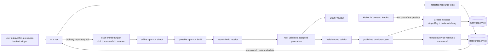

# B84 - AI widgets: make `omnidraw.json` the concrete resource-binding authority

[Overview](../BASED.md)

Let AI Chat create or configure a resource, receive its exact local
`resourceId`, and write that ID beside the logical code slot in the widget's
`omnidraw.json`. The agent then runs the portable check/build workflow from
[D10](../d/D10.md). Draft Preview, publication, placement, reload, and every
widget function call consume only the host-accepted build generation and its
manifest reference. The user must never choose a database while placing or
running a widget.

This is implementation order **3 of 5**. It depends on [D10](../d/D10.md) for
portable build receipts and source/build freshness, and [B83](B83.md) for the
exact editable widget target. It defines the resource model checked by
[A118](../a/A118.md) and inspected at runtime by [A119](../a/A119.md).

## Product contract

The intended flow is fixed:

1. AI Chat may create and inspect resources and edit their schema/data through
   protected resource tools.
2. An authoritative resource result gives the agent the exact non-secret local
   `resourceId` plus bounded safe metadata.
3. The agent edits `omnidraw.json`. The resource declaration contains both the
   logical `slot` used by server code and the concrete `resourceId` used by the
   host.
4. The agent runs `npm run check` and `npm run build`; neither script contacts
   Omnidraw or reads its database.
5. The host detects and validates the atomic build receipt. Draft Preview uses
   that accepted generation and its exact manifest reference.
6. Publication copies the accepted validated reference into the published manifest.
7. Placement creates a widget instance without selecting or copying a
   resource binding.
8. FunctionService resolves the current published manifest reference on every
   call and revalidates resource lifecycle, kind, effect, operation, policy,
   and protected-write approval.
9. Every instance of one published widget uses the same published resource.

There is no Preview/placement resource picker, no **Connect database** or
**Rebind** interaction, no Pi binding-intent custom record, and no
per-instance `resourceBindings` map on a canvas item.

## Existing conflict

The current `oss-split` code implements the opposite authority model:

- `packages/widget-contract/src/filesystem/schema.ts` supports logical resource
  slots but no concrete `resourceId`.
- `packages/service-agent/src/prompts/prompt.state-and-resources.md` says the
  user selects concrete resources.
- `packages/canvas-contract/src/types.ts` stores `resourceBindings` on each
  widget-instance item.
- `WidgetPreviewService.open` accepts process-owned `selectedResources`.
- `WidgetFilesystemRuntimeCatalog.resolvePlacement` accepts and returns
  per-placement `resourceBindings`.
- `FunctionService` resolves the canvas item's binding instead of the
  published manifest's binding.

Those rules came from E41's portability decision. This task intentionally
changes that product decision: a configured widget manifest contains local
installation configuration.

## Manifest contract

Use one declaration as the authored server contract and concrete local link:

```json
{
  "$schema": "https://omnidraw.dev/schemas/widget/v1.json",
  "schemaVersion": 1,
  "resources": [
    {
      "slot": "contacts",
      "resourceId": "resource_local_01J...",
      "kind": "db",
      "effect": "read_write",
      "required": true,
      "operations": {
        "listContacts": {
          "effect": "read",
          "sql": "SELECT id, name, email FROM contacts ORDER BY name",
          "result": "rows"
        }
      }
    }
  ]
}
```

- `slot` is the stable logical name referenced by authored function code.
- `resourceId` is the exact local host resource selected by AI authoring.
- `kind`, `effect`, `required`, SQL operations, and parameter declarations keep
  their current meanings.
- `resourceId` is an identifier, not a credential. Knowing it never grants
  access without host resolution and policy checks.
- Secret values, provider credentials, resource contents, and host paths remain
  forbidden from the manifest.
- An imported/template declaration may omit `resourceId` so the draft remains
  editable. A required unconfigured declaration is not ready for Preview,
  publication as usable, placement, or function dispatch.
- Parse IDs through one bounded resource-ID schema. Never match by display name
  and never accept an arbitrary unbounded string.

### Portability tradeoff

A configured manifest is intentionally installation-specific. On another
Omnidraw home, the same ID may not exist. The host reports that exact reference
as stale; AI Chat creates or selects a local resource and edits the manifest.
The host must never silently choose a similarly named or first-compatible
resource.

## Authority architecture



## Fixed decisions

1. `omnidraw.json` is the only durable widget-to-resource binding authority.
2. One published widget key has one resource mapping shared by all its canvas
   instances. Per-instance resource divergence is not supported.
3. Canvas items retain widget key, instance ID, geometry, UI props, and normal
   state identity. They contain no `resourceBindings` field.
4. Pi transcript custom entries do not duplicate binding intent. Conversation
   history may record ordinary tool results, but only the manifest answers
   which resource a slot uses.
5. Preview consumes the exact manifest captured by D10's latest accepted build
   generation and accepts no browser-selected resource input. Raw file edits do
   not change the displayed Preview until a matching build succeeds.
6. Placement accepts and returns no binding payload. A required manifest
   reference must validate before a node is inserted.
7. FunctionService reads the exact current published manifest and resource at
   invocation time. It never trusts a browser descriptor or old canvas copy.
8. Successful protected resource create/inspect results may expose the exact
   resource ID to the scoped agent. Failed, rejected, canceled, ambiguous, or
   stale results provide no usable identity.
9. The model may write a verified resource ID through ordinary repository file
   editing, then must run the portable check and build before presenting it.
   No host-only editor or separate bind/unbind Pi tool is added.
10. Manifest effect remains a ceiling. Resource capability, current policy,
    and protected-write approval can only narrow it.
11. Writing an ID into the manifest does not execute a resource operation and
    does not bypass create/schema/data mutation approvals.
12. Missing, deleted, provisioning, migrating, wrong-kind, or denied resources
    fail closed. Remediation is AI editing `omnidraw.json`, opening/fixing the
    resource, or retrying only a genuinely transient provider read.
13. A resource-ID-only edit is runtime configuration, not executable source.
    The portable build command must still emit a new receipt, but may reuse
    byte-identical `dist`/Capsule output. Explicit publication is required
    before the new configuration affects live instances.
14. Publishing a new resource ID changes every instance on its next runtime
    resolution while preserving geometry, z-order, instance ID, WidgetState,
    and unrelated extension data.
15. No display-name mapping, global/latest choice, first-compatible fallback,
    user picker, or per-instance override exists.
16. Isolated artifact inspection must say when no real resource function was
    exercised. A captured screenshot is not proof of bound canvas behavior.
17. No relational database schema change is expected. Legacy bindings stored
    inside canvas JSON require bounded normalization, not a new DB authority.

## Build and publication identity

`resourceId` must not enter executable construction identity. The portable
build command is still the synchronization boundary:

- include it in the complete source/manifest generation digest so host
  freshness is exact;
- exclude it from the canonical executable manifest projection, dependency
  identity, and Capsule build input;
- retain slot/kind/effect/operation declarations in executable identity because
  they constrain generated descriptors and execution;
- add a `resource-binding` change class, or an equivalent explicit branch, for
  safe configuration-only receipt/publication while reusing executable bytes;
- verify the existing published executable output still matches the logical
  resource contract before promoting a binding-only manifest change;
- copy the complete validated declarations, including `resourceId`, to the
  published `omnidraw.json` atomically.

## Implementation plan

### 1. Extend the strict public manifest contract

- Add bounded optional `resourceId` to the authored resource requirement in
  `@omnidraw/resource-runtime` / `@omnidraw/widget-contract` at the narrowest
  correct boundary.
- Keep unconfigured imports parseable while representing readiness separately.
- Reject malformed IDs, duplicate/reserved slots, kind/effect conflicts, and
  resource IDs outside the declared field.
- Add a pure build projection that removes only the concrete ID.
- Add binding-only change classification and digest tests.
- Apply semantic version bumps to every changed public/runtime package,
  regenerate `bun.lock`, rebuild `dist`, and run packed public composition.

### 2. Give AI authoritative resource identity

- Update the protected resource result/context contract so successful create
  and explicit inspect/select operations return exact `resourceId`, safe name,
  kind, and lifecycle status to the scoped agent.
- Never return credentials, secret values, provider handles, or unrelated
  resource IDs.
- Update prompts to instruct the agent to write the exact returned ID into the
  matching manifest slot, run the offline check, run the portable build, wait
  for host acceptance, and then inspect Preview.
- Keep B83's exact widget target and D10's source/build generation around the
  workflow without claiming external writers are locked.
- If multiple resources are discussed, the agent must use explicit verified
  IDs and explicit slot edits; the host never guesses a mapping.

### 3. Make Preview manifest-owned

- Remove `selectedResources` from Preview UI/API/service inputs.
- Consume the exact draft manifest/resource references from one host-accepted
  D10 build generation before session creation.
- Validate existence, lifecycle, kind, effect, operation contract, and policy
  before Preview starts and at the provider boundary as needed.
- Missing/stale references produce safe authoring diagnostics, not a resource
  picker or a generic guest failure.
- Preview success is emitted only after the real manifest-bound runtime path
  mounts and any required acceptance read succeeds.

### 4. Remove placement and canvas binding ownership

- Remove `resourceBindings` from placement request/result descriptors.
- Placement loads the current published manifest and rejects an invalid
  required reference before inserting a node.
- Remove `resourceBindings` from the widget-instance canvas contract and
  client projection.
- Remove resource candidate-list calls, picker/controller state, per-slot
  binding patches, and Connect/Rebind surfaces from widget flows.
- Add a bounded migration/normalizer for existing canvas JSON that removes
  legacy `resourceBindings` while preserving all other item bytes and identity.
- If one-release compatibility is necessary, accept legacy data only at the
  migration edge and never use it as runtime authority.

### 5. Make FunctionService manifest-owned

- Resolve the published resource declaration from the exact current widget key
  on every call.
- Fence publication identity around asynchronous resource resolution so an old
  resource cannot execute under a new contract.
- Revalidate resource existence, readiness, kind, effect, operation, policy,
  and write approval immediately before dispatch.
- Keep exact item/instance checks needed for CanvasService and WidgetState, but
  remove item-binding freshness checks.
- Invalidate only resource/config caches after binding-only publication; do not
  remount Capsule or replace WidgetState identity.

### 6. Remove obsolete binding-intent machinery

Do not implement or retain:

- prompt resource-selection records as durable binding authority;
- branch-scoped widget/slot binding-intent transitions or reducers;
- resource-ready reconciliation that mutates widget/canvas bindings;
- `agent.bindingIntent.resolve`;
- process-only Preview selections;
- placement binding inputs/results;
- exact-instance binding APIs or controlled per-slot canvas patches;
- Connect/Rebind banners, dialogs, optimistic state, or retry-after-connect.

Resource lifecycle events may remain for the resource workspace itself. They
must not mutate widget or canvas configuration.

### 7. Revise system documentation and prompts

- Amend E41's portability rule: a logical widget contract is portable, but a
  configured local resource ID is stored in the manifest by explicit product
  choice.
- Update `docs/internal/llm.widget-system.md`, agent prompts, API docs, tests,
  and `FILES.md`.
- State plainly that instance creation never asks the user to choose a resource.
- Preserve draft-versus-published authority and user-controlled publication.

## Causal tests

1. Approved resource creation returns one exact ID; the agent writes it into
   the intended draft slot; no binding-intent custom entry is created.
2. A ready DB referenced in `omnidraw.json` opens draft Preview and returns
   controlled rows without any resource-list or picker call.
3. Missing `resourceId` leaves a draft editable but Preview/publish/place fail
   with safe `edit-manifest` remediation.
4. Unknown/deleted ID, not-ready state, wrong kind, and denied effect each fail
   before Preview session, placement, or function dispatch.
5. Changing only `resourceId` requires a new build receipt while leaving the
   executable digest, `dist`, and Capsule bytes unchanged.
6. Binding-only publication atomically updates the published manifest and
   runtime configuration without rebuilding executable bytes.
7. Placement creates exactly one item with no `resourceBindings` field and
   performs no resource listing.
8. Hard reload restores the instance and reads through the published manifest
   without a user choice.
9. Two instances use the same published reference. Publishing a new reference
   switches both on the next read while preserving state and geometry.
10. Legacy canvas binding JSON is removed/ignored and cannot override the
    published manifest.
11. A stale or malicious browser cannot supply a resource ID through Preview,
    placement, function, or canvas commands because those inputs do not exist.
12. An invented syntactically valid ID grants nothing and reveals no candidate
    resources.
13. Secret values, provider credentials, resource data, and host paths remain
    absent from manifest, model messages, errors, canvas JSON, and events.
14. Protected writes still require normal approval after a valid manifest link.
15. Importing the widget into another isolated home reports the stale local ID
    and works only after the agent edits the manifest to a verified local ID.

## End-to-end acceptance

Use one fresh isolated Omnidraw home:

1. Ask AI Chat for a Phone Book backed by a new database.
2. The agent creates the DB and configures schema/data through protected tools.
3. The resource result provides one exact `resourceId`.
4. The agent writes `slot: contacts` and that ID into `omnidraw.json`, then runs
   offline check and portable build.
5. The host accepts the build receipt; Draft Preview opens automatically and
   renders seeded contacts. No picker,
   Connect, Rebind, or resource-list dialog appears.
6. Publish and place once. The canvas item contains widget/instance identity but
   no resource binding map.
7. Read, hard reload, and read again; all rows remain available.
8. Change only the draft ID to a second controlled DB. Run build, prove it
   reuses the executable bytes, publish configuration explicitly, and prove all existing instances
   use the second DB without remount/state loss.
9. Invalidate the resource in a separate case. The widget reports a safe
   authoring diagnostic and never opens a picker.

Capture the manifest declaration, working draft Preview, placed widget after
reload, and trusted canvas projection proving `resourceBindings` is absent.

## Test plan

```sh
bun test packages/resource-runtime packages/widget-contract
bun test apps/cli/tests/WidgetPreviewService.test.ts \
  apps/cli/tests/WidgetFilesystemRuntimeCatalog.test.ts \
  apps/cli/tests/FunctionService.test.ts
bun test packages/api/src/widget packages/api/src/function
bun run --cwd packages/ui-ai-chat test
bun test packages/canvas-contract packages/service-canvas packages/canvas
bun run test:architecture
bun run test:packed-public-composition
bun run test:packed-canvas-kernel
bun run build
bun run lint:functional-core
bun run lint:functional-core:agent
bun run generate:files
git diff --check
```

## TODOS

- [x] Extend the strict manifest contract with bounded optional `resourceId`.
- [x] Exclude `resourceId` from executable identity and add binding-only publication.
- [x] Expose authoritative resource IDs to scoped AI resource authoring safely.
- [x] Update agent prompts for direct manifest linking and no user picker.
- [x] Require offline check plus portable build before Preview presents manifest edits.
- [x] Make Preview resolve only draft-manifest resource references.
- [x] Remove resource selection from Preview and placement UI/API.
- [x] Remove canvas-item `resourceBindings` and normalize legacy canvas JSON.
- [x] Make FunctionService resolve only published-manifest references.
- [x] Remove branch binding intent, reconciliation, picker, and Connect/Rebind code.
- [x] Update E41, widget-system docs, prompts, API docs, screen docs, and `FILES.md`.
- [x] Apply required public-package versions and regenerate lock/dist artifacts.
- [x] Add causal, migration, redaction, packed-package, and continuous browser tests.
- [x] Capture final no-picker Preview/placement/reload evidence.

## Acceptance criteria

- AI Chat can create/configure a resource and write its exact ID into the
  widget manifest.
- `omnidraw.json` is the only durable widget resource-binding authority.
- Preview, publication, placement, reload, and function invocation use that
  exact manifest reference.
- Instance creation never asks the user to choose a resource.
- Canvas items and Pi transcript extension state contain no binding copy.
- Every instance of one published widget uses the same published binding.
- Resource-ID changes require a new accepted build receipt, reuse executable
  bytes, and affect instances only after explicit publication.
- Invalid references fail closed with AI-authoring remediation and cannot grant
  access through ID guessing.
- Resource policy, protected-write approval, secret redaction, D10 writer
  authority, B83 target verification, and A118 diagnostics remain intact.
- Public package versions, lock/dist artifacts, full tests, packed composition,
  and browser acceptance pass.

## Non-goals

- Per-instance databases or per-canvas resource overrides.
- A resource picker during Preview, placement, or runtime repair.
- Connect/Rebind host UI.
- Branch-scoped binding-intent custom records.
- Automatic first-compatible or display-name resource selection.
- Embedding resource data, credentials, secrets, SQL results, or provider
  handles in `omnidraw.json`.
- A new relational database table for widget bindings.

## NOTES

- No bitmap mockup is useful. The absence of a picker is part of the fixed
  product contract; the authority diagram and end-to-end trace are the useful
  planning evidence.
- 2026-08-11: Rewritten after the user clarified that resource binding is
  AI-authored widget configuration, not user-selected instance state.
- 2026-08-11: Confirmed the conflicting logical-slot/per-instance-binding model
  already exists on `oss-split`; implementation must correct that baseline
  directly rather than importing the abandoned picker worktree.
- 2026-08-11: Implemented bounded optional manifest `resourceId`, excluded it
  from executable construction identity, removed Preview/placement/canvas
  binding inputs and intent machinery, normalized legacy canvas JSON, and made
  Preview plus FunctionService revalidate only the accepted/current manifest.
- 2026-08-11: Live isolated-home acceptance created a controlled database row,
  showed a safe stale-reference failure, rebuilt to a real manifest-bound read,
  published, placed without a picker, and repeated the read after hard reload.
  Evidence is in `docs/internal/screens/assets/19-canvas-*.webp`.
- 2026-08-11: Version changes: `resource-runtime` 0.8.0→0.9.0,
  `widget-contract` 0.11.0→0.12.0, `canvas-contract` 0.7.0→0.8.0,
  `service-canvas` 0.7.0→0.7.1, and `capsule-omnidraw` 0.8.0→0.9.0.
  The lockfile and staged distributions were regenerated; full, packed,
  architecture, functional, scenario, and browser gates passed.

---
