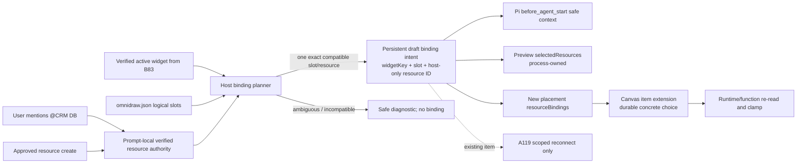

# B84 - AI widgets: durable resource intent reaches Preview and placement
[Overview](../BASED.md)

Turn explicit resource mentions and approved resource creation into a
widget-and-slot-scoped binding intent that survives ordinary follow-up prompts,
feeds full-stack Preview, and is persisted on newly placed canvas widgets.
Today the host records a session-global list that is neither model context nor
a runtime binding, while both Preview and placement callers omit the binding
fields their API contracts already support.

This is implementation order **3 of 5**. It depends on [D10](../d/D10.md) for
safe manifest edits and [B83](B83.md) for verified widget/canvas scope. It
provides binding state to [A118](../a/A118.md) diagnostics and
[A119](../a/A119.md) existing-instance repair.

## Context

### Current selection is stored at the wrong lifetime

- [`ChatTab.tsx`](../../packages/ui-ai-chat/src/chat/components/tabs/ChatTab.tsx)
  submits `resourceIds` on every prompt, including an empty array when the
  prompt has no resource mention.
- [`AgentService.ts`](../../packages/service-agent/src/AgentService.ts)
  resolves those IDs and appends a custom resource-selection record.
- [`tx.session-records.ts`](../../packages/service-agent/src/core/tx.session-records.ts)
  calls Pi `appendCustomEntry`.
- [`llm.pi.extensions.md`](../../docs/external/llm.pi.extensions.md) explicitly
  states that appended extension state does **not** participate in LLM context.
- [`types.ts`](../../packages/service-agent/src/tools/types.ts) stores only
  `{ resources, selectedAt }`; there is no widget key, manifest slot, canvas,
  instance, source, or replacement/clear state.
- [`prompt-chat.test.ts`](../../packages/service-agent/tests/prompt-chat.test.ts)
  currently proves that a later mentionless prompt appends `resources: []`,
  replacing the latest selection in the exact way that caused historical
  [B44](B44.md).

Prompt-local resource authority and durable draft binding intent are different
things. The first must clear on every turn. The second must survive “continue”
until the user explicitly replaces/disconnects it or the manifest removes the
slot.

### Preview and placement already accept bindings, but callers omit them

- [`contract.ts`](../../packages/api/src/widget/contract.ts) supports selected
  resources for Preview and resource bindings for placement resolution.
- [`WidgetPreviewService.ts`](../../apps/cli/src/services/WidgetPreviewService.ts)
  validates explicit selected resources and can auto-resolve only one compatible
  ready candidate for a required slot.
- [`WidgetFilesystemRuntimeCatalog.ts`](../../apps/cli/src/services/WidgetFilesystemRuntimeCatalog.ts)
  validates concrete bindings and reports a required-selection error when they
  are missing.
- [`preview-owner.ts`](../../packages/ui-ai-chat/src/canvas-extension/preview-owner.ts)
  calls `widget.preview.open` without the selected resource state.
- [`canvas-extension/index.ts`](../../packages/ui-ai-chat/src/canvas-extension/index.ts)
  calls `widget.placement.resolve({ reference })` without resource bindings.
- [`resource-bindings.ts`](../../packages/service-agent/src/tools/resource-bindings.ts)
  contains binding planners, but the current production flow does not call them.
- [`fx.session-records.ts`](../../packages/service-agent/src/core/fx.session-records.ts)
  can read the latest session record, but no production Preview/placement path
  consumes it.

### Portable requirements and concrete choices must remain separate

[`llm.widget-system.md`](../../docs/internal/llm.widget-system.md) and
[E41](../e/E41.md) establish the ownership rule:

- `omnidraw.json` declares portable logical requirements by slot, kind, effect,
  required flag, and optional DB operation descriptors;
- Preview keeps concrete selected resources in process memory;
- a placed canvas item owns the durable mapping from slot to concrete resource
  and read/write ceilings;
- resource IDs, local paths, and secrets never enter the portable manifest.

The global Omnidraw configuration file is unrelated. The agent may edit the
widget's `omnidraw.json`; it must not create `omnidraw.config` or write
resource identities into application config.

## Fixed decisions

1. Introduce two explicit state types:
   - **prompt resource authority:** resources explicitly mentioned in the
     current user prompt or created through a currently approved tool call;
   - **draft binding intent:** append-only host state keyed at minimum by chat,
     widget key, and manifest slot.
2. An empty/omitted resource list on a mentionless continuation clears only
   prompt-local authority. It never erases an existing draft binding intent.
3. Concrete resource IDs stay host-only. The model sees bounded name, kind,
   lifecycle status, slot, requested effect, and resolution status.
4. A binding is planned only when the target widget and slot are unambiguous.
   Do not let the LLM guess an ID or silently choose among multiple compatible
   resources.
5. The manifest requirement is the maximum capability request. The host
   intersects it with the selected resource and stores the narrowest
   `{ allowRead, allowWrite }` mapping. A mention never raises permissions
   beyond the manifest or approval policy.
6. An approved `od_resource_create` result can become binding authority without
   exposing its internal ID to the model. Rejection, cancellation, ambiguous
   completion, or a not-ready resource does not bind it.
7. Preview receives exact process-owned selected resources for the draft.
   New placement receives exact resource bindings and persists them only on the
   new canvas item.
8. Existing canvas items are not silently mass-updated. Their scoped Connect/
   Rebind transaction belongs to [A119](../a/A119.md).
9. No new Pi/LLM binding tool is added. Mentions, approved resource creation,
   `omnidraw.json` edits, Bash, and host reconciliation are sufficient.
10. Intent state follows active Pi history branches. Editing/resending an old
    message must not resurrect a binding from an abandoned branch.

## State model

The exact TypeScript names may differ, but the implementation must preserve
these semantics:

```text
PromptResourceAuthority (one turn)
  promptEntryId
  verifiedCanvasId?
  verifiedWidgetTargets[]
  resources[] = { host resourceId, safe name, kind, status, origin }

WidgetDraftBindingIntent (append-only transitions)
  chatId
  widgetKey
  slot
  resourceId                 # host-only
  resourceKind
  requestedEffect
  grantedRead / grantedWrite
  origin = mention | approved-create | reconnect
  status = pending | resolved | stale | cleared
  manifestDigestSha256?
  selectedAt
```

The durable record may live in the Pi session transcript as custom extension
state; it does not need a database table. A reader must reduce records on the
active branch by `(widgetKey, slot)` and ignore abandoned tail entries.

## Plan



### 1. Separate prompt authority from binding intent

- Replace the overloaded `TWidgetResourceSelectionRecord` with explicit
  prompt-local and intent transition types.
- Preserve prompt authority only for the active turn; clear it in `finally`
  after prompt start/cancellation.
- Append binding-intent transitions to the session manager with enough scope
  and manifest identity to restore them safely after reconnect.
- Add pure reducers/selectors in local `fn.*` files for active-branch records.
  Do not read globals from those functions; follow the functional-core rules.
- Flush intent records durably after an accepted transition.
- Bound records/results: maximum slots per manifest, maximum active intents,
  safe string lengths, and no raw provider details.

### 2. Resolve explicit resources once and keep IDs host-side

- Deduplicate submitted IDs and resolve them through the resource service at
  the prompt boundary.
- Reject missing/deleting resources and retain `pending` status for created,
  provisioning, or migrating resources rather than pretending they are ready.
- Project safe metadata into [B83](B83.md)'s `before_agent_start` context so the
  model knows which resources the user explicitly selected.
- Keep the concrete ID only in host state. Tool results and model-visible
  diagnostics continue using resource names/kinds.
- Change ChatTab/forwarding tests so a mentionless prompt means no new
  authority; it does not emit a “clear all bindings” command.

### 3. Reconcile against the current manifest after every relevant change

Run the planner when any of these events occurs:

- one verified widget and one or more resources are explicitly mentioned;
- a resource-create approval finishes successfully;
- the active widget's `omnidraw.json` changes through edit/patch/Bash/Config;
- a draft is created or loaded;
- a pending selected resource becomes ready;
- Preview/new placement asks for current binding state.

Planner rules:

1. Read and validate the current manifest under [D10](../d/D10.md)'s exact
   snapshot boundary.
2. Compare resource kind and required effect to each slot.
3. Resolve automatically only when the mapping is unique. One DB resource and
   one DB slot is unique; two DB resources for two DB slots is not unique
   without explicit slot information.
4. Intersect manifest effect, resource capability, and approval policy.
5. Store one intent per exact slot. A new explicit selection for that same
   slot appends a replacement transition.
6. If the manifest removes a slot, append `stale`/`cleared` and stop handing it
   to Preview/placement.
7. If a kind/effect changes incompatibly, mark the old intent stale and return
   an actionable diagnostic. Never coerce it.

Reuse or replace the currently dead helpers in
[`resource-bindings.ts`](../../packages/service-agent/src/tools/resource-bindings.ts)
so there is one tested planner, not two competing algorithms.

### 4. Capture approved resource creation safely

- Extend the host-side resource tool composition with an internal success
  callback carrying the actual created resource before `fnSafeResource`
  removes its ID from model-visible output.
- Fire it only after the approval executes and the creation response is
  authoritative.
- Associate it with the current prompt's verified widget target. If no target
  or slot is unambiguous, retain only safe prompt context and return an
  unresolved diagnostic; do not create a session-global wildcard binding.
- Await readiness only through existing resource lifecycle events or bounded
  explicit checks. Do not add polling/sleep loops to the agent.
- Never treat secret value creation as permission to reveal or log plaintext.

### 5. Feed full-stack Preview

- Add a binding-intent read port to the Preview owner composition.
- Before `widget.preview.open`, reduce current intent for that `widgetKey`,
  validate it against the exact captured manifest, and pass
  `selectedResources` in the supported API shape.
- Keep concrete selection process-owned inside `WidgetPreviewService`.
- Preview reopen/rebuild must restore it from current host intent; a process
  restart may require session reconnect/reduction but not a repeated mention.
- If a required slot remains unresolved, return a typed binding diagnostic and
  do not present generic guest/runtime failure as a source-code bug.
- Do not weaken A116/A117 isolated artifact inspection: its documented
  `artifact_exact` mode remains resource-free unless A118 explicitly adds a
  separate scoped diagnostic mode.

### 6. Feed new placement and persist on the canvas item

- Before `widget.placement.resolve`, gather intent for the selected draft or
  published widget key and pass exact `resourceBindings`.
- Validate them again in `WidgetFilesystemRuntimeCatalog` against the current
  published manifest and resource catalog generation.
- Persist the returned validated bindings in the canvas widget extension at
  the same controlled transaction that creates the node.
- If a required slot has no unambiguous ready selection, prevent placement or
  place an explicit connection-needed frame according to the existing product
  contract; never silently drop the mapping.
- Prove placement retries/idempotency cannot create duplicate widget nodes or
  different bindings from one pointer action.

### 7. Keep the system prompt complete and accurate

Update [`prompt.state-and-resources.md`](../../packages/service-agent/src/prompts/prompt.state-and-resources.md)
and [`prompt.tools.md`](../../packages/service-agent/src/prompts/prompt.tools.md):

- `omnidraw.json` declares logical slots only and is editable with existing
  file/Bash tools;
- explicitly mentioned or approved-created resources are host binding
  authority when target+slot resolution is unique;
- mentionless continuation does not erase binding intent;
- Preview and new placement receive host-validated concrete choices;
- no model-callable binding or publish tool exists;
- do not write resource IDs/secrets into manifest, source, collaborative state,
  logs, or global config;
- when mapping is ambiguous, report the exact slot/kind needed instead of
  guessing.

### 8. Add independent and end-to-end tests

Required causal tests:

1. `@CRM DB` then “continue” retains slot intent while current prompt authority
   is empty.
2. Explicit replacement changes only the target widget+slot.
3. Removing a slot from `omnidraw.json` makes the old intent stale.
4. Two compatible resources never auto-map to two same-kind slots.
5. Approved resource creation binds only after authoritative success/readiness.
6. Rejected/canceled/failed creation creates no intent.
7. Preview open receives selected resources and can execute one declared read
   function against the test resource.
8. New placement receives/persists resourceBindings on the exact canvas item.
9. Runtime clamps a stored write bit when the manifest permits read only.
10. Secret values and internal IDs are absent from model messages, tool
    results, events, diagnostics, and snapshots.
11. Branch/edit/reconnect reduces only the active transcript's intent.

## Test plan

```sh
bun test packages/service-agent/tests/prompt-chat.test.ts packages/service-agent/tests/resource-tools.test.ts
bun test packages/service-agent/tests/widget-filesystem/preview-ephemeral.test.ts
bun test apps/cli/tests/WidgetPreviewService.test.ts apps/cli/tests/WidgetFilesystemRuntimeCatalog.test.ts
bun test packages/api/src/widget/api.placement-resolve.test.ts packages/api/src/widget/contract.test.ts
bun test packages/ui-ai-chat/tests/canvas-extension/preview-owner.test.ts packages/ui-ai-chat/tests/widget-placement/WidgetPlacementCoordinator.test.ts
```

Add one temporary-resource end-to-end fixture covering chat mention → manifest
slot → Preview function read → new placement → canvas persistence → published
function read. Use fake/test DB/KV/secret providers and never production data.

## TODOS

- [ ] Split prompt-local resource authority from persistent draft binding intent.
- [ ] Key intent by active chat branch, widget key, and manifest slot.
- [ ] Keep concrete resource IDs host-only and inject bounded safe context through Pi.
- [ ] Replace or activate one pure, uniquely resolving binding planner.
- [ ] Reconcile intent after mentions, approved create, manifest changes, load/create, readiness, Preview, and placement.
- [ ] Capture successful approved resource creation through an internal host callback.
- [ ] Pass selected resources into full-stack Preview open/rebuild.
- [ ] Pass validated resourceBindings into new placement and persist them on the canvas item.
- [ ] Update system prompts with exact manifest/binding/no-new-tool rules.
- [ ] Add continuation, replacement, stale slot, ambiguity, approval, Preview, placement, clamp, branch, and redaction tests.
- [ ] Update widget architecture docs and `FILES.md` with the two-lifetime state model.
- [ ] Run focused tests, typechecks, functional-core checks, and affected production builds.

## Acceptance criteria

- A normal mentionless follow-up cannot erase an established widget-slot
  binding intent.
- Intent is never session-global: every active mapping identifies the chat
  branch, widget key, and manifest slot.
- The model sees safe selected-resource context, while concrete IDs remain
  host-only.
- Preview receives and uses exact selected resources; new placement persists
  exact validated resourceBindings on its canvas item.
- Approved new resources can be bound without a new Pi tool, but rejected,
  failed, ambiguous, or unready resources cannot.
- The host never guesses between multiple compatible resources or grants more
  read/write authority than the manifest permits.
- `omnidraw.json` contains only portable logical requirements; no resource ID,
  local path, secret, or global config field is introduced.
- All causal tests pass independently of [A119](../a/A119.md)'s existing-item UI.

## Non-goals

- Updating already placed canvas items; [A119](../a/A119.md) owns exact-instance
  repair and reconnect UI.
- Adding a model-callable bind/unbind tool.
- Persisting Preview sessions, resource provider handles, or a new binding DB
  table.
- Automatically publishing a draft.
- Guessing slot mappings from arbitrary natural-language prose when host
  identity is ambiguous.

## NOTES

- No bitmap mockup is useful. The hard part is state lifetime and ownership,
  shown in the flow diagram.
- [B44](B44.md) is historical evidence for the continuation failure. Reuse its
  conceptual split, but implement it against the current filesystem-first
  architecture rather than restoring actor-era code.
- If `@omnidraw/widget-contract` or `@omnidraw/canvas-contract` public runtime
  `src/` must change, bump the package semantically and regenerate the lockfile.

### LOGS

- 2026-08-10: Created after tracing the current resource selection record to an
  unused Pi custom entry and confirming Preview/placement contracts accept
  bindings that their UI callers never supply.

---
