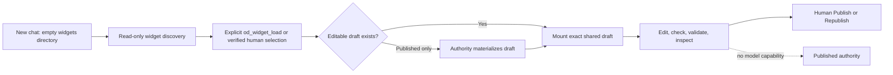

# B92 - AI Chat workspaces: restore explicit widget loading and hard publication isolation

[Overview](../BASED.md)

Every AI Chat currently receives symlinks to every shared widget draft as soon
as its workspace is ensured. The model therefore starts with editable access to
unrelated drafts, while the fixed tool registry has no load operation. Restore
empty per-chat workspaces, explicit draft loading, and an enforceable boundary
that leaves publication exclusively under direct human control.

## Report

Observed on 2026-08-14 in a new AI Chat workspace:

```text
$ ls -al
total 0
drwxr-xr-x@ 3 omarezzat  staff   96 Aug 14 11:40 .
drwxr-xr-x@ 5 omarezzat  staff  160 Aug 14 11:40 ..
drwxr-xr-x@ 3 omarezzat  staff   96 Aug 14 11:40 widgets

$ ls -al widgets
Small CRM -> ../../../../../../../widgets/drafts/small-crm
```

The user did not load or mention **Small CRM** before it appeared. Listing the
model's tools also showed create, list, validate, Preview inspection, file
tools, resources, web fetch, and Bash, but no widget load tool.

This violates the intended conversation ownership model:

- Every new chat starts with an empty `widgets/` directory.
- A chat sees editable widget source only after an explicit load, a verified
  human widget selection, or creation in that chat.
- Loading an existing shared draft mounts that exact draft and no sibling.
- Loading a published-only widget materializes an editable draft through the
  widget authority, then mounts the draft; published source is never mounted.
- The model can create, edit, validate, build, and inspect drafts, but only a
  direct human action can Publish or Republish.

## Confirmed causes

### Workspace initialization mounts the global draft root

[`WidgetWorkspace.ensureChat`](../../apps/backend/src/shell/agent/workspace/WidgetWorkspace.ts)
always calls `#reconcileSharedMounts`. That reconciliation removes stale owned
links and then scans every valid folder under the shared draft root, creating a
symlink in the chat for each draft it finds.

The behavior is reached from chat connection, session creation, list, load,
file resolution, validation, grep, and Bash mutation fencing. Even
`loadWidget(name)` first calls `ensureChat`, so it exposes every draft before it
mounts the requested one. Removing a mount is also not durable because the next
ensure operation recreates it.

### The tool registry omits load

[`AI_CHAT_TOOL_NAMES`](../../apps/backend/src/shell/agent/tools/CONSTANTS.ts) and
[`createWidgetWorkspaceTools`](../../apps/backend/src/shell/agent/tools/tool.widget-workspace.ts)
register list, create, and validate, but no `od_widget_load`. The workspace
already has an internal single-draft `loadWidget` primitive, so the missing
piece is the model-facing authority and its catalog/materialization contract.

The older isolated-workspace design in [`S83`](../s/S83.md) explicitly required
empty chat workspaces, explicit cross-chat loading, draft-only mounts, and no
automatic loading of every widget. The current behavior was introduced during
the Effect application replacement in commit `990b3faab`.

### Widget listing has side effects and an inaccurate contract

`od_widget_list` calls `listAvailableWidgets`, which calls `listMounts`, which
calls `ensureChat` and therefore mounts all shared drafts. Discovery mutates
chat authority.

[`readWidgetCatalog`](../../apps/backend/src/shell/agent/workspace/read-widget-catalog.ts)
also scans only the draft root and always reports `hasPublished: false`, while
the tool description claims that it lists shared drafts and published widgets.

### Published-only selections cannot become editable

[`AgentService.#resolvePromptWidgetSelection`](../../apps/backend/src/shell/agent/AgentService.ts)
mounts only references whose catalog result already contains an
`editableDraft`. Published-only references have `editableDraft: null`, so a
verified human selection supplies context but cannot establish an editable
workspace target.

### Bash bypasses selective workspace access

Structured read, edit, patch, grep, validate, and Preview tools resolve only
through validated chat mounts. Bash does not. The production
[`AgentBashCapability`](../../apps/backend/src/shell/agent/AgentBashCapability.ts)
runs `bash -lc` with the Omnidraw host process's filesystem, environment,
process, executable lookup, and network authority. The chat cwd is explicitly
documented as a starting directory rather than a confinement boundary.

Consequently, removing automatic symlinks alone would change discoverability
but not enforce access: Bash could traverse from a mount target or known host
path into sibling drafts and publication-related roots. There is no
model-callable publish tool today, but publication isolation is prompt guidance
and API shape rather than a hard capability boundary.

## Fixed decisions

- `ensureChat` creates and validates chat storage but never adds a missing
  widget mount from the shared catalog.
- Existing valid mounts explicitly owned by that chat survive reconnect.
- Reconnect may remove broken or stale owned mounts; it must not discover or
  add new shared drafts.
- `od_widget_list` is bounded, read-only discovery. It returns correct draft
  and published availability without changing the chat mount set.
- Add `od_widget_load({ name })` to the fixed tool registry.
- If a healthy draft exists, load mounts that shared draft idempotently.
- If only a healthy publication exists, the widget authority materializes a
  new editable draft from the exact current published source, then the chat
  mounts that draft.
- If both forms exist, load uses the existing draft and never overwrites it
  from published source implicitly.
- Invalid, ambiguous, changing, or unhealthy catalog entries fail closed with
  an actionable structured result.
- A verified widget reference selected by the human may invoke the same load
  authority before the model turn. Names appearing only in prose are not load
  authority.
- Published folders and accepted artifacts are never mounted writable into AI
  Chat.
- No publish, republish, metadata-publish, approval, mount-creation, unload, or
  widget-deletion operation becomes model-callable.
- Bash remains useful for draft checks and builds only if its effective
  filesystem and credentials cannot reach unmounted drafts, published roots,
  publication staging/signing state, or a publication API capability.
- The frontend's direct human Publish and Republish workflows remain the only
  publication entrypoints.

## Plan



### 1. Separate chat storage from mount reconciliation

Split workspace initialization into operations with single responsibilities:

- ensure chat metadata, history, workspace, and an empty `widgets/` directory;
- inspect and validate existing chat-owned mounts without adding catalog
  entries; and
- explicitly mount one resolved draft.

Remove the global draft scan from every general workspace operation. Preserve
valid explicit mounts across reconnect and remove only links proven to be stale
backend-owned mounts. Foreign filesystem entries remain untouched and fail
closed when they conflict with a requested mount.

Do not clear a resumed chat's valid explicit mounts merely because the runtime
reconnects. "Starts empty" applies to a newly created chat identity, not every
connection to an existing conversation.

### 2. Add one authoritative load tool

Add `od_widget_load({ name })` beside list, create, and validate. Resolve the
name against one current app-owned widget catalog snapshot and retain the
snapshot generation/digest through asynchronous materialization and mount
creation.

For an existing draft, validate manifest name/slug identity and mount the exact
direct child of the shared draft root. For a published-only widget, call an
injected widget-domain operation that captures the exact accepted published
source, materializes it atomically as a draft, refreshes the catalog, and then
mounts it. The agent workspace must not read or copy published files directly.

Return the stable widget key, display name, source decision, mounted lexical
path, whether materialization occurred, and the next recommended reads. Plain
repeated loads are idempotent. Name ambiguity, catalog drift, a conflicting
mount, or an existing unhealthy draft must not fall back to another variant.

Route verified human widget references through this same operation so attached
selection and explicit tool loading share validation, materialization, audit,
and mount semantics.

### 3. Make discovery pure and accurate

Compose agent discovery from the application widget catalog rather than a
draft-only filesystem scan. Keep output bounded and paginated, and report
`hasDraft`, `hasPublished`, health, and `mountedInThisChat` accurately.

Listing must use mount inspection that performs no reconciliation or writes.
Remove descriptions and result fields that imply published availability when
the implementation cannot prove it.

### 4. Enforce the publication and sibling-draft boundary

Retain structured file tools as the normal authoring surface and keep their
existing exact mount validation. Replace unrestricted live Bash authority with
a capability appropriate for draft authoring, such as a restricted process
view rooted in the explicitly mounted draft(s), with required toolchain inputs
available read-only.

The enforcement must prevent:

- resolving or reading an unmounted sibling draft;
- traversing from a mounted symlink target into the shared draft parent;
- reading or mutating published, staging, signing, trash, quarantine, database,
  configuration, credential, and resource-authority roots;
- using inherited credentials or local network authority to call publication;
  and
- creating or replacing chat mounts outside the structured backend operation.

If the supported host cannot provide that boundary safely, Bash must be absent
for AI Chat and the trusted check/build operations must be exposed through
bounded structured tools. Prompt instructions are not an access control.

### 5. Add causal conformance coverage

Cover the workflow at workspace, registry, AgentService, live composition, and
shell-capability boundaries. Tests must exercise real chat identities and more
than one shared draft so a global-mount regression cannot pass accidentally.

## Causal tests

1. With two healthy shared drafts and one publication present, a new chat's
   `widgets/` directory is empty after connection and session creation.
2. `od_widget_list` reports correct draft/publication availability and leaves
   the mount set byte-for-byte unchanged.
3. Loading one existing draft creates exactly one backend-owned mount; the
   other draft remains unavailable to structured file tools.
4. Repeating the same load is idempotent and does not duplicate transcript
   active-target records or catalog mutations.
5. A second chat starts empty, explicitly loads the same draft, and resolves to
   the same real shared folder without receiving other mounts.
6. Reconnecting each chat preserves only its explicit mount set. A draft
   created later by another chat is not discovered automatically.
7. A broken or renamed owned mount is removed or repaired only through explicit
   resolution; no unrelated draft is mounted as fallback.
8. Loading a healthy published-only widget atomically materializes one draft
   from the exact current accepted source and mounts only that draft.
9. When draft and published forms both exist, load preserves and mounts the
   draft without overwriting it. An unhealthy draft fails visibly rather than
   silently replacing it from published source.
10. Catalog generation/source movement during published materialization aborts
    or retries coherently and cannot mount a mixed or stale result.
11. A verified human widget selection uses the same load boundary. Unverified
    prose, an ambiguous name, or a stale frontend reference mounts nothing.
12. The exact agent registry contains `od_widget_load` and contains no publish,
    republish, approval, symlink, arbitrary mount, unload, or delete-widget
    tool.
13. Bash or its replacement can run the supported check/build workflow in the
    loaded draft but cannot list, read, modify, or infer source from an
    unmounted sibling draft or publication root.
14. Bash or its replacement cannot use inherited environment/network
    credentials to invoke publication or protected resource authority.
15. Direct human Publish and Republish still accept the exact current healthy
    draft generation and remain unaffected by chat reconnects or mount state.

## TODOS

- [x] Remove global shared-draft mounting from `ensureChat` and all read/list paths.
- [x] Preserve only valid explicitly owned mounts across reconnect.
- [x] Add the fixed `od_widget_load({ name })` tool and model-facing contract.
- [x] Inject authoritative draft/publication discovery into agent widget listing.
- [x] Add published-only source materialization without implicit draft overwrite.
- [x] Route verified human widget selections through the same load authority.
- [x] Make `od_widget_list` pure, accurate, bounded, and non-mounting.
- [x] Constrain or replace Bash so unmounted drafts and publication authority are unreachable.
- [x] Update tool prompts and descriptions for explicit loading and human-only publication.
- [x] Add empty-chat, cross-chat, reconnect, list-purity, and load-idempotency tests.
- [x] Add published-only materialization, catalog-race, and unhealthy-draft tests.
- [x] Add live shell-isolation and human publication conformance coverage.
- [x] Run backend agent, widget catalog/filesystem, Preview, publication, API contract, and architecture gates.

## Acceptance criteria

- A newly created chat has an empty `widgets/` directory regardless of how many
  drafts or publications exist globally.
- No general chat initialization, discovery, file, validation, Preview, or Bash
  operation adds a widget mount implicitly.
- A chat gains editable widget access only through creation, explicit
  `od_widget_load`, or a verified human widget selection.
- Loading one widget never exposes a sibling widget.
- Existing drafts are shared across chats only after each chat explicitly loads
  them.
- Published-only widgets can be loaded by atomically materializing an editable
  draft; published source is never mounted or overwritten by the agent.
- Listing accurately reports draft and publication availability without side
  effects.
- The model has no publication tool or equivalent filesystem, credential, or
  local-network path to publication authority.
- Direct human Publish and Republish remain the only publication actions.
- Regression tests fail if `ensureChat` scans the shared draft root, if list
  changes mounts, if load disappears from the registry, or if the agent shell
  can access an unmounted/publication path.

## NOTES

- No mockup is useful. This is a backend capability, workspace lifecycle, and
  security-boundary correction with no intended visual change.
- Structured file tools already enforce lexical entry through
  `widgets/<mounted-name>/...`; preserve that design while removing the global
  reconciliation side effect.
- The current focused suites pass because they create a draft in the same chat,
  assert the no-load registry, and never seed multiple drafts before connecting
  a fresh second chat.
- The workspace API may retain a narrowly named stale-mount cleanup operation,
  but "reconcile" must never mean "make every shared draft visible here."

### LOGS

- 2026-08-14: Filed from a reproduced report and repository investigation.
  Confirmed global mount reconciliation, missing model load tool, list side
  effects, draft-only discovery, published-only selection gap, and unrestricted
  Bash authority. The seven focused workspace/registry/reference tests pass and
  therefore do not currently protect the intended invariant.
- 2026-08-14: Implemented and independently reviewed explicit per-chat loading,
  authoritative side-effect-free discovery, published-source materialization,
  reconnect cleanup, and the hard agent publication/shell boundary.
- 2026-08-14: Combined B92-B95 validation passed all typechecks, 713 backend
  tests, 169 Canvas tests, 123 frontend tests, and 61 architecture/package tests.
- 2026-08-14: Product decision superseded B92's shell-isolation requirement.
  AI Chat again exposes host-authority Bash; its chat workspace is only the
  initial cwd and no filesystem, environment, subprocess, or network
  confinement is claimed. Explicit widget loading and the absence of a model
  Publish tool remain unchanged.

---
