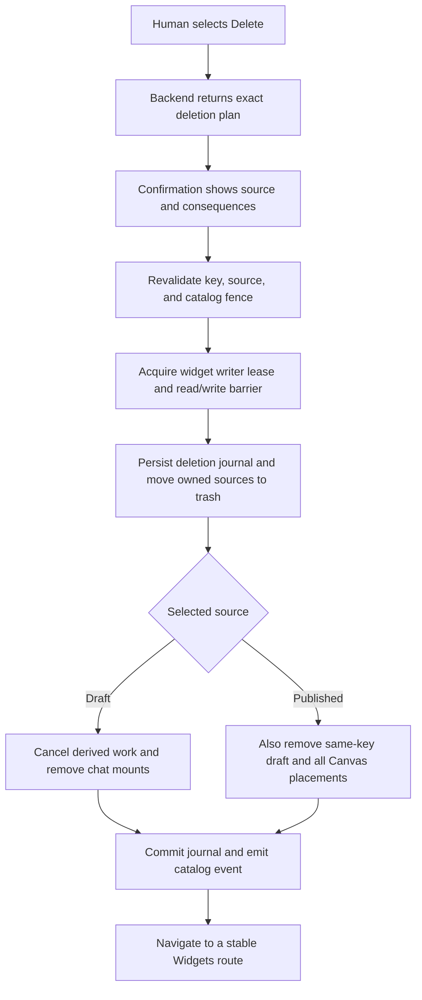

# B93 - Widgets: restore source-aware deletion for drafts and publications

[Overview](../BASED.md)

Draft and published widget detail pages expose no delete action, and the
Widgets section menu only refreshes the catalog. Restore deliberate,
source-aware human deletion across the frontend, typed API, filesystem
authority, Canvas placements, Preview state, and AI Chat mounts. Deletion must
also work for unhealthy widgets whose manifest or release cannot be trusted.

## Report

On 2026-08-14 the published **Small CRM** detail page had no destructive action
in its header, overview, or filesystem catalog panel. Its health was
`unhealthy` with `CAPSULE_INSPECTION_FAILED` and `RELEASE_INVALID`. The Widgets
section overflow contained only **Refresh widget folders**.

This is not only a missing button. There is no delete operation in the current
frontend widget port, private operation contract, backend widget RPC router, or
filesystem-management service.

## Confirmed causes

### The frontend has no deletion workflow

[`WidgetDetailPage.tsx`](../../apps/frontend/src/shell/framework/feature/sidebar/widgets/WidgetDetailPage.tsx)
renders Publish or Republish controls for drafts and a sidebar toggle, but no
Delete action, confirmation dialog, pending state, or error handling.
[`WidgetsSidebarSection.tsx`](../../apps/frontend/src/shell/framework/feature/sidebar/widgets/components/WidgetsSidebarSection.tsx)
adds only the catalog refresh action to the section menu.

The widget capability in
[`ports.ts`](../../apps/frontend/src/shell/framework/feature/sidebar/ports.ts)
contains catalog, file, draft-config, Preview, and publication operations but
no source-aware deletion operation. The generated private operation manifest
therefore cannot expose one to the UI.

### The backend contract and authority also omit deletion

[`contract.ts`](../../apps/backend/src/shell/api/widget/contract.ts),
[`handlers.ts`](../../apps/backend/src/shell/api/widget/handlers.ts), and
[`types.ts`](../../apps/backend/src/shell/api/widget/types.ts) define the same
catalog, config, publication, placement, Preview, and runtime surface without
delete. The live
[`WidgetFilesystemManagementService.ts`](../../apps/backend/src/shell/widget/WidgetFilesystemManagementService.ts)
can save draft config and build or publish, but cannot remove a draft or
publication.

The only nearby removal primitive is temporary-workspace cleanup in
[`NodeWidgetFilesystemWorkspace.ts`](../../apps/backend/src/shell/agent/widget-filesystem/workspace/NodeWidgetFilesystemWorkspace.ts).
It deliberately rejects the draft namespace and removes only staging or
Preview paths. It is not a hidden widget-delete implementation.

### The filesystem-first rewrite dropped previously accepted behavior

[`A76`](../a/A76.md) previously accepted source-aware confirmed deletion.
Draft deletion removed only the draft. Published deletion removed the
publication, a same-key draft, runtime definition, and placed Canvas widget
instances. That UI and API existed before the filesystem-first redesign
handoff (`a04fb57bd`) but were not carried into the replacement architecture.

The old code is historical product evidence, not an implementation to copy.
The current filesystem publication writer has leases, read/write barriers,
journals, `.trash`, and `.quarantine`; the restored operation must use current
authorities and recovery rules.

### Unhealthy widgets need an identity path independent of artifact validity

The reported publication is precisely the kind of entry a user must be able
to remove. Requiring a valid manifest, trusted browser artifact, or valid
release descriptor before delete would make broken entries permanent. The
operation must identify an exact catalog entry by validated widget key,
source, catalog observation, and fenced direct-child path without executing or
trusting its contents.

## Fixed decisions

- Deletion is a direct human UI capability. Do not add a model-callable widget
  delete tool.
- Delete is source-explicit: `draft` and `published` have different, visible
  consequences and confirmation copy.
- Deleting a draft removes only that draft and its derived Preview/build state
  and AI Chat mounts. A same-key publication and its placed instances remain.
- Deleting a publication removes the publication, any same-key draft and its
  derived state, and every placed instance of that widget on every Canvas.
- Widget resources are independent authorities and are never deleted as an
  implicit consequence.
- Widget-instance state is removed through the existing Canvas item/state
  authority and database cascade, not by frontend database access.
- Healthy and unhealthy catalog entries are equally deletable. Content
  inspection is diagnostic, not delete authorization.
- A stale confirmation cannot delete a replacement that appeared at the same
  key. Catalog or source drift returns a typed conflict and asks the human to
  review again.
- Publish, build, Preview rebuild, catalog refresh, and delete serialize on the
  current per-widget filesystem lease and publication barrier.
- Filesystem and Canvas cleanup form a durable, recoverable operation. Do not
  report complete success while placements or owned source are only partially
  removed.
- B92's explicit per-chat widget mounts must not become dangling links:
  deletion removes backend-owned mounts for the deleted draft across chats and
  invalidates their active target records.

## Plan

### 1. Add a source-aware deletion plan to the widget API

Add a typed human-facing operation under the widget router that first resolves
an immutable deletion plan for `{ widgetKey, source }`. The plan records the
catalog digest or generation, exact variant identity, safe relative paths,
whether a paired draft exists, affected Canvas placement count, and affected
AI Chat mount count. It must be derivable for unhealthy entries without
parsing their manifests or releases.

Confirmation commits that exact plan or supplies its opaque token. Re-read and
compare the catalog entry while holding the writer lease before mutation.
Return typed outcomes for not found, stale plan, unsafe path, busy operation,
partial recovery pending, and successful idempotent completion. Register the
operation through the private frontend contract and capability adapter, but do
not add it to the AI Chat tool registry.

### 2. Implement durable filesystem deletion

Add deletion to the filesystem management authority rather than deleting paths
from the RPC handler. Reuse the publication writer lease and
`PublicationReadWriteBarrier`; cancel or await in-flight build and Preview work
for the exact key.

Fence every source as a validated direct child of its configured draft or
published root. Reject traversal, symlink escape, case-fold ambiguity, or a
source that changed after planning. Move owned source and derived directories
to the existing trash area, record each phase in a deletion journal, and make
restart recovery either finish the operation or restore the pre-delete state.
Only purge trash after the cross-authority operation commits.

Draft deletion removes the exact draft, its Preview frames and accepted draft
build cache, and all backend-owned AI Chat mounts targeting it. Published
deletion performs those steps for a same-key draft when present and also moves
the exact publication to trash. Catalog refresh happens after the committed
source transition and produces one coherent event.

### 3. Remove published placements through Canvas authority

For published deletion, enumerate Canvas items by the existing `widget-key`
query across all canvases, then issue normal idempotent Canvas delete commands
with revision conflict handling. Do not mutate Canvas tables or widget-state
tables from the widget filesystem service. Existing composite foreign keys
must continue to cascade instance state when a Canvas widget item is removed.

Because source storage and Canvas are distinct durable authorities, persist
operation progress and placement identities before committing removals. A
cancelled process or restart resumes safely; retries cannot delete a newly
created replacement widget or unrelated Canvas item. Leave referenced resource
definitions untouched.

### 4. Add explicit human UI and safe navigation

Add a danger-zone Delete action to draft and published detail pages. Fetch the
deletion plan before opening the final confirmation so copy can name the exact
source and count affected placements or mounts.

Draft confirmation states that the publication and placed published instances
will remain. Published confirmation states that the publication, same-key
draft when present, derived Preview state, chat mounts, and all placed Canvas
instances will be removed. Require an intentional confirmation, preserve focus
when cancelled, disable duplicate submission, surface typed failures, and
navigate away only after committed success.

The action remains available when health diagnostics fail. Do not hide it
behind manifest-derived tabs, Publish readiness, or a valid release.

### 5. Add causal conformance and recovery coverage

Test domain policy, filesystem adapters, API contracts, Canvas integration,
frontend capability wiring, and human interaction. Use two same-key variants,
more than one Canvas, more than one chat, unhealthy filesystem fixtures, and
in-flight build/publication races so the source-specific contract cannot pass
through a shallow UI-only implementation.

## Causal tests

1. Healthy and unhealthy draft and published detail pages all show a Delete
   action independent of manifest or release validity.
2. Cancelling either confirmation mutates nothing and restores focus to the
   triggering control.
3. A draft plan says that publication and placed instances remain and reports
   the count of chat mounts that will be removed.
4. Draft deletion removes only the exact draft, derived Preview/build state,
   and all backend-owned chat mounts; the publication, its Canvas placements,
   instance state, and resources remain.
5. A published plan reports all Canvas placements, same-key draft presence,
   and chat mounts before the human confirms.
6. Published deletion removes the exact publication, a same-key draft,
   derived state, chat mounts, placements on every Canvas, and their instance
   state while leaving resource definitions untouched.
7. A publication with an unreadable manifest, invalid release descriptor, or
   failed Capsule inspection is still deletable by its safe catalog identity.
8. Replacing or changing the source between plan and confirmation yields a
   typed stale-plan conflict and deletes neither version.
9. Path traversal, an escaping symlink, case-fold collision, and a non-direct
   child fail before mutation.
10. Delete racing Publish, build, or Preview rebuild serializes on the same
    widget lease and cannot resurrect a removed source or publish mixed files.
11. Canvas revision conflicts retry through the Canvas authority without
    deleting unrelated or newly created items.
12. Cancellation or process termination at each journal phase recovers on
    restart to one coherent state; no successful response is emitted for a
    partially cleaned operation.
13. Repeating a committed request is idempotent and emits no duplicate Canvas
    commands or catalog events.
14. Successful deletion refreshes the sidebar once and navigates away from the
    now-missing detail route; failed deletion keeps context and shows an
    actionable error.
15. The exact AI Chat tool registry still contains no delete, Publish,
    Republish, or arbitrary filesystem-removal capability.

## TODOS

- [x] Add typed deletion-plan and commit contracts to the backend widget API.
- [x] Expose deletion only through the frontend's direct human capability.
- [x] Implement leased, fenced, journaled draft and publication deletion.
- [x] Remove draft Preview/build state and backend-owned AI Chat mounts.
- [x] Remove published placements through Canvas authority with recovery.
- [x] Add the source-specific confirmation UI and stable post-delete routing.
- [x] Cover unhealthy entries, drift, races, restart recovery, and idempotency.
- [x] Verify model tool registries still cannot delete or publish widgets.

## Acceptance criteria

- A human can delete any exact draft or published catalog entry from its
  detail page, including an unhealthy or corrupt entry.
- Each confirmation accurately describes and counts its source-specific blast
  radius before mutation.
- Draft deletion preserves publication, published placements, instance state,
  and resources.
- Published deletion removes its paired draft and all placed instances but
  preserves independent resources.
- Deletion is fenced against stale catalog state and unsafe filesystem paths,
  serializes with other widget writes, and recovers coherently after restart.
- Catalog, routing, Preview, Canvas, and AI Chat mount state converge without
  dangling or resurrected entries.
- No agent-facing tool or unrestricted filesystem path can invoke the human
  deletion capability.

## NOTES

- The current Canvas contract already supports `widget-key` queries, and the
  Canvas store's composite foreign key already removes widget-instance state
  when its Canvas item is deleted. Reuse those authorities.
- Publication storage already contains trash, quarantine, writer-lease,
  journal, and read/write-barrier concepts. Extend their ownership model rather
  than adding direct `rm` calls at an API edge.
- Coordinate this task with [`B92`](B92.md): explicit chat mounts make their
  cleanup enumerable, and deletion must invalidate them without granting the
  model delete authority.
- `A76` captures the previously accepted user semantics, but its retired actor
  and service implementations are not compatible with the current Effect and
  filesystem-first architecture.

### LOGS

- 2026-08-14: Reproduced the report in the live local app. The detail header
  had no Delete action and the Widgets overflow exposed only catalog refresh.
- 2026-08-14: Traced the omission through the frontend port, private operation
  contract, backend RPC contract, handlers, capability type, and filesystem
  management service.
- 2026-08-14: Confirmed temporary workspace cleanup intentionally rejects
  draft removal and is not a widget deletion path.
- 2026-08-14: Located the previously accepted source-aware behavior in A76 and
  its removal during the filesystem-first redesign handoff.
- 2026-08-14: Ran
  `bun test apps/backend/src/shell/api/widget/contract.test.ts apps/backend/src/shell/api/widget/api.management.test.ts`:
  5 passed, 0 failed. These tests pass because they currently encode no delete
  contract and only minimal management-operation identity.
- 2026-08-14: Implemented and independently reviewed human-only source-aware
  deletion with fenced plans, durable recovery, exact cleanup, and UI routing.
- 2026-08-14: Reconciled deletion mount admission with B92 explicit loading;
  the combined backend, frontend, RPC, architecture, and production-build gates pass.

---
