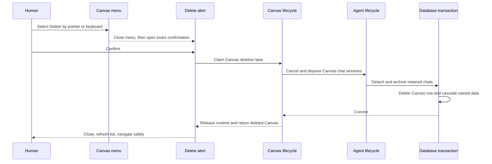

# B94 - Canvas sidebar: make deletion reachable and coordinate retained chats

[Overview](../BASED.md)

The Canvas overflow shows a Delete action, but normal pointer activation closes
the menu without leaving a confirmation on screen. Keyboard activation does
open the dialog. Even after reaching that dialog, a Canvas with retained AI
Chat metadata cannot be deleted because the database deliberately restricts
the raw row deletion and the API performs no chat lifecycle coordination.

## Report

Reproduced on 2026-08-14 from the active **Untitled Canvas**:

1. Open **Options for Untitled Canvas** with the pointer.
2. Click the red Delete item.
3. The menu closes. No confirmation, notification, or navigation remains.
4. Open the same menu with the keyboard and press Enter on Delete.
5. The **Delete Canvas** confirmation appears.

Rename has the same pointer-only dialog-handoff failure, which identifies a
shared menu-to-dialog cause rather than a missing Delete callback. The Canvas
was left unchanged during investigation.

## Confirmed causes

### Pointer selection loses the menu-to-dialog handoff

[`SidebarItem.tsx`](../../apps/frontend/src/shell/framework/feature/sidebar/components/SidebarItem.tsx)
opens a non-modal Kobalte dropdown and invokes `onRename` or `onDelete` directly
from each item's `onSelect`. [`Sidebar.tsx`](../../apps/frontend/src/shell/framework/feature/sidebar/components/Sidebar.tsx)
immediately sets the corresponding controlled dialog open.

Kobalte 0.13.12 selects menu items on pointer-up and schedules menu close after
calling `onSelect`. The new dialog is therefore mounted inside the still-active
pointer/menu dismissal sequence and is dismissed again. Keyboard selection
uses the same callbacks without that pointer-up sequence and leaves the dialog
open. Both Rename and Delete reproduce this exact split.

The action handoff needs an explicit state transition: select an intended
action, finish closing the menu, then open the requested dialog. A timing-only
delay without interaction coverage is not an acceptable contract.

### The confirmation closes before asynchronous deletion settles

[`DeleteCanvasDialog.tsx`](../../apps/frontend/src/shell/framework/feature/sidebar/components/DeleteCanvasDialog.tsx)
declares `onDelete` as synchronous, calls it, and closes immediately.
`Sidebar.handleDelete` actually starts an asynchronous `canvas.remove` request.
If the backend rejects, the dialog and affected-Canvas context are already
gone; duplicate submission is not fenced and the user sees only a transient
notification.

Deletion needs an awaited pending state, must remain open on failure, and may
close or navigate only after committed success.

### Retained AI Chats intentionally block raw Canvas row deletion

[`000-initial.sql`](../../apps/backend/src/shell/database/migrations/000-initial.sql)
defines `chats.canvas_id` as nullable but uses `ON DELETE RESTRICT` to preserve
chat history. The existing
[`ChatStoreTurso.test.ts`](../../apps/backend/src/shell/database/tests/ChatStoreTurso.test.ts)
explicitly proves that deleting a referenced Canvas must fail and retain both
records.

The live reported Canvas contains AI Chat instances and retained chat
metadata. [`api.remove-canvas.ts`](../../apps/backend/src/shell/api/canvas/api.remove-canvas.ts)
only calls `db.canvas.deleteById`, so it reaches that foreign-key restriction
without detaching or archiving chats. It exposes neither an actionable typed
conflict nor a coordinated deletion path.

The database already permits chat metadata with `canvas_id = NULL`, but
[`ChatStoreTurso.ts`](../../apps/backend/src/shell/database/ChatStoreTurso.ts)
types `TChatUpdateArgs.canvasId` as `string | undefined`; the existing update
surface cannot express detachment even though the schema and list queries can.

### Runtime and database deletion are not one lifecycle

The API deletes the database row first and only then calls
[`CanvasService.release`](../../apps/backend/src/shell/canvas/authority/CanvasService.ts).
There is no Canvas deletion lane that prevents a concurrent command or new
subscriber, no AgentService operation that disposes sessions attached to the
Canvas, and no API-level deletion test.

Database cascades already remove Canvas items, widget-instance state, and
Canvas-scoped media. They must remain database-owned. Chat workspaces and
history are intentionally retained and need explicit detach/archive semantics,
not a cascade.

## Fixed decisions

- Pointer, touch, and keyboard activation of Rename and Delete use the same
  deterministic menu-to-dialog handoff.
- Delete uses an alert-dialog pattern with Cancel and an explicit destructive
  confirmation. Cancel mutates nothing and returns focus to the Canvas action
  trigger.
- Confirmation awaits deletion, disables duplicate submission, remains open
  with an actionable error on failure, and closes only after committed
  success.
- Deleting the final Canvas is allowed; the existing empty Canvases state and
  Add Canvas action are the recovery UI.
- Canvas items, widget-instance state, and Canvas-scoped media are deleted by
  existing database cascades with the Canvas row.
- Independent widget definitions and resource definitions are not deleted.
- Retained AI Chat metadata, history, and workspaces survive. Chats attached to
  the deleted Canvas are disconnected, detached to `canvas_id = NULL`, and
  archived so they cannot remain active under a missing scope.
- Active chat generations, prompts, streams, approvals, and in-memory scope
  maps for the Canvas are cancelled or disposed before the deletion commits.
- Chat detach/archive and Canvas row deletion are one database transaction.
  A failed transaction leaves the Canvas and all chat associations intact.
- Canvas command acceptance, subscription, and deletion serialize through one
  Canvas lifecycle boundary. No acknowledged command can land after deletion.
- Deleting the active Canvas navigates to a remaining Canvas when one exists,
  otherwise to the stable empty workspace route. Deleting an inactive Canvas
  does not move the active route.
- The backend returns typed not-found, stale-confirmation, busy, and
  coordination failures rather than leaking a raw foreign-key error.

## Plan

### 1. Repair the menu-to-dialog transition

Make `SidebarItem` report an intended action while exposing the dropdown's
controlled open state. Close the menu first, then open Rename or Delete from a
stable post-menu transition. Do not let the originating pointer-up event or
the menu's focus restoration dismiss the new dialog.

Use the same path for pointer, touch, Enter, and Space. Preserve dropdown
keyboard navigation, Escape behavior, focus restoration, and accessible names.
Cover Rename in the regression because it shares the exact broken boundary,
while keeping this task's destructive semantics focused on Canvas deletion.

### 2. Make deletion confirmation asynchronous and informative

Use `AlertDialog.Root` for deletion and model idle, planning, deleting, and
failed states explicitly. Before final confirmation, resolve an exact plan for
the stable Canvas ID that includes its current name/revision and counts of
items, Canvas-scoped media, and retained chats.

Confirmation copy must state that Canvas content and media will be permanently
removed while chat history is retained and archived. Await the commit, disable
Cancel and Delete only while the request is in flight, prevent duplicate
submissions, and keep the dialog open with a typed error on failure. A stale
plan caused by replacement or meaningful revision drift requires review rather
than deleting newly changed content silently.

### 3. Add one semantic backend Canvas-deletion operation

Move coordination out of the RPC handler. Add a lazy semantic transaction that
claims deletion ownership for the Canvas, rejects new Canvas commands and
subscriptions, and waits for or interrupts already-owned work according to the
Canvas authority's lifecycle contract.

Resolve every retained chat attached to the stable Canvas ID. Add an
AgentService lifecycle operation that invalidates connection generations,
cancels prompts and approvals, disposes live sessions, and clears in-memory
widget/Canvas scope ownership idempotently. A disposed chat cannot reconnect
under the Canvas after deletion starts.

Do not turn DB, AgentService, or CanvasService into ambient dependencies of one
another. The core program owns the order through semantic services; shell
adapters supply the concrete database and runtime capabilities.

### 4. Detach chats and delete the Canvas transactionally

Extend the chat metadata update contract so `canvasId: null` is distinct from
an omitted field. Add a bounded database operation that, in one transaction:

1. revalidates the exact Canvas deletion plan;
2. sets attached chats to `canvas_id = NULL` and `status = 'archived'`; and
3. deletes the Canvas row, allowing existing foreign keys to cascade Canvas
   items, widget-instance state, and Canvas-scoped media.

On database failure, roll back both detach/archive and deletion, then let the
Canvas lifecycle resume from durable state. After commit, final runtime release
is idempotent and cannot turn a successful durable delete into a misleading
retryable 404. Return the deleted Canvas and cleanup counts to the UI.

### 5. Reconcile frontend state and routing once

After committed success, remove the exact Canvas from the frontend store and
invalidate Canvas/sidebar consumers once. If it was active, select a
deterministic remaining Canvas from the refreshed list or navigate to `/` when
none remain. Ensure Canvas, AI Chat, Preview/widget portals, and event streams
dispose during route teardown and cannot render stale data after navigation.

Remove or implement the current no-op `evictCanvas` adapter so the port does
not imply cache eviction that never occurs.

## Causal tests

1. Pointer-clicking Rename closes the menu and leaves the Rename dialog open;
   cancelling restores focus to the same Canvas action trigger.
2. Pointer-clicking Delete closes the menu and leaves the Delete alert open.
   Touch, Enter, and Space reach the same state exactly once.
3. Escape or Cancel mutates nothing, issues no API request, and restores focus.
4. Delete confirmation shows the exact Canvas and correct content, media, and
   retained-chat consequences from its current plan.
5. While deletion is pending, repeated pointer/keyboard activation issues one
   request. The dialog stays open on a typed failure and permits a safe retry.
6. A Canvas without chats deletes successfully; Canvas items, widget-instance
   state, and Canvas-scoped media cascade while widget and resource definitions
   remain.
7. A Canvas with active and archived chats disconnects their live sessions,
   cancels prompts/approvals, preserves histories and workspaces, sets
   `canvas_id = NULL`, archives them, and then deletes successfully.
8. A database fault between chat detach and Canvas delete rolls back both; the
   Canvas and original chat associations remain readable and the runtime can
   resume coherently.
9. A Canvas command racing deletion is ordered before the deletion plan or
   rejected after deletion ownership is claimed; it cannot acknowledge a
   mutation into a deleted Canvas.
10. New chat connections and event subscriptions are rejected once deletion
    starts, and existing streams close deterministically after commit.
11. A stale plan or already missing Canvas returns a typed result without
    deleting another Canvas or exposing a raw foreign-key error.
12. Deleting the active Canvas navigates to a deterministic remaining Canvas;
    deleting the last Canvas renders the empty state; deleting an inactive
    Canvas preserves the current route.
13. Frontend invalidation and deletion events occur once even if the client
    retries after losing the success response.
14. Direct database tests continue to prove `ON DELETE RESTRICT` protects chat
    history when callers bypass the semantic deletion operation.

## TODOS

- [x] Make pointer, touch, and keyboard menu-to-dialog handoff deterministic.
- [x] Convert Canvas deletion to an awaited accessible alert dialog.
- [x] Add exact deletion-plan and typed deletion results to the private API.
- [x] Add Canvas deletion lifecycle ownership and Agent chat disposal.
- [x] Support explicit chat detachment and archive it in the delete transaction.
- [x] Reconcile active/inactive/last-Canvas routing after committed deletion.
- [x] Add interaction, API, transaction, concurrency, and recovery coverage.
- [x] Remove or implement the misleading no-op Canvas eviction capability.

## Acceptance criteria

- A human can reach and confirm Canvas deletion with pointer, touch, or
  keyboard, and Rename no longer shares the broken pointer handoff.
- Cancellation and backend failure preserve the Canvas and keep understandable
  UI context; duplicate submission is impossible.
- Canvases with AI Chats delete successfully without deleting chat histories or
  workspaces and without leaving active sessions scoped to a missing Canvas.
- Canvas-owned items, widget state, and media are removed; independent widgets
  and resources remain.
- Database and runtime coordination is serialized, transactionally safe, and
  causally tested under failure and concurrent activity.
- Frontend list, route, Canvas runtime, and event streams converge exactly once
  after success, including when the final Canvas is deleted.

## NOTES

- This is not a missing backend route: `canvas.remove` is present end to end and
  raw deletion works for an unreferenced Canvas.
- `chats.canvas_id ON DELETE RESTRICT` is valuable preservation policy. Do not
  weaken it to `CASCADE`; the semantic operation must archive and detach chats
  deliberately.
- The browser skill exposed the key input distinction: pointer activation
  fails while keyboard activation opens the same dialog. That changed the UI
  plan from “add a Delete button” to “repair menu-to-dialog ownership.”
- No destructive browser action was executed during investigation.

### LOGS

- 2026-08-14: Reproduced pointer Delete and Rename closing without a surviving
  dialog; verified keyboard Enter opens the Delete confirmation.
- 2026-08-14: Inspected Kobalte 0.13.12 selection mechanics: menu actions run
  on pointer-up and menu close is scheduled after `onSelect`.
- 2026-08-14: Confirmed the frontend closes the dialog before awaiting the
  existing asynchronous `canvas.remove` operation.
- 2026-08-14: Confirmed the backend route directly deletes the Canvas row and
  does not coordinate retained chats or AgentService runtime ownership.
- 2026-08-14: Ran
  `bun test apps/backend/src/shell/database/tests/BunServiceTurso/fx.canvas.test.ts apps/backend/src/shell/database/tests/ChatStoreTurso.test.ts`:
  5 passed, 0 failed. The suite proves raw delete works only when unreferenced
  and intentionally fails while a retained chat references the Canvas.
- 2026-08-14: Implemented and independently reviewed the accessible deletion
  flow, retained-chat transaction, runtime coordination, and deterministic routing.
- 2026-08-14: Corrected the RPC inventory assertion during review and verified
  the combined 96-procedure contract plus full backend/frontend suites.

---
