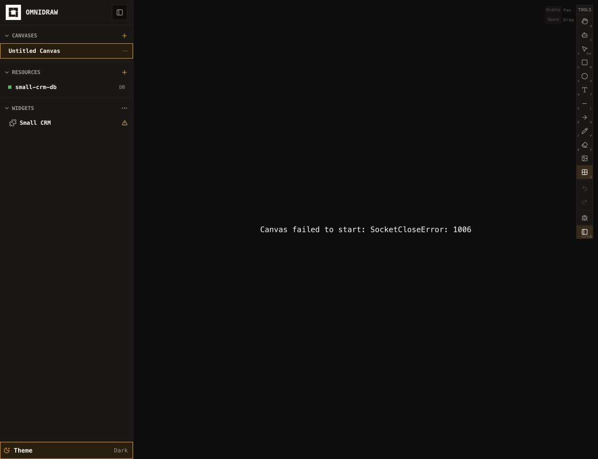
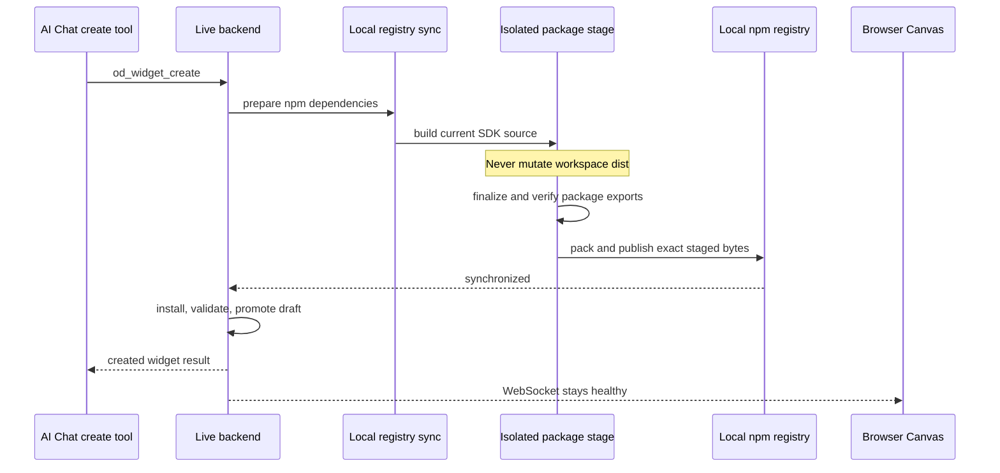

# B95 - AI widget create: registry SDK rebuild crashes the live backend

[Overview](../BASED.md)

The first `od_widget_create` in local development lazily synchronizes the SDK
to the local npm registry. That synchronization rebuilds `@omnidraw/sdk` in
the same checkout as the running backend, and the SDK build deletes `dist/`
before recreating it. The watched backend resolves
`@omnidraw/sdk/contract` through that mutable directory, restarts inside the
gap, and dies. The browser loses its RPC socket, the Canvas remains in a fatal
`SocketCloseError: 1006` state, and the interrupted create leaves a temporary
scaffold behind.

## Report

Reported and reproduced on 2026-08-14 after asking AI Chat to create a new
widget with `od_widget_create`.

The server sequence was:

```text
[backend] Listening on http://127.0.0.1:3000
[vite] hmr update /src/shell/framework/pages/canvas.tsx
[vite] ws proxy error: connect ECONNREFUSED 127.0.0.1:3000
[backend] error: Cannot find module '@omnidraw/sdk/contract'
  from 'apps/backend/src/shell/widget/WidgetPreviewService.ts'
[vite] ws proxy error: connect ECONNREFUSED 127.0.0.1:3000
```

The active page then displayed:

```text
Canvas failed to start: SocketCloseError: 1006
```

After the crash, `packages/sdk/dist/contract.js` existed again and resolved
successfully from `apps/backend`. Its modification time was **12:33:13**, the
same second as the HMR, module-resolution failure, and proxy disconnect. The
failure is therefore a transient destructive-build window, not a missing SDK
export or invalid import.

The interrupted scaffold was not promoted to the shared draft catalog, but it
remained at:

```text
.omnidraw/agent/pi/agent/widgets/tmp/create-efdb2b40-9a34-49c5-8677-74f51dbb3bf4
```

Its manifest identified the attempted widget as **Simple Example**. The
temporary directory contains the scaffold files but no installed lockfile or
accepted build. It is not authoritative user data and should be reclaimed on
the next backend startup.

## Confirmed causes

### Widget creation reaches lazy registry synchronization

[`tool.widget-workspace.ts`](../../apps/backend/src/shell/agent/tools/tool.widget-workspace.ts)
creates the scaffold in a temporary directory, then calls
`WidgetWorkspace.prepareNpmDependencies()` before `npm install`, validation,
promotion, mounting, and the initial Preview build.

In local development,
[`layer.live-mechanics.ts`](../../apps/backend/src/shell/runtime/layer.live-mechanics.ts)
wires that call to [`LocalWidgetPackageRegistrySync.ts`](../../apps/backend/src/shell/widget/LocalWidgetPackageRegistrySync.ts),
which executes:

```text
node scripts/local-registry.mjs publish-widget-packages
```

This is the intended lazy path from [`D9`](../d/D9.md) and the repository-root
bug in [`B91`](B91.md) is already fixed. The new failure occurs after the
correct script is reached.

### Registry packaging destroys the live SDK output in place

[`local-registry.mjs`](../../scripts/local-registry.mjs) resolves the current
workspace package closure and `packWorkspacePackage` runs each package's normal
workspace build before packing its `dist/` directory.

For the current closure, that invokes `packages/sdk/scripts/build.ts`. The
first build operation is:

```ts
rmSync(distDir, { recursive: true, force: true })
```

It also deletes and recreates workspace fallback subpath directories. Only
after TypeScript declaration generation and Bun bundling does
`dist/contract.js` exist again. The local registry's publication lock
serializes publishers, but it does not protect live consumers in the checkout
from this destructive interval.

### The watched backend imports through the mutable package dist

`apps/backend/node_modules/@omnidraw/sdk` is a workspace symlink to
`packages/sdk`. The package export for `./contract` points to
`./dist/contract.js`. The source-run backend has no app-level path mapping for
the SDK entrypoint, so Bun watches and resolves the generated package output.

When local registry synchronization removes `dist/`, the watcher restarts on
that filesystem change. Module graph construction reaches
[`WidgetPreviewService.ts`](../../apps/backend/src/shell/widget/WidgetPreviewService.ts)
while `contract.js` is absent and fails resolution. Recreating the file later
does not restore the already-failed backend graph. Vite continues running but
its WebSocket proxy has no backend target.

This can also be triggered by any concurrent normal public-package build in
the live checkout, including root test scripts whose pre-hooks rebuild public
distributions. Widget creation is simply the first product workflow that does
it automatically from inside the running backend.

### Failed process lifetime bypasses scaffold cleanup

[`WidgetWorkspace.createDraft`](../../apps/backend/src/shell/agent/workspace/WidgetWorkspace.ts)
normally removes the temporary scaffold in `finally`. The host process dies
before JavaScript cleanup can run, and `WidgetWorkspace.init` only creates the
temporary root; it does not reclaim abandoned `create-*` direct children from
a previous process lifetime.

The draft/catalog boundary held—the broken scaffold was not promoted—but the
transient storage lifecycle is incomplete.

### Initial Canvas boot treats the socket close as terminal

The frontend RPC layer owns physical reconnect and generation recovery, but
[`Canvas.tsx`](../../packages/canvas/src/components/Canvas.tsx) records an
initial runtime boot failure in `bootError`. The runtime lifecycle retries only
when its source key changes, so a transient socket close during first snapshot
load remains a permanent full-Canvas error even if connectivity returns.

This does not cause the backend crash, but it turns a temporary development
outage into a page that requires a manual reload.

## Fixed decisions

- Lazy local registry synchronization remains; do not move package publication
  back into general dev startup.
- Registry synchronization never builds into, deletes, renames, or otherwise
  mutates a public package's workspace `dist/` or fallback subpath directories.
- Registry packages are built from the exact current checkout source—including
  intentional uncommitted edits—into a unique isolated staging directory.
- The staged package is fully finalized and export-verified before `npm pack`.
  A build that cannot honor an explicit staging output fails before touching
  the live checkout; there is no fallback to an in-place build.
- Normal release builds may continue producing each package's workspace
  `dist/`, but source-run private applications must not lose runtime imports
  merely because a packaging build refreshes that directory.
- Local registry publication locking and overwrite semantics from D9 remain
  unchanged. Isolation is additional build ownership, not a per-worktree
  registry or package-version policy change.
- A failed or cancelled registry sync returns one bounded
  `WIDGET_CREATE_FAILED` tool result. It never terminates or invalidates the
  backend process.
- A widget draft is still promoted only after dependency synchronization,
  installation, and validation succeed.
- The widget temporary root is process-transient. On startup, the exclusive
  workspace owner removes safe, direct `create-*` leftovers from prior process
  lifetimes without following symlinks or touching drafts.
- Initial Canvas boot retries only transport failures through the accepted
  connection-generation recovery boundary. Semantic failures such as missing
  or invalid Canvas identity remain terminal and actionable.
- After a transient backend restart, the existing Canvas recovers without a
  page reload, duplicate runtime, stale stream, or replayed mutation.

## Plan





### 1. Add an isolated public-package staging contract

Give the public package build tooling an explicit output-directory contract.
The package root remains the source/configuration authority, while generated
JavaScript, declarations, manifest, documentation, and compatibility files
are written only below a caller-provided staging root.

Start with every package in the current `@omnidraw/sdk` workspace dependency
closure and make the contract enforceable for future closure growth. Extend
[`prepare-package-dist.ts`](../../scripts/prepare-package-dist.ts) to accept an
explicit package root and distribution root, validate both, and finalize the
staged tree without assuming `<package>/dist`.

Package build scripts must redirect **all** outputs when staging is requested.
For the SDK that includes TypeScript declarations, Bun bundles, CLI output,
generated fallback subpaths, and the standalone package manifest. A package
that lacks staging support is rejected before its normal build script runs.

Keep the ordinary `bun run build` behavior and release qualification surface
unchanged when no staging destination is supplied.

### 2. Make local registry packaging stage-only

Change `packWorkspacePackage` to allocate a unique directory under the local
registry's owned state/temp root, invoke the stage-capable build for the exact
workspace package, verify every exported target and package identity, and run
`npm pack` against that staged package.

Retain dependency-order calculation, the host-global publication lock,
upstream-integrity comparison, and D9's local overwrite behavior. Clean the
stage in `finally` on success, failure, timeout, and cancellation. Never copy a
pre-existing workspace `dist`, because it may be stale relative to current
source. Never write the stage inside the repository, where Bun/Vite watchers
could treat it as application input.

### 3. Decouple live application imports from packaging churn

Define exact source-run resolution for the supported public entrypoints used by
private applications, or an equivalently stable dev output authority outside
release `dist/`. Keep the mapping explicit—do not add a wildcard that makes
private SDK internals importable—and preserve package-export resolution in
packed/external-consumer tests.

At minimum, the backend's runtime `@omnidraw/sdk/contract` and package identity
imports must remain resolvable throughout any SDK package build. Audit the
frontend and backend public-package imports so a concurrent `build:public`
cannot create another missing-export restart window. Add architecture tests
that distinguish supported source-run entrypoints from standalone dist
verification rather than weakening public package boundaries.

### 4. Recover interrupted widget-create storage

At `WidgetWorkspace.init`, inspect only direct children of the configured
transient root. Remove entries proven to be backend-owned create scaffolds from
an earlier lifetime, using the fixed prefix/identity convention and `lstat`
fences. Do not follow symlinks, recurse outside the root, infer ownership from
manifest contents, or touch the shared draft root.

Keep normal in-process `finally` cleanup. Add abrupt-termination coverage where
the process stops after scaffold creation and before dependency synchronization
finishes; the next startup reclaims the orphan and exposes no draft or mount.
Coordinate this edit with [`B92`](B92.md), which also changes workspace
initialization and mount semantics.

### 5. Recover Canvas initial boot after transient reconnect

Classify initial snapshot/stream failures at the transport boundary. For a
transient disconnect, retain one owned Canvas runtime activation and wait for a
new accepted physical connection generation before retrying the exact boot.
Use the existing Effect-owned retry/cancellation and connection-generation
machinery; do not add browser timers or an unconditional loop inside the
component.

Navigation, Canvas deletion, host retirement, source-key replacement, and
shutdown cancel the pending retry. A terminal semantic error remains visible
without retry. Successful recovery clears the alert, installs one current
snapshot/event stream, and does not replay optimistic commands.

### 6. Add the full create-while-live regression

Exercise the real local-development composition with a running backend and
frontend transport. The test must trigger the first lazy package sync through
`od_widget_create`, not call only isolated helpers, while continuously checking
backend health and the existing Canvas connection.

Assert the resulting registry tarball represents current source, the widget is
installed/validated/promoted exactly once, and no workspace package output or
fallback path changes during the registry build. Inject build and publish
failures to prove controlled tool errors and cleanup without process loss.

## Causal tests

1. With a live backend importing `@omnidraw/sdk/contract`, the first local
   `od_widget_create` completes registry synchronization without a backend
   restart, WebSocket close, Vite proxy refusal, or Canvas boot error.
2. During the complete registry sync, repeated resolution and reads of every
   supported live SDK entrypoint succeed; `packages/sdk/dist` and generated
   workspace fallback paths retain identical identity, bytes, and mtimes.
3. The packed local-registry SDK contains the exact current uncommitted source
   change from the checkout rather than stale workspace dist bytes.
4. Staged declaration, bundle, CLI, manifest, documentation, dependency, and
   export verification matches the normal qualified SDK distribution.
5. A package in the SDK dependency closure without stage-output support fails
   before any workspace output is touched.
6. Concurrent widget creates coalesce on process-local synchronization and the
   host-global publish lock; each package is staged and published once.
7. Build failure, pack failure, registry failure, timeout, and cancellation
   remove the isolated stage, preserve workspace outputs, keep the backend
   healthy, and return one bounded `WIDGET_CREATE_FAILED` result.
8. An interrupted create never promotes a draft or creates a chat mount. Its
   safe transient scaffold is reclaimed on the next backend startup.
9. Startup cleanup rejects or unlinks an escaping symlink and ignores foreign,
   malformed, non-direct, and draft-root entries without following them.
10. Running a normal `build:public` concurrently with the source-run backend
    cannot make supported package imports temporarily unresolvable.
11. A transient socket close during initial Canvas snapshot load waits for a
    new connection generation and boots one runtime without a page reload.
12. A genuinely missing Canvas, invalid snapshot, authentication failure, or
    other terminal semantic error remains visible and is not retried forever.
13. Navigation, Canvas deletion, host retirement, and shutdown cancel pending
    boot recovery and leave no stale iterator, wait handle, or runtime.
14. Packed/public package verification still imports exclusively from the
    standalone staged `dist` contract and detects missing exports.

## TODOS

- [x] Add an explicit isolated output contract for SDK-closure package builds.
- [x] Finalize and verify staged package distributions outside the repository.
- [x] Make local registry sync pack only staged current-source artifacts.
- [x] Decouple source-run app imports from mutable packaging output.
- [x] Reclaim safe widget-create transient leftovers on backend startup.
- [x] Retry initial Canvas boot only after transient connection recovery.
- [x] Add live create, failure, cancellation, concurrency, and restart tests.
- [x] Preserve D9 registry locking/overwrite and standalone package checks.

## Acceptance criteria

- Creating the first widget in a live development session cannot rebuild away
  a module used by the backend or frontend.
- The backend stays healthy, the WebSocket remains connected, and the Canvas
  never enters `SocketCloseError: 1006` during local package synchronization.
- Local registry packages contain exact current checkout source and remain
  standalone, export-complete, and dependency-correct.
- Build, pack, publish, timeout, and cancellation failures return controlled
  tool errors without partial drafts, orphaned stages, or process termination.
- Crash-left widget-create scaffolds are safely reclaimed on startup without
  touching authoritative drafts or foreign paths.
- Initial Canvas boot recovers from a genuine transient disconnect through the
  owned connection-generation machinery and still fails closed for semantic
  errors.
- Normal release builds, public package qualification, D9 publication policy,
  and packed external consumers remain unchanged.

## NOTES

- `@omnidraw/sdk/contract` is correctly exported and resolves after the build.
  Adding another export or replacing the import with a relative backend path
  would not fix the destructive interval.
- The modification time of the regenerated SDK distribution provides direct
  causal evidence: it matches the backend failure to the second.
- The local registry publish lock protects registry state, not filesystem
  readers in the checkout. Holding it longer cannot solve live import safety.
- The orphaned **Simple Example** directory was inspected but not deleted; it
  remains evidence and contains no promoted catalog authority.
- B91 fixed the repository-root composition error. B95 starts at the next
  successful step in that same widget-create path.

### LOGS

- 2026-08-14: Confirmed the live page alert `Canvas failed to start:
  SocketCloseError: 1006` and preserved the viewport in `B95.png`.
- 2026-08-14: Confirmed `@omnidraw/sdk/contract` is declared in package exports,
  `dist/contract.js` exists after the failure, and runtime import from
  `apps/backend` now succeeds.
- 2026-08-14: Matched the SDK dist regeneration timestamp to the backend module
  failure and Vite WebSocket proxy refusal at 12:33:13.
- 2026-08-14: Traced `od_widget_create` through lazy local registry sync to
  `packWorkspacePackage` and the SDK build's initial recursive `dist/` removal.
- 2026-08-14: Found the unpromoted **Simple Example** scaffold still present in
  the widget temporary root and confirmed startup has no stale-temp cleanup.
- 2026-08-14: Ran
  `bun test scripts/local-registry.test.mjs apps/backend/tests/LocalWidgetPackageRegistrySync.test.ts apps/backend/tests/LiveWidgetPackageRegistryComposition.test.ts`:
  15 passed, 0 failed. Existing tests cover command composition and registry
  policy but never run package synchronization beside a live module consumer.
- 2026-08-14: Implemented and independently reviewed isolated current-source
  staging, source-stable app imports, cancellation cleanup, orphan reclamation,
  and generation-aware Canvas recovery.
- 2026-08-14: The combined live source-run backend stayed healthy throughout a
  concurrent public-package rebuild; production frontend and package builds pass.

---
