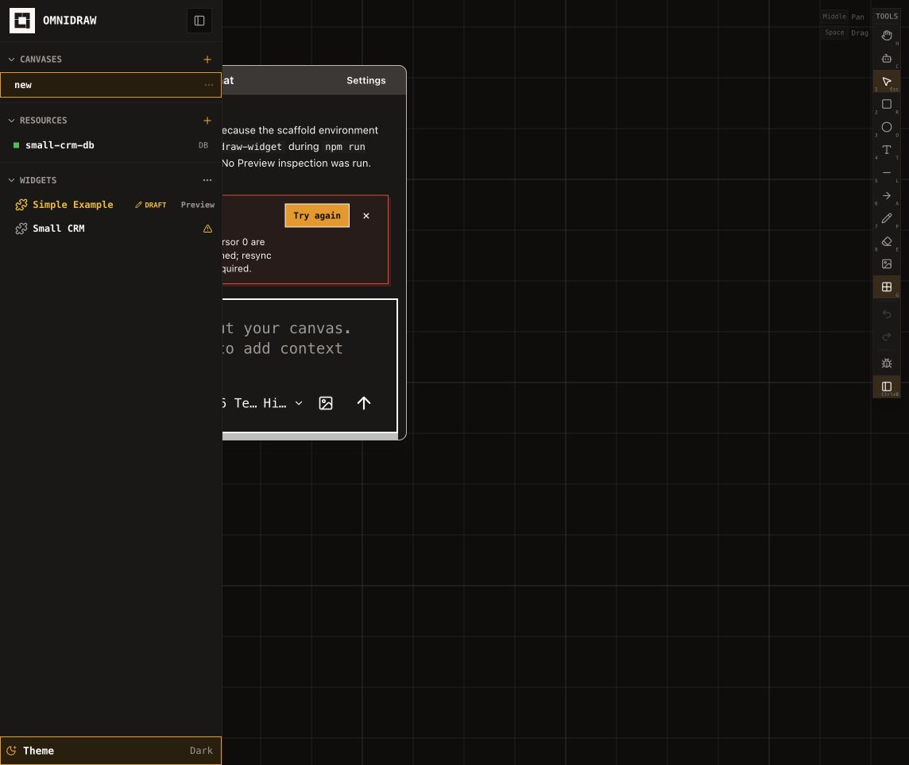
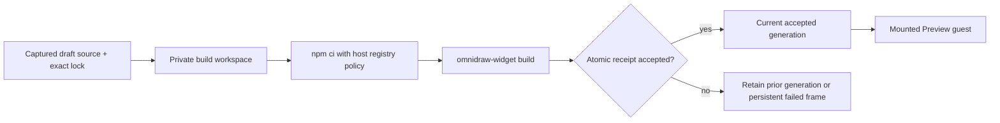

# B96 - AI widget Preview: lockfile-only drafts cannot build and leave blank frames

[Overview](../BASED.md)

Fresh AI-created widgets generate a valid exact dependency lock but never
materialize the SDK CLI that the current Preview rebuild path invokes directly.
The portable build fails with `omnidraw-widget: command not found`, no accepted
generation exists, and placing Preview leaves a blank canvas frame with only a
transient error notification.

## Report

Reproduced on 2026-08-14 after repairing exact local SDK synchronization:

1. AI Chat created the plain DOM **Simple Example** draft.
2. The draft was promoted with `package.json` and `package-lock.json`, but no
   `node_modules` directory.
3. Initial creation and later `od_widget_validate` both reached the portable
   build and failed at `npm run build` with exit code `127` because
   `omnidraw-widget` was not on the draft's executable path.
4. The sidebar still projected the draft as healthy and exposed **Preview**.
5. Placing it authored a valid `widget-preview` frame, but no widget content
   rendered inside the frame.

The npm debug logs contain the direct failed `npm run build`. As a control, an
isolated copy of the same exact draft completed `npm ci` and `npm run build`,
producing `dist/main.js`, CSS, a source map, and
`dist/omnidraw.build.json`. The authored widget source is not the failure.

## Confirmed causes

### Lock generation and build execution disagree

[`tryNpmInstall`](../../apps/backend/src/shell/agent/tools/npm-install.ts)
deliberately runs `npm install --package-lock-only --ignore-scripts`. This is
correct for creating a deterministic authored lock without persisting an
executable dependency tree in the shared draft.

[`WidgetBuildGenerationService.rebuild`](../../apps/backend/src/shell/widget/WidgetBuildGenerationService.ts)
still runs `npm run build` directly in `widgets/drafts/<widgetKey>`. That path
implicitly requires `node_modules/.bin/omnidraw-widget`, contradicting the
lockfile-only scaffold and the documented host-owned private-scratch build
boundary in
[`llm.widget-system.md`](../../docs/internal/llm.widget-system.md).

The repository already has the isolated dependency/build machinery in
[`WidgetNpmDistributionBuild.ts`](../../apps/backend/src/shell/widget/WidgetNpmDistributionBuild.ts)
and
[`WidgetFilesystemBuildService.ts`](../../apps/backend/src/shell/agent/widget-filesystem/build/WidgetFilesystemBuildService.ts),
but manual/AI generation rebuild does not use it to execute the portable SDK
command and atomically admit its exact receipt.

### Manifest health is presented as Preview readiness

[`fnProjectWidgetCatalog`](../../apps/frontend/src/shell/framework/feature/sidebar/widgets/fn.widget-catalog.ts)
offers draft placement whenever catalog source health is `healthy`; the public
draft form does not carry the current accepted-build phase. A syntactically
healthy but unbuilt/rejected draft therefore appears Preview-ready.

### A failed mount removes its only visible explanation

[`WidgetPreviewService.open`](../../apps/backend/src/shell/widget/WidgetPreviewService.ts)
correctly requires a current accepted generation and rejects when none exists.
The frontend mount rejection then reaches
[`CanvasExtensionBridge`](../../packages/canvas/src/internal/CanvasExtensionBridge.ts),
which retires and removes the widget content host. Cangine retains the authored
frame, so the user sees an empty rectangle. The failure is available only as a
short-lived `Canvas extension failed` notification.

## Fixed decisions

- Keep shared draft folders source-only. Do not make persistent draft
  `node_modules` the repair and do not run dependency lifecycle scripts during
  lock generation.
- Creation, `od_widget_validate`, canvas **Rebuild**, and human Build & Publish
  must use one host-owned portable build execution boundary from the exact
  captured source and lockfile.
- The build boundary installs exact dependencies in a private workspace using
  the configured registry, bounded environment/output/time, cancellation, and
  existing mutable-local-registry rules. It atomically exposes only the
  portable `dist/` plus receipt for independent generation acceptance.
- Partial, cancelled, stale, or failed work never replaces a current accepted
  generation or leaves an admissible partial receipt. A failed newer build
  preserves the last accepted Preview.
- A Preview frame that cannot open before guest mount must retain a bounded,
  persistent in-frame state such as **Build required** or **Build failed** with
  actionable **Rebuild** and **Remove** controls. It must not collapse to an
  empty rectangle or rely only on a toast.
- Reuse the exact build-generation state owned by the backend. Do not create a
  second frontend readiness boolean. B96 supplies the missing initial-build
  and failed-frame behavior; the remaining cross-surface readiness work stays
  with [`B70`](./B70.md), and failed diagnostic-clone behavior stays with the
  completed [`B90`](./B90.md).
- Preserve the exact-version local registry behavior from B95 and the
  `omnidraw-workspace` tag fix: a newer `latest` tag must not block the build.

## Plan

### 1. Unify portable build execution

- Replace the direct draft-local `npm run build` call with an injected shell
  build capability owned by the live runtime composition.
- Capture and fence the exact current draft source, manifest, and lock before
  execution and recheck them before accepting output.
- Reuse the existing isolated npm distribution runner and workspace lifecycle
  instead of adding another package installer or ambient process fallback.
- Atomically project the SDK-produced `dist/` and receipt into the generation
  observation boundary, or refactor generation acceptance to consume the exact
  equivalent immutable build result directly. Keep one acceptance authority.

### 2. Make every build caller share the path

- Verify scaffold creation automatically produces one accepted generation
  after lock generation.
- Route AI validation, Preview **Rebuild**, and Build & Publish through the same
  operation and diagnostic vocabulary.
- Preserve coalescing, stale-source rejection, last-known-good retention,
  cancellation, shutdown, and workspace cleanup.
- Return the real install/build failure once, with bounded stdout/stderr and no
  host-path or registry-secret leakage.

### 3. Render pre-guest Preview failures

- Keep the authored frame and its title/actions mounted when
  `widget.preview.open` reports build-required, building, or rejected state.
- Render an accessible persistent placeholder inside the frame with the exact
  bounded state and next action. Do not execute guest code for an unaccepted
  generation.
- Ensure **Rebuild** replaces the placeholder with the guest only after the
  exact accepted generation becomes ready; failure keeps the placeholder or
  prior accepted guest truthfully visible.
- Keep transient toasts as supplemental feedback, not the only error surface.

### 4. Add causal regression coverage

- Reproduce a fresh lockfile-only plain and React scaffold with no draft
  `node_modules`, then prove initial accepted build and Preview mount.
- Cover a newer local-registry `latest` tag while the workspace requires an
  older exact SDK version.
- Cover dependency install failure, SDK command failure, invalid receipt,
  source drift, cancellation, restart, and cleanup without partial acceptance.
- Cover a frame placed before any accepted generation and a failed newer build
  over a last-known-good generation.
- Assert the browser renders either the exact guest or the persistent bounded
  state—never an unexplained empty frame.

## TODOS

- [ ] Replace direct draft-local build execution with the host-owned private build workspace.
- [ ] Make initial create, validate, Rebuild, and Build & Publish share the exact build operation.
- [ ] Atomically fence and accept portable output without persistent draft dependencies.
- [ ] Preserve last-known-good generations and clean failed/cancelled build workspaces.
- [ ] Add a persistent in-frame state for pre-guest Preview failures.
- [ ] Add plain/React, local-registry, failure, cancellation, stale-source, and browser regressions.
- [ ] Run backend widget/agent/API, frontend sidebar/runtime, Canvas portal, typecheck, and architecture suites.
- [ ] Update the Preview/build sections of the widget-system authority and screen atlas if presentation changes.

## Acceptance criteria

- A fresh AI-created widget with only exact source plus `package-lock.json`
  automatically reaches a current accepted generation without storing
  `node_modules` in its draft.
- `od_widget_validate`, Preview **Rebuild**, and Build & Publish use the same
  exact-source, exact-lock, isolated build operation.
- The exact workspace SDK builds even when the shared registry's `latest` tag
  points to a newer version.
- Failed, cancelled, timed-out, stale, or interrupted builds cannot admit
  partial output or replace the last accepted generation.
- A current accepted generation mounts the authored widget in the canvas
  Preview frame.
- With no accepted generation, the frame shows a persistent accessible
  build-required/failed state and actionable next step instead of blank content.
- Draft catalog health and Preview build state remain distinct and truthful;
  no surface claims runtime success from source health or build acceptance.
- No public package runtime change or version bump is introduced unless the
  implementation genuinely changes a public package.

## NOTES

- The attached screenshot is the live reproduced state after placement: the
  draft row is healthy while the selected Preview frame has no content.
- The source-only draft invariant is intentional. Reverting lock generation to
  a persistent `npm install` would hide the mismatch and expand mutable
  authored state instead of fixing the host build boundary.
- This task restores behavior already stated by the widget-system authority:
  scaffold creation runs the portable build automatically, and the host-owned
  build uses a private scratch checkout.

### LOGS

- 2026-08-14: Filed from a live browser and repository investigation. Confirmed
  draft-local build exit `127`, absent `node_modules`, no accepted generation,
  a blank retained frame, and successful isolated `npm ci` plus SDK build of
  the same source.

---
