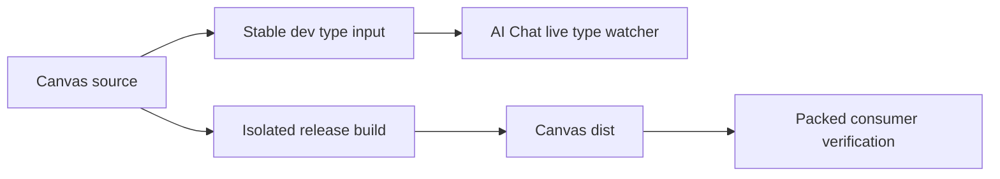

# B97 - public package dev: Canvas build races AI Chat type watcher

[Overview](../BASED.md)

Running a normal Canvas/public-package build while `bun run dev` is active can
make the AI Chat declaration watcher report a false implicit-`any` error:

```text
src/canvas-extension.tsx:232:26 - error TS7031:
Binding element 'actionId' implicitly has an 'any' type.
```

## Report

The authored callback is valid. `TCanvasWidgetHostRegistration.onAction`
contextually types `actionId` as `string`, the emitted Canvas declaration has
the same contract, and a settled AI Chat typecheck passes. The error appears
only when the downstream watcher recompiles during an upstream production
build.

## Confirmed cause

The Canvas and AI Chat dev watchers share each package's release `dist/` with
one-off production builds. Normal Canvas Vite builds empty `packages/canvas/dist`
before TypeScript emits declarations again. During that gap, the live AI Chat
watcher cannot resolve the Canvas contract, loses the contextual callback type,
and reports TS7031. B95 isolated private application source-run imports, but did
not cover one public package's live declaration watcher consuming another
public package's mutable release output.

## Fixed decisions

- Do not add a redundant callback annotation to hide a missing dependency
  contract.
- A public package's live dev/type watcher must not consume an upstream output
  directory that a normal build destructively replaces.
- Release and packed-package verification must continue to exercise standalone
  `dist/` exports; source-only dev resolution must stay explicit and bounded.
- Keep the public package dependency direction and package ABI unchanged.

## Plan



1. Give the AI Chat dev declaration watcher an explicit stable Canvas type
   input instead of resolving through the release `dist/` directory.
2. Keep normal AI Chat release/type validation against the public package
   contract.
3. Add a causal regression that runs the live downstream type watcher while a
   destructive Canvas build occurs and rejects TS7031 or unresolved exports.
4. Run package typechecks, builds, tests, source-run stability, and architecture
   checks.

## TODOS

- [x] Isolate the AI Chat live type watcher from Canvas release output churn.
- [x] Add the concurrent watcher/build regression.
- [x] Verify standalone public distributions remain valid.
- [x] Run focused and architecture validation.

## Acceptance criteria

- Rebuilding Canvas while frontend dev watchers are active cannot produce
  TS7031 in `canvas-extension.tsx` or an unresolved `@omnidraw/canvas` import.
- The AI Chat source remains contextually typed from the Canvas-owned contract.
- One-off package typechecks/builds and packed consumers still validate the
  standalone public `dist/` API.
- No runtime API change or public package version bump is introduced.

### LOGS

- 2026-08-14: Filed from the reported live TS7031. Confirmed the source and
  emitted Canvas contract type `actionId` as `string`, reproduced the shared
  `dist/` deletion window, and identified the downstream dev watcher as the
  missing B95 coverage.
- 2026-08-14: Added a dev-only AI Chat typecheck configuration that resolves
  the exact Canvas, Canvas Contract, and Theme source entrypoints. Normal
  typecheck/build configurations remain package-export consumers. The frontend
  dev supervisor now uses this stable configuration instead of emitting AI Chat
  declarations into the shared release output.
- 2026-08-14: Extended source-run build stability to keep the real AI Chat
  TypeScript watcher alive across `build:public`. The first causal run exposed
  the transitive Theme/Canvas Contract gaps; the complete bounded mapping then
  stayed at zero errors through the same destructive release builds.
- 2026-08-14: Validation passed: AI Chat typecheck/build and 89 tests, Canvas
  typecheck and 170 tests, frontend typecheck/build and 123 tests, concurrent
  source-run build stability, and all 63 architecture/package tests.
