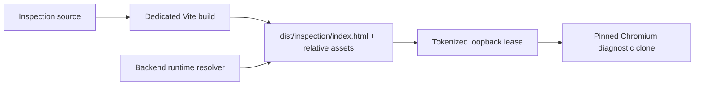

# B98 - Preview inspect: frontend shell build is unreachable

[Overview](../BASED.md)

`od_widget_preview_inspect` rejects an accepted widget before guest mount with
`INSPECTION_SHELL_MISSING`, even after the frontend has been built and Omnidraw
has restarted.

## Report

The reproduced Small CRM result contains an exact accepted artifact and exact
manifest-bound diagnostic-clone identity, but functional verification fails in
73 ms at the inspection preflight. No widget code executes.

## Confirmed causes

- The backend derives `apps/backend/frontend/dist/inspection` from its runtime
  module directory; the real frontend sibling requires one additional parent.
- The shell server requires `<shell>/index.html`, while the combined frontend
  Vite build emits `apps/frontend/dist/inspection.html`.
- The emitted HTML uses root-absolute `/assets/...` URLs. The loopback shell
  requires a one-time token as the first URL segment, so those requests would
  be rejected even after correcting only the entry path.
- The shared frontend `vite-plugin-top-level-await` transform rewrites the
  QuickJS loader chunk to expose a named `__tla` export. Capsule intentionally
  accepts only the loader's single default export, so every real artifact then
  fails during browser-host bootstrap with `BROWSER_MOUNT_FAILED`.
- Canvas forwards fractional authored frame dimensions directly into the
  widget runtime. Capsule requires bounded integer viewport dimensions, so a
  resized Preview can fail visibly with `VIEWPORT_REJECTED` even when its
  accepted artifact is healthy.
- Backend tests manufacture an ideal `shell/index.html` and fake the browser
  shell port. No gate checks the actual frontend build against the backend
  resolver and tokenized asset contract.

## Fixed decisions

- Keep the inspection shell a private frontend entry and a separate bounded
  distribution rooted at `apps/frontend/dist/inspection`.
- Emit `index.html` and all of its assets below that root with relative URLs so
  every request retains the one-time lease token.
- Keep the main application build and inspection build independently cleanable;
  neither build may erase the other's output.
- Resolve the source-run shell from the actual backend runtime module depth.
- Preserve the exact QuickJS loader module namespace; the inspection build
  must reject top-level-await wrapper exports.
- Normalize Canvas frame dimensions and scale into the public widget viewport
  bounds before mount and every viewport update.
- Validate the built shell layout and tokenized serving contract causally; do
  not treat a synthetic fixture as release-layout evidence.

## Plan

1. Split inspection-shell bundling from the main SPA build and preserve the
   isolated `dist/inspection` root.
2. Correct the backend source-run path and add exact resolver coverage.
3. Verify every emitted HTML asset is relative, remains inside the shell root,
   exists, and is retrievable only through an active lease token.
4. Preserve the QuickJS loader's single-default-export module shape and add a
   build-output assertion for it.
5. Normalize fractional Canvas geometry at the frontend widget boundary.
6. Run frontend build/type/tests, backend Preview inspection tests/typecheck,
   architecture checks, a real browser shell smoke, and live Small CRM
   Preview inspection.

## TODOS

- [x] Emit the isolated inspection shell with token-relative assets.
- [x] Correct and test the backend runtime resolver.
- [x] Add built-output and tokenized-serving regression coverage.
- [x] Verify a real accepted widget mounts in the diagnostic clone and visible Preview.
- [x] Run focused, architecture, and live Small CRM validation.

## Acceptance criteria

- A normal frontend build produces `apps/frontend/dist/inspection/index.html`
  and all referenced assets below the same inspection root.
- The backend resolves that exact directory in source-run development.
- The lease entry and every shell asset load through `/<token>/...`; unleased
  and traversal requests remain rejected.
- The real pinned browser loads the shell API before any widget job is mounted.
- The real preflight used by `od_widget_preview_inspect` accepts the built shell
  and can no longer reject an accepted widget with `INSPECTION_SHELL_MISSING`.
- The emitted QuickJS loader exposes exactly one default export and a real
  signed widget reaches guest execution without `BROWSER_MOUNT_FAILED`.
- Fractional Canvas frame sizes are projected to bounded integer runtime
  dimensions without changing the authored Canvas document.
- No public package runtime or version changes are introduced.

### LOGS

- 2026-08-14: Filed from the Small CRM `INSPECTION_SHELL_MISSING` result.
  Confirmed the accepted widget never mounted, the browser runtime checks
  passed, the backend path was one parent short, the Vite entry filename did
  not match, and generated asset URLs bypassed the lease token.
- 2026-08-14: Split the private inspection entry into its own Vite build rooted
  at `dist/inspection`, with `base: "./"`, an `index.html` entry, and all assets
  contained below the lease-served directory. Added a build verifier that
  rejects absolute, escaping, or missing asset references.
- 2026-08-14: Corrected the source-run backend resolver and restored its exact
  layout test. Added a real built-output smoke test that opens a tokenized lease
  in Chromium, waits for the inspection shell API, and confirms unleased asset
  access remains closed.
- 2026-08-14: The production inspection preflight passed against Playwright
  1.61.1, Chromium revision 1228/version 149.0.7827.55, and the repaired shell
  path. Validation passed: 80 focused backend Preview/tool tests plus backend
  typecheck; 123 frontend tests, typecheck, and both builds; Chromium shell
  smoke; browser typecheck; and all 63 architecture/package tests.
- 2026-08-14: Reopened after the real Small CRM retry advanced past preflight
  but failed with `BROWSER_MOUNT_FAILED`; the visible Preview also remained
  failed. Shell-only loading was insufficient acceptance evidence.
- 2026-08-14: Traced the real mount failure through `WidgetHostError` and
  Capsule to the transformed QuickJS loader namespace. Removed the shared
  top-level-await transform from both frontend builds and added an emitted
  module-shape gate that rejects named `__tla` exports.
- 2026-08-14: Traced the visible Preview failure to fractional Canvas frame
  dimensions and added a pure bounded viewport projection used for initial
  mount and subsequent node updates, with four focused policy tests.
- 2026-08-14: Rebuilt Small CRM and used the repaired inspect tool against its
  manifest-bound Preview. Inspection reached the guest, exposed one widget
  compatibility error (`aria-hidden` on SVG), and passed after that attribute
  was removed: `.brand strong`, database rows, and dashboard metrics were
  observed with no visible errors or runtime diagnostics.
- 2026-08-14: Final validation passed: 68 focused Preview/viewport tests,
  backend and frontend typechecks, 127 frontend tests, both frontend builds,
  emitted asset/QuickJS module verification, tokenized Chromium shell smoke,
  source-run import stability (519 checks), and all 63 architecture/package
  tests. The broader live browser suite reached its unrelated overlapping
  Preview placement check but remains nondeterministic because newly placed
  frames use UUID order keys; B98's live Small CRM verification passed.
