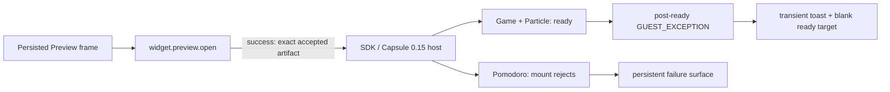

# B99 - Widget Preview: accepted runtimes go blank on cold remount
[Overview](../BASED.md)

Restarting `bun run dev` and reloading the canvas leaves every existing draft
Preview blank. The backend successfully returns each accepted artifact, but the
browser runtime either rejects mount or reports a fatal guest exception after
`ready()` without replacing the blank frame with a durable failure state.

## Context

The defect was reproduced on 2026-08-15 against the current `effectV4` checkout
after the Capsule `0.15.0` / SDK `0.8.1` update. The affected canvas contains
three independent drafts:

- **Little Pomodoro** (`DOM`);
- **Game of Life** (`DOM` + `CANVAS_2D`);
- **Particle Effect** (`DOM` + `WEBGL`).

All three catalog entries are reported as healthy and have host-accepted build
receipts. A clean browser reload sends one `widget.preview.open` request for
each persisted frame. All three RPC calls succeed and return the expected
artifact, runtime descriptor, function descriptors, and diagnostics envelope.
The failure begins after that boundary:

- Little Pomodoro rejects its browser mount and receives the persistent generic
  `MOUNT_FAILED` Preview surface.
- Game of Life and Particle Effect reach the SDK mount target's `ready()` path,
  so `mount-target.ts` reveals their targets and removes `aria-hidden`. Both
  subsequently emit fatal `GUEST_EXCEPTION`, paint no visible content, and
  retain apparently-ready blank `capsule-instance` elements.
- A post-ready fatal diagnostic is shown only as a transient toast by the
  Canvas extension. `renderFailure` is only called from the initial `open()`
  rejection path, so an already-returned mount can remain blank indefinitely.
- The normal browser console contains no actionable guest error because the
  closed Capsule boundary correctly suppresses raw guest details.
- `od_widget_preview_inspect` cannot currently recover the bounded runtime
  event during normal dev because the private inspection shell is absent; that
  separate defect is tracked in [B100](./B100.md).

This is a regression of the product outcome covered historically by
[B79](./B79.md), but the old task describes the retired Preview implementation.
The current ownership path is:

- [`WidgetBuildGenerationService.ts`](../../apps/backend/src/shell/widget/WidgetBuildGenerationService.ts)
  for importing and accepting the current build generation after restart;
- [`WidgetPreviewService.ts`](../../apps/backend/src/shell/widget/WidgetPreviewService.ts)
  for reconstructing and signing the process-owned Preview artifact;
- [`widget-runtime/index.ts`](../../apps/frontend/src/shell/framework/feature/widget-runtime/index.ts)
  for transport decoding and SDK host mount;
- [`mount-target.ts`](../../apps/frontend/src/shell/framework/feature/widget-runtime/mount-target.ts)
  for candidate readiness and visibility;
- [`canvas-extension/index.ts`](../../apps/frontend/src/shell/framework/feature/canvas-extension/index.ts)
  for Preview lifecycle and persistent failure UI;
- [`browser-host.ts`](../../packages/sdk/src/internal/browser-host.ts) for the
  Capsule `0.15.0` adapter and bounded diagnostic mapping.

Do not assume that all three guests share one unsupported authored operation.
The correlated cold-remount failure may be caused by host/runtime identity,
artifact compatibility, readiness semantics, or multiple guest-level
regressions exposed by the same restart. Capture the first trusted runtime
event for each fixture before changing widget source or widening Capsule
policy.

## Plan

### 1. Preserve the exact cold-remount reproduction

- Add current-architecture browser fixtures for three representative API
  profiles: DOM/theme, Canvas 2D/animation, and the supported indexed
  RawShaderMaterial WebGL subset.
- Build and accept each fixture, place its Preview, prove a visible marker,
  stop the backend, start a fresh backend against the same home, reload the
  browser, and prove the same exact accepted generation paints again.
- Capture the accepted generation, build identity, Capsule package/build
  identity, artifact hash, runtime generation, lifecycle generation, viewport,
  and first bounded failure event before and after restart.
- Add an unchanged-page control and an in-process Reload control so backend
  restart, browser reload, and ordinary candidate replacement remain distinct.

### 2. Identify the first causal runtime divergence

- Run each fixture through the visible Preview host and the diagnostic-clone
  host using the same accepted bytes and policy.
- Determine whether failure occurs during artifact admission, guest module
  evaluation, initial channel delivery, viewport delivery, first animation
  frame, Canvas API use, or WebGL facade use.
- Compare Capsule `0.14.0` and `0.15.0` only in a bounded compatibility test if
  evidence places the regression at the dependency update. Do not ship a
  dual-runtime fallback.
- Verify that the trusted build identity and construction cache cannot claim a
  new Capsule package identity while reusing bytes or runtime code from an old
  process/dependency closure.
- If authored widget code is invalid, make the validator/inspection evidence
  name the exact unsupported operation and keep the product regression test for
  the supported subset. Do not silently broaden the public API profile.

### 3. Make readiness and fatal failure truthful

- Define the point at which a mount is safe to reveal. A runtime that has only
  created its Capsule container but has not completed initial guest/channel
  work must not become a successful blank Preview.
- Route a fatal diagnostic after `ready()` into the owning Preview lifecycle.
  Retire or quarantine the failed mount and render the same persistent,
  actionable in-frame failure surface used for an initial mount rejection.
- Preserve the last-good generation during an in-process replacement. On a
  cold browser reload, where no last-good DOM exists, never leave an unexplained
  white frame.
- Keep raw guest text, closed-root DOM, stacks, host paths, secrets, and
  resource identifiers out of the UI. Use only the existing bounded diagnostic
  contract and verified `widget://` location mapping.

### 4. Qualify restart behavior and dependency updates

- Extend live browser acceptance so at least one real accepted Preview survives
  a full backend process restart plus browser reload; a WebSocket reconnect
  without process replacement is not sufficient evidence.
- Add SDK browser qualification that executes representative DOM, Canvas 2D,
  and WebGL guest code instead of only validating decoded artifact metadata.
- Require Capsule dependency upgrades to pass cold construction, cold browser
  mount, initial channel delivery, first-frame paint, and fatal-event ownership
  tests before updating the SDK/public package set.
- Verify cancellation, page navigation, duplicate frames, rebuild, source
  drift, runtime policy change, and shutdown do not leak Capsule hosts or revive
  a retired generation.

## TODOS

- [x] Add the three-profile cold-restart browser reproduction.
- [x] Capture the first bounded failure event and exact accepted identity; keep the unavailable dev inspection startup scoped to B100.
- [x] Isolate the Capsule/adapter/artifact/readiness cause without speculative widget edits.
- [x] Repair accepted-artifact cold remount for every supported fixture.
- [x] Persistently surface fatal post-ready runtime failures.
- [x] Add dependency-upgrade and full-process-restart acceptance gates.
- [x] Run focused SDK/frontend/backend tests, builds, Chromium acceptance, and architecture checks.

## Acceptance criteria

- A host-accepted DOM, Canvas 2D, and supported WebGL Preview paints before and
  after a complete `bun run dev` backend restart and browser reload.
- Each remount uses the exact current receipt, construction, signature,
  artifact hash, manifest, runtime policy, and Capsule identity.
- `ready()` cannot produce a permanently blank target followed by an unowned
  fatal `GUEST_EXCEPTION`.
- Any initial or post-ready fatal failure becomes a persistent bounded in-frame
  state with a stable code and safe remediation; a transient toast is optional
  supplemental feedback only.
- The browser console, Canvas DOM, and AI context do not receive raw guest
  values, closed-root content, unbounded stacks, host paths, or secrets.
- A Capsule/SDK dependency update that recreates this cold-remount failure is
  rejected by automated qualification.

## NOTES

- The successful `widget.preview.open` responses rule out missing Canvas
  placement, missing draft, stale build receipt, and transport failure for this
  reproduction. They do not prove the returned artifact executed correctly.
- Sidebar `draftHealth: healthy` describes filesystem/catalog validity, not
  runtime health. Do not redefine it as runtime evidence.
- Preview is process-owned, but accepted construction inputs are recoverable
  after restart. Ephemeral session ownership does not justify a blank frame.
- No mockup is needed beyond the supplied failure screenshot.

### LOGS

- 2026-08-15: Reproduced the supplied canvas after `bun run dev` restart. Three
  persisted Preview frames were blank while their draft catalog entries stayed
  healthy.
- 2026-08-15: Recorded the reload RPC boundary: Little Pomodoro, Game of Life,
  and Particle Effect each completed `widget.preview.open` successfully with an
  accepted artifact response.
- 2026-08-15: Inspected browser mount targets. Little Pomodoro rejected with
  `MOUNT_FAILED`; Game of Life and Particle Effect had visible, non-ARIA-hidden
  ready targets containing `capsule-instance`, but no painted content. The
  runtime reported fatal `GUEST_EXCEPTION` only through transient notification
  UI.
- 2026-08-15: Confirmed the accepted receipts were produced with SDK `0.8.1`
  after the repository's Capsule `0.15.0` update. The exact rejected guest
  operation remains intentionally unclaimed until a working bounded inspection
  path or direct browser fixture captures it.
- 2026-08-15: Re-ran the exact current drafts in an isolated copy of the supplied
  home. Game of Life (`DOM` + `CANVAS_2D`) and Particle Effect (`DOM` +
  `WEBGL`) reached `ready()` and painted. Little Pomodoro (`DOM`) emitted fatal
  `GUEST_EXCEPTION` as its first bounded runtime event and then rejected with
  `MOUNT_FAILED`. This supersedes the earlier correlation that all three current
  drafts shared the same failure.
- 2026-08-15: Removed only Little Pomodoro's
  `window.addEventListener("pagehide", ...)` registration in the isolated copy.
  The resulting artifact mounted and painted. Capsule 0.15.0's public DOM
  profile does not promise that lifecycle event; its generated runtime surface
  supplies `pagehide` only for the WebGL overlay. No shared construction-cache,
  artifact-identity, or dependency-closure divergence was found: the executable
  input digest already covers SDK, Capsule package/build, transforms, runner,
  policy, and source bytes.
- 2026-08-15: Added SDK offline policy diagnostic
  `SOURCE_DOM_EVENT_UNSUPPORTED`, with a fixed remediation and `widget://`
  location, for literal pure-DOM `window.addEventListener("pagehide", ...)`.
  The diagnostic excludes guest callback text. Bumped the public SDK and
  qualified package set to `0.8.2`.
- 2026-08-15: Routed fatal events after readiness into the Canvas Preview owner.
  A current fatal generation is synchronously quarantined, detached from
  viewport delivery, disposed with `fatal-runtime`, and replaced by the bounded
  persistent Preview failure surface. Stale generations and aborted lifecycles
  cannot retire or revive a newer mount; pre-commit failure keeps the last-good
  generation.
- 2026-08-15: Extended live Chromium acceptance with executable DOM, Canvas 2D,
  and indexed `RawShaderMaterial` WebGL fixtures. All paint before and after a
  complete backend process replacement plus page reload while preserving the
  exact artifact digest/hash, manifest, API contract, and signing identity. The
  existing in-process Reload, pre-guest failure, navigation, and reconnect
  controls also pass.
- 2026-08-15: Qualified focused and full SDK/frontend tests, backend build/cache
  and mount-convention tests, SDK/frontend/backend typechecks and builds, the
  packed external SDK checker, 63 architecture/package tests, the built Chromium
  inspection shell, and the full real-browser acceptance suite. B100 was not
  modified; its dev inspection-shell startup/cache behavior remains separate.
- 2026-08-15: Follow-up review found that candidate-attempt generation had
  prematurely revoked fatal ownership from the installed last-good mount. Fatal
  authority now follows the installed mount identity and transfers only when a
  replacement commits. The causal regression proves failed replacement,
  synchronous quarantine/detach, disposal exactly once, and persistent bounded
  failure; the successful-replacement control proves a late fatal from the old
  mount is ignored. Fire-and-forget retirement absorbs rejection explicitly.
- 2026-08-15: Added the inverse SDK policy gate proving literal `pagehide`
  registration remains accepted for `DOM` + `WEBGL`. Rebased the completed B99
  change onto E43 (`358596fd`) and requalified focused lifecycle/SDK tests, SDK,
  frontend, backend, and browser typechecks, SDK/frontend builds, and the full
  live Chromium acceptance suite.

---
