# D1 - Managed-service OSS rewrite and scale-to-zero functions

[Overview](../BASED.md)

Execute the clean OSS rewrite defined by the managed-service architecture and its recovered operational plan, preserving the canvas while replacing actor-per-widget cost with tenant-safe browser widgets and short-lived server functions.

## Context

The current server has one global authority domain: database rows, Automerge documents, filesystems, PTYs, agent workspaces, resources, events, and long-lived actor processes are not organization-scoped. Widget placement also provisions an actor child process, making idle cost grow with widget count.

This task implements the public OSS foundation only. Managed billing, fleet policy, organization placement, and production sandbox infrastructure belong in the future private managed monorepo.

Authoritative inputs:

- [`llm.managed-service-architecture.md`](../../docs/internal/llm.managed-service-architecture.md)
- [`llm.oss-managed-service-migration-plan.md`](../../docs/internal/llm.oss-managed-service-migration-plan.md)
- [`llm.turso.md`](../../docs/external/llm.turso.md)
- [`SCREENS.md`](../../docs/internal/screens/SCREENS.md)
- completed architecture exploration [`E36`](../e/E36.md)

The operational plan's M0–M10 ledger is the detailed execution contract. This leaf records BASED ownership, milestone commits, evidence, and final archival state without duplicating that plan.

## Plan

No UI mockup is needed: the renderer and product screens are protected invariants. The useful visual is the migration dependency chain.

```mermaid
flowchart LR
  M0["M0 baseline"] --> M1["M1 strict data foundation"]
  M1 --> M2["M2 public package boundary"]
  M2 --> M3["M3 tenant-safe backend"]
  M3 --> M4["M4 independent resources"]
  M4 --> M5["M5 immutable widget model"]
  M5 --> M6["M6 scale-to-zero functions"]
  M6 --> M7["M7 neutral widget host"]
  M7 --> M8["M8 authoring cutover"]
  M8 --> M9["M9 managed-ready OSS"]
  M9 --> M10["M10 clean-room acceptance"]
  M10 --> A["Archive D1"]
```

Each milestone is implemented, focused-tested, passed through the common repository gate, recorded in the operational ledger, and committed before the next milestone begins. A failed hard-stop gate is fixed within its current milestone.

## TODOS

- [x] M0 — Capture reproducible canvas behavior and current cost baselines.
- [ ] M1 — Replace XDG/actor-era storage with the strict fresh `~/.vibecanvas/main.db` foundation.
- [ ] M2 — Consolidate APIs, rename UI packages, and establish narrow public capabilities.
- [ ] M3 — Make tenant context mandatory across every backend authority surface.
- [ ] M4 — Extract actor-independent Resource Store contracts and local providers.
- [ ] M5 — Implement manifest v2, immutable revisions, artifacts, bindings, and publication.
- [ ] M6 — Implement typed, bounded, short-lived server functions and usage receipts.
- [ ] M7 — Cut the preserved canvas renderer over to the neutral widget host.
- [ ] M8 — Cut AI authoring, Preview, validation, and publication over to v2.
- [ ] M9 — Isolate legacy actors and prove private-style external composition.
- [ ] M10 — Pass clean-room architecture, isolation, load, integrity, and recovery acceptance.
- [ ] Mark every operational-ledger milestone `PASSED`, close this leaf, and set D1 to `[x]`.

## NOTES

- The migration starts from empty storage. Never mutate, move, delete, import, or silently adopt actor-era data.
- The canvas renderer is protected; backend boundaries change behind a neutral widget host.
- Keep the Automerge throttle postinstall patch until an upstream fix is deliberately verified.
- Existing user changes and unrelated open BASED work remain out of scope.

### LOGS

- 2026-07-21: Created branch `codex/managed-service-migration` from architecture commit `8c0aa342`.
- 2026-07-21: Recovered the intended 1,125-line clean-rewrite execution plan from repository-local worktree state; rejected its older orphaned in-place-upgrade draft as superseded.
- 2026-07-21: Recovered completed architecture exploration E36 and its task-owned sketch.
- 2026-07-21: Began M0 repository, test, dependency, and authority-surface baseline audits.
- 2026-07-21: M0 passed with the durable canvas regression command, deterministic 10,000-widget fixture, live server/actor/Automerge/resource measurements, expanded repository test coverage, functional-core lint, and four-target build.

---
