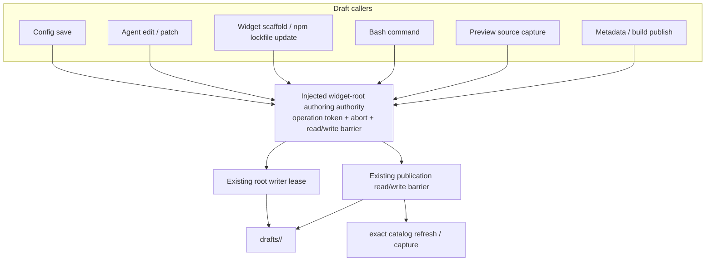

# D10 - widget drafts: one writer authority for Config, agent edit, Bash, Preview, and publish
[Overview](../BASED.md)

Make every draft authoring surface coordinate through the same widget-root
writer authority before resource repair depends on AI edits to
`omnidraw.json`. Today Config has a root writer lease and digest fence, while
agent `edit`/`patch` and Bash use separate process-local queues. A Config save
can therefore pass its final digest check and still overwrite an agent change
that lands immediately before the atomic rename.

This is implementation order **1 of 5**. Complete it before [B83](../b/B83.md),
[B84](../b/B84.md), [A118](../a/A118.md), and [A119](../a/A119.md).

## Context

### Current authorities do not compose

- [`WidgetFilesystemManagementService.ts`](../../apps/cli/src/services/WidgetFilesystemManagementService.ts)
  owns Config save, metadata publish, and build-and-publish. Config save
  refreshes the catalog, checks the expected manifest digest, acquires
  `txAcquireWidgetRootWriterLease`, enters the publication write barrier, and
  delegates to `NodeWidgetFilesystemWorkspace.saveDraftManifest`.
- [`NodeWidgetFilesystemWorkspace.ts`](../../packages/service-agent/src/widget-filesystem/workspace/NodeWidgetFilesystemWorkspace.ts)
  performs the digest-fenced manifest rewrite and atomic rename. It correctly
  rejects a stale expected digest, but only against the bytes it sees while
  its caller holds the management lease.
- [`WidgetWorkspace.ts`](../../packages/service-agent/src/workspace/WidgetWorkspace.ts)
  serializes structured file mutations with its own `#authoringQueues` and
  `#writeQueues`. Those queues are local to the `AgentService` workspace
  instance and do not share the management writer lease.
- [`tool.bash.ts`](../../packages/service-agent/src/tools/tool.bash.ts) snapshots
  mounted draft revisions, runs host-authority Bash, detects changed draft
  source afterward, and emits change notifications. It coordinates only with
  `WidgetWorkspace.withDraftAuthoringOperations`; Config and publication do
  not wait for that queue.
- [`AgentBashCapability.ts`](../../apps/cli/src/services/AgentBashCapability.ts)
  starts the child process with host filesystem/process/environment authority.
  The chat workspace is its starting directory, not an OS confinement
  boundary, so shell-text parsing cannot be treated as a reliable way to
  decide whether a command might write a draft.
- [`WidgetPreviewService.ts`](../../apps/cli/src/services/WidgetPreviewService.ts)
  and publication capture exact source trees. They need a coherent read
  snapshot relative to all authoring writers; otherwise a build can observe a
  half-completed multi-file edit even when each individual rename is atomic.

### Concrete lost-update trace

```text
Config UI                 Agent edit                    Draft file
---------                 ----------                    ----------
read digest A                                           manifest A
check digest A
acquire management lease
final check A
                          process-local queue only
                          rename manifest B             manifest B
rename Config result C                                  manifest C
release lease

Result: the agent's valid manifest B disappears without a conflict.
```

The existing digest fence is not wrong; its ownership boundary is incomplete.
All cooperating writers must use one lease/barrier, and exact readers must
capture only before or after a complete authoring operation.

## Fixed decisions

1. The pinned widget root has exactly one cooperative writer authority. Config,
   structured agent writes, scaffold creation, dependency/lockfile updates,
   Bash, draft deletion, Preview capture, metadata publish, and full publish
   must compose with it.
2. `packages/service-agent` must not import an app-layer CLI service. Define a
   narrow injected authoring port in the package; wire its CLI implementation
   to the same root lease and publication read/write barrier already used by
   `WidgetFilesystemManagementService`.
3. Do not parse Bash source to guess whether it writes. A Bash call from an AI
   chat conservatively holds a cancellable root authoring lease for the
   command lifetime. This may make Config briefly show “widget files are being
   edited,” but it cannot silently lose bytes.
4. Lease acquisition is bounded, abortable, re-entrant only for the same
   operation token, and released in `finally` after success, failure, timeout,
   cancellation, or child-process crash.
5. A long Bash process must never make the UI appear to save successfully.
   Config/publish either wait within a clear bound or return a typed busy or
   conflict result. They do not bypass the lease.
6. Preview and publish remain exact-snapshot readers. They take the read side
   of the same barrier while capturing source, then release it before long
   construction work. Publish keeps its existing digest/catalog fences and
   revalidates before commit.
7. `omnidraw.json` is the portable widget manifest. The global
   `<omnidraw-home>/config.json` is application configuration and remains
   outside widget authoring. No `omnidraw.config` compatibility file is added.
8. Preserve the functional-core rules in the repository `AGENTS.md`: pure
   coordination decisions belong in local `fn.*` files; impure reads/writes
   use injected `fx.*`/`tx.*` portals; orchestration remains in the service or
   tool file.

## Plan



### 1. Freeze the authoring-port contract

Add a small service-agent contract that expresses operations, not a concrete
lock implementation. It should support:

- `withRootWrite({ purpose, operationToken, signal }, operation)` for a
  mutation that may touch any draft;
- `withDraftWrite({ widgetKey, purpose, operationToken, signal }, operation)`
  only if the implementation can prove it composes with the root lease;
- `withSnapshotRead({ purpose, signal }, capture)` for bounded exact source
  capture;
- typed `busy`, `aborted`, `conflict`, and `unavailable` failures;
- caller-supplied or host-generated operation tokens for nested/re-entrant
  calls without accidentally allowing unrelated operations to share a lease.

Keep the port internal to service-agent unless another package truly needs the
type. Do not publish a lock primitive as widget SDK surface.

### 2. Reuse the existing root lease and barrier in the CLI composition

- Build one CLI adapter over `txAcquireWidgetRootWriterLease` and the existing
  `PublicationReadWriteBarrier`.
- Construct it once per pinned widget root in
  [`setup-services.ts`](../../apps/cli/src/setup-services.ts) and inject the
  same instance into widget management, `AgentService`, Preview, and
  publication composition.
- Ensure shutdown rejects new work, aborts or waits for bounded in-flight
  operations, and releases OS/file handles.
- Ensure two Omnidraw processes using the same home still coordinate through
  the existing filesystem lease. An in-memory mutex alone is insufficient.

### 3. Route structured authoring through the shared authority

Cover every path in service-agent that can mutate mounted widget source:

- `od_widget_create`, scaffold writes, `npm install`, and lockfile creation;
- `edit` and `patch`, including create-file behavior;
- any structured manifest helper;
- mount-aware cleanup or delete paths;
- draft-change notification and catalog invalidation.

The operation must remain under one outer authoring lease until all related
files are durable and the change callback has been scheduled. Keep
`WidgetWorkspace`'s local queues only if they still provide useful ordering
inside one process; document that the shared root authority is the safety
boundary.

### 4. Put Bash under the same authority

- Acquire the root write authority before spawning a Bash command for AI Chat.
- Hold it until the child exits and draft revision detection plus change
  notification completes.
- Thread cancellation from the Pi tool to lease wait and child termination.
- Bound queue wait and command duration separately so an actionable error can
  distinguish “writer busy” from “command timed out.”
- Acquire once even when multiple widgets are mounted; do not recursively take
  per-widget locks in inconsistent name order.
- Continue detecting which mounted drafts changed for precise invalidation and
  transcript events. Detection is observability, not the lock.

### 5. Make Preview and publish observe complete snapshots

- Preview build/check/open and publication capture enter the shared snapshot
  read boundary while reading manifest, source file set, and digests.
- Release the read boundary after immutable bytes/digests are captured; do not
  hold it during npm/build/browser work.
- Recheck draft/catalog digests at existing commit fences. If source changed
  during construction, return the existing stale-build/rebuild result rather
  than publishing older bytes as current.
- Coordinate with open task [B70](../b/B70.md): D10 owns writer/snapshot
  exclusion; B70 owns the product's exact-revision readiness state. Do not
  invent a second readiness authority here.

### 6. Surface conflicts without data loss

- Config keeps its current digest field and returns `WIDGET_MANIFEST_CONFLICT`
  if the loaded form is stale after another authoring operation.
- A busy writer produces a distinct bounded error/message, not a false stale
  digest and not an infinite spinner.
- Agent edit/patch returns a precise conflict or cancellation result and can
  reread before retrying. It must not automatically replay a patch against new
  bytes.
- Bash is never automatically rerun because shell commands may have external
  effects.

### 7. Add deterministic race coverage

Use controllable barriers/deferred promises rather than timing sleeps. Cover:

1. Config pauses after its first digest read; agent edit commits; Config then
   fails stale instead of overwriting.
2. Agent edit holds the lease; Config waits or returns busy; final bytes contain
   the agent edit.
3. Bash changes `omnidraw.json` while Config is queued; Config cannot overwrite
   it from an old form.
4. Bash cancellation and child crash release the lease.
5. Preview capture sees all-before or all-after for a two-file edit, never one
   old and one new file.
6. Publish construction becomes stale after a later edit and cannot commit the
   older source as current.
7. Two service compositions pointed at one temporary widget root coordinate
   through the filesystem lease.

## Test plan

Run focused suites first:

```sh
bun test packages/service-agent/tests/widget-filesystem/workspace.test.ts
bun test packages/service-agent/tests/tool-registry.test.ts packages/service-agent/tests/widget-shared-draft-root.test.ts
bun test apps/cli/tests/WidgetFilesystemManagementService.test.ts apps/cli/tests/AgentBashCapability.test.ts
bun test apps/cli/tests/WidgetPreviewService.test.ts
```

Add a dedicated cross-authority race suite at the CLI composition edge. Then
run package typechecks and the functional-core check required by the touched
folders. Use temporary widget roots only; never point a race test at the
developer's real Omnidraw home.

## TODOS

- [ ] Define the narrow injected widget-root authoring port and typed failures.
- [ ] Implement one CLI adapter over the existing root writer lease and barrier.
- [ ] Inject the same authority into management, AgentService, Preview, and publication.
- [ ] Route scaffold, install, edit, patch, and cleanup mutations through it.
- [ ] Hold the root authoring lease across each AI Bash command and change notification.
- [ ] Make Preview/publication source capture use the exact snapshot read side.
- [ ] Preserve digest/catalog commit fences and actionable conflict behavior.
- [ ] Add deterministic Config-versus-edit, Config-versus-Bash, Preview, publish, cancellation, and multiprocess race tests.
- [ ] Update widget architecture documentation and `FILES.md` for the single cooperative authority.
- [ ] Run focused tests, package typechecks, functional-core checks, and the production build affected by composition changes.

## Acceptance criteria

- Config, agent structured edits, Bash, Preview capture, and publication all
  use one cooperative widget-root authority in the running application.
- The documented Config/agent lost-update interleaving cannot overwrite valid
  source and has a deterministic regression test.
- A Bash timeout, cancellation, spawn failure, or crash always releases the
  writer lease and reports which phase failed.
- Preview/build capture never observes a partial multi-file authoring
  operation.
- Publication never commits a build whose captured source became stale.
- No shell-source parser, process-local-only mutex, second draft root, or
  widget-level `omnidraw.config` becomes an authority.
- Existing Config digest fencing, atomic filesystem publication, catalog
  refresh, and user-controlled Publish behavior remain intact.
- Each test uses an isolated temporary widget root and leaves no lock or child
  process behind.

## Non-goals

- Confining Bash to the chat workspace; Bash intentionally retains host
  authority.
- Allowing the agent to publish or bypass user-controlled publication.
- Changing resource binding ownership; [B84](../b/B84.md) and
  [A119](../a/A119.md) own that work.
- Replacing exact-revision readiness work already owned by [B70](../b/B70.md).
- Adding a database table or distributed job system for draft writes.

## NOTES

- No UI mockup is needed. The user-visible change is limited to a bounded
  busy/conflict message; the important design is the ownership and race trace.
- The most conservative Bash policy is intentional. Because Bash has host
  authority, advisory path prediction is not a correctness boundary.
- If implementation changes public/runtime `src/` in a versioned published
  package, follow the repository package policy: apply a semantic version bump
  and regenerate the lockfile. Private packages and tests/docs-only changes do
  not receive a release bump.

### LOGS

- 2026-08-10: Created from the AgentService/canvas/resource-binding review.
  Confirmed Config uses the filesystem root writer lease and digest fence while
  structured agent edits and Bash use a separate `WidgetWorkspace` queue.

---
