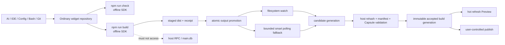

# D10 - widget repositories: portable build receipts and smart Preview refresh

[Overview](../BASED.md)

Make ordinary widget repositories safe to edit from AI tools, Bash, Config UI,
an IDE, or any external process without pretending Omnidraw can lock every
writer. A new Preview generation becomes visible only after the repository's
portable `npm run build` completes and atomically emits a verifiable build
receipt. Omnidraw observes that filesystem result; the build script never calls
the host and never reads `main.db`.

This is implementation order **1 of 5**. Complete it before [B83](../b/B83.md),
[B84](../b/B84.md), [A118](../a/A118.md), and [A119](../a/A119.md).

## Product workflow

```text
AI Chat -> create widget -> scaffold repository -> automatic portable build
        -> host detects accepted build -> render Preview

AI/IDE/Config/Bash -> edit ordinary files -> npm run check -> npm run build
                   -> host detects accepted build -> refresh Preview

Human forgets build -> Preview remains on last accepted generation
                    -> Config “Rebuild” runs npm run build
                    -> host detects accepted build -> refresh Preview
```

Raw file edits never become a Preview/publish generation merely because a file
watcher fired. The build receipt is the handoff boundary.

## Why one writer authority is impossible

The widget draft is an ordinary repository. Omnidraw controls some edits, but
cannot require cooperation from:

- a user's IDE or editor;
- Git commands and checkout operations;
- AI Bash with general host filesystem authority;
- third-party formatters/code generators;
- an external machine building the cloned repository.

A host-only mutex or lease would protect only host participants and create a
false safety claim. Correctness must instead come from:

- digest-fenced host writes where Omnidraw itself edits a file;
- portable build staging and atomic output publication;
- an exact receipt describing the build inputs and outputs;
- host revalidation before accepting the generation;
- source/build freshness tracking after later external edits.

## Portability boundary

Widget scripts must work in a cloned repository with no Omnidraw process,
database, socket, token, or environment capability.

The canonical scripts are package-local and supplied by the public SDK/tooling:

```json
{
  "scripts": {
    "check": "omnidraw-widget check .",
    "build": "omnidraw-widget build ."
  }
}
```

Exact package/bin naming may follow existing SDK conventions, but the following
is fixed:

- the command comes from a declared repository dependency;
- it uses only repository files and public package APIs;
- it does not connect to localhost or a remote Omnidraw host;
- it does not read application configuration or `main.db`;
- it does not receive a host capability through environment variables;
- it can run in a sandbox or on an external machine;
- host acceptance never trusts the script merely because it exited zero.

[A118](../a/A118.md) owns the offline `check` contract. D10 owns the portable
build receipt and host observation/import lifecycle.

## Build receipt contract

The portable builder writes generated output into a temporary sibling and
atomically promotes it. The completion receipt is written last. A proposed
shape is:

```json
{
  "schemaVersion": 1,
  "sourceDigestSha256": "...",
  "manifestDigestSha256": "...",
  "executableInputDigestSha256": "...",
  "sdkVersion": "...",
  "buildIdentity": "...",
  "outputs": [
    { "path": "dist/main.js", "byteSize": 1234, "sha256": "..." }
  ]
}
```

Use one fixed safe path such as `dist/omnidraw.build.json`, finalized during
implementation. Requirements:

- strict versioned schema with bounded arrays/strings/sizes;
- safe relative output paths only;
- no timestamps or machine paths in executable identity;
- exact source/manifest/executable-input digests;
- exact generated-file sizes/digests;
- public SDK/build identity;
- no resource contents, credentials, host IDs, or Omnidraw database state;
- atomic write/rename after every referenced output is durable.

The receipt is a notification and evidence envelope, not trusted authority.
The host recomputes required digests, validates the artifact/Capsule, and rejects
forged, partial, stale, or incompatible output.

## Smart host observation

Use filesystem events as a latency optimization and bounded polling as the
correctness fallback:

1. Watch the draft root and fixed receipt paths when supported.
2. Coalesce duplicate events by widget key and observed marker identity.
3. Poll only active/recent/visible drafts at a short bounded interval.
4. Back off idle drafts; do not recursively hash every repository every tick.
5. Compare marker inode/mtime/size before reading; hash only on change.
6. Read receipt and output metadata, then re-read marker identity to reject a
   concurrently replaced receipt.
7. Recompute current source/manifest digests only for a candidate generation or
   explicit readiness query.
8. Accept one immutable generation only when current files, receipt, outputs,
   SDK identity, and Capsule validation all agree.
9. Publish one generation-changed event after acceptance.
10. Keep the last accepted Preview running when a new candidate is invalid.

Poll intervals, active-draft bounds, hashing concurrency, and backoff must be
configuration constants with deterministic fake-clock tests. Do not use
unbounded sleeps, recursive scans, or one watcher per source file.

## Fixed decisions

1. Widget source folders are externally editable ordinary repositories.
2. Omnidraw does not claim a cooperative lock over AI, Bash, human, Git, or
   external writers.
3. Host-owned Config/structured writes remain atomic and digest-fenced. They
   fail conflict if bytes changed; they never overwrite an external edit from
   a stale form.
4. `npm run build` is the portable synchronization boundary for presenting a
   new generation.
5. The build command has no host communication channel. Filesystem outputs and
   the atomic receipt are its only signal.
6. The public builder stages exact input, constructs output, and promotes it
   atomically. Concurrent builds serialize through a portable repository-local
   build lock or fail busy; this lock does not block source editors.
7. Host acceptance independently validates the receipt, current source,
   manifest, outputs, compatibility, and Capsule construction.
8. A source/config edit after build marks the accepted generation stale for
   publication and shows **Build required**, but does not tear down the last
   working Preview.
9. Preview renders only accepted immutable generations, never raw source or a
   half-written `dist` tree.
10. Publish accepts only a current host-accepted generation whose source and
    manifest still match the receipt. It remains user controlled.
11. Resource-ID-only changes under B84 still require `npm run build`, but the
    builder may reuse executable bytes and emit a new config/receipt generation.
12. Widget creation scaffolds, installs dependencies through the existing
    controlled workflow, runs build automatically, waits for host acceptance,
    and only then creates/renders the first Preview.
13. AI prompts require check/build after every edit they want to present.
14. Config exposes a manual **Rebuild** action. It runs the same repository
    `npm run build`, not a privileged host-only builder.
15. Build failure preserves the previous accepted Preview and returns mapped
    widget-relative diagnostics to UI and A119.
16. Shutdown stops watchers/pollers/build children and leaves no detached import
    or accepted-generation mutation afterward.

## Architecture



## Implementation plan

### 1. Define the public portable build contract

- Add the build CLI/API to the public SDK or the narrowest publishable widget
  tooling package.
- Freeze safe project-root discovery, manifest input, source inclusion/exclusion,
  symlink policy, output layout, receipt schema, and exit codes.
- Ensure the build works with only installed repository dependencies.
- Never import private app/service packages into the public builder.
- Add packed external-project tests with network and host services unavailable.

### 2. Capture a coherent portable input

- Enumerate allowed input files with the existing source bounds/path rules.
- Reject symlinks, traversal, special files, output directories as input, and
  files changed during capture.
- Stage/copy the exact captured input before invoking the bundler so output does
  not mix old/new source files.
- Compute source, manifest, and executable-input digests from that exact stage.
- On concurrent source mutation, either complete an older coherent stage whose
  receipt records its digest or fail stale; the host will not accept it as
  current if repository files have since changed.

### 3. Promote output and receipt atomically

- Build into a temporary sibling owned by one portable build operation.
- Validate expected UI/server outputs before promotion.
- Make resource-ID-only/config-only builds reuse proven executable output where
  safe, while still emitting a new receipt.
- Rename/promote output atomically and write the completion receipt last.
- Clean failed/interrupted staging directories without deleting the last
  accepted output.

### 4. Add one host generation observer

- Implement one process service keyed by widget root/key.
- Combine watch events with polling fallback and active/idle backoff.
- Reuse one bounded hashing pool; avoid duplicate concurrent imports.
- Validate receipt schema, paths, file hashes, current source/manifest digests,
  SDK/build compatibility, and Capsule artifact.
- Store accepted generation in process/catalog state, not a new database table.
- Emit exact generation/readiness events for Preview/sidebar/publication.
- On invalid candidate, retain old generation and record bounded diagnostics.

### 5. Integrate create/edit/Preview flows

- `od_widget_create`: scaffold -> controlled install -> portable build -> wait
  for exact host acceptance -> render first Preview.
- AI edit/patch/Bash prompt guidance: edit -> check -> build -> wait -> inspect.
- External/human edit: mark source dirty/build required; do not auto-run code.
- Config **Rebuild**: spawn the same npm build with bounded output/cancel and
  wait for the matching accepted receipt.
- Preview owner subscribes to accepted generation only and hot-swaps at most
  once per generation.
- A119 inspection targets the exact accepted generation/current Preview.

### 6. Fence publication

- Publish only the latest accepted generation when current source and manifest
  still match its receipt.
- Revalidate before final atomic publication commit.
- If files change during publication construction, return stale/build-required
  instead of publishing old bytes as current.
- Presentation/config-only publication may reuse executable bytes only when
  the receipt proves the logical executable contract is unchanged.

### 7. Update user and agent feedback

Expose distinct states:

- **Source changed — build required**;
- **Building**;
- **Build failed** with bounded authored locations;
- **Build output detected — validating**;
- **Preview ready** with accepted generation;
- **Build stale**;
- **Rebuild** manual action.

Never show “Preview updated” on a source watch event alone.

## Causal tests

1. Portable build succeeds in an external temporary repository with no host,
   no `main.db`, no host environment token, and blocked network.
2. Build receipt is deterministic for identical inputs and contains no host or
   machine path.
3. Concurrent two-file edit cannot produce a mixed staged source generation.
4. Source mutation after staging produces a coherent older receipt that the
   host rejects as stale/current mismatch.
5. Partial output, missing receipt, receipt written early, unsafe path, forged
   digest, incompatible SDK, or Capsule failure is never accepted.
6. Watch event accepts quickly; dropped watch event is recovered by bounded
   polling exactly once.
7. Idle backoff avoids recursive hot polling; an active Preview remains timely.
8. Duplicate watch/poll events produce one accepted generation and one refresh.
9. Raw source edit keeps the old Preview and marks build required.
10. Successful build hot-refreshes once; failed build keeps old Preview.
11. Resource-ID-only build emits a new receipt while executable bytes remain
    byte-identical.
12. Create tool does not render until its automatic build is accepted.
13. AI edit without build cannot appear as new Preview; subsequent build does.
14. Manual Config Rebuild runs the same portable command and recovers.
15. Config save with stale digest cannot overwrite an external edit.
16. Two builds serialize/fail busy without blocking external source editing.
17. Publish rejects a generation whose source/manifest became stale.
18. Shutdown cancels build/import work and leaves no children/watchers.

## Test plan

```sh
bun test packages/sdk packages/widget-contract
bun test packages/service-agent/tests/widget-capsule-scaffold.test.ts
bun test apps/cli/tests/WidgetFilesystemManagementService.test.ts \
  apps/cli/tests/WidgetPreviewService.test.ts
bun run --cwd packages/ui-ai-chat test
bun run test:packed-public-composition
bun run build
bun run lint:functional-core
bun run generate:files
git diff --check
```

Add a packed external-repository smoke that removes all Omnidraw host/database
environment and blocks network during check/build.

## TODOS

- [ ] Define the portable SDK build CLI and strict receipt schema.
- [ ] Capture/stage coherent repository input and compute exact digests.
- [ ] Promote generated output and completion receipt atomically.
- [ ] Add portable concurrent-build serialization without locking editors.
- [ ] Add host watcher plus bounded smart polling/backoff observer.
- [ ] Revalidate source/manifest/output/Capsule before accepting a generation.
- [ ] Track dirty/building/failed/validating/ready/stale states without a DB table.
- [ ] Integrate automatic scaffold build and accepted-generation Preview refresh.
- [ ] Require AI check/build workflow after edits.
- [ ] Add Config manual Rebuild through the same portable command.
- [ ] Fence publication to one current accepted generation.
- [ ] Add causal external-edit, receipt, polling, dedup, stale, failure, and shutdown tests.
- [ ] Update widget architecture/prompts/UI docs and `FILES.md`.
- [ ] Apply required public-package version bumps and regenerate lock/dist.
- [ ] Run full tests, packed external composition, builds, lint, and browser acceptance.

## Acceptance criteria

- Widget repositories can be edited by any external process without a false
  host lock guarantee.
- `npm run build` works without Omnidraw or `main.db` and has no host channel.
- Only a validated atomic build receipt can create a new Preview generation.
- Watch plus smart polling detects completed builds efficiently and exactly once.
- Raw edits never expose partial/unbuilt source to Preview or publication.
- AI create/edit workflow automatically builds before presenting changes.
- Human manual Rebuild recovers when AI/external tooling omitted build.
- Previous working Preview survives build failure.
- Publication accepts only current host-validated generations.
- No new relational DB schema/table is introduced for build state.

## Non-goals

- Locking or preventing external repository edits.
- Giving build/check scripts access to host APIs or database state.
- Automatically running arbitrary code whenever a source file changes.
- Treating filesystem watch delivery as a correctness guarantee.
- Publishing automatically after build.
- Replacing B84 resource authority or A119 Preview diagnostics.

## NOTES

- No UI mockup is needed beyond existing Config/Preview patterns; the important
  design is the portable receipt and observation state machine.
- 2026-08-11: Rewritten after clarifying that no host can own all widget file
  writers. Build output, not edit coordination, is the presentation handoff.

---
