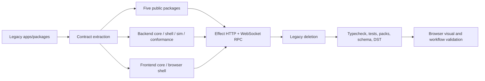

# D11 - Effect v4 two-app/five-package clean-cut refactor

[Overview](../BASED.md)

Replace the legacy workspace, runtime, and transport with the PRD's two private applications, five public packages, Effect v4 application boundaries, and deterministic backend simulation while preserving the current schema and product UI.

## Context

The clean-cut workspace and application topology are implemented: two private
applications, five public packages, exact Effect v4, native WebSocket Effect
RPC, one runtime per app instance, backend/frontend
`core`/`shell`/`sim`/`conformance`, and no compatibility workspace or parallel
plugin/service locator. `docs/PRD_REVIEW.md` remains the corrective acceptance
ledger. D11 stays open until its partial architecture findings and final strict
source-run browser gate are closed rather than inferred from unit tests.

Authorities:

- [`docs/PRD.md`](../../docs/PRD.md)
- [`docs/internal/llm.app-architecture.md`](../../docs/internal/llm.app-architecture.md)
- [`docs/external/llm.effect.md`](../../docs/external/llm.effect.md)
- [`docs/internal/llm.widget-system.md`](../../docs/internal/llm.widget-system.md)
- [`docs/internal/screens/SCREENS.md`](../../docs/internal/screens/SCREENS.md)
- vendored Effect reference `repos/effect` at `1f09f265beb86b2ed49b663b353ed597b78a6ab3`

## Plan

No mockup is needed because visual redesign is out of scope. The screen atlas is the visual acceptance baseline.

### 1. Establish final public contracts

- Make `canvas-contract` own the complete serialized scene, validation, canonical codecs, lifecycle contributions, and conformance vectors without Cangine, Theme, Solid, Effect, persistence, or authority dependencies.
- Merge theme contract and implementation into `@omnidraw/theme` with explicit scoped CSS exports.
- Consolidate the portable widget manifest, artifact, guest ABI, host bridge, validation, and conformance vectors into `@omnidraw/sdk` while encapsulating Capsule.
- Extract an Effect-free AI Chat component/action-streaming contract and Canvas extension into `@omnidraw/component-ai-chat`.
- Keep Canvas host-injected, map the Omnidraw contract exhaustively to Cangine, and use an instance-owned Effect runtime internally.

### 2. Replace the backend application

- Rename `apps/cli` to `apps/backend` and relocate every private backend service/API/runtime implementation into the owning application.
- Split domain policy and lazy programs into `core`, live adapters and the one `ManagedRuntime` into `shell`, controlled implementations into `sim`, and unchanged semantic scenarios into `conformance`.
- Keep the current 14-table fresh-install schema and one-JSONB-row-per-canvas-node authority; remove every pre-refactor compatibility path.
- Implement deterministic seeded scheduling, virtual time, fault injection, canonical trace/replay, and the three required distributed scenarios.
- Keep source-run CLI, static SPA serving, Preview inspection, trusted local widget execution, and all supported product authorities.

### 3. Replace private transport and frontend composition

- Replace oRPC, PartySocket, and every SSE/EventSource path with exact Effect v4 HTTP and WebSocket RPC.
- Use one native browser WebSocket, Effect-owned physical reconnect, connection generations, and domain-owned snapshot/cursor recovery, stale-generation rejection, idempotent replay, and cancellation recovery.
- Move product-private AI, widget, navigation, resource, sidebar, and Preview UI into `apps/frontend`; keep pure view policy separate from browser/transport mechanics.
- Preserve routes, screens, interactions, and styling from the atlas.

### 4. Delete legacy surface and repair tooling

- Remove all applications except backend/frontend and all packages except canvas-contract/canvas/sdk/component-ai-chat/theme.
- Remove `global.d.ts`, `FILES.md`, the generated file index, compiled Preview/binary tooling, portal-era lint/hooks, old package names, compatibility exports, and legacy scripts.
- Limit workspaces to `apps/*` and `packages/*`; move isolated packed consumers under `tests/fixtures`.
- Update build, release staging, architecture, package-set, fresh-schema, live/sim conformance, packed-consumer, integration, and CI gates for the final topology.

### 5. Qualify the clean cut

- Regenerate the lockfile and build all seven workspaces.
- Run unit, type, architecture, schema/constraint/recovery, live/sim conformance, deterministic replay, packed consumer, transport reconnect, integration, and full repository tests.
- Run the backend and frontend from a fresh local home/database.
- Manually exercise the welcome/create flow, Canvas, AI Chat, widget catalog/Preview, and resource routes in the browser; compare key states with the screen atlas and inspect browser/runtime errors.

## TODOS

- [x] Repair the complete live widget/AI Chat chain: immediate portal mounting,
  canonical identity, typed RPC failures, JSON-safe payloads, durable chat
  identity/preferences, process-restart recovery, and one titlebar action.
- [x] Restore renderer-neutral sidebar placement with the full pointer session,
  coordinate projection, threshold, cancellation, bounds, preview, and
  viewport-centred Add behavior.
- [x] Replace backend `private`, `services`, `plugins`, root composition, and
  the string service locator with the final `core`/`shell`/`sim`/`conformance`
  ownership and one resolved Layer graph.
- [x] Make live and simulated backend domains execute the same core programs
  and activate shared conformance beyond the current Canvas model.
- [x] Replace the frontend topology with `core`/`shell`/`sim`/`conformance`,
  one disposable application runtime, explicit browser-world services, and
  shared live/sim scenarios (without frontend DST).
- [x] Replace duplicated path-plus-Unknown transport declarations with strict
  per-operation schemas, exhaustive typed failures, bounded streams, cursors,
  and semantic reconnect/replay rules.
- [x] Move all database mechanics under the backend database shell while
  preserving the currently required 14-table schema and authority behavior.
- [x] Strengthen structural, Effect-program, world-access, package-build, and
  browser gates so the reviewed false-green states cannot pass.
- [x] Pass the full unit/type/build/architecture/database/live-sim/packed
  verification matrix from self-constructed inputs.
- [x] Run a fresh isolated dev environment and verify visible Canvas, AI Chat,
  catalog widget, Preview, resources, typed failures, native reconnect, and a
  real backend restart through source-run Playwright. The complete functional
  and visual gate passes, including the responsive 360 px Preview titlebar,
  all four actions, and a live Reload dispatch. A later independent fresh-home
  source dev run also succeeded in the Codex in-app browser for Canvas startup,
  AI Chat placement, durable reload, and browser error inspection.
- [x] Record final evidence and mark D11 complete only after the reviewed
  shortcomings are actually closed.

## NOTES

- The worktree was clean on branch `effectV4` before implementation began.
- Preserve the current redesigned 14-table schema; the PRD's "new schema" means a clean-install authority, not another UI/product data redesign.
- Public runtime source changes require independent semantic version bumps and lockfile regeneration.
- `repos/effect` is read-only and pinned to the exact Effect v4 RC required by the PRD.

### LOGS

- 2026-08-13: Reopened D11 after `docs/PRD_REVIEW.md` reproduced release-blocking
  workflow defects and showed that both application architecture claims were
  false greens. Replaced the completed checklist with corrective acceptance
  gates covering every P0/P1 implementation area and live browser usability.

- 2026-08-13: Read the PRD, application architecture, Effect v4 guide, widget system, screen atlas, repository guide, and BASED conventions in full; began repository, backend, frontend, and baseline-test audits.
- 2026-08-13: Replaced the legacy five-app/twenty-one-package surface with private `backend` and `frontend` applications plus the five qualified public packages. Added strict public declarations, exact package versions, standalone dist staging, and an explicit public package set.
- 2026-08-13: Introduced the backend Effect `core`/`shell`/`sim`/`conformance` split, one runtime owner, native Effect HTTP/RPC, deterministic replay/fault worlds, and shared live/sim Canvas authority scenarios. Preserved the pinned 14-table/18-index clean-install schema and extracted 208 registered SQL operations.
- 2026-08-13: Replaced browser oRPC/PartySocket transport with one native WebSocket, connection generations, domain cursor/snapshot recovery, stale-lease fencing, cancellation, and idempotent Canvas command replay. Moved all private product UI and widget hosting into the frontend while keeping Canvas, AI Chat, SDK, and Theme public surfaces transport-neutral.
- 2026-08-13: Deleted retired applications, packages, global declarations, compatibility readers, compiled-binary/Preview paths, portal tooling, and helper workspaces. Rebuilt architecture, release, package-dist, packed-consumer, database, conformance, and CI gates around the final topology.
- 2026-08-13: `bun run test:final-acceptance` passed on the final tree: 668 backend tests, 152 Canvas, 17 Canvas Contract, 78 AI Chat, 20 SDK, 13 Theme, 46 frontend Bun tests plus 19 frontend Vitest tests, 45 architecture tests, 12 deterministic simulation/conformance tests, and 27 schema/constraint/recovery tests. All five standalone package dists and isolated packed consumers passed clean installation, typecheck, runtime smoke, and browser checks.
- 2026-08-13: Manual in-app browser validation covered the welcome/create flow, theme toggle, Canvas tools, AI Chat mount/maximize/restore, KV/secret/database resources, every widget inspector tab, and a real backend restart. It found and fixed missing AI Chat CSS, undefined optional resource wire fields, and a dev-watch declaration race. The automated live browser gate then passed all 16 atlas routes, AI Chat short-drag persistence, forced native WebSocket reconnect from generation 1 to 2, stale-generation rejection, zero retired-socket late frames, and post-reconnect Canvas mutations.

- 2026-08-13: An early desktop Browser connection attempt exposed no
  controllable tab, so the corrective workflow was first qualified through
  Playwright Chromium against the real source-run backend and Vite frontend in
  an isolated `OMNIDRAW_HOME`. After reconnecting the desktop browser later in
  the task, a separate fresh-home in-app validation also passed.
- 2026-08-13: Replaced the false-green browser fixture with a genuine
  SDK/Vite/Capsule widget build. Visible pointer drag now proves one current
  Canvas host, world-projected bounded placement, immediate rendered guest
  content, reload, and backend-restart remount.
- 2026-08-13: Added native wire capture and a bounded local OpenAI-compatible
  provider. The gate proves New Chat session persistence, exact model plus
  `xhigh` persistence, embedded ProseMirror keyboard delivery, prompt dispatch,
  provider admission, partial/final stream visibility, authoritative history,
  and process-restart recovery; none of those steps may pass with a visible
  handled alert.
- 2026-08-13: The corrective run found and drove fixes for stale placement
  ports, Canvas object decoding, invalid widget minimum size, missing guest
  bridge fixture output, undefined unary RPC results, New Chat/connect races,
  embedded keyboard capture, no-op preference writes, and Pi-shaped optional
  values in real agent event/history output. Canonical JSON projection closed
  the final transport mismatch.
- 2026-08-13: Current focused evidence: transport contract 7/7; architecture
  14/14; backend conformance 70/70; frontend conformance 13/13;
  Canvas 155/155; AI Chat 84/84; backend full 681/681; frontend Bun 64/64 plus
  Vitest 22/22; strict browser typecheck green.
- 2026-08-13: The clean source-run browser gate passed all 16 route states,
  visible local-provider partial/final streaming and authoritative history,
  durable New Chat/model/`xhigh`, immediate/reload/restart draft guest pixels,
  two real backend process restarts, three resource kinds, physical native
  reconnect, generation fencing, and zero retired-socket late frames or
  handled browser errors.
- 2026-08-13: Replaced Preview's parallel extension titlebar with one native
  compact Canvas titlebar. The final live gate proves exactly one title and
  one `•••` dropdown at 360 px, contained non-overlapping rectangles, and the
  exact Reload/Rebuild/Build and Publish/Remove menu. A final strengthened run
  clicks Reload and requires a new successful `widget.preview.open`; fresh
  screenshot review confirms the fix.
- 2026-08-13: The root `bun run test` passed after all corrective changes. A
  separate fresh-home `bun run dev` session was then exercised in the Codex
  in-app browser: Canvas booted, visible pointer placement mounted AI Chat,
  reload retained one durable widget on the same Canvas URL, and the page had
  no alerts, console errors, or warnings.
- 2026-08-13: Closed the remaining architecture rows. Live and simulated
  Canvas now share one core reducer; seven backend domains run unchanged core
  scenarios through production live and controlled sim Layers; frontend RPC is
  operation-indexed across 87 requests and 6 streams; and all six resumable
  frontend domains have cursor/duplicate/terminal recovery matrices.
- 2026-08-13: Moved the remaining Canvas, AI Chat, frontend polling, catalog,
  resource-expiry, database-event, reconnect, and host-retirement lifecycles
  under their instance-owned Effect runtimes. Public Promise/AsyncIterable
  boundaries remain transport-neutral and emitted declarations remain
  Effect-free.
- 2026-08-13: The final live gate exposed and fixed Capsule container reuse on
  Preview Reload. Replacement generations now stage in fresh hidden targets,
  swap only after readiness, retain the last-good view on rejection, and error
  toasts are detectable alerts. The corrected screenshot contains the mounted
  guest and no extension error toast.
- 2026-08-13: Final `bun run test` passed from rebuilt public inputs: backend
  687/687, Canvas 156/156, AI Chat 88/88, frontend 80 Bun + 24 Vitest,
  architecture 49/49, backend conformance/sim 74/74, frontend conformance
  13/13, database 27/27, all packed consumers/browser smokes, and the full
  source-run browser workflow. D11 is complete with 36/36 review findings
  closed.

---
