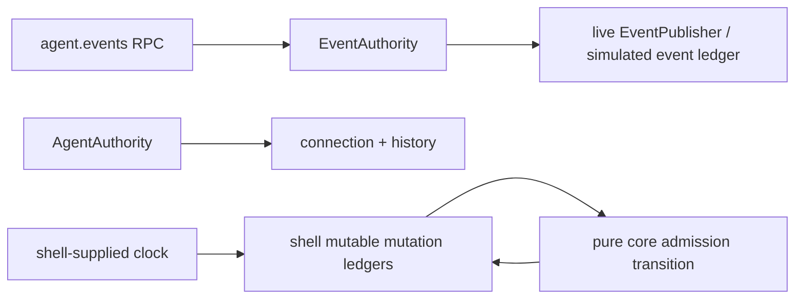

# D13 - backend: remove ambiguous event and mutation-ledger ownership

[Overview](../BASED.md)

Make EventAuthority the only agent-event authority and make widget-state
mutation-rate policy pure while preserving the existing observable contracts.

## Context

Agent-event streaming existed in both AgentAuthority and EventAuthority,
including duplicate live and simulation adapters. The widget mutation limiter
also kept mutable ledgers inside core even though core should own only
deterministic policy.

## Plan

1. Remove agent-event methods, programs, live wiring, and simulation state from
   AgentAuthority.
2. Route the existing RPC and conformance semantics through EventAuthority.
3. Replace the stateful core rate limiter with a pure ledger transition and
   keep the mutable ledger lifecycle in the shell service.
4. Reuse and test the transition in deterministic simulation.
5. Run focused tests, backend conformance, architecture tests, and typecheck.

## TODOS

- [x] Consolidate agent-event ownership under EventAuthority.
- [x] Move RPC and conformance coverage without changing cursor behavior.
- [x] Introduce and unit-test the pure mutation-rate transition.
- [x] Move mutable ledger ownership and lifecycle to shell/simulation.
- [x] Run the required verification suite.

## NOTES

- Cursor-ahead behavior remains a terminal `EVENT_CURSOR_INVALID` stream
  failure; this task does not introduce resync or cursor compatibility.
- Mutation admission remains a fixed-window per-scope limit. Empty ledgers are
  evicted before capacity admission, release frees a scope immediately, and
  every reported retry remains at least 1 ms.

### LOGS

- 2026-08-13: Removed the AgentAuthority event operation and duplicate program,
  live adapter, simulation ledger, and agent conformance state. `agent.events`
  now runs the existing EventAuthority agent-event program.
- 2026-08-13: Replaced the stateful core limiter with an immutable admission
  transition. WidgetStateService now owns its injected clock, mutable ledger
  Map, release, metrics, and disposal; deterministic simulation reuses the same
  policy with an explicit clock.
- 2026-08-13: Focused live/sim and unit tests passed, backend conformance passed
  (75), architecture passed (49), and backend TypeScript typecheck passed.

---
