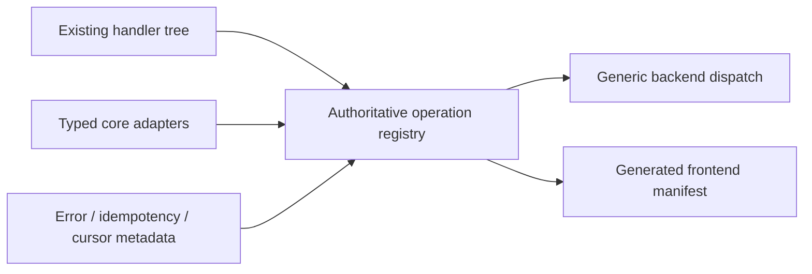

# D14 - private RPC operation registry authority (order 4/7)

[Overview](../BASED.md)

Make the existing backend private-RPC operation registry the sole authority for
dispatch and transport metadata without revising the protocol.

## Context

Core routing, idempotency, cursor translation, and frontend runtime metadata
were maintained in additional manual branches or lists beside the existing
operation-contract registry.

## Plan

## TODOS

- [x] Derive the exact request and stream paths from the registered handler tree.
- [x] Put codecs, adapters, errors, idempotency, and cursor metadata on registry entries.
- [x] Replace backend manual path matching with generic registry dispatch.
- [x] Generate and validate frontend runtime metadata.
- [x] Strengthen parity tests and run the requested verification matrix.

## NOTES

- The protocol remains unchanged: 87 requests, 6 streams, typed failures,
  payload encoding, cursor behavior, and idempotency behavior are preserved.

### LOGS

- 2026-08-13: Replaced manual request and stream dispatch with the existing
  registry, generated the frontend metadata manifest, and strengthened parity.
- 2026-08-13: Typechecks, transport, backend/frontend conformance,
  architecture, reconnect, and live browser verification passed.

---
