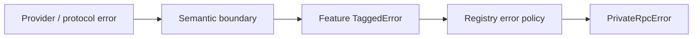

# D15 - standardize expected semantic failures (order 5/7)

[Overview](../BASED.md)

Replace ad-hoc coded errors with feature-owned schema-backed expected failures
and one private-RPC projection without collapsing defects or interruption into
the expected-error channel.

## Plan

## TODOS

- [x] Add cross-codec and status/failure-matrix tests.
- [x] Bound semantic codes and structured JSON details by feature.
- [x] Translate shell failures once at semantic boundaries.
- [x] Centralize private RPC and log-field mapping.
- [x] Run conformance, transport, architecture, typecheck, and focused tests.

## NOTES

- The operation registry remains the routing authority; this task owns its
  bounded expected-failure policy.
- Resource details retain sensitive-key filtering.

### LOGS

- 2026-08-13: Converted agent, events, Canvas, database, functions, resources,
  widget state, and widget failures to explicit tagged contracts.
- 2026-08-13: Added exhaustive status and codec matrices and verified live/sim
  conformance, transport parity, architecture, and all workspace typechecks.

---
