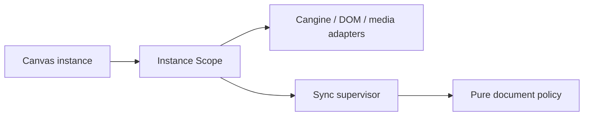

# D16 - canvas: structured lifetime ownership and orchestration split (order 6/7)

[Overview](../BASED.md)

Give each Canvas instance one explicit resource lifetime, then separate pure
document policy from synchronization supervision and concrete adapters without
changing public ports or wire behavior.

## Plan

## TODOS

- [x] Scope runtime acquisitions and aggregate cleanup failures.
- [x] Prove partial acquisition, interruption, replacement, and idempotent disposal.
- [x] Extract pure policy, synchronization supervision, and narrow adapters.
- [x] Keep public declarations Effect-free and wire behavior unchanged.
- [x] Bump Canvas, regenerate the lockfile, and run package/browser verification.

## NOTES

- Teardown remains sequential, reverse-acquisition ordered, and best effort.

### LOGS

- 2026-08-13: Replaced disposer slots with one sequential instance Scope and
  extracted document policy, sync supervision, and adapters.
- 2026-08-13: Advanced Canvas to 1.1.1. Canvas tests, public builds and
  declarations, frontend integration, architecture, typecheck, packed Canvas,
  and live placement/reload/reconnect browser acceptance passed.

---
