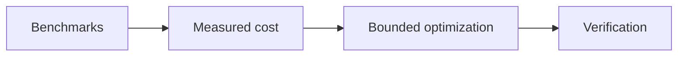

# D17 - measured performance and low-risk cleanup (order 7/7)

[Overview](../BASED.md)

Add representative performance evidence, optimize only measured material
costs, and finish bounded cleanup after the ownership and lifecycle work.

## Plan

## TODOS

- [x] Add Canvas, canonical JSON, widget-state, and database benchmarks.
- [x] Optimize only benchmark-proven costs and record evidence.
- [x] Convert exported core programs to named Effect.fn.
- [x] Remove dead helpers/logging and normalize SQL/theme/icon ownership.
- [x] Align package-local lifecycle conventions without a shared package.
- [x] Run the requested repository verification matrix.

## NOTES

- Public cancellation signatures remain compatible.
- The earlier ownership tasks supersede benchmark code aimed at retired
  AgentAuthority event and mutable rate-limiter classes.

### LOGS

- 2026-08-13: Added deterministic benchmark evidence. Canvas, canonical JSON,
  and database implementations retained their simpler correctness-first form.
- 2026-08-13: Converted core programs to named Effect.fn, deleted dead helpers,
  removed debug logging, semantically renamed SQL, documented CSS/test-runner
  ownership, and aligned package-local disposal.
- 2026-08-13: Workspace typechecks, architecture, app/package tests,
  conformance, database, packaging, and live-browser verification passed in the
  task worktree.

---
