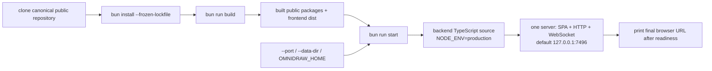

# D18 - release: clone, install, build, and start entirely from source

[Overview](../BASED.md)

Make the supported Omnidraw application release a conventional source-run Bun
checkout with one exact user contract: clone, frozen install, explicit build,
then start the already-built application. Close the remaining script,
repository-metadata, documentation, Git LFS, and cross-platform CI gaps without
reintroducing compiled binaries or an application-package distribution.

## Context

[S134](../s/S134.md) removed the compiled binary, installer, application npm
wrapper, self-updater, and GitHub binary-release workflow. The redesigned
repository also intentionally keeps the backend as a TypeScript source entry
and the frontend as built static assets. Historical binary material under
`tasks/` is execution history, not a release design input.

The remaining active release surface does not yet express that design as one
reliable end-user workflow:

- The root [`package.json`](../../package.json) has no `start` script.
  `server:prod` runs `build` on every invocation and hard-codes port `7496`, so
  starting is neither independent of building nor naturally overrideable.
- [`build-config.ts`](../../apps/backend/src/shell/cli/build-config.ts) and
  [`CliPlugin.ts`](../../apps/backend/src/shell/cli/CliPlugin.ts) still describe
  the source-server default as port `3000`. The release command must default to
  `7496`, while `bun run start -- --port 8080` must select `8080` without a
  duplicate or hidden port argument.
- [`main-app.ts`](../../apps/backend/src/shell/cli/main-app.ts) starts the
  Effect-owned backend runtime but does not print a clear final browser URL
  after the listening server has been acquired. The URL must describe the
  actual host and selected port and must not be printed before startup is
  ready.
- The backend already serves the built frontend through
  [`layer.server.ts`](../../apps/backend/src/shell/server/layer.server.ts) and
  the HTTP shell. `start` must use that built output and must never invoke
  Vite, TypeScript compilation, package staging, or any other build step.
- [`README.md`](../../README.md) leads with `bun install` plus `bun run dev`
  and presents `server:prod` as the production-style path. The user workflow
  must instead use frozen install, build, and start; `dev` remains a clearly
  separate contributor workflow.
- `--data-dir` and `OMNIDRAW_HOME` already resolve through
  [`fn.resolve-omnidraw-home.ts`](../../apps/backend/src/shell/config/fn.resolve-omnidraw-home.ts),
  with `--data-dir` taking precedence and `~/.omnidraw` as the default. Release
  documentation and source-run acceptance must preserve this contract.
- Three of the five public package manifests still point at
  `github.com/vibecanvas/vibecanvas`, while two and the README point at
  `github.com/omnidraw/omnidraw`. The target public repository must actually
  exist before the README clone command and all five package manifests are
  standardized on it.
- [`.gitattributes`](../../.gitattributes) places documentation and task media
  in Git LFS. Runtime code does not require those assets, but the supported
  clone contract must make an explicit choice: either a normal documented
  clone installs LFS, or the repository is changed so users can complete the
  runtime workflow without LFS.
- [`.github/workflows/test.yml`](../../.github/workflows/test.yml) currently
  runs only on Ubuntu and does not exercise the end-user sequence as a clean
  release checkout. Release OS claims must be no broader than the clean-clone
  matrix that runs the exact source workflow.
- [`check-published-lockfile.ts`](../../scripts/check-published-lockfile.ts)
  and [`published-lockfile.test.ts`](../../scripts/published-lockfile.test.ts)
  already enforce a public-npm `bun.lock` and allow a gitignored local
  `.npmrc`. Keep that gate and do not commit `.npmrc`.

The intended release command sequence is fixed:

```bash
git clone https://github.com/omnidraw/omnidraw.git
cd omnidraw
bun install --frozen-lockfile
bun run build
bun run start
```

The canonical repository rename/transfer is an external release prerequisite.
Do not publish documentation or packages with a clone URL that has not been
verified publicly. `omnidraw/omnidraw` is the target identity; if that target
cannot be made public, this task is blocked until the maintainer supplies the
one canonical replacement rather than preserving split metadata.

The reported approximately 685 MB installed dependency footprint and 5.37 MB
frontend chunk are post-blocking usability/performance work. Record fresh
measurements when qualifying the release, but do not weaken, delay, or combine
this source-run contract with dependency or bundle optimization.

## Plan



### 1. Establish one production source-run command

- Add root `start` that launches
  `apps/backend/src/main.ts serve` from TypeScript source with
  `NODE_ENV=production`.
- Make `start` contain no `prestart`, `build`, compiler, Vite, package staging,
  install, or generated-output mutation. A missing/stale frontend build should
  fail clearly and tell the user to run `bun run build`; it must not repair the
  problem implicitly.
- Remove `server:prod` instead of retaining a second production entrypoint.
  Update active callers and documentation to use only `start`.
- Set the source-run server default to `7496` and keep one parser-owned
  override. Prove both `bun run start` and
  `bun run start -- --port 8080`; update CLI help and tests to agree.
- Keep `bun run build` as the explicit complete workspace/frontend build and
  preserve its existing public-package staging/release guarantees.
- Print one unambiguous ready message such as
  `Omnidraw is ready at http://127.0.0.1:7496/` only after the server has bound
  successfully. The printed URL must reflect a port override.

### 2. Preserve home and data selection

- Keep the default home at `~/.omnidraw`, with `OMNIDRAW_HOME` as the
  environment override and `--data-dir` as the higher-precedence CLI override.
- Add production-start coverage using an isolated temporary home so release
  tests never read or mutate a developer or CI account's real Omnidraw data.
- Document the default, precedence, and examples alongside the end-user start
  workflow. Do not change the clean-install database or add migration support.

### 3. Make repository identity exact before publication

- Rename or transfer the public GitHub repository to the target
  `https://github.com/omnidraw/omnidraw` before release qualification. Verify
  anonymous clone access; do not rely only on a signed-in browser or a redirect
  from the old repository.
- Update the `repository.url` and correct package `directory` in all five
  public manifests:
  [`canvas-contract`](../../packages/canvas-contract/package.json),
  [`canvas`](../../packages/canvas/package.json),
  [`sdk`](../../packages/sdk/package.json),
  [`component-ai-chat`](../../packages/component-ai-chat/package.json), and
  [`theme`](../../packages/theme/package.json).
- Make the README clone URL, package metadata, deploy/release checks, and any
  active repository links use the same canonical identity. Add a structural
  assertion so `vibecanvas/vibecanvas` cannot return in publishable manifests.
- Because these are metadata/release-workflow changes rather than public
  runtime `src/` changes, do not bump package versions solely for this task.
  Regenerate the lockfile only if an actual manifest/lock input requires it.

### 4. Make the clone and LFS contract honest

- Audit every LFS-tracked path and confirm none is read by build or runtime.
- Choose and implement one complete policy before the release:
  - preferred: make the exact five-command runtime workflow succeed without
    Git LFS and keep large documentation assets out of runtime/build inputs; or
  - fallback: declare Git LFS as an installation prerequisite immediately
    before the clone command and exercise a real LFS checkout in every
    clean-clone CI lane.
- A partial checkout that silently leaves required build/runtime files as LFS
  pointer text is forbidden. Add a gate that proves the chosen policy from a
  fresh checkout.

### 5. Replace release instructions and retire obsolete user guidance

- Rewrite the README quick start around frozen install, explicit build, and
  start. Move `bun run dev` and the development frontend URL into a contributor
  section and label them as non-release workflows.
- Document Bun `1.3.14`, the supported operating systems, the default and
  override URLs, data-home behavior, rebuild expectations after updating the
  checkout, and graceful shutdown.
- Audit active user-facing README/package/deployment/release documentation for
  compiled executables, global installation, binary upgrades, self-update,
  uninstallers, or `server:prod`, and remove actionable instructions for those
  retired paths. Historical `tasks/` logs, the architectural PRD's explicit
  prohibitions, and vendored/external references are not active user guidance
  and must not be rewritten to fabricate history.
- Add an active-surface regression check that rejects reintroduced Bun compile
  flags, binary installer/updater entrypoints, global-install instructions, or
  executable-package release workflows while excluding archived task history
  and read-only references.

### 6. Qualify the exact workflow on every claimed OS

- Initially claim Linux and macOS and add a clean source-release CI matrix for
  `ubuntu-latest` and `macos-latest`. Do not claim Windows unless an equivalent
  `windows-latest` lane runs the same contract successfully; if Windows is
  added, make `NODE_ENV=production` portable rather than relying on POSIX shell
  assignment syntax.
- In each lane, begin from a clean checkout with no workspace cache, local npm
  registry, committed `.npmrc`, prebuilt `dist`, or existing Omnidraw home.
  Run `bun install --frozen-lockfile`, `bun run build`, and `bun run start`
  against a temporary data directory.
- Probe `/health`, `/`, a direct SPA route, and the WebSocket/application
  startup needed to show that the built frontend is served by the source-run
  backend. Stop the process cleanly and fail on leaked child processes.
- Prove default port `7496` and an override such as `8080`. Snapshot relevant
  build outputs before start and assert they are byte-for-byte unchanged after
  shutdown, demonstrating that `start` did not compile or rebuild.
- Retain `check:published-lockfile` before install and the
  `published-lockfile` architecture test. Assert `.npmrc` remains ignored and
  untracked and that `bun.lock` contains no local registry, file, link, or
  workspace leakage for published dependencies.
- Keep the existing full acceptance workflow. The clean-clone source-release
  job is additional release evidence, not a replacement for unit,
  architecture, package-dist, conformance, database, or browser gates.

## TODOS

- [x] Add the build-free production `start` command and remove `server:prod`.
- [x] Make port `7496` the documented default and preserve `--port` forwarding.
- [x] Print the actual browser URL only after successful server readiness.
- [x] Preserve and test `--data-dir`, `OMNIDRAW_HOME`, and `~/.omnidraw` behavior.
- [/] Make `omnidraw/omnidraw` publicly cloneable and standardize all five public package manifests and active links.
- [x] Choose and enforce a complete Git LFS clone policy with no runtime dependency on documentation assets.
- [x] Rewrite end-user and contributor documentation around install, build, start, and dev.
- [x] Add regression coverage preventing retired binary/global-install/update/uninstall release paths from returning.
- [x] Add clean-clone Linux and macOS release CI, and keep OS claims identical to the passing matrix.
- [x] Preserve public-lockfile and untracked `.npmrc` gates.
- [/] Run the exact clean-clone sequence plus full repository release acceptance and record dependency/chunk measurements as non-blocking follow-up evidence.

## NOTES

- Current verification already reports that `.npmrc` is untracked and the
  committed lockfile resolves through public npm. This task preserves that
  known-good state; it does not redesign local-registry development.
- `bun run dev` may continue to use repository-local data and its separate Vite
  frontend port because it is a contributor orchestrator, not the release
  application contract.
- The source-run backend may execute trusted local widget functions in Bun
  children as defined by the widget architecture. That is runtime behavior,
  not compiled application distribution.
- Avoid treating occurrences of words such as “binary” for media payloads or
  “executable” for widget artifacts as retired application packaging. Gates
  should target the actual compile/installer/updater release mechanisms.
- The repository moved to Bun `1.4.0` in commit `6fc63cbab` after this task was
  drafted. Release documentation and CI preserve that newer repository
  authority instead of downgrading to the task's former `1.3.14` requirement.
- The implemented LFS fallback requires Git LFS for the normal clone and runs
  `git lfs fsck` after an LFS-enabled checkout in both source-release CI lanes.
  Six small historical images committed as ordinary Git blobs have explicit
  non-LFS attributes; all remaining LFS paths are documentation/task media and
  are rejected if they enter an active runtime or build input.
- Fresh local measurements on 2026-08-21 were 1,078,124 KiB allocated for
  `node_modules`, 15,932 KiB allocated for `apps/frontend/dist`, and 4,205,535
  bytes for the largest frontend application chunk. These remain non-blocking
  optimization evidence.

### LOGS

- 2026-08-20: Task created from the clone-and-run release report. Classified
  as Debt because the work standardizes release scripts, metadata,
  documentation, CI, and qualification around the already-decided source-run
  architecture.
- 2026-08-21: Implemented the build-sealed, build-free source start; readiness
  URL; port and data-home contracts; canonical package metadata; LFS policy;
  README/deployment guidance; structural regression tests; and Linux/macOS
  clean-source CI. `bun run test:final-acceptance`, package-dist verification,
  typecheck, architecture tests, published-lockfile verification, browser
  acceptance, and local source-release probes passed.
- 2026-08-21: Release qualification remains externally blocked. Anonymous
  `git ls-remote https://github.com/omnidraw/omnidraw.git HEAD` requested GitHub
  credentials instead of returning a public ref, so the canonical target is
  not publicly cloneable from this environment. The exact remote clean-clone
  sequence and publication must wait for the maintainer to make that repository
  public (or provide the one canonical replacement).
- 2026-08-21: Review follow-up made the source-release checkout discard
  persisted GitHub credentials and run the anonymous query in CI, broadened the
  LFS and retired-release gates across tracked active sources/scripts/workflows,
  and made shutdown qualification detect and clean leaked process-group members.

---
