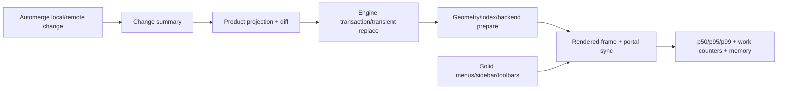

# D2 - canvas-engine integrated projector and product performance qualification
[Overview](../BASED.md)

Measure the complete Vibecanvas path—Automerge change, product projection diff,
engine transaction, retained render, Solid overlays, and real widget portals—
so engine cutover decisions are based on product costs rather than engine-only
benchmarks.

## Context

Canvas-engine has recorded retained-renderer targets for:

- empty pan/zoom;
- 1,000 and 5,000 visible nodes;
- 50,000 total/5,000 visible;
- indexed hit and marquee queries;
- 100-node transactions;
- text/images/portals/animation/3D;
- zero static idle frames.

Those measurements do not include Vibecanvas’s:

- Automerge materialization and change summaries;
- element/group-to-engine projection;
- resource and portal side-table diffs;
- semantic child-to-product ID mapping;
- Solid toolbar, style menu, context menu, and AI sidebar;
- real widget DOM and Draft Preview runtime;
- transient line handles, clone previews, and external widget ghosts.

The existing `packages/canvas/PERFORMANCE.md` and
`packages/canvas/tests/perf/` harness measure the current runtime. Extend the
same product KPIs with a canvas-engine pilot lane; do not replace historical
baselines or compare unlike jsdom and production-browser timings.

Relevant files:

- `packages/canvas/PERFORMANCE.md`
- `packages/canvas/tests/perf/canvas-runtime.perf.test.ts`
- `packages/canvas/tests/perf/widget-connection-mesh.perf.test.ts`
- `packages/canvas/tests/perf/*.results.local.txt`
- `packages/canvas/src/plugins/scene-hydrator/SceneHydrator.plugin.ts`
- `packages/canvas/src/services/crdt/CrdtService.ts`
- the projection adapter introduced by A85/A86
- `packages/canvas/src/components/`
- `packages/canvas/src/widget-host/`
- `packages/ui-ai-chat/src/`

Dependencies:

- immutable engine artifact from D1;
- engine transient implementation A14;
- A85 real widget-host pilot;
- A86 coherent remote-change/session policy for collaboration scenarios.

## Plan

### 1. Freeze workload definitions and environments

Add deterministic seeded fixtures for:

1. empty canvas;
2. 1,000 visible simple elements;
3. 5,000 visible mixed product elements;
4. 50,000 total with exactly 5,000 visible;
5. nested groups with depths 4/16 and inline text children;
6. pen-heavy paths and routed connectors;
7. 20/100/500 mounted widget portals;
8. Automerge bursts updating 1/10/100/500 elements;
9. local drag while remote peer updates unrelated and overlapping entities;
10. transient 16-handle line edit, 100-node clone preview, and widget ghost;
11. Solid toolbar/style/context menus and AI sidebar mounted.

Every run records:

- seed and fixture digest;
- product elements/groups and derived engine node counts;
- visible nodes, group depth, path points, glyphs, resources, portals;
- selected/transient counts;
- DPR, viewport, browser/version, OS/device/backend;
- engine/package and consumer commits.

Use local deterministic assets/fonts. No network fetch belongs in timed
sections.

### 2. Instrument stage boundaries separately

Add production-safe disabled-by-default spans/counters for:

| Stage | Measurements |
|---|---|
| Automerge | materialization/change-summary time, changes/op/encoded bytes |
| Projection | changed product entities, projected node/resource/portal count, diff time |
| Engine transaction | validation/publication time, changed node count |
| Geometry/index | bounds/routing/index updates, full rebuild/fallback count |
| Render prepare | compile/upload/cache work |
| Frame | total CPU, draw calls, visible/culled, dropped estimate |
| Portal | DOM projection writes, unchanged skips, mount/unmount count |
| Solid UI | commit/layout long tasks around active canvas interactions |
| Transients | owner replace time, indexed nodes, cleanup count |

Counters must show whether one product entity update touches only its projection
root/derived children. A benchmark that reports only total frame time cannot
detect an O(n) application projector.

Keep instrumentation allocation-free or near-zero when disabled. Do not add
production console logging.

### 3. Build a real production-browser runner

- Keep fast Vitest/jsdom structural tests for deterministic work counters.
- Add Playwright production-build benchmarks for Chromium, Firefox, and WebKit.
- Run DPR 1 and 2.
- Use warmup plus enough measured samples for p50/p95/p99; record sampling
  method and retain outliers.
- Separate cold initialization/resource decode from warm interaction results.
- Measure one logical user operation through the visible committed frame,
  including portal synchronization where applicable.
- Confirm static scenes and stable transients schedule zero continuous frames.

### 4. Establish gates

Use these initial acceptance gates unless baseline evidence justifies a
reviewed change:

- 5,000 visible mixed product scene: pan/zoom p95 `< 16.7 ms/frame` on the
  qualification machine;
- 50,000 total/5,000 visible: no per-frame product or engine full-scene scan;
- 100 changed product elements: projection diff plus engine transaction p95
  `< 8 ms` before render;
- topmost hit p95 `< 2 ms`; marquee over 5,000 visible p95 `< 8 ms`;
- one unchanged idle scene: zero continuous frames;
- camera-to-visible portal update: same logical frame;
- one entity update: no unrelated projection/resource/portal rebuild;
- transient replace/clear: no durable projection, recorder, or CRDT work;
- no task-created long event over 50 ms in ordinary 5,000-visible interaction;
- logical owner/node/portal/listener counts return to baseline after stress.

Treat 500 simultaneous rich widgets as a scale characterization if it cannot
meet the ordinary 60Hz gate; it must still be bounded, stable, and free of
unbounded per-frame work. Record 20 and 100 as primary interactive portal gates.

### 5. Compare topology choices

The audit PoC projects each product element to a semantic group plus one or more
derived children. Measure:

- universal semantic-root group;
- direct single-node projection plus a semantic ID side map;
- hybrid: root group only for multi-node elements/groups/widgets.

For each, compare:

- retained node/index memory proxy and measured heap;
- full projection time;
- one-entity diff time;
- hit-to-semantic-ID cost;
- selection bounds/order correctness;
- 5,000/50,000 scene frame results.

Choose the smallest topology that preserves stable semantic mapping. Do not
standardize universal roots merely because the PoC used them.

### 6. Collaboration and widget scenarios

Measure separately:

- unrelated remote burst while local transform preview is active;
- overlapping remote update that cancels the gesture;
- remote deletion during capture;
- widget focus/drag/resize/fullscreen with 20/100/500 portals;
- Draft Preview build completion outside timed render sections, followed by
  mount and portal projection;
- theme update across visible widgets;
- offscreen portal suspension/remount.

Report projection/diff, engine, portal, and Automerge times independently.

### 7. Memory and lifecycle stress

Run bounded stress for:

- 1,000 transient replace/clear cycles;
- 1,000 create/delete projection transactions;
- 1,000 widget ghost cancels;
- repeated canvas/runtime create/destroy;
- resource replacement and failed/late loads;
- context loss/restoration with active product projection.

Measure logical counts plus browser heap where supported. Allocator RSS/high
water marks are evidence, not automatic leaks; require retained-reference or
logical-count proof before classifying a leak.

### 8. Baseline, regressions, and CI

- Commit workload definitions, correctness assertions, and summary evidence.
- Keep machine-local raw result files gitignored as existing harnesses do.
- Add a stable quick structural budget to normal CI.
- Run full browser distributions on a scheduled/manual qualification lane.
- Fail CI on correctness/work-scope regressions; fail timing only on a stable
  pinned runner with documented noise policy.
- Update `packages/canvas/PERFORMANCE.md` with the canvas-engine path and exact
  reproduction commands.

### 9. Exit report

Publish one durable report containing:

- environment and artifact identities;
- workload table and fixture digests;
- p50/p95/p99 for every stage;
- work counters proving incremental behavior;
- topology comparison and decision;
- widget/collaboration/transient results;
- memory/lifecycle interpretation;
- failed gates with owners and required action;
- explicit go/no-go recommendation for broader renderer migration.

Engine-only numbers must remain labeled separately from product-integrated
numbers.

## TODOS

- [ ] Define deterministic product workloads and fixture metadata.
- [x] Add disabled-by-default stage spans and bounded work counters.
- [ ] Extend structural perf tests with a canvas-engine pilot lane.
- [ ] Add production Playwright runner for Chromium/Firefox/WebKit and DPR 1/2.
- [ ] Measure Automerge, projection, engine transaction, prepare/render, portal, and UI separately.
- [x] Prove no full-scene product scan for frame and one-entity update paths.
- [ ] Compare semantic-root, direct-node, and hybrid projection topologies.
- [ ] Run transient, collaboration, and 20/100/500-widget scenarios.
- [ ] Run memory/lifecycle/context-loss stress and interpret logical versus allocator retention.
- [ ] Add stable CI correctness/work-scope budgets and scheduled timing lane.
- [ ] Update `packages/canvas/PERFORMANCE.md` and record the final qualification report.

## NOTES

- Do not optimize before the first complete product-integrated distribution is
  recorded.
- Do not compare jsdom microbenchmarks directly with browser frame timing.
- Do not hide p99/outliers; explain host noise separately from deterministic
  work counters.
- Projector cost is application cost even when the engine remains fast.
- This task qualifies the pilot. It does not authorize removal of the current
  production renderer.

### D3 bounded-projector evidence

- 2026-07-24: The one-entity lane now publishes deterministic copies, scans,
  roots, nodes, bounded leaf slots, recovery passes, and invariant fallbacks.
  At 5k/50k/100k, all 40 samples reported zero collection copies/scans and one
  projected root. Timing evidence is recorded in
  `packages/canvas/PERFORMANCE.md`; remaining D2 browser/UI/memory matrix work
  stays open.

### LOGS

- 2026-07-23: Detailed integrated-performance plan created from the
  compatibility audit, existing canvas performance model, and engine benchmark
  requirements. Implementation waits on D1/A14/A85/A86.

---
