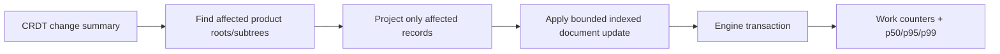

# D3 - canvas projection: remove remaining scale cliffs
[Overview](../BASED.md)

Remove collection-sized work from ordinary incremental canvas updates and prove
the product projector remains bounded at large document sizes.

## Context

- The incremental document helper still copies the full node collection for a
  one-element update.
- Any structural group change currently falls back to full projection.
- Repeated ownership-failure recovery can reproject more of the document than
  the changed entity requires.
- The migration recorded a healthy isolated 5,000-element one-update result,
  but the 50,000/100,000-element distributions and complete performance run are
  still missing; one full run timed out during teardown.
- D2 owns broad product qualification. This task owns implementation changes
  for scale cliffs exposed by that evidence.

## Plan

1. Measure copies, scans, projected roots, derived nodes, and retry passes for a
   one-element update and a bounded group edit.
2. Replace full-array copying in the incremental document path with an indexed
   or structurally shared representation appropriate to the published snapshot
   contract.
3. Reproject only affected group subtrees, escalating to full projection solely
   for a documented invariant failure.
4. Aggregate ownership recovery so one change cannot trigger repeated
   collection-sized projection passes.
5. Add 5,000/50,000/100,000 element distributions and teardown completion to
   the D2 qualification evidence.

## TODOS

- [x] Add deterministic work counters for copies, scans, roots, nodes, and
      recovery passes.
- [x] Remove full node-array copying from an ordinary one-element update.
- [x] Bound structural group changes to affected subtrees.
- [x] Aggregate ownership-failure recovery into one bounded pass.
- [x] Record p50/p95/p99 at 5,000, 50,000, and 100,000 elements.
- [x] Diagnose and eliminate the performance-run teardown timeout.
- [x] Update D2 and `packages/canvas/PERFORMANCE.md` with final evidence.

## Acceptance criteria

- One ordinary element update performs no document-sized scan or collection
  copy.
- A structural group change projects only its affected subtree unless a
  counted, diagnosed invariant fallback is required.
- Ownership recovery performs at most one bounded retry pass per authoritative
  change.
- 50,000/100,000-element results include p50/p95/p99 and deterministic work
  counters, not timing alone.
- The complete performance suite exits cleanly without teardown timeout.

## NOTES

- Preserve immutable publication semantics; do not trade away snapshot safety
  merely to avoid an array copy.
- Prefer boring indexed functions in the local projection core over hidden
  mutable caches.

### LOGS

- 2026-07-24: Created from the canvas migration audit and the incomplete Phase
  11 scale evidence recorded in `CANVAS-MIGRATION-PROGRESS.md`.
- 2026-07-24: Replaced ordinary node-array and signature-record copies with
  immutable persistent sequences/records. Indexed command generation no
  longer scans either snapshot; group create/delete/reparent changes splice
  only affected roots and descendants. Deterministic results report zero
  collection copies and scans for ordinary element/group updates.
- 2026-07-24: Ownership fallback is capped at one recovery pass and adds the
  failed owner to that bounded incremental retry. The isolated 40-sample lane
  completed at 5k/50k/100k with p50/p95/p99 of
  0.088/0.432/0.650 ms, 0.086/0.129/0.288 ms, and
  0.284/1.625/1.660 ms respectively. Every sample projected one root/two
  nodes with zero collection copies/scans.
- 2026-07-24: The complete 11-scenario canvas performance suite passed and
  exited cleanly in 28.43 seconds; the former teardown-hook timeout did not
  recur.
- 2026-07-24: Final canvas correctness gate passed (73 files / 359 tests),
  canvas TypeScript and functional-core lint passed, and all 11 widget-host
  suites passed.

---
