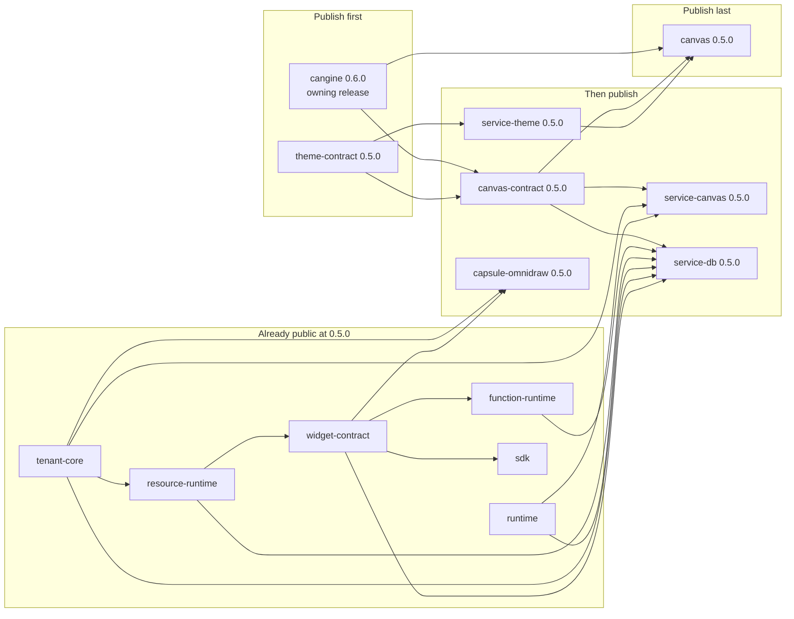

# D5 - packages: publish the managed-service dependency set

[Overview](../BASED.md)

Prepare the complete, pinned Omnidraw package closure needed by a separately
deployed managed service, and prove that a clean external workspace can install
and compose the staged artifacts without this monorepo. Publication remains a
manual maintainer action and is deliberately outside this implementation.

## Context

The managed service must consume public packages rather than workspace links or
copied source. The requested set is:

| Package | Managed use | Registry state on 2026-08-01 |
|---|---|---|
| `@omnidraw/tenant-core` | Every authority boundary | `0.5.0` published |
| `@omnidraw/runtime` | Application and service lifecycle | `0.5.0` published |
| `@omnidraw/widget-contract` | Cell, executor, and widget artifacts | `0.5.0` published |
| `@omnidraw/resource-runtime` | Cell resources and executor proxies | `0.5.0` published |
| `@omnidraw/function-runtime` | Scheduling and function execution | `0.5.0` published |
| `@omnidraw/sdk` | User widget and function builds | `0.5.0` published; confirm usable |
| `@omnidraw/canvas-contract` | Shared browser/server canvas protocol | `0.5.0` local; unpublished |
| `@omnidraw/service-canvas` | Authoritative Cell canvas behavior | private workspace manifest; unpublished |
| `@omnidraw/service-db` | Turso-backed managed persistence and stores | private workspace manifest; unpublished |
| `@omnidraw/capsule-omnidraw` | Widget builds, capabilities, and browser hosting | unversioned workspace manifest; unpublished |
| `@omnidraw/service-theme` | Managed shell and canvas themes | `0.5.0` local; unpublished |
| `@omnidraw/canvas` | Managed canvas UI and runtime | `0.5.0` local; unpublished |

The requested list is not currently a publishable dependency closure:

- `canvas-contract` and `canvas` require `@omnidraw/cangine@0.6.0`. The public
  registry currently has `latest=0.5.2`, and the exact `0.6.0` endpoint returns
  404. The workspace resolves `0.6.0` from local Verdaccio.
- `canvas-contract`, `service-theme`, and `canvas` require
  `@omnidraw/theme-contract@0.5.0`, which also returns 404 from the public
  registry.
- `service-canvas` still has `private: true`, workspace dependencies, raw source
  exports, and no pack or prepublish contract.
- `capsule-omnidraw` has no version, public publish metadata, files list, build,
  or prepublish gate, and retains workspace/catalog dependency protocols.
- The existing [`publish-npm.ts`](../../scripts/publish-npm.ts) publishes binary
  artifacts from `dist/release-manifest.json`; it does not publish workspace
  libraries and must not silently become their unordered publisher.

Existing evidence should be extended rather than replaced:

- [`test-packed-public-composition.ts`](../../scripts/test-packed-public-composition.ts)
  proves the five already-published managed foundation packages as local
  tarballs in a clean external composition.
- [`test-packed-canvas-kernel.ts`](../../scripts/test-packed-canvas-kernel.ts)
  proves `theme-contract`, `canvas-contract`, `service-theme`, and `canvas` as
  local tarballs in a clean browser consumer.
- [S132](../s/S132.md) completed the workspace-split canvas-kernel boundary,
  including deliberate built exports, package-owned CSS/fonts, a fake Cell
  transport, and browser smoke coverage.

No product mockup is useful for this task. Publication must preserve the
existing managed composition and canvas UI. The useful visual is the release
dependency graph.

## Plan

### Fixed release rules

- Workspace manifests may retain `workspace:*` and `catalog:` for atomic local
  development. Every versioned package must implement `bun run build`, which
  creates a standalone `dist/` package root and generated public manifest.
  Only `npm publish ./dist` is supported. The generated manifest and tarball,
  not the workspace manifest, are the public dependency boundary.

- A package-level `version` in its own `package.json` is the sole release
  marker. Publishing tools discover versioned workspace packages; they must
  not maintain a second package allowlist. An unversioned package is private
  and is never selected for publication.
- The intended unchanged package line is `0.5.0`. Only changes to a versioned
  package's public/runtime code under `src/` justify and require a semantic
  version bump before publication, including when the previous version exists
  only locally. Scripts, tests, docs, metadata, build configuration, export
  staging, and repository tooling do not bump versions. Update exact internal
  dependency pins after a real `src/` bump and regenerate the lockfile. Never
  overwrite or republish an npm version.
- Adding `version` to `service-canvas` and `capsule-omnidraw` is the deliberate
  act that adds them to the release set. Do this only after their public
  package boundaries and release gates are ready in the same change.
- Publish dependency-first and stop a wave if any dependency is unavailable or
  its verification fails. Do not publish a package whose declared exact
  dependency cannot be installed from `https://registry.npmjs.org/`.
- Preserve exact internal dependency pins in generated `dist/package.json`
  files for the managed-service set. No packed manifest, declaration,
  JavaScript, CSS, or source file may contain a
  `workspace:`, `catalog:`, `file:`, `link:`, repository-absolute path, or
  private Omnidraw package import.
- Keep the library release separate from the compiled `omnidraw-v*` binary
  release. Discover its package set from package-level versions and derive
  dependency order so a binary build cannot accidentally control library
  publication.
- Every real publish is preceded by build, typecheck, tests, isolated pack
  inspection, `npm publish --dry-run`, and clean-consumer installation of the
  exact tarball. Publication is idempotent: exact versions already present on
  npm are verified and skipped; mismatched contents are a hard failure.
- Use npm trusted publishing with GitHub OIDC after package ownership is
  configured. If npm requires a one-time authenticated bootstrap for a new
  package, perform only that initial publish with a scoped maintainer/granular
  token and then configure the repository workflow as its trusted publisher.
  Never place npm credentials in the repository or task log.
- Publish public production entry points only. Keep test helpers public only
  where they are a deliberate supported API; do not ship workspace tests,
  fixtures, caches, source maps containing local paths, or internal build
  credentials.
- If implementation touches `fn.*.ts`, `fx.*.ts`, or `tx.*.ts`, print and
  follow the repository function-file rules before editing. `fn` remains pure,
  `fx` is an injected two-argument read, `tx` is an injected two-argument
  write, imports use allowed leaves, and runtime globals are never accessed
  directly from function files.

### 1. Freeze package-set identity and live registry evidence

- Add one workspace scan that treats package manifests as the source of truth:
  versioned packages are the release set and unversioned packages are private.
  Validate that every versioned package has public metadata and release gates,
  and that no unversioned package can enter a tarball publication command.
- Derive dependency order from exact package dependencies. Keep expected public
  entry-point assertions in pack tests rather than duplicating package
  identity/version in a separate release manifest.
- Query the public registry by exact package/version, not only by `latest`.
  Record version, dist-tag, tarball integrity, provenance/attestation where
  available, and publish time for every existing package.
- For the six already-published requested packages, compare their public
  tarballs with the expected public contract. Confirm that `sdk@0.5.0` exposes
  `./widget`, `./server`, and `./function-client`, installs without workspace
  protocols, and builds one minimal user widget and one typed function client.
- Fail if a published `0.5.0` package is stale relative to an API required by
  the managed fixture. Resolve that by planning `0.5.1` for the affected
  package and every dependent package, never by attempting to replace `0.5.0`.

### 2. Unblock the two missing transitive dependencies

#### `@omnidraw/cangine@0.6.0`

- Treat Cangine as an owning-repository release, not a tarball copied from this
  workspace or the local Verdaccio cache.
- In the Cangine repository, run its build, tests, typecheck, pack inspection,
  clean Node/Bun consumer, license/third-party notice, and browser/editor smoke
  gates, then publish `0.6.0` with provenance.
- Verify all public subpaths used here exist on npm: `.`, `./scene`,
  `./editor`, and `./testing`. Confirm the public tarball matches the locally
  tested `0.6.0` API and move the intended stable dist-tag only after success.
- Hard stop: do not publish `canvas-contract` or `canvas` until a clean install
  can resolve the exact public Cangine version.

#### `@omnidraw/theme-contract@0.5.0`

- Re-run its package-local build, typecheck, tests, isolated pack checks, and a
  clean import of `.`, `./CONSTANTS`, `./types`, and `./fn.validation`.
- Verify the tarball contains only deliberate `dist`, documentation, and
  license files and has no undeclared runtime dependency.
- Publish and verify `0.5.0` before `canvas-contract` or `service-theme`.

### 3. Publish the portable contracts and theme service

#### `@omnidraw/canvas-contract@0.5.0`

- Reuse the S132 built-package contract. Verify `.`, `./CONSTANTS`, `./types`,
  and `./validation`, exact Cangine/theme-contract dependencies, declaration
  portability, `sideEffects: false`, license, and repository metadata.
- Run contract tests plus clean server and browser imports. The server import
  must not pull Solid, DOM globals, canvas UI, OSS API/router code, or a private
  service package.
- Pack, dry-run, publish, then install the exact npm artifact in isolation and
  repeat the transport/validation tests.

#### `@omnidraw/service-theme@0.5.0`

- Reuse the S132 built-package contract. Verify the JavaScript/types entry and
  both CSS exports, exact theme-contract dependency, CSS side-effect metadata,
  independent service instances, and package-owned license/documentation.
- Prove one clean managed shell can import the service and CSS without a
  workspace alias and without restyling unrelated global shell elements.
- Pack, dry-run, publish, then repeat the package tests against the exact npm
  artifact.

### 4. Make the authoritative server service publishable

#### `@omnidraw/service-canvas@0.5.0`

- Remove `private: true`; add `version` only when the package is ready to join
  the release set, plus description, license, repository,
  public `publishConfig`, deliberate `files`/exports, build/prepack,
  prepublish, test, and typecheck contracts.
- Choose and document one supported distribution form. Prefer compiled ESM
  plus declarations for a managed-service boundary; if source TypeScript is
  intentionally retained to match the existing Bun-only service packages,
  prove the managed deployment toolchain consumes it and state the Bun/runtime
  requirement in package metadata and README.
- Replace `workspace:*` dependencies with exact public versions of
  `canvas-contract`, `runtime`, and `tenant-core`. Ensure the packed output has
  no repository path mapping and no undeclared or private service dependency.
- Make exports explicit. Support the public service capability and default
  authority implementation through documented entry points; do not preserve
  a wildcard export merely because the workspace used one.
- Add package documentation for injected persistence/transaction portals,
  tenant fencing, lifecycle, and the invariant that `CanvasService` is the
  only durable canvas authority. Keep database/vendor adapters outside this
  portable package.
- Extend the clean managed fixture with an in-memory persistence edge and prove
  tenant isolation, snapshot, execute, subscribe/cancel, optimistic conflict,
  transaction rollback, lifecycle stop, and restart reconstruction against
  only installed package APIs.
- Pack, dry-run, publish, then rerun the same fixture using the exact npm
  artifact.

### 5. Make Capsule integration publishable

#### `@omnidraw/capsule-omnidraw@0.5.0`

- Add `version` only when the package is ready to join the release set, plus
  description, license, repository, public `publishConfig`, a
  deliberate files list, build/prepack, prepublish, test, and typecheck gates.
- Produce portable built ESM and declarations for the supported subpaths:
  `./contract`, `./build`, `./builder`, `./host`, and `./capabilities`.
  Decide whether `./testkit` is a supported public testing API; publish and
  document it deliberately or remove it from the public exports.
- Replace `catalog:`/`workspace:*` with exact public dependencies:
  `@omnidraw/capsule@0.10.2`, `tenant-core@0.5.0`, and
  `widget-contract@0.5.0`. Verify every Capsule subpath imported by emitted
  code exists in its public tarball.
- Split or condition exports only if required to keep browser hosting free of
  Node/Bun-only builder code. A browser consumer of `./host` or
  `./capabilities` must not load signing/build modules; a server builder must
  not need the managed web shell.
- Document supported engines and runtime assumptions for building/signing.
  Ensure signing keys and host capabilities are injected and no key material,
  local registry URL, or workspace path reaches the tarball.
- Extend the clean managed fixture to build a minimal SDK widget, sign it,
  validate its capability contract, mount it through Capsule in a real
  browser, call one authorized capability, reject one unauthorized capability,
  and dispose the host without leaked channels/workers.
- Pack, dry-run, publish, then repeat the fixture from the exact npm artifact.

### 6. Publish the managed canvas UI last

#### `@omnidraw/canvas@0.5.0`

- Reuse the S132 built-package contract. Verify `.`, `./styles.css`,
  `./debug-trace`, `./extension`, `./runtime`, `./services`, and `./types`;
  exact Cangine/canvas-contract/service-theme/theme-contract dependencies; and
  `solid-js` as a compatible peer rather than a bundled second runtime.
- Inspect CSS/font URLs and the full tarball. All assets must be package
  relative and present; styles must remain scoped; emitted declarations must
  not name frontend, oRPC, AI chat, database, or private service types.
- Install from npm in the existing fake-Cell canvas-kernel fixture. Require one
  Solid instance and exercise snapshot load, subscription, rectangle create
  and edit, theme switching, diagnostics, cancellation, clean unmount, CSS,
  and fonts in the real-browser smoke.
- Pack, dry-run, publish, then repeat the clean install, typecheck, production
  build, transport tests, and browser smoke against the exact npm artifact.

### 7. Add one ordered, retry-safe library release workflow

- Add a dedicated script that discovers versioned workspace packages, validates
  their dependency DAG, and supports `--dry-run`, a selected package/wave, and
  full dependency-first publication. Default to no real publish unless an
  explicit release flag is present. Reject explicit selection of an
  unversioned package.
- For an existing exact npm version, fetch and verify identity/integrity and
  skip it. Do not treat any successful `npm view` response as sufficient.
- Publish sequentially by dependency wave. Parallel publication is allowed
  only for nodes with no edge between them, and the next wave begins only after
  npm registry reads and clean installs observe every prior artifact.
- Add a dedicated GitHub Actions workflow with frozen install, complete tests,
  pack gates, clean managed consumer, OIDC `id-token: write`, protected release
  environment, concurrency control, exact tag/version validation, artifact
  retention, and a final registry verification report.
- Add a repository gate that compares each versioned package with the base
  revision: if anything under its `src/` changed, its package-level version
  must also change. Validate semantic version progression, dependent exact
  pins, and the regenerated lockfile in the same gate.
- Use a distinct tag namespace such as `packages-v0.5.0`; do not overload
  `omnidraw-v*`. Validate that every selected repository-owned package matches
  the tag version and that externally owned dependencies match their exact
  recorded versions.
- Keep `latest` unchanged until the whole stable package set passes. For a
  prerelease, publish to `beta`/`next`, validate the full remote consumer, then
  promote dist-tags intentionally. A partial wave must never be advertised as
  the complete stable managed set.

### 8. Prove the remote managed-service composition

- Add a clean fixture that installs every requested package from the public
  npm registry with exact versions and no workspace root, Bun lock reuse,
  Verdaccio `.npmrc`, filesystem link, or repository path.
- Typecheck and production-build a minimal managed Cell composition using
  tenant authority, runtime lifecycle, resources, function contracts, SDK,
  Capsule builder/host, CanvasService, theme service, and canvas UI.
- Run server behavior tests and the real-browser smoke. Assert that tenant and
  widget state never cross authority boundaries, CanvasService remains the
  sole durable canvas writer, and WidgetStateService remains the sole
  widget-instance state authority.
- Inspect the installed dependency tree for duplicate/conflicting Omnidraw,
  Capsule, Cangine, Solid, Zod, and Turso versions. Permit peers only where the
  ownership contract requires host selection.
- Run `npm audit`/signature or provenance verification as supported, license
  inventory, tarball integrity checks, and a secret/path scan over installed
  artifacts.
- Record the exact registry versions, integrity hashes, workflow run, tag,
  commit, dist-tags, clean-fixture commands, and results in this task log.
  Close D5 only after a fresh machine can install and pass the complete remote
  fixture.

## TODOS

- [x] Add version-driven package discovery and staged-artifact verification.
- [x] Confirm the six already-published packages, including SDK build/use.
- [ ] Publish and verify `@omnidraw/cangine@0.6.0` from its owning repository.
- [x] Make `@omnidraw/theme-contract@0.5.0` independently buildable and packable.
- [x] Make `@omnidraw/canvas-contract@0.5.0` independently buildable and packable.
- [x] Make `@omnidraw/service-theme@0.5.0` independently buildable and packable.
- [x] Make `@omnidraw/service-canvas@0.5.0` independently buildable and packable.
- [x] Make `@omnidraw/service-db@0.5.0` independently buildable and packable.
- [x] Make `@omnidraw/capsule-omnidraw@0.5.0` independently buildable and packable.
- [x] Make `@omnidraw/canvas@0.5.1` independently buildable and packable.
- [ ] Enforce version bumps for `src/` changes in every versioned package.
- [-] Add an automated publishing workflow; maintainers publish each `dist/` manually.
- [x] Pass the full clean managed-service fixture from exact staged tarballs.
- [ ] Record release evidence and mark D5 complete.

## NOTES

- The npm registry is the source of truth for publication status. The local
  Verdaccio registry is useful for rehearsal but cannot satisfy the final gate.
- `@omnidraw/sdk@0.5.0` was confirmed published during plan creation; no SDK
  republish is expected unless the clean user-build fixture finds a contract
  gap.
- `@omnidraw/capsule@0.10.2` is already public and matches the local catalog.
- `@omnidraw/cangine@0.6.0` appearing under `node_modules` does not prove public
  availability: the lockfile points at `127.0.0.1:4873`.
- Do not use npm unpublish as rollback. Fix forward with a patch version and
  move dist-tags only after the repaired full set passes.

### LOGS

- 2026-08-01: Audited BASED conventions, D1 managed composition, S132 canvas
  package work, all requested manifests, internal imports, package-local build
  and test gates, both packed-consumer fixtures, the binary release publisher,
  and the GitHub release workflow. No implementation code changed.
- 2026-08-01: Queried the public npm registry. Confirmed `0.5.0` for
  tenant-core, runtime, widget-contract, resource-runtime, function-runtime,
  and SDK. Confirmed 404 for canvas-contract, service-canvas,
  capsule-omnidraw, service-theme, and canvas.
- 2026-08-01: Found and recorded two missing release prerequisites: public npm
  returns 404 for `theme-contract@0.5.0` and `cangine@0.6.0`; Cangine `latest`
  is `0.5.2`, while the workspace consumes locally published `0.6.0` from
  Verdaccio. Confirmed `capsule@0.10.2` is public.
- 2026-08-01: Clarified the repository release rule: package-level `version`
  is the publishing marker, unversioned packages stay private, and every
  `src/` change in a versioned package requires a semantic version bump plus
  dependent exact-pin and lockfile updates. Updated root `AGENTS.md` and this
  plan; no package source or version changed.
- 2026-08-02: Adopted a staged-package contract after maintainer review.
  Workspace manifests keep `workspace:*` and `catalog:` for linked development;
  `bun run build` now generates the standalone npm package under `dist/`, and
  maintainers publish manually with `npm publish ./dist`.
- 2026-08-02: Added shared TypeScript build and distribution finalization
  scripts. The finalizer resolves internal dependencies to exact workspace
  versions, resolves catalog entries, rewrites exports and relative ESM
  specifiers, copies package documentation/licenses, and rejects missing or
  non-portable export targets.
- 2026-08-02: Added public metadata, built ESM/declarations, explicit exports,
  documentation, and first release versions for `service-canvas@0.5.0` and
  `capsule-omnidraw@0.5.0`. Audited all twelve release packages and confirmed
  that none has a `src/` diff. Kept the six already-published foundation
  packages at `0.5.0`; packaging and script changes do not bump versions.
- 2026-08-02: `bun run verify:package-dists` passed for all twelve versioned
  workspace libraries: dependency-ordered builds, npm dry-run packs, isolated
  tarballs, a clean external install, Bun server imports, and portable Node ESM
  imports. The fixture substituted the locally installed Cangine 0.6.0 tarball
  because its owning repository publication remains a manual prerequisite.
- 2026-08-02: `bun run test:packed-public-composition` passed a clean install,
  typecheck, two managed behavior tests, and runtime smoke for the five
  foundation packages. `bun run test:packed-canvas-kernel` passed a clean
  install, one Solid runtime, typecheck, two transport tests, production build,
  and two browser smokes for the staged canvas kernel packages.
- 2026-08-02: Every package-local typecheck and test gate passed. This includes
  12 CanvasService authority tests, 36 Capsule integration tests, 11 SDK tests,
  and 135 canvas tests. No package was published.
- 2026-08-02: Updated `docs/internal/llm.how-to-deploy.md` with the staged
  `dist/` contract, all twelve prepared package versions, public Cangine and
  Capsule prerequisites, dependency-first manual publication waves, exact npm
  verification commands, recovery rules, and the explicit prohibition on
  publishing workspace package roots.
- 2026-08-02: Added `bun run deploy:packages:list`. It checks every versioned
  library against public npm, treats 404 and newer unpublished local versions
  as deployments, refuses to republish an existing exact version, explains
  local/latest and dist-tag mismatches, validates external Omnidraw
  prerequisites, propagates dependency blockers, and prints dependency-ordered
  individual and combined copy-paste publication commands. Five focused tests
  cover registry decisions and dependency ordering. The live check correctly
  reported all six published foundation packages as `CURRENT` at `0.5.0`, the
  unpublished packages as `DEPLOY`, and Cangine 0.6.0 as the remaining public
  blocker; nothing was published.
- 2026-08-02: Improved the deployment report with color-aware status groups,
  summary counts, whitespace, prerequisite sections, and isolated copy/paste
  command blocks. Fixed staged dependency resolution for Bun's bare `catalog`
  spelling and added a regression test plus a verifier rejection for any bare
  local dependency protocol.
- 2026-08-02: Added `service-db@0.5.0` to the version-driven release set with a
  standalone TypeScript build, copied SQL migration assets, package docs, and
  public metadata. Removed its emitted dependency on the private
  `shared-functions` and `service-widget-state` workspaces while preserving the
  store's structural contract and database transaction serialization.
- 2026-08-02: Added selected-package verification with automatic internal
  dependency closure. The generated combined command now verifies only the
  packages marked ready, so an unrelated missing Capsule prerequisite does not
  prevent safe earlier releases. The selected closure for `resource-runtime`
  and `service-db` passed dependency-ordered builds, npm dry-run packs,
  isolated tarballs, clean install, Bun imports, and portable Node imports.
- 2026-08-02: Rebuilt both ready distributions and ran `npm publish --dry-run`
  successfully. `resource-runtime@0.5.1` now pins its formerly bare `catalog`
  peer to `@tursodatabase/database@0.7.2`; `service-db@0.5.0` packs 112 files,
  including its seven SQL migrations, with no workspace or catalog protocols.
  No package was published.
- 2026-08-02: Aligned `service-db`'s direct
  `@tursodatabase/database-common` dependency with the `0.7.2` database runtime
  so clean consumers do not install conflicting Turso common-library versions.
- 2026-08-02: Removed two obsolete Turso experimental-option type
  suppressions from `resource-runtime@0.5.1`; the public `0.7.2` types now
  describe those options and correctly reject unused `@ts-expect-error`
  directives during staged builds.
- 2026-08-02: Removed the same obsolete suppression from three service-db
  recovery fixtures, restoring its complete prepublish typecheck. Made the
  established database service/store subpaths explicit and extended clean
  consumer verification to import Bun-only package entries under Bun while
  excluding them from the portable Node smoke according to package engines.

---
