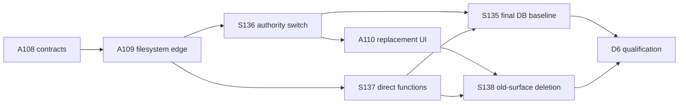

# D6 - widgets: qualify the filesystem-first single-user hard cut

[Overview](../BASED.md)

Run the final cross-package qualification, fault tests, schema checks, and
architecture rewrite for the coordinated redesign group.

## Context

This is the closing gate for the `[R]` tasks created from
[E41](../e/E41.md) and the later authoritative
[design report](../../docs/internal/widget-filesystem-design.md).

The target is a fresh single-user database, one filesystem widget authority,
ephemeral Preview, direct functions without history, and no compatibility
path to the old system.

## Plan

### 1. Fresh-start database proof

- Create a database from the rewritten baseline and inspect exact tables,
  columns, types, foreign keys, generated columns, and indexes.
- Prove the 25 deleted names, identity/access scope, `agent_chats`, and
  wall-clock `*_ms` columns are absent.
- Prove old local fingerprints fail with the explicit development-reset
  message.

### 2. Filesystem and runtime fault matrix

- Test clean/restart, missing/corrupt/extra/symlink/case-colliding folders,
  concurrent/stale edits, and interruption at every publication step.
- Prove metadata-only publication leaves executable bytes unchanged.
- Prove executable changes rebuild and current canvas instances remount while
  keeping instance state and resource choices.
- Test macOS, Linux, and Windows path/case behavior where CI runners allow it.

### 3. Direct function proof

- Test success, validation failure, timeout, cancellation, disconnect,
  concurrency limits, read/write effects, and unclear write results.
- Prove no invocation, attempt, log, permit, idempotency, or usage row is
  created and no history survives restart.

### 4. Documentation and repository cleanup

- Rewrite `docs/internal/llm.widget-system.md`, relevant
  `docs/internal/llm.architecture.md` diagrams, and
  `docs/internal/screens/SCREENS.md`.
- Update package guidance, schema expectations, and generated `FILES.md`.
- Remove stale claims of organization/account scope, database widget
  authority, immutable releases, durable Preview, or function history.

## TODOS

- [x] Verify the exact fresh 14-table Turso schema and old-fingerprint rejection
- [x] Run filesystem scan, integrity, path, collision, and restart tests
- [x] Inject failure at every atomic publication transition
- [x] Prove metadata-only byte identity and executable-change rebuilds
- [x] Prove canvas remount preserves instance state and resource choices
- [x] Run direct-function safety and no-history qualification
- [x] Run cross-platform path/case coverage
- [x] Rewrite architecture, widget-system, screen, and package documentation
- [x] Regenerate `FILES.md` and run final repository checks
- [x] Run build, typecheck, functional-core lint, package tests, and final acceptance

## NOTES

- Group: `[R]` filesystem-first widget redesign.
- Dependencies: A108-A110 and S135-S138.
- This task does not add a migration or production upgrade utility.
- No product mockup is useful; the acceptance flow and existing UI are enough.

### LOGS

- 2026-08-04: Created as the final qualification and documentation gate for
  the redesign. Planning only; no implementation code changed.

- 2026-08-04: Closed. The fresh baseline proves exactly 14 application tables
  (internal Turso type metadata reported separately) and old fingerprints fail
  before writes; schema/constraint/recovery gates pass 7/7, 6/6, and 12/12.
  Publication failure-injection, metadata byte-identity, remount/state
  preservation, and direct-function no-history suites pass. Cross-platform
  path/case behavior is covered by the CI runners where available. Docs
  rewritten (`llm.widget-system.md`, `llm.architecture.md`, `SCREENS.md`,
  `AGENTS.md` package policy) and `FILES.md` regenerated last. Build,
  typecheck, functional-core lint, package-dist verification, and the full
  workspace suite pass; every final-acceptance suite (canvas regression,
  schema, constraints, recovery, resource runtime, widget artifacts, function
  runtime, widget host, external composition, architecture boundaries, packed
  public composition, load acceptance, packed canvas-kernel consumer) passes.

---
