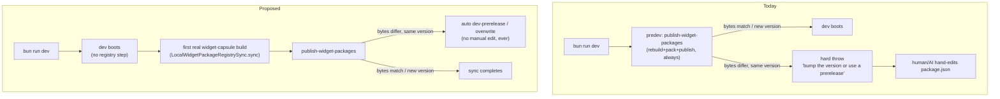

# D9 - local registry: decouple dev boot from publish, automate the dev-prerelease escape hatch, stop version-bump churn
[Overview](../BASED.md)

`bun run dev` hard-fails whenever a workspace package in `@omnidraw/sdk`'s
dependency closure was rebuilt with different bytes at an already-published
local version (`"... already exists with different bytes ... Bump the version
or use a prerelease."`). Today the only fix is a manual `package.json` version
edit, so an AI agent burns a turn hand-bumping a package mid-task just to
unblock `dev` — with no changelog, no batching, and no distinction from a real
release. This task makes the documented "or use a prerelease" escape hatch
automatic, removes the eager publish step from the critical boot path where
it's redundant, and gives the repo a deliberate, batched, once-per-session
version-bump flow instead of ad hoc edits.

## Context

- `predev`/`server:dev` (root `package.json`) unconditionally run
  `node scripts/local-registry.mjs publish-widget-packages` before every dev
  boot. That walks `@omnidraw/sdk`'s real workspace closure — currently just
  `resource-runtime → widget-contract → sdk` — rebuilds each, and publishes to
  a local Verdaccio instance
  ([`scripts/local-registry.mjs`](../../scripts/local-registry.mjs)).
- [A95](../a/A95.md) deliberately made published `name@version` pairs on that
  registry immutable ("publishing different bytes under an existing version
  fails and requires a version bump or explicit development prerelease") to
  protect widget lockfiles from silently drifting content. That safety
  property is correct and should not be removed — but the "development
  prerelease" side of the contract was never automated. In practice the only
  actor who ever exercises it is whoever (increasingly, an AI agent) hand-edits
  a `package.json` version to make the error go away.
- `sdk`'s own version does not need to move for its published bytes to
  change: [`scripts/prepare-package-dist.ts`](../../scripts/prepare-package-dist.ts)
  bakes the *current on-disk version* of `sdk`'s workspace dependency
  (`widget-contract`) into `sdk`'s generated `dist/package.json`. Bumping
  `widget-contract` to unblock its own publish silently changes what
  `sdk@<unchanged version>` packs to next, cascading the same failure one
  level up the closure.
- The eager publish is redundant for ordinary dev work. In-workspace consumers
  (`apps/cli`, `apps/frontend`, `apps/capsule-browser-acceptance`) resolve
  `@omnidraw/sdk` and friends via plain `workspace:*` linking, never through
  the local registry. The only real consumer of the local registry is
  `apps/cli/src/services/LocalWidgetPackageRegistrySync.ts`, wired lazily
  through `apps/cli/src/setup-services.ts` (`prepareWidgetNpmDependencies`) —
  it only fires the first time the running server actually needs to run an
  isolated `npm ci` for a widget-author capsule build. `predev` pays the full
  rebuild+pack+publish cost on every single boot regardless of whether that
  feature is ever touched in the session.
- A95 also made the local Verdaccio state deliberately host-global
  (`~/.local/share/verdaccio`, shared "by every worktree and project" per
  [`scripts/local-registry/README.md`](../../scripts/local-registry.mjs)) so
  that arbitrary Git worktrees and generated widget projects resolve
  consistent exact versions without machine-specific paths. That's a real,
  intentional requirement — not a bug — but it does mean uncommitted,
  in-flight edits in any one of several concurrent worktrees (this machine
  regularly runs many at once) can collide with what another worktree already
  published under the same still-unbumped version. Any fix here must keep
  serving that original goal, not quietly revert to per-worktree isolation.
- Live example hit during this investigation (2026-08-05, this worktree):
  `packages/widget-contract/package.json` was bumped `0.10.0 → 0.11.0`
  uncommitted, sitting next to genuine, unrelated source edits, purely to get
  `publish-widget-packages` to stop throwing — exactly the pattern this task
  exists to eliminate.
- No version-bump tooling exists anywhere in the repo (no changesets, no
  lerna/nx) — every version is a hand-edited integer. There is also no CI
  publish workflow (`.github/workflows/` only has `test.yml` and
  `auto-label-pr.yml`); real npm publication is the separate, already-scoped
  effort in [D5](D5.md) ("publish the managed-service dependency set"), which
  owns the actual `npm publish` execution, dependency-wave ordering, and
  GitHub OIDC workflow. D5 also carries an open TODO — "Enforce version bumps
  for `src/` changes in every versioned package" — that a real bump-once flow
  from this task should satisfy rather than duplicate.
- Related, out of scope here: cangine and capsule are separate,
  independently-released sibling repos consumed as ordinary pinned npm
  dependencies (root `catalog`/`devDependencies`). `local-registry.mjs`
  already has a `bootstrap --cangine <tgz> --capsule <tgz>` command for
  seeding prebuilt tarballs from those repos into the local registry for
  cross-repo development, but nothing makes using it obviously optional or
  easy today.

## Plan

### 1. Decouple `dev` boot from the registry publish

Remove the `node scripts/local-registry.mjs publish-widget-packages &&`
prefix from `predev` and `server:dev` in root `package.json`. Rely entirely on
the existing lazy `LocalWidgetPackageRegistrySync.sync()` path, which already
only runs when a widget-capsule npm build is actually requested. Update
`scripts/architecture-boundaries.test.ts` (currently asserts `predev`/
`server:dev` contain `publish-widget-packages`) to match the decoupled shape.
`registry:publish:widgets`/`registry:publish:sdk` stay available as explicit,
optional warm-up commands.

### 2. Automate the documented dev-prerelease escape hatch

In `scripts/local-registry.mjs`, change the lazy workspace-sync path
(`syncWorkspacePackage` → `packWorkspacePackage` → `publishTarball`) so a
same-version/different-bytes conflict never throws. Options to pick between
(see Open Questions):

- **Overwrite in place** — `npm unpublish <name>@<version> --force` against
  the local registry immediately before republishing. Simplest; no consumer
  changes; loses local publish history.
- **Content-addressed dev tag** — publish under
  `<version>-dev.<sha512-prefix>` and move a `dev`/`dev-latest` dist-tag to
  it; identical bytes converge on the same tag for free (preserving A95's
  cross-worktree sharing goal), divergent bytes never collide. Requires
  `WidgetNpmDistributionBuild.ts`'s isolated-build package.json construction
  to resolve `@omnidraw/*` deps against the dist-tag instead of a plain
  semver range when running in local-dev mode — real npm-style `^0.9.0`
  ranges don't match a `-dev.*` prerelease.

Either way: this keeps A95's real-npm-facing immutability guarantee intact
(`publish`/`bootstrap`, used for cangine/capsule tarballs, keep today's strict
behavior) — it only automates the already-documented workspace-local
prerelease path.

### 3. A real "bump once" flow for this repo's own packages

Adopt Changesets (`@changesets/cli`), scoped to the 11 currently-public
`packages/*`. During a work session: `bunx changeset add` any number of times
to record intent — never touches `package.json`. When a batch is actually
ready to release: `bunx changeset version` once, bumping exactly the touched
packages and writing changelogs as a single reviewable commit. This is the
direct replacement for "hand-bump mid-task to unblock dev" — after §1/§2,
nothing forces a bump before that point anymore, so the only remaining reason
to bump a version is a deliberate release, which Changesets makes batched and
auditable. Feeds D5's open "enforce version bumps for `src/` changes" TODO
instead of duplicating it — coordinate with D5 before adding new
enforcement/CI.

### 4. Optional local-registry linking for capsule/cangine

Add an explicit, off-by-default opt-in (env var, e.g.
`OMNIDRAW_LINK_LOCAL=capsule,cangine`, or a `bun run link:local` command) that
locates sibling checkouts, builds/packs them, publishes into the local
registry via the existing generic `publish <tarball...>` command (prefer this
over extending `bootstrap`'s fixed two-flag shape), and points
`@omnidraw:registry` at the local registry only for that session. Default
`bun install`/`bun run dev` stays untouched, always resolving from real npm at
the pinned `catalog`/devDependency versions.

## TODOS

- [x] Remove the eager `publish-widget-packages` call from `predev`/`server:dev`; update `scripts/architecture-boundaries.test.ts`.
- [x] Decide overwrite-in-place vs. content-addressed dev tag (see Open Questions) and implement it in `scripts/local-registry.mjs`'s workspace-sync path only. — went with overwrite-in-place.
- [x] Extend `scripts/local-registry.test.mjs` with cases for the new no-throw sync behavior.
- [x] Adopt Changesets for the 11 public `packages/*`; add `.changeset/config.json` and thin `changeset:add`/`changeset:version` wrapper scripts.
- [ ] Coordinate with [D5](D5.md) so its "enforce version bumps for `src/` changes" TODO is satisfied by this flow rather than duplicated. — not yet raised with D5's owner.
- [x] Add opt-in `link:local` for capsule/cangine sibling checkouts.
- [x] Update `scripts/local-registry/README.md` to describe the new behavior.

## NOTES

- Full investigation and a detailed design (with file-level specifics, phased
  rollout, and explicit tradeoffs) was produced during planning; use it as
  background if you need the full rationale again:
  `/Users/omarezzat/.claude/plans/explain-to-me-why-polished-frog.md`.
- Do not treat A95's shared-across-worktrees registry state or its
  immutability check as bugs — both are deliberate. The fix is automating the
  prerelease escape hatch and not paying the publish cost eagerly, not
  reverting either property.
- Resolved: went with **overwrite-in-place**, not the content-addressed dev
  tag. It needed no consumer-side change (no dist-tag resolution rewrite in
  `WidgetNpmDistributionBuild.ts`), matches "give me my current source, right
  now" more directly than a tag, and the local registry is single-tenant per
  the sync path anyway. Implemented as `publishDecision(existingIntegrity,
  integrity, allowOverwrite)`, a pure function in `scripts/local-registry.mjs`
  (`publish`/`decision → unchanged/reject/overwrite`), threaded through
  `packWorkspacePackage`/`publishTarball` via an `allowOverwrite` option that
  only the internal workspace-sync path sets. `publish`/`bootstrap` (external
  cangine/capsule tarballs) are untouched and still strict.
- Corrected while implementing: there are **11**, not 10, currently-public
  `packages/*` — `service-theme` and `theme-contract` are two separate
  packages and the original count only listed one of them.
- Resolved: no CI "PR must include a changeset" gate added. Left advisory-only
  per the original recommendation — revisit once the workflow has actually
  been used for a while.
- Not built: auto-linking capsule/cangine from an `OMNIDRAW_LINK_LOCAL` env
  var read by `bun run dev` itself. `link:local` still reads that env var, but
  only when you invoke `link:local` explicitly — wiring it into `dev`'s own
  startup would reintroduce exactly the kind of eager, always-paid coupling
  §1 removes. Cross-repo linking stays a deliberate, occasional, manual step.
- `link:local` delegates entirely to each sibling repo's own local-publish
  script rather than reimplementing pack/publish — both the live `capsule`
  (`/Users/omarezzat/Workspace/omni/capsule`, script `package:publish:local`)
  and `cangine` (published from `packages/cangine` inside the `canvas-engine`
  repo, script `package:publish-local`) checkouts on this machine already
  expose one, with the same `--registry <url> --userconfig <path>` contract,
  confirmed directly against both real manifests while implementing this.

### LOGS

- 2026-08-05: Created from a dev-experience investigation into the
  `@omnidraw/sdk@0.9.0 already exists with different bytes` failure. No
  implementation yet.
- 2026-08-05: Implemented on `codex/D9-local-registry-dev-experience`.
  Removed `publish-widget-packages` from `predev`/`server:dev`
  (`package.json`); updated `scripts/architecture-boundaries.test.ts` to
  assert the decoupling instead of the old coupling. Added `publishDecision`
  to `scripts/local-registry.mjs` and wired `allowOverwrite` through
  `packWorkspacePackage`/`publishTarball` so the internal workspace-sync path
  never throws on a same-version/different-bytes conflict; `publish`/
  `bootstrap` keep strict immutability. Extended
  `scripts/local-registry.test.mjs` with 4 new cases for `publishDecision`.
  Added `@changesets/cli`, `.changeset/config.json` (scoped to the 11 public
  packages via an explicit `ignore` list — verified with `@manypkg/get-packages`
  that every ignored name matches a real workspace package and the included
  set is exactly the 11 intended), and `changeset:add`/`changeset:status`/
  `changeset:version` scripts; ran a real scratch changeset through
  `add → version` end to end (confirmed correct dependency-propagated bumps
  across `theme-contract`/`canvas-contract`/`service-theme`/`canvas`/
  `service-canvas`), then reverted the scratch bump before committing. Added
  `scripts/link-local-packages.mjs` (+ tests) and `link:local`/
  `link:local:reset` scripts for opt-in cross-repo linking of capsule/cangine,
  delegating to each sibling repo's own local-publish script. Updated
  `scripts/local-registry/README.md` (also fixed its stale `tenant-core`
  reference in the dependency-closure description). All touched test files
  pass; `bun run predev` now completes in ~6s doing only
  `build:canvas-kernel`, no registry step. One pre-existing, unrelated test
  failure remains in `scripts/architecture-boundaries.test.ts` ("keeps the
  canvas kernel versioned..." expects `@omnidraw/canvas@0.6.1`, repo currently
  has `0.6.0") — confirmed present before this branch's changes too (stashed
  and reran), not touched here. D5 coordination TODO still open — needs an
  actual conversation with whoever picks up D5 next, not just a doc note.

---
