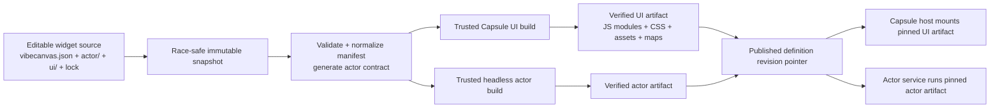

# E34 - Capsule-only Vibecanvas manifest v1 and artifact boundary
[Overview](../BASED.md)

Define the first intentionally breaking `vibecanvas.json` contract for Capsule widgets and the source/build/artifact boundaries around it. The target has no ArrowJS compatibility: a widget definition has one actor backend, one Capsule UI, and separate immutable actor/UI build artifacts.

## Context

This exploration narrows the broader Capsule migration in [`E32`](./E32.md) to the Vibecanvas-owned manifest and publication contract. The normative background is:

- [`llm.widget-system.md`](../../docs/internal/llm.widget-system.md)
- [`llm.capsule-repository.md`](../../docs/internal/llm.capsule-repository.md)
- [`llm.capsule-vibecanvas-integration.md`](../../docs/internal/llm.capsule-vibecanvas-integration.md)
- [`llm.capsule.md`](../../docs/internal/llm.capsule.md), historical and superseded by the two Capsule documents above

The primary current manifest implementations are:

- [`packages/sdk/vibecanvas.schema.json`](../../packages/sdk/vibecanvas.schema.json)
- [`packages/service-actor/src/core/types.ts`](../../packages/service-actor/src/core/types.ts)
- [`packages/service-actor/src/core/vibecanvasjson.zod.ts`](../../packages/service-actor/src/core/vibecanvasjson.zod.ts)
- [`packages/service-actor/src/ActorService.ts`](../../packages/service-actor/src/ActorService.ts)

The current manifest models its two execution halves as `actor` and `widget`, where `widget` actually means the browser UI. It points to a UI directory with `widget.relWidgetDir`, assumes `main.ts`/`main.js`, and stores canvas tool metadata beside that path. The actor service recursively reads this directory as UTF-8 and the actor API returns `{ path, content }[]` as `widgetCode`. The frontend reconstructs a source map and compiles it per mounted Arrow sandbox. There is no immutable UI artifact, binary asset delivery, content hash, Capsule ABI, actor artifact, contract hash, or definition revision pin.

Capsule changes the boundary: trusted infrastructure receives an immutable source snapshot, compiles and bundles the UI and all guest dependencies, emits a verified self-contained artifact, and mounts only that artifact. The browser must never compile raw widget TypeScript. The actor must eventually be built into a separate verified headless artifact instead of loading raw TypeScript.

This task is an exploration and contract-design task. It should produce an implementation-ready manifest decision and follow-up task split; it does not implement Capsule itself.

## Decisions already made

1. The change is intentionally breaking.
2. There is no ArrowJS compatibility parser, `arrow-v1` runtime, dual manifest shape, or long-lived migration union.
3. The first Capsule manifest is `manifestVersion: 1`.
4. `manifestVersion` versions the Vibecanvas source-manifest schema. It is not the published definition revision, Capsule ABI, artifact-envelope version, DOM-profile version, or actor-protocol version.
5. The product entity remains a **widget**. Its two authored execution halves are top-level `actor` and `ui`.
6. The current top-level `widget` section is renamed to `ui`.
7. Both `actor` and `ui` are required. The redundant `kind?: "widget" | "actor-widget"` field should be removed.
8. Capsule is the only UI runtime, so an authored `ui.runtime` discriminator is unnecessary in manifest v1. Resolved Capsule ABI/profile versions belong in build outputs and published descriptors.
9. `ui.entry` points to the authored source entry, not generated JavaScript. It must not be restricted to `.js`.
10. The trusted Capsule builder owns transpilation and bundling. A widget source tree does not require or publish an author-maintained `dist/` directory.
11. Build output is stored as an immutable content-addressed Capsule artifact outside the editable source tree.
12. Actor resources and UI capabilities remain different authority domains. `actor.resources` never becomes direct browser authority.

## Current contract problems

### Naming and shape

- `widget` ambiguously means both the full product object and only its current Arrow UI section.
- `TVibecanvasActorWidget` contains a UI source path and canvas tool registration, not the actor-widget aggregate its name suggests.
- `kind` claims to distinguish `widget` from `actor-widget`, but both actor and widget sections are required and catalog code normally derives `actor-widget` anyway.
- `relWidgetDir` points to a directory while runtime code separately assumes `main.ts`, `main.js`, and sometimes `main.css`.
- `relFunctionPath` and `relWidgetDir` use inconsistent entry concepts. Both build targets need explicit source entries.

### Contract drift

The public JSON Schema, TypeScript types, and Zod runtime schema are manually maintained and already disagree:

- TypeScript and Zod accept the optional `kind`; the public JSON Schema has `additionalProperties: false` and does not define it.
- The public schema is strict in many nested objects while most Zod objects are not `.strict()` and can strip unknown fields.
- String lengths and path requirements differ.
- The public `functionName` pattern requires content after `fn.`, `fx.`, or `tx.`, while Zod currently permits an empty suffix.
- Public path fields do not express the complete no-absolute/no-traversal/no-backslash/no-NUL rules required by the hostile build snapshot.
- [`packages/sdk/package.json`](../../packages/sdk/package.json) does not clearly publish/export `vibecanvas.schema.json` in its `files` surface.

One canonical manifest contract must own TypeScript types, runtime validation, normalization, public JSON Schema generation or parity tests, and contract hashing. The complete manifest should not remain owned by `service-actor` once it contains UI build policy, canvas presentation, and Capsule concerns.

### Runtime and publication

- [`ActorService.getWidgetCode`](../../packages/service-actor/src/ActorService.ts) recursively transports text source and cannot represent general binary assets.
- [`packages/api-actors/src/api.def-get.ts`](../../packages/api-actors/src/api.def-get.ts) exposes raw `widgetCode`.
- [`packages/ai-chat/src/canvas-extension/Widget.plugin.ts`](../../packages/ai-chat/src/canvas-extension/Widget.plugin.ts) reconstructs Arrow source and reads `def.widget.tool`.
- [`packages/ai-chat/src/widget/mount-arrow-sandbox.ts`](../../packages/ai-chat/src/widget/mount-arrow-sandbox.ts) rewrites SDK imports, injects the actor bridge, and compiles per mount.
- [`packages/service-agent/src/widget-drafts/WidgetDraftController.ts`](../../packages/service-agent/src/widget-drafts/WidgetDraftController.ts) treats a source map with `main.ts` or `main.js` as preview input.
- [`packages/service-agent/src/core/tx.validate-widget-files.ts`](../../packages/service-agent/src/core/tx.validate-widget-files.ts) type-checks actor TypeScript but does not perform the final trusted UI build.
- [`packages/service-agent/src/tools/fn.widget-create.ts`](../../packages/service-agent/src/tools/fn.widget-create.ts) scaffolds the old `widget.relWidgetDir` shape.
- [`packages/service-db/src/model.ts`](../../packages/service-db/src/model.ts) stores definition metadata and a manifest path but has no immutable definition-revision or artifact pointers.
- [`packages/service-actor/src/Actor.ts`](../../packages/service-actor/src/Actor.ts) loads actor functions from the raw `actor.relFunctionPath` source.

## Proposed manifest direction

The exact budget/profile schemas remain to be finalized, but the intended source shape is:

```json
{
  "$schema": "https://vibecanvas.dev/schemas/v1/vibecanvas.schema.json",
  "manifestVersion": 1,
  "slug": "notes",
  "name": "Notes",
  "description": "Shared notes",
  "actor": {
    "entry": "./actor/functions.ts",
    "initialState": "ready",
    "initialData": {},
    "dataSchema": {
      "type": "object",
      "additionalProperties": false
    },
    "resources": {},
    "states": {
      "ready": {
        "on": {}
      }
    },
    "inputMsgSchema": {},
    "outputMsgSchema": {}
  },
  "ui": {
    "entry": "./ui/main.tsx",
    "domProfile": "standard",
    "capabilities": []
  },
  "canvas": {
    "tool": {
      "label": "Notes",
      "behavior": {
        "type": "mode",
        "mode": "draw-create"
      }
    }
  }
}
```

This example is directional, not a finalized schema. In particular, the exploration must decide whether canvas tool metadata lives at `canvas.tool`, `ui.tool`, or a simpler top-level field. `canvas.tool` is currently preferred because tool registration controls canvas presentation/creation and is not part of Capsule UI execution.

### Root rules

- Require `manifestVersion: 1`.
- Require `slug`, `name`, `actor`, and `ui`.
- Remove `kind`.
- Keep `$schema` as editor/tooling metadata; it does not replace `manifestVersion`.
- Decide whether source `version` remains useful metadata or is too easily confused with definition revision and artifact versions.
- Choose one stable machine identity. Prefer `slug` as stable identity and `name` as display text if the DB/API migration cost is accepted; do not introduce an additional source-authored ID without a need.

### Actor rules

- Prefer `actor.entry` over `actor.relFunctionPath`; it is the source entry for the trusted headless actor build.
- Keep the current state-machine format unless a separate actor-contract redesign is justified. Capsule does not by itself require renaming all `data`/`context` terminology.
- Require `dataSchema`, `inputMsgSchema`, and `outputMsgSchema` for every manifest v1 definition, even when input/output maps are empty.
- Derive actor state-name types from declared states and validate the initial state and transition targets against them.
- Keep logical resource slots, kinds, requiredness, scope, and named DB operations under `actor.resources`.
- Add result schemas for named DB operations where generated result typing is promised.
- Resolve how output delivery is declared. The Capsule actor contract requires each output to be explicitly ephemeral, replayable from a cursor, or durable until acknowledged; the current `outputMsgSchema` only describes payload shape.
- Generate one actor contract digest from normalized state/data/input/output/resource declarations and embed it in UI and actor artifacts. The digest is generated output, never hand-authored in `vibecanvas.json`.

### UI rules

- Use `ui.entry`, not `ui.entrypoint`, unless naming is deliberately reversed before implementation.
- `ui.entry` is a normalized source-relative file path inside the immutable snapshot.
- Initial supported source extensions should be explicitly release-gated. The intended set is `.js`, `.jsx`, `.ts`, and `.tsx`; `.vue` becomes valid only when the trusted Vue plugin/profile ships.
- The extension list declares accepted build inputs, not what the guest VM evaluates. The artifact entry is generated JavaScript.
- Do not infer authority from imports. Optional browser features require explicit UI capability requests.
- Treat capabilities as requests, not grants. Effective authority is artifact request ∩ host policy ∩ mount grant ∩ instance-bound provider binding.
- The widget's own typed actor capability should be implicit from the required actor section and host binding rather than repeated as an opaque capability string in every manifest.
- UI capability names must remain distinct from actor resource kinds. No UI field accepts actor instance IDs, resource IDs, provider IDs, filesystem paths, accounts, or concrete grants.
- Decide whether `domProfile` is author-selected, a stable Vibecanvas product-level profile request, or omitted for the standard host default. Exact Capsule profile/ABI versions belong in the artifact descriptor.
- Framework metadata should be optional or inferred where safe. It may select only a pinned trusted transform from a host allowlist and must never select arbitrary guest bundler plugins.
- `capabilities` defaults to `[]` if retained as an array.
- Omitted budgets use host defaults. Numeric requests can only reduce or request within deployment maxima.
- Omitted parkability means non-parkable. A park declaration needs an explicit serializable snapshot schema; arbitrary framework heaps are not serializable.

### Tool metadata

The existing tool behavior is canvas integration rather than Capsule execution. Preferred options, in order:

1. `canvas.tool` for explicit ownership;
2. a top-level `tool` for the smallest shape;
3. `ui.tool` only for migration locality, despite weaker semantics.

Explore safe defaults so the common manifest does not repeat metadata:

- tool label defaults to top-level `name`;
- capabilities default to none;
- budgets default to host policy;
- parkability defaults off;
- decide whether the common tool behavior can default to draw-create or must remain explicit.

## Source, build, and artifact boundary

`vibecanvas.json` is a source/build declaration. It must not become a mutable registry of generated hashes or effective host grants.



### Authored source tree

A normal source snapshot should look like:

```text
vibecanvas.json
package.json
dependency lock
actor/
  functions.ts
  ...
ui/
  main.tsx
  styles.css
  assets/
    ...
```

The snapshot may contain JS, TS, JSX, TSX, supported framework files, CSS, and binary assets. Source paths must reject absolute paths, traversal, backslashes where portability requires POSIX normalization, NULs, duplicate normalized paths, case-collision ambiguity, and all symlinks. Reads must be race-safe and no-follow.

### No source `dist/`

An author-maintained `dist/` is not required and should not be part of the normal draft/publish contract. Requiring it would create two source authorities, invite AI Chat to edit generated files, permit stale output, complicate fingerprints, and move trusted compiler/plugin selection back into guest-controlled scripts.

The builder may use a temporary isolated output directory internally. That directory is disposable implementation detail. The durable outputs are content-addressed artifacts stored outside `widget-drafts`, shared AI mounts, and canonical source snapshots. A local development cache, if introduced, must be ignored and never become publication authority.

Plain `.js` source remains valid, but it is still bundled and verified. JavaScript source is not copied directly into the browser runtime as an unverified shortcut.

### Trusted build input

The Vibecanvas build adapter should provide Capsule with:

- the immutable source snapshot and source revision;
- `ui.entry`;
- the complete pinned dependency lock;
- normal package source/bytes resolved without install scripts;
- `@vibecanvas/sdk/widget` as a pinned provided package;
- generated definition-specific SDK declaration augmentation;
- selected Capsule runtime ABI and DOM profile;
- only host-approved TypeScript/JSX/Vue transforms;
- capability and budget requests;
- actor contract descriptor/hash;
- deterministic build policy and limits.

The hostile build boundary must have no network, ambient secrets, guest install scripts, guest configuration execution, or guest-selected plugins. It needs CPU, memory, process, file, byte, depth, and wall-clock limits. Preview and publication must invoke this same build and verifier.

### Artifact output

The UI artifact owns generated runtime output:

- generated JavaScript entry/module graph;
- parsed/scoped CSS;
- binary asset table;
- source maps with normalized virtual paths;
- dependency and transform digests;
- artifact hash and envelope version;
- Capsule runtime ABI and resolved profile compatibility;
- requested capabilities and budget maxima;
- actor contract hash;
- diagnostics and reproducibility metadata;
- park/snapshot metadata.

The actor build emits a separate headless actor artifact with the same actor contract hash. UI and actor hashes remain independent so a UI-only change can preserve actor state and process revision.

### Published runtime descriptor

Publication, not the source manifest, records a descriptor equivalent to:

```text
definition revision
normalized manifest hash
UI artifact hash
actor artifact hash
actor contract hash
Capsule ABI
DOM profile
builder/toolchain identity
activation and rollback metadata
```

Every mounted UI and actor instance must pin a definition/artifact revision. Publication must define stay-pinned, remount, coordinated migration, and rollback behavior rather than silently replacing live code.

## Structural consequences

### Shared manifest ownership

The full manifest should move out of `packages/service-actor`. Create or select one Vibecanvas-owned definition-contract module/package that can be consumed by SDK tooling, service-agent, service-actor, APIs, publication, and `packages/capsule-vibecanvas` without making Capsule depend on Vibecanvas.

The contract must distinguish:

- authored source manifest;
- validated/normalized manifest;
- generated actor contract;
- published definition revision;
- UI runtime/artifact descriptor;
- actor runtime/artifact descriptor.

Do not overload `TVibecanvasJson` with host-only `manifest_path`, artifact hashes, DB timestamps, or effective grants.

### `packages/sdk/vibecanvas.schema.json`

- Define only manifest v1; no Arrow alternatives.
- Require `manifestVersion`, actor, and UI.
- Replace `widget`/`relWidgetDir` with `ui`/`entry`.
- Add UI profile, capability, budget, and park schemas.
- Move or redefine tool metadata according to the ownership decision.
- Require Capsule actor schemas and output delivery metadata.
- Strengthen path, cardinality, string, and additional-property rules.
- Publish the schema as part of the SDK/tooling surface.
- Generate it from the canonical runtime contract or maintain mandatory parity fixtures.

### `packages/service-actor/src/core/types.ts`

- Stop defining the complete UI-aware manifest locally.
- Import the canonical manifest and actor contract types.
- Keep actor-runtime-local function and resource types local where appropriate.
- Replace `TVibecanvasActorWidget` with explicit UI/canvas concepts if compatibility aliases are briefly useful inside one atomic branch, but do not ship a legacy manifest shape.
- Replace raw source-path runtime assumptions with actor artifact/revision descriptors.

### `packages/service-actor/src/core/vibecanvasjson.zod.ts`

- Move or derive the canonical parser from shared ownership.
- Parse only manifest v1 and reject `widget`, `relWidgetDir`, `kind`, and unknown properties.
- Normalize defaults exactly once before hashing/building.
- Add trusted cross-field validation for paths, schemas, state names, message declarations, output delivery, resource scope, capability uniqueness, budgets, and parkability.
- Keep the public JSON Schema, inferred TypeScript, normalized output, and runtime behavior in parity.

### `packages/service-actor/src/ActorService.ts`

- Remove `getWidgetCode` and all UI directory/source reading.
- Stop serving UI runtime payloads through the actor service.
- Consume a pinned actor definition/artifact descriptor.
- Make publication transitions revision-aware.
- Ensure UI-only publication never closes, resets, or reloads actor instances.
- Leave Capsule host mounting and UI artifact delivery to the Vibecanvas definition/artifact adapter and frontend host path.

### Service-agent and publication

- Rewrite scaffolding to emit manifest v1, `actor/`, and `ui/` source.
- Validate both source entries and all required files without hard-coded `main.ts` assumptions.
- Build UI and actor from one pinned immutable draft revision.
- Generate SDK contract augmentation before both builds.
- Verify artifact and actor contract hashes.
- Keep source snapshots and artifacts distinct.
- Make preview execute the exact UI artifact bytes publication would activate.
- Stage source, artifacts, resource-binding transition, and revision metadata before atomically activating one definition revision pointer.
- Preserve the previous active revision on build, verification, binding, or reconciliation failure.

### Database and actor lifecycle

The current definition and instance records need a revision model that can represent:

- immutable definition revisions;
- active published revision;
- UI and actor artifact hashes;
- actor contract hash;
- manifest hash;
- artifact retention/lease and rollback state;
- the actor-definition revision pinned by each actor instance;
- the UI artifact/revision pinned by each canvas widget instance.

The current publication path can close actors and reset state to initial values. A UI-only revision must preserve actors. Actor-contract or actor-artifact changes need explicit compatibility/migration policy and rollback.

### API and canvas host

- Replace raw `widgetCode` responses with compact verified artifact descriptors or artifact fetch references.
- Include enough tool/revision/runtime summary metadata in definition listings to avoid refetching every definition after one publication.
- Replace Arrow source reconstruction with Capsule artifact selection and verification.
- Create one shared Capsule host/scheduler and one handle per hydrated widget UI.
- Create an instance-bound actor provider that captures the owning canvas/element/actor authority. Guest calls never select actor or resource IDs.
- Forward geometry, scale, visibility, distance, priority, occlusion, focus, composition, pointer capture, collapse, freeze, park, resume, and destroy lifecycle inputs.
- Destroying UI transport must not implicitly delete the backend actor.

### SDK and actor capability

- Keep `@vibecanvas/sdk/widget` as the normal guest import unless a separate naming decision is made; “widget” remains the product aggregate even though the manifest section is `ui`.
- Remove Arrow reactivity and global bridge setters.
- Bundle the SDK into the Capsule artifact through provided package input.
- Generate definition-specific declarations from the canonical actor contract.
- Expose actor epoch, revision, status, state, context, error, typed inputs, typed outputs, send results, and lifecycle-safe subscriptions.
- Distinguish transport failure, schema rejection, authorization/binding failure, accepted/queued, and optional processed outcomes.
- Define race-free initial snapshot plus subscription, resync, output durability, backpressure, freeze/park behavior, and teardown.

### Documentation and terminology

- Update [`llm.capsule-vibecanvas-integration.md`](../../docs/internal/llm.capsule-vibecanvas-integration.md) references from `normalizedManifest.widget` to `normalizedManifest.ui`.
- Continue using widget terminology for widget drafts, publishing, canvas elements, catalogs, AI tools, and the aggregate definition.
- Use UI only for the browser execution half.
- Keep “Capsule capability” and “actor resource” qualified and separate.

## Breaking cutover policy

There is no runtime legacy support. The implementation branch must update all repository scaffolds, fixtures, examples, tests, prompts, published defaults, and callers atomically to manifest v1. Old installed manifests become invalid until explicitly rebuilt/reinstalled under the new contract.

Do not add:

- `widget ?? ui` fallbacks;
- a manifest v0 normalizer;
- `arrow-v1` runtime descriptors;
- old `relWidgetDir` support;
- raw `widgetCode` API compatibility;
- browser TypeScript compilation fallback;
- source import string rewriting.

If product data needs a one-time external migration or reset procedure, design it as an explicit cutover operation rather than permanent manifest/runtime compatibility.

## Plan

### 1. Freeze the authored manifest contract

- Decide the exact root, actor, UI, canvas-tool, capability, budget, profile, and parkability vocabulary.
- Resolve `actor.entry`, `ui.entry`, supported source extensions, output delivery declarations, and source `version` semantics.
- Define defaults that reduce boilerplate without hiding security-relevant decisions.
- Write valid and invalid manifest examples.

### 2. Choose canonical contract ownership

- Select the shared Vibecanvas package/module that owns source types, normalization, Zod/runtime validation, public JSON Schema, and actor contract generation.
- Define environment-neutral types versus build/host adapters.
- Define schema/type parity tests and versioning rules.

### 3. Specify build and artifact contracts

- Define immutable source snapshot, dependency lock, provided SDK/type packages, trusted plugin selection, limits, and deterministic hashing.
- Define separate UI and actor artifact envelopes and their shared contract hash.
- Define artifact storage, retention, verification, fetch, cache, and rollback responsibilities.
- Confirm that no editable or canonical source `dist/` is needed.

### 4. Specify publication and lifecycle persistence

- Design definition-revision and instance-pin data models.
- Define preview/publish byte identity and activation transaction/compensation.
- Define UI-only publication, actor-compatible publication, incompatible migration, live-instance pinning, remount, and rollback behavior.

### 5. Map the atomic breaking change

- Enumerate every `manifest.widget`, `relWidgetDir`, `relFunctionPath`, `main.ts`, `widgetCode`, Arrow sandbox, schema, fixture, prompt, API, and DB consumer.
- Split implementation into addition/subtraction tasks that can land in a controlled sequence without shipping dual runtime behavior.
- Define the clean-install or explicit one-time data cutover story.

### 6. Define verification gates

- Add manifest parity, path confinement, deterministic build, binary asset, artifact tamper, contract mismatch, publication rollback, UI-only actor preservation, instance pinning, and no-raw-source transport tests.
- Add SDK/provider tests for owning-actor binding, revision/cursor resync, accepted/rejected sends, output delivery modes, lifecycle, quotas, and teardown.
- Add a CI assertion that no Arrow dependency, raw `widgetCode`, browser compiler path, or source `dist/` authority remains after cutover.

## Acceptance criteria for this exploration

- One final manifest v1 schema is documented with valid and invalid examples.
- The source entry is clearly distinguished from the generated JavaScript artifact entry.
- The repository does not require an authored `dist/` directory.
- Manifest, Capsule ABI, artifact envelope, actor protocol, DOM profile, and definition revision versioning are separately defined.
- Canonical contract ownership and schema/type generation/parity are decided.
- UI capabilities and actor resources remain separate.
- UI and actor artifact/build contracts are specified.
- Publication revision, instance pinning, UI-only update, rollback, and artifact retention requirements are specified.
- Every affected package/API/DB/runtime surface is mapped.
- The no-legacy cutover and repository/data conversion strategy are explicit.
- Follow-up addition/subtraction tasks can be estimated without reopening basic manifest ownership or `dist/` questions.

## TODOS

- [ ] Finalize the manifest v1 JSON shape and defaults.
- [ ] Decide `canvas.tool` versus top-level or `ui.tool` ownership.
- [ ] Decide the canonical manifest contract package/module.
- [ ] Decide `actor.entry` and supported actor source extensions.
- [ ] Finalize supported `ui.entry` source extensions and profile gating.
- [ ] Define output delivery declarations and generated actor contract hashing.
- [ ] Define UI capability, budget, DOM profile, and parkability request schemas.
- [ ] Define source snapshot and dependency-lock rules.
- [ ] Define UI and actor artifact envelopes and storage.
- [ ] Define definition-revision, active pointer, rollback, and instance-pin persistence.
- [ ] Map all current manifest/raw-source/Arrow consumers and fixtures.
- [ ] Define the atomic no-legacy cutover/reset procedure.
- [ ] Produce implementation addition/subtraction tasks and CI gates.

## NOTES

The important distinction is:

```text
ui.entry = authored source file, possibly TypeScript/TSX
artifact entry = generated JavaScript module inside a verified Capsule artifact
```

A `.js`-only source entry would either force authors/AI to prebuild or make committed generated output authoritative. Both conflict with the trusted Capsule builder design.

The source manifest should contain requests and business declarations. Artifact hashes, exact resolved ABI/profile versions, effective grants, concrete bindings, and instance identities are host-generated operational data.

The Capsule standalone repository remains consumer-neutral. Every type, capability ID, actor contract, publication rule, and manifest in this task belongs to Vibecanvas or the future `packages/capsule-vibecanvas` adapter.

Backend actor trust remains a separate E32 decision. Compiling the actor into an artifact does not by itself make actor execution safe against hostile code; process/VM/OS authority and interruption still require an explicit trust model.

### LOGS

- 2026-07-18: Created the exploration after review of the current widget manifest, service-actor schema/types/service, Capsule repository specification, Vibecanvas integration profile, and widget runtime path.
- 2026-07-18: Recorded the accepted breaking direction: manifest v1 is Capsule-only, the aggregate widget has `actor` + `ui`, and no Arrow compatibility is retained.
- 2026-07-18: Recorded that `ui.entry` is a source entry and may be TypeScript/TSX; generated JavaScript belongs to the artifact.
- 2026-07-18: Recorded that editable/published source does not require a `dist/` directory; build output is a separate content-addressed artifact.

---
