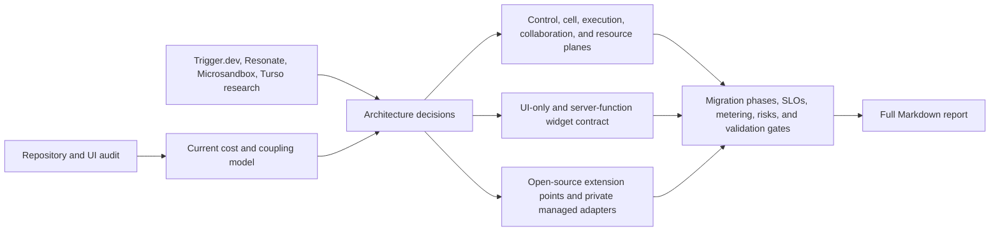

# E36 - Managed multi-tenant architecture and scale-to-zero widget functions

[Overview](../BASED.md)

Design an implementation-ready managed-service architecture that preserves the canvas experience while replacing one-resident-backend-per-widget costs with browser-only widgets and metered, on-demand server functions.

## Context

The current open-source runtime combines a local application database, Automerge synchronization, actor processes, actor message APIs, and file-backed actor resources. The managed product needs organizations with multiple users, shared infrastructure, tenant-aware placement, cheap idle behavior, bounded and billable backend execution, and a clean boundary between public runtime contracts and proprietary managed infrastructure.

Primary repository inputs:

- [`ActorService.ts`](../../packages/service-actor/src/ActorService.ts)
- [`llm.widget-system.md`](../../docs/internal/llm.widget-system.md)
- [`llm.turso.md`](../../docs/external/llm.turso.md)
- [`SCREENS.md`](../../docs/internal/screens/SCREENS.md)
- [`E32`](./E32.md) and [`E34`](./E34.md), for the existing Capsule and immutable-artifact direction

External systems to compare through primary sources:

- [Trigger.dev](https://github.com/triggerdotdev/trigger.dev)
- [Resonate](https://github.com/resonatehq)
- [Microsandbox](https://github.com/superradcompany/microsandbox)

The deliverable is [`llm.managed-service-architecture.md`](../../docs/internal/llm.managed-service-architecture.md). It is an architecture report and migration contract, not an implementation of the managed service.

## Plan

The supplied sketch is the starting hypothesis: a control plane assigns organizations to multi-tenant servers, which delegate widget work to worker pools and file-backed resources. The exploration will test and refine the boundaries rather than assume fixed counts such as 100 organizations per server.

### 1. Establish the current baseline

- Trace widget publication, browser mounting, actor lifecycle, Automerge WebSockets, database resources, and runtime/plugin registration from repository evidence.
- Separate unavoidable shared-service cost from the current per-widget resident-process cost.
- Record user-facing invariants from the screen atlas that the rewrite must preserve.

### 2. Evaluate reference systems

- Extract durable execution, queueing, leases, retries, concurrency, and metering lessons from Trigger.dev and Resonate.
- Extract sandbox pooling, isolation, and lifecycle lessons from Microsandbox.
- Validate Turso/libSQL file, transaction, concurrency, and remote-access constraints relevant to resource placement.
- Distinguish verified source facts from recommendations inferred for Vibecanvas.

### 3. Design the target architecture

- Define organization, workspace/canvas, cell, artifact, function, invocation, and resource placement units.
- Define one multiplexed browser connection and shared, evictable Automerge authority per cell.
- Define browser-only widgets, build-generated typed server-function stubs, and on-demand sandbox workers; keep durable execution out of the initial system while preserving a future private managed extension seam.
- Define a resource broker that preserves the local SDK illusion without pretending remote files are a safe shared filesystem.
- Define quotas, fairness, retries, idempotency, concurrency keys, observability, and a billing ledger.

### 4. Preserve public/private separation

- Identify stable open-source interfaces for tenant context, placement, execution, resources, artifacts, metering, and identity.
- Keep the local single-tenant distribution as the default adapter set.
- Place managed auth, billing, organization placement, fleet control, and proprietary policies in a private composition repository.

### 5. Produce the rewrite roadmap

- Map current packages to keep, split, replace, or retire.
- Define staged compatibility bridges and rollback points instead of a flag-day rewrite.
- Include capacity formulas and measurement gates rather than unsupported organizations-per-server promises.
- Close the exploration with explicit decisions, rejected alternatives, open questions, and acceptance criteria for implementation tasks.

## TODOS

- [x] Create the exploration task, branch, and compressed task-owned copy of the supplied sketch.
- [x] Audit current repository flows and user-facing invariants with file evidence.
- [x] Research the linked systems and relevant Turso/libSQL behavior through primary sources.
- [x] Write the target architecture, function model, storage model, metering model, and open/private boundary.
- [x] Add diagrams, decision tables, capacity formulas, migration phases, risks, and validation gates.
- [x] Verify every repository link, external citation, and Mermaid block.
- [x] Complete the report and close the BASED task.

## NOTES

- The organization is the billing and policy boundary. A cell is the data locality and failure boundary. A sandbox invocation is the compute-accounting boundary.
- Fixed organization counts are a starting capacity hypothesis only; placement must use measured weighted load and hard safety ceilings.
- A UI-only widget must create no server execution artifact and consume no per-widget idle backend memory.
- Security design is not the focus of this exploration, but the architecture must retain an explicit sandbox and capability boundary so later enforcement does not require another topology rewrite.
- E36 supersedes E34's required-actor and no-legacy decisions: the new manifest requires UI, permits optional server functions, and isolates old actors behind a bounded compatibility adapter.
- Executor hosts may be physically shared, but each executor slot is assigned to one cell scheduler at a time; data/collaboration placement and compute capacity use separate load scores.
- Every writable resource has one owner and every invocation mutation is gated by the authoritative attempt epoch plus a bounded write permit.
- Organization-owned artifact references authorize and retain globally deduplicable immutable blob bytes; the content hash itself grants no authority.
- A cell is a logical placement/data/failure boundary recorded by `cells` and `organization_placements`; the initial deployment maps one cell to one VPS, but `vibecanvas.turso` is cell-owned storage rather than the cell itself.
- One multi-tenant Automerge service serves all organizations in a cell; add document partitions only from measured active load, never one idle server per organization.
- The Resource Store and its database files are colocated, while widget function sandboxes may execute on other hosts through `ctx.resources` private RPC.
- Use one new private managed monorepo, for two repositories total. All initial managed metadata stores—including `control-plane.turso` and one `vibecanvas.turso` per cell—use Turso.
- Durable workflows are removed from the initial architecture. A future private managed extension may prototype Resonate without adding workflow semantics to ordinary functions or OSS adapters now.

### LOGS

- 2026-07-21: Created branch `codex/managed-multitenant-architecture`.
- 2026-07-21: Added this E36 exploration and compressed the supplied 1786x884 sketch to a task-owned 1400x693 PNG.
- 2026-07-21: Began parallel repository, workflow-system, sandbox, and storage research.
- 2026-07-21: Traced the current actor/Automerge/resource/agent flow and confirmed the principal steady-state cost is one retained Bun child process per active actor widget.
- 2026-07-21: Compared Trigger.dev, Resonate, Microsandbox, and Turso behavior through primary project documentation and separated source facts from Vibecanvas recommendations.
- 2026-07-21: Wrote the full managed-service report with target planes, widget tiers, tenant model, leases/fairness, file-resource ownership, billing receipts, public/private interfaces, migration phases, capacity tests, and rejection/risk tables.
- 2026-07-21: Resolved an independent architecture review covering E32/E34 precedence, cross-cell executor ownership, resource-side fencing, complete tenant surfaces, artifact authority/GC, build-time contract extraction, crash billing, retention, and idempotency conflicts.
- 2026-07-21: Verified Markdown whitespace, local links, fence balance, all 22 external source URLs, image dimensions, and the eight Mermaid blocks; closed E36.
- 2026-07-21: Clarified cell identity versus its directory rows/VPS/database, documented shared-per-cell Automerge and optional Resource Store/executor separation, fixed the repository count at one new private repo, standardized control/cell metadata on Turso, and removed durable workflows from the initial system while retaining a future managed Resonate extension seam.

---
