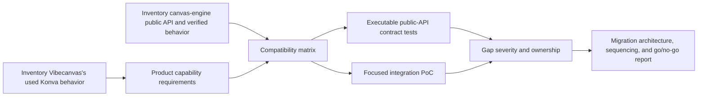

# E37 - Canvas-engine compatibility audit and executable migration contract

[Overview](../BASED.md)

Determine whether the local `@omnidraw/cangine` can replace Konva in
`@vibecanvas/canvas`, prove the answer with executable public-API checks, and
turn every missing or mismatched capability into a concrete migration
requirement.

## Context

`packages/canvas` currently exposes product behavior through services and
plugins while retaining live Konva nodes throughout scene, selection,
transform, hydration, image, text, grouping, and widget-host code. The new
engine intentionally rejects Konva compatibility and instead exposes a
renderer-agnostic, ID-based, transactional scene API.

Primary inputs:

- [`packages/canvas`](../../packages/canvas)
- [`llm.managed-service-architecture.md`](../../docs/internal/llm.managed-service-architecture.md)
- local engine repository at `/Users/omarezzat/Workspace/vibecanvas/canvas-engine`
- original engine commit `c7be5910cc54ab373cd6e7025c1d27e7a8827970`
- re-evaluated engine commit `cd308f686468acd6171fcc975f0dfe478124ae9d`

The compatibility harness must consume the engine through its public package
exports using a filesystem package dependency. It must not deep-import engine
implementation files or edit the engine repository.

## Plan

### 1. Establish the used compatibility surface

- Count production Konva imports, runtime types, constructor calls, and method
  usage instead of auditing all of Konva.
- Trace the stable plugin stack, scene layers, event routing, selection,
  transforms, drawing, text, images, groups, render order, portals, hydration,
  recorder/debug behavior, and extension points.
- Separate engine-owned rendering mechanisms from application-owned CRDT,
  history, semantic selection, tools, and widget policy.

### 2. Audit the engine as a public consumer

- Pin the inspected engine commit and record dirty-state caveats.
- Read package exports, specification, progress ledger, documentation, tests,
  and representative demos.
- Exercise only `@omnidraw/cangine` public exports through a filesystem
  dependency.

### 3. Build executable compatibility evidence

- Add a contract suite covering scene transactions, primitives, hierarchy,
  ordering, camera conversion, picking, bounds, gestures, transform proposals,
  text, paths, images, HTML portals, widget frames, serialization, SVG, and
  lifecycle.
- Add a focused adapter/PoC only where it proves the app/engine ownership seam.
- Make unsupported requirements explicit outcomes rather than silently
  skipping them.

### 4. Produce the migration report

- Classify each requirement as compatible, adaptable, incomplete, or absent.
- Identify blockers versus simplifications and distinguish engine work from
  `packages/canvas` refactors.
- Define an incremental migration sequence with removal targets, validation
  gates, and a final go/no-go decision.
- Reconcile the rendering change with the managed-service architecture and
  browser-only widget-host invariant.

## TODOS

- [x] Create the exploration task and branch.
- [x] Inventory actual Konva use and current canvas behavior.
- [x] Inventory and exercise the engine public API.
- [x] Add the filepath dependency and executable compatibility suite/PoC.
- [x] Run focused and package-level validation.
- [x] Write and verify the full compatibility report.
- [x] Close the BASED task with evidence and logs.
- [x] Re-evaluate the report and executable contract against the updated engine.

## NOTES

- A mockup image is not useful for this exploration; the Mermaid flow plus
  executable behavior matrix provides the relevant evidence.
- The engine repository's `AGENTS.md` references `docs/README.md`, but that file
  is absent at the inspected commit. This audit will use the available spec,
  roadmap, progress ledger, consolidated documentation, public source, tests,
  and demos.
- No legacy document migration or Konva adapter is required because the product
  has not deployed.
- Konva appears in 97 of 200 canvas source files. Nineteen files import it at
  runtime and 17 production constructor sites create nodes, but most migration
  work is removing live node types/methods from service and plugin boundaries.
- Engine commit `cd308f6` adds the application-owned transient projection that
  was the common blocker for line handles, Alt-drag clones, and external
  widget-placement ghosts.
- The representative projection uses one semantic group per product element
  and derived render children. This keeps stable product IDs while mapping
  inline text and widget subparts to engine primitives.
- Current product rotation values are Konva degrees; engine transforms require
  clockwise radians. With no deployment, change the persistence contract
  during cutover instead of keeping a legacy conversion boundary.
- The absolute `file:` dependency is audit-only. The updated engine now
  produces a compiled, consumer-verified tarball; production still requires
  Vibecanvas to vendor and pin that artifact with a repository-relative path.
- The compiled tarball's internal ESM imports omit `.js` extensions. Direct
  Node import and default Vitest externalization fail; keeping the package
  inside Vite's transform pipeline with `ssr.noExternal` passes the complete
  canvas suite.

### LOGS

- 2026-07-23: Created branch `codex/canvas-engine-compatibility`.
- 2026-07-23: Created E37 and began repository/engine inventory at engine commit
  `c7be5910cc54ab373cd6e7025c1d27e7a8827970`.
- 2026-07-23: Counted the used Konva surface across source and tests and traced
  scene, camera, registry, selection, transform, shapes, text, image, group,
  render-order, widget-host, hydration, and recorder behavior.
- 2026-07-23: Added the requested filesystem dependency and a public-entrypoint
  compatibility suite plus a Konva-free representative `TCanvasDoc` projection.
- 2026-07-23: Recorded a 36-row matrix: 18 compatible, 10 canvas adapters, four
  engine gaps, one release gap, and three validation gaps.
- 2026-07-23: Verified the focused compatibility suite (9/9), complete canvas
  suite (223/223), canvas TypeScript, engine TypeScript, current engine suite
  (1005/1005), and `git diff --check`.
- 2026-07-23: Wrote
  [`llm.canvas-engine-compatibility.md`](../../docs/internal/llm.canvas-engine-compatibility.md)
  with the go/no-go decision, proposed transient API contract, target
  architecture, migration phases, acceptance gates, and risks; closed E37.
- 2026-07-23: Reopened E37 to re-evaluate engine commit `cd308f6`, including
  its public transient scene and immutable compiled package artifact.
- 2026-07-23: Reclassified the 36-row matrix as 19 compatible, 13 canvas
  adapters, zero engine gaps, one release/tooling gap, and three validation
  gaps.
- 2026-07-23: Replaced the old negative API check with a public transient
  contract covering hit-tested line handles, Alt-drag clone preview and
  same-ID durable handoff, sidebar widget ghost, recorder isolation, and
  cleanup metrics.
- 2026-07-23: Switched the requested local filepath dependency to the compiled
  tarball, recorded its native Node/Vitest externalization caveat, and added
  the scoped `ssr.noExternal` consumer configuration.
- 2026-07-23: Verified the focused compatibility suite (9/9), complete canvas
  suite (223/223), canvas and engine TypeScript, updated engine suite
  (1026/1026), upstream packed-consumer workflow, clean engine state, and
  `git diff --check`; updated the report and closed E37 again.

---
