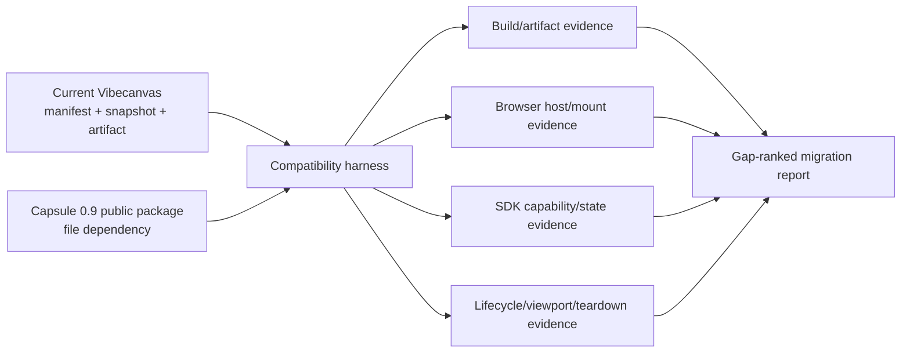

# E37 - Capsule widget-sandbox compatibility and migration gaps

[Overview](../BASED.md)

Test the current standalone Capsule package against Vibecanvas's post-M10 widget,
artifact, browser-runtime, collaborative-state, and server-function contracts.
Produce executable evidence and a migration report without preserving Arrow
guest or manifest compatibility.

## Context

The earlier [E32](./E32.md) exploration evaluated a specification before Capsule
existed as a consumable library. Capsule now lives at
`/Users/omarezzat/Workspace/vibecanvas/capsule`, publishes the single
`@capsule/capsule` facade, and claims DOM, React, Vue, CodeMirror, WebGL, WebGPU,
capability, lifecycle, and teardown construction evidence.

Vibecanvas also changed substantially since E32. The current system is described
by:

- [`llm.managed-service-architecture.md`](../../docs/internal/llm.managed-service-architecture.md)
- [`llm.widget-system.md`](../../docs/internal/llm.widget-system.md)
- [`packages/widget-contract`](../../packages/widget-contract)
- [`packages/ui-ai-chat/src/widget-runtime`](../../packages/ui-ai-chat/src/widget-runtime)
- [`packages/sdk/src/widget.ts`](../../packages/sdk/src/widget.ts)

The current UI artifact is an immutable Vibecanvas JSON envelope containing a
self-contained Bun bundle, but the final browser mount still runs it through
Arrow. Capsule uses a different signed artifact, build request, runtime ABI,
profile, capability, schema, lifecycle, and host-handle contract. Guest source
and Vibecanvas contracts may change; there is no requirement for legacy runtime
or manifest support.

A UI mockup is not useful for this exploration. The important output is an
executable boundary test plus a contract/lifecycle migration map.

## Plan

### 1. Freeze both tested surfaces

- Record the exact Vibecanvas files and current Capsule package/version/commit.
- Use only Capsule's supported npm export map through a file dependency.
- Separate upstream construction evidence from Vibecanvas-specific proof.

### 2. Build an executable compatibility harness

- Build a representative framework-neutral widget into a Capsule artifact.
- Mount it through Capsule's public browser host in a real browser.
- Exercise DOM interaction, viewport updates, focus, freeze/resume, and destroy.
- Verify deterministic build output and terminal-zero teardown diagnostics.
- Add negative checks for direct reuse of the current Vibecanvas UI envelope.

### 3. Map application capabilities

- Compare Capsule's capability and guest-channel model with server functions,
  collaborative state, theme/props, preview, outputs, and instance identity.
- Verify whether the public package exposes enough schema/provider types and
  constructors to implement a consumer capability without private deep imports.
- Map current JSON-schema/function descriptors to Capsule schemas and contract
  hashes.

### 4. Map host, lifecycle, and scale behavior

- Compare the synchronous Arrow mount port with Capsule's asynchronous handle.
- Map canvas geometry/visibility/fullscreen/collapse to Capsule viewport and
  scheduling states.
- Identify ownership for one shared host, capability descriptors, per-instance
  bindings, cache budgets, artifact verification keys, and cleanup.
- Distinguish demonstrated behavior from missing population/performance evidence.

### 5. Produce the migration verdict

- Rank gaps as blocker, required adapter work, product decision, or hardening.
- Define the no-legacy target contracts and implementation sequence.
- Record a go/no-go verdict for a limited PoC and for production cutover.

## TODOS

- [x] Record exact Capsule and Vibecanvas tested revisions.
- [x] Add a file-path Capsule dependency in an isolated compatibility app.
- [x] Add deterministic build and package-boundary tests.
- [x] Add and run a real-browser mount/lifecycle/teardown PoC.
- [x] Test the current Vibecanvas artifact boundary against Capsule.
- [x] Map server-function and collaborative-state providers.
- [x] Map manifest/build/artifact/signing/profile changes.
- [x] Map canvas viewport, collapse, fullscreen, freeze, park, and destroy.
- [x] Assess framework/GPU/browser evidence and remaining acceptance work.
- [x] Write the full compatibility and migration report.
- [x] Update `FILES.md`, run focused verification, and close the exploration.

## NOTES

- Compatibility means Capsule can satisfy the current product behavior after an
  intentional guest/contract rewrite. It does not mean a current Arrow bundle
  or Vibecanvas artifact envelope should execute unchanged.
- Capsule's own automated gates are construction evidence. Human browser,
  accessibility, IME, GPU/hardware, and broad platform claims remain distinct.
- The managed architecture requires the UI runtime to stay behind an adapter.
  Rejecting Capsule must not reopen manifest v2, immutable publication, or
  server-function architecture.

### LOGS

- 2026-07-23: Created the exploration and branch
  `codex/capsule-widget-compatibility`.
- 2026-07-23: Reviewed the Arrow runtime semantics, current managed/widget
  architecture, evolved widget contract, browser runtime, SDK bridges, Capsule
  public package surface, and Capsule project status.
- 2026-07-23: Added `apps/capsule-compatibility` with a direct Capsule
  file dependency, deterministic source build, browser host/lifecycle demo, and
  six package/artifact characterization tests.
- 2026-07-23: Mounted artifact
  `sha256:2fe95a09e010acc05e17f9d5c22e49a83d1a44d77f5b92ad9be0488eb4dd4390`
  in the in-app browser. Viewport, freeze, resume, and destroy passed; final
  diagnostics reported `terminalZero: true`.
- 2026-07-23: Found two public package blockers: application schema resources
  cannot be constructed through a supported export, and the public package
  supplies verification but no trusted release signer. Found a separate
  testkit defect: root and testkit bundles instantiate different local symbols,
  so the host rejects the supported automation attachment.
- 2026-07-23: Wrote
  [`llm.capsule-widget-compatibility.md`](../../docs/internal/llm.capsule-widget-compatibility.md)
  with the no-legacy target contract, capability mapping, lifecycle policy,
  missing browser surfaces, scale/security gates, and staged cutover plan.
- 2026-07-24: Reevaluated Capsule at
  `e80a2601fc8a51a0b3da14317cd6b2977f686e24` using the updated library guide
  and public package exports.
- 2026-07-24: Updated the harness to create and register a public schema, sign
  the artifact through `@capsule/capsule/sign`, require the signature at mount,
  attach the repaired public testkit, and render live SVG and Canvas 2D.
- 2026-07-24: The old schema, signer, testkit identity, SVG, and Canvas 2D gaps
  are resolved. Revised the report verdict to **GO**; remaining work is the
  Vibecanvas artifact, SDK, capability-provider, and async mount migration.
- 2026-07-24: Final verification passed: 8 compatibility tests, TypeScript,
  production Vite build, 10 architecture tests, and a real-browser signed
  mount. Browser destroy reported terminal-zero counters, released both public
  registrations, and disposed the provider binding.

---
