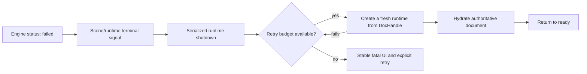

# E38 - canvas: terminal engine recreation and bounded recovery policy

[Overview](../BASED.md)

Design and validate how a running canvas destroys and recreates its runtime
after `@omnidraw/cangine` enters the terminal `status: "failed"` state.

## Context

The engine's durable-publication contract makes fatal post-commit failures
terminal. Every later operation rejects, and the failed engine must be
destroyed rather than restored from an application snapshot.

[`CanvasEngineAdapter`](../../packages/canvas/src/engine/CanvasEngineAdapter.ts)
correctly rejects access after terminal failure and presents a fatal fallback.
[`SceneService`](../../packages/canvas/src/services/scene/SceneService.ts)
currently observes adapter resize events but does not propagate terminal status
to
[`CanvasRuntimeLifecycle`](../../packages/canvas/src/components/CanvasRuntimeLifecycle.ts).
Consequently, a runtime that fails after boot remains allocated until normal
page teardown and is not recreated from the authoritative Automerge document.

This exploration owns the recovery policy and validation. It must not restore a
snapshot into the failed engine, mutate the CRDT to compensate for rendering
failure, or create overlapping engine/runtime instances.

## Plan

### 1. Establish ownership

- Decide whether `SceneService`, the assembled runtime, or
  `CanvasRuntimeLifecycle` owns the terminal signal and retry counter.
- Define one serialized shutdown/replacement path that cannot overlap engines,
  observers, portal roots, input subscriptions, or transient owners.
- Preserve the current authoritative `DocHandle` as the only rebuild source.

### 2. Define bounded recovery

- Specify retry count, backoff, deduplication, and reset behavior.
- Prevent deterministic engine/document failures from causing an infinite
  recreation loop.
- Keep a stable fatal fallback after the retry budget is exhausted and define an
  explicit user retry action.

### 3. Validate failure and teardown paths

- Inject a fatal post-commit engine failure after a successful boot.
- Prove the failed engine is destroyed exactly once before replacement starts.
- Prove queued projection, resize, render, portal, input, and transient work
  cannot reach the failed engine.
- Prove the replacement hydrates the current Automerge document and resumes
  live updates without duplicate subscriptions or DOM hosts.
- Exercise replacement boot failure, repeated fatal signals, navigation during
  recovery, and final component teardown.

## TODOS

- [ ] Choose and document the terminal-status signal owner.
- [ ] Define the bounded retry and stable-fallback policy.
- [ ] Implement serialized failed-runtime shutdown and recreation.
- [ ] Rehydrate only from the authoritative Automerge `DocHandle`.
- [ ] Add fatal post-commit failure injection coverage.
- [ ] Add duplicate-signal, retry-exhaustion, navigation, and teardown tests.
- [ ] Run canvas lifecycle, portal, collaboration, browser, and performance gates.
- [ ] Record final validation evidence and close the task.

## NOTES

- This task is intentionally open and unvalidated.
- No mockup image is useful yet. The state-transition Mermaid diagram captures
  the architectural decision that must be validated.
- The existing fatal fallback remains the safe behavior until bounded
  recreation is implemented.
- Recovery must create a fresh engine; no old scene snapshot may be restored
  into a terminal engine.

### LOGS

- 2026-07-24: Created from the S112 review finding that terminal engine status
  is enforced by the adapter but not yet connected to runtime replacement.

---
