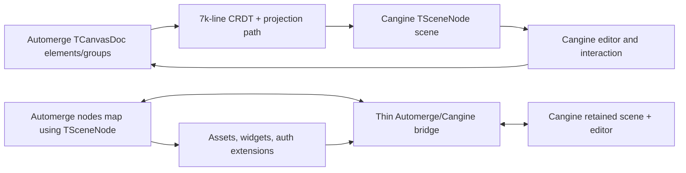

# E39 - canvas: collapse the collaborative document onto Automerge and Cangine

[Overview](../BASED.md)

Determine whether Vibecanvas can remove its parallel `TCanvasDoc` geometry
model and make Cangine scene nodes the collaborative canvas data stored by
Automerge, leaving only a thin synchronization bridge and explicit
application-owned asset/widget extensions.

## Context

Vibecanvas currently has two complete canvas representations:

1. [`TCanvasDoc`](../../packages/service-automerge/src/types/canvas-doc.zod.ts)
   persists product `elements` and `groups` in Automerge.
2. `@omnidraw/cangine` owns a validated serializable retained scene made of
   `TSceneSnapshot`, `TSceneNode`, and `TSerializedSceneCommand`.

The product representation is projected into the Cangine representation
through the architecture documented in
[`packages/canvas/ARCHITECTURE.md`](../../packages/canvas/ARCHITECTURE.md):

```text
TCanvasDoc
  -> CrdtService change summary
  -> CrdtProjectionService
  -> ProjectionCoordinator
  -> projectors, signatures, persistent indexes, and diffs
  -> serialized Cangine scene commands
  -> Cangine retained scene
```

That split was a defensible renderer-migration boundary and remains appropriate
when a product has domain objects meaningfully different from render nodes.
Vibecanvas is now principally a free-form canvas, however, and its persisted
shape vocabulary substantially duplicates Cangine's scene vocabulary.

Primary inputs:

- [`canvas-doc.zod.ts`](../../packages/service-automerge/src/types/canvas-doc.zod.ts)
- [`canvas-doc.types.ts`](../../packages/service-automerge/src/types/canvas-doc.types.ts)
- [`llm.cangine.md`](../../docs/internal/llm.cangine.md)
- [`packages/canvas/ARCHITECTURE.md`](../../packages/canvas/ARCHITECTURE.md)
- [`packages/canvas/AGENTS.md`](../../packages/canvas/AGENTS.md)
- [`CrdtService.ts`](../../packages/canvas/src/services/crdt/CrdtService.ts)
- [`ProjectionCoordinator.ts`](../../packages/canvas/src/engine/ProjectionCoordinator.ts)
- [`engine/projection`](../../packages/canvas/src/engine/projection)
- [`engine/projection-runtime`](../../packages/canvas/src/engine/projection-runtime)
- [`CanvasEngineAdapter.ts`](../../packages/canvas/src/engine/CanvasEngineAdapter.ts)
- [`AutomergeService.ts`](../../packages/service-automerge/src/AutomergeService.ts)
- [`WidgetInstanceMetadataProjector.ts`](../../packages/service-automerge/src/projection/WidgetInstanceMetadataProjector.ts)
- [`api.create-canvas.ts`](../../packages/api/src/canvas/api.create-canvas.ts)
- [`E37`](./E37.md), [`S111`](../s/S111.md), [`S112`](../s/S112.md),
  [`S113`](../s/S113.md), and [`S115`](../s/S115.md)

The Cangine documentation establishes both sides of the intended boundary:

- Cangine already provides validated serializable scene snapshots, hierarchy,
  ordering, atomic scene transactions, shapes, text, paths, connectors, widget
  frames, metadata, extensions, commands, and an optional standard editor.
- Cangine deliberately does not own Automerge, persistence, collaboration,
  product history policy, permissions, widget business logic, application
  portal content, or runtime resource bytes.

This exploration must distinguish **scene-schema ownership** from
**collaboration ownership**. The target is not to make Cangine own the
Automerge repository. The target hypothesis is:

- Cangine owns the durable scene/node vocabulary.
- Automerge owns collaborative storage and merge semantics.
- Vibecanvas owns a small document envelope, synchronization, assets, widgets,
  authorization, and migrations.

## Investigation findings

### The models substantially overlap

The current element projectors mostly perform structural translation:

- rect, ellipse, and diamond become a Cangine group plus rect/ellipse/polygon
  and optional text child;
- line and arrow become a Cangine connector;
- pen samples become a Cangine polygon;
- text becomes a Cangine text node;
- image becomes a Cangine image node plus runtime resource registration;
- UI widget and widget instance become a Cangine widget frame plus portal
  registration;
- product groups become Cangine groups;
- `x`, `y`, degrees, `scaleX`, `scaleY`, `parentGroupId`, and `zIndex` become
  Cangine transform, `parentId`, and `orderKey`.

The actual product-specific exceptions are much smaller:

- image source/asset ownership and delete/upload side effects;
- widget definition, revision, instance, state-document, portal-content, and
  authorization data;
- optional freehand source samples if strokes must remain re-editable;
- theme tokens if existing objects must dynamically follow theme changes;
- product audit/locking data if it has a real consumer.

### The duplicate boundary carries significant machinery

The narrow production path currently contains approximately:

- 4,404 lines in `engine/projection`;
- 987 lines in `engine/projection-runtime`;
- 155 lines in `services/projection`;
- 1,683 lines in `services/crdt`;
- about 7,229 lines total before related semantic/product adapters and tests.

Not every line is removable: resource ownership, portal mounting, failure
containment, and collaboration policy remain necessary. The projection
registry, element projectors, product-to-engine ID namespace, projection
signatures, projection index, incremental projection structures, JSON
clone/freeze helpers, and product-shaped command conversion exist principally
because the two scene models differ.

`packages/canvas/src` currently imports the legacy canvas document types in
roughly 74 files, while Cangine is imported in roughly 41 files. This indicates
that `TCanvasDoc` is still the product-wide vocabulary rather than a contained
storage adapter.

### The current schema already shows drift

- `zCanvasDoc` requires `name`, but `api.create-canvas.ts` creates
  `{ id, elements, groups }` without `name`; the database separately stores the
  canvas name.
- `zCanvasDoc` is not used as a production ingress validator for complete
  loaded canvas documents; outside tests, only narrower widget schemas have a
  runtime consumer.
- `zDrawingStyle` duplicates `zElementStyle` and has no production consumer.
- base-element `bindings` are initialized and cloned but do not drive connector
  behavior; connector data separately stores `startBinding` and `endBinding`.
- `originalText` is projected only into metadata.
- image `naturalWidth` and `naturalHeight` are persisted but ignored by the
  current image projector.
- timestamps are written broadly, but most have no read-side product behavior.
- the document has no explicit schema version despite already containing
  migration-specific fields and legacy widget migration code.

### Automerge capabilities are reimplemented above Automerge

`CrdtService` snapshots entities with JSON cloning, hashes them with
`JSON.stringify`, compares top-level fields, tracks local-write depth, and
constructs its own change summaries. `fxBuilder` and `tx.apply-ops` implement
another path-operation and inverse-operation system for history.

The exploration must test whether Automerge `patchInfo`, object identity, and
change APIs plus Cangine serialized commands/recorder entries can replace most
of this custom diffing without weakening collaboration or undo behavior.

### `service-automerge` is not currently generic

`AutomergeService` imports `TCanvasDoc` and `TElement`, emits element
create/delete callbacks, retains complete persisted element projections, and
publishes `elements` into the widget-instance metadata projector. Widget state
authorization depends on that durable projection.

The service cannot simply stop understanding canvas content without first
moving widget-instance extraction to a deliberate canvas-specific boundary.
The target Cangine-node model must retain a stable, server-readable widget
extension contract.

## Working target

The default hypothesis to validate is an Automerge-normalized Cangine scene:

```ts
type TCollaborativeCanvasDocument = {
  schemaVersion: 2;
  rootLayerIds: string[];
  nodes: Record<string, TSceneNode>;
  assets: Record<string, TCanvasAssetReference>;
};
```

`Record<string, TSceneNode>` is preferred over directly storing
`TSceneSnapshot.nodes: TSceneNode[]` because independent nodes and fields are
better CRDT mutation targets than array positions. A pure materializer can
produce the Cangine `TSceneSnapshot` array for initial `scene.replace()`.

Product data should be explicit and namespaced rather than hidden in a second
geometry union. Candidate node extensions include:

```ts
extensions: {
  "vibecanvas:widget"?: {
    type: "ui-widget" | "widget-instance";
    definitionId?: string;
    revisionId?: string;
    instanceId?: string;
    stateDocumentId?: string;
    kind?: string;
    uiProps?: TJsonValue;
    payload?: TJsonValue;
  };
  "vibecanvas:authoring"?: {
    locked?: boolean;
    createdAt?: number;
    updatedAt?: number;
    penSource?: TJsonValue;
    themeTokens?: TJsonValue;
  };
}
```

These shapes are only starting points. The exploration must minimize them,
define their quotas and validation, and decide whether each field belongs on a
node, in a sibling document map, in the database, or nowhere.

## Plan



### 1. Freeze ownership and document decisions

- Confirm that a free-form canvas node is itself product data and does not need
  a second product geometry object.
- Define the smallest versioned Automerge envelope around Cangine nodes.
- Decide which system owns canvas identity/name, layers, assets, widgets,
  authoring metadata, validation, and migrations.
- Record the exact Cangine versioning/pinning policy because persisted data
  would now depend directly on its public scene contract.

### 2. Prove the bridge with executable collaboration cases

- Build an isolated in-memory spike using two Automerge peers and the public
  Cangine scene API/test backend.
- Bootstrap a Cangine snapshot from the normalized node map.
- Capture local Cangine transactions through its recorder or scene
  subscription and write them into Automerge.
- Apply remote Automerge patches as atomic Cangine serialized commands.
- Prove echo suppression, disjoint concurrent field edits, same-node
  conflicts, delete/update conflicts, hierarchy changes, order changes, and
  multi-node transactions.
- Measure whether patch-driven updates make full JSON hashing, signatures, and
  the custom projection index unnecessary.

### 3. Prove editor, history, and semantic behavior

- Decide whether standard Cangine editor commands can become the ordinary
  editing path or whether product tools still need a write-through command
  facade.
- Design Automerge-aware undo/redo that records new collaborative changes
  instead of silently rewinding only the local Cangine scene.
- Test selection, grouping, ordering, clone, text, path editing, connector
  attachment, inline text, transients, and remote-change cancellation without
  product/derived ID duplication.

### 4. Prove the product exceptions

- Model image assets without storing runtime resource objects in scene data.
- Model widget frames with namespaced durable business identity while keeping
  portal callbacks and guest DOM runtime-only.
- Update the server-side widget-instance projection hypothesis to extract
  widget identities from Cangine nodes/extensions.
- Decide whether freehand source samples and theme tokens are requirements or
  removable legacy flexibility.
- Validate quota and untrusted-data behavior for extensions and assets.

### 5. Design migration and deletion

- Create a representative v1-to-v2 migration plan for every current element
  discriminator and group.
- Determine whether the existing projectors can be reused once as a migration
  compiler, then removed.
- Inventory precise files/services/types/tests to keep, rewrite, or delete.
- Define rollout, backward compatibility, offline-client, failure recovery, and
  rollback policy.
- Split approved implementation into small Addition/Subtraction/Debt tasks;
  this exploration does not authorize a flag-day rewrite.

## Decision questions

### Scene and document ownership

- Is a Cangine `TSceneNode` the canonical collaborative object, or is there any
  current product element whose semantics cannot be represented as a node
  subtree plus namespaced application data?
- Should Automerge store an exact `TSceneSnapshot`, a normalized node map, or a
  node map plus fixed runtime-owned system layers?
- Are root/content/background layers durable collaborative data or runtime
  scaffolding added by the bridge?
- Should canvas ID and name live only in the database, only in Automerge, or in
  both with a defined authority and reconciliation rule?
- What document schema version and migration marker are required?
- Does Vibecanvas accept Cangine scene-schema changes as persistence migrations,
  and how is the Cangine package version pinned to a document schema version?

### Node identity and semantic structure

- Can the current product element ID become the primary Cangine node ID?
- For composite objects such as shape-with-inline-text, should the canonical
  object be a persisted Cangine group subtree or independent sibling nodes with
  a product bundle extension?
- Can selection, focus, hit testing, group/order commands, and server tools use
  Cangine node IDs directly, eliminating `ProjectionIndex` and derived ID
  namespaces?
- Are `locked`, timestamps, original text, container/link information, and
  other current metadata genuine product requirements?

### Collaboration and atomicity

- Is Automerge strictly authoritative with every editor action written there
  before Cangine changes, or may Cangine apply an optimistic local transaction
  that is immediately captured and reconciled through Automerge?
- Can Cangine's recorder entries be the local command feed, or is a custom
  write-through editor command boundary required?
- Can Automerge `patchInfo` reliably identify changed node paths, including
  list/path edits, without rescanning or JSON-hashing the entire document?
- How are one Cangine multi-node transaction and one Automerge change kept
  atomically equivalent?
- How are local echoes identified without the current local-write-depth and
  pending-event markers?
- How should same-node concurrent edits merge: granular nested properties,
  whole-node replacement, or operation-specific application commands?
- What happens when a merged Automerge state is valid CRDT data but violates
  Cangine hierarchy/reference invariants?
- Should invalid remote nodes be quarantined, replaced by a local-only visible
  placeholder, or reject document admission? Which layer reports the error?

### Editor and history

- Should Vibecanvas adopt the standard Cangine editor for ordinary
  create/select/group/order/delete/clone/text/path behavior?
- Which current plugins remain product policy and which duplicate editor
  behavior?
- Should history use a custom Cangine editor history adapter, Automerge-native
  undo, inverse Cangine recorder commands applied through Automerge, or another
  model?
- How should undo behave after remote changes touch the same nodes?
- Does the development recorder store Cangine scene commands, Automerge
  changes, normalized input, or some combination?

### Geometry and authoring exceptions

- Is the rendered freehand polygon/path sufficient canonical data, or must raw
  points, pressure, and `simulatePressure` survive for later restyling?
- Must existing shapes dynamically follow theme token changes, or can creation
  resolve tokens into concrete Cangine paints and dimensions?
- Should a shape with inline text remain one product operation? If so, is a
  persisted group subtree enough to express that atomic bundle?
- Can Cangine connector endpoints replace `bindings`,
  `startBinding`, and `endBinding` completely?
- Are degree rotations still required anywhere, or should persistence adopt
  Cangine radians and remove conversion?
- Does any supported extension require a custom element kind that Cangine
  cannot represent using existing nodes, groups, widget frames, portals, and
  extensions?

### Assets, resources, and portals

- What is the minimal durable asset-reference schema for Cangine image/font
  resource IDs?
- Should asset references live in the same Automerge document, another
  Automerge document, or database tables?
- How are upload, clone, delete, garbage collection, undo restoration, and
  remote availability coordinated without embedding bytes or callbacks in
  scene nodes?
- Should widget portal descriptors be derived from widget-frame nodes and
  extensions, or stored in a separate durable map?
- Which resource/portal staging and rollback mechanisms remain necessary after
  projection removal?

### Widgets and server authorization

- What exact namespaced widget extension is stable enough for the server to
  inspect without importing the full canvas UI?
- Should widget instance identity be stored directly on the `widget-frame`
  node, on its semantic parent group, or in a sibling `widgetInstances` map?
- Can `WidgetInstanceMetadataProjector` consume normalized Cangine nodes while
  preserving source-sequence, quarantine, uniqueness, and state-document
  authorization guarantees?
- Should generic `AutomergeService` stop emitting element create/delete events
  and instead expose document/version events to canvas-specific projectors?
- Which extension fields are security-sensitive and require server-side schema
  validation independent of client/Cangine validation?

### API, CLI, package, and extension contracts

- Where should `TCollaborativeCanvasDocument` live if
  `service-automerge` becomes generic: `packages/canvas`, a small public
  document-contract package, or elsewhere?
- Which consumers currently importing `TElement` should instead consume
  `TSceneNode`, node queries, or a narrower widget/asset contract?
- How should the canvas CLI query and mutate Cangine nodes without recreating a
  product schema?
- Do canvas extensions register new Cangine-node factories/policies rather than
  product element projectors?
- Is runtime Zod validation of the full collaborative document still useful,
  or should Cangine validate the scene while Vibecanvas validates only its
  envelope and extensions?

### Migration and rollout

- Have any canvas documents using the current schema been shipped or persisted
  in environments that must be retained?
- Is migration in-place inside the existing Automerge document, into a new
  document URL, or at export/import boundaries?
- Can old and new clients ever connect to the same document? If not, what
  coordinated version gate prevents schema corruption?
- Is a one-time migration allowed to resolve current theme tokens to concrete
  values?
- How are image resources and widget identities verified before deleting the
  old `elements` and `groups` collections?
- What is the rollback point after a document has migrated?
- Should new-canvas creation switch only after old-document migration and
  server widget projection are proven?

### Validation and definition of success

- What untrusted-document quotas are enforced by Automerge/server admission,
  Cangine validation, and extension validators respectively?
- What representative maximum node count and collaboration workload must the
  bridge sustain?
- What latency, allocation, and incremental-work thresholds must improve before
  deleting the current optimized projection path?
- Which current compatibility, product, widget, CLI, collaboration, browser,
  lifecycle, and performance tests form the non-regression gate?
- How much code and how many concepts must be removed for the migration to count
  as a simplification rather than merely a third architecture layered beside
  the existing two?

## Acceptance criteria

- One explicit ownership decision for scene schema, collaboration, resources,
  widgets, metadata, validation, history, and migration.
- An executable two-peer proof covering local/remote node creation, nested
  field edits, transform, hierarchy, reorder, delete/update conflict, and
  multi-node atomic changes.
- A representative document containing every current element discriminator,
  nested groups, inline text, image, connector bindings, pen, UI widget, and
  widget instance can round-trip through the proposed document and Cangine
  scene.
- Widget-instance server projection and authorization have a concrete
  replacement contract.
- The report identifies every current production subsystem as keep, simplify,
  replace, migrate-only, or delete.
- The target has one collaborative scene vocabulary and one synchronization
  boundary; it does not retain the current projector as a permanent
  compatibility layer.
- Migration, rollback, version gating, validation, and performance gates are
  implementation-ready.
- Approved work is split into bounded follow-up tasks before production schema
  changes begin.

## Outcome

Superseded on 2026-07-27: the Automerge-normalized target below remains
historical exploration evidence, but its production decision was replaced by
a centrally authoritative CanvasService backed by queryable JSONB
`canvas_items`. The existing follow-up IDs A89-A92 and S116 were rewritten in
place so task numbering remains contiguous; no migration or rollback window is
planned.

Accepted: remove `TCanvasDoc` as a parallel geometry vocabulary.

- Cangine owns the persisted scene/node schema.
- Automerge owns collaborative storage and merge semantics.
- Vibecanvas owns only a versioned envelope, asset descriptors, namespaced
  widget/authoring extensions, authorization, runtime resources/portals,
  collaborative history policy, and migration.
- Persist a normalized `Record<nodeId, TSceneNode>`, not the Cangine snapshot
  node array.
- Keep database canvas identity/name authoritative.
- Use one recorder/patch-driven Automerge/Cangine bridge with guarded
  compensating history.
- Migrate by copying to a new versioned Automerge URL and atomically switching
  the database row; never use permanent dual writes.
- Use the existing projector only as a bounded migration compiler, then delete
  it with the v1 schema and custom CRDT diff machinery.

The complete ownership matrix, resolved decision questions, bridge algorithm,
conflict policy, widget/asset contracts, validation/performance gates,
migration/rollback plan, rejected alternatives, and deletion inventory are in
[`llm.canvas-document-architecture.md`](../../docs/internal/llm.canvas-document-architecture.md).

Executable evidence is in
[`cangine-automerge-document.test.ts`](../../packages/canvas/tests/exploration/cangine-automerge-document.test.ts).
The seven passing cases use two Automerge peers and public Cangine
scene/editor APIs.

Implementation is split into [`A89`](../a/A89.md),
[`A90`](../a/A90.md), [`A91`](../a/A91.md), [`A92`](../a/A92.md), and
[`S116`](../s/S116.md). No production schema cutover occurred in E39.

## TODOS

- [x] Confirm all decision questions with repository evidence or an explicit
  product decision.
- [x] Define the minimal versioned Automerge envelope around Cangine nodes.
- [x] Build and test the isolated two-peer Automerge/Cangine bridge spike.
- [x] Prove editor, collaborative history, echo suppression, and conflict
  behavior.
- [x] Prove image resource and widget portal/authorization exceptions.
- [x] Build and validate a representative v1-to-v2 migration prototype.
- [x] Inventory keep/simplify/replace/migrate-only/delete targets.
- [x] Measure complexity, incremental work, and performance against the current
  path.
- [x] Write the final architecture decision, rejected alternatives, risks,
  rollout, rollback, and validation gates.
- [x] Create bounded implementation tasks and update the BASED index.

## NOTES

- This task began intentionally open. The executable proof resolved the
  collaboration, history, widget authorization, and migration questions needed
  for an architecture decision; production work remains in the follow-ups.
- A UI mockup is not useful. The relevant visual is the ownership/data-flow
  Mermaid diagram.
- Cangine's use of the word “durable” describes its serializable retained
  scene; it does not mean the engine owns external persistence.
- “Keep application document fields separate from engine scene fields” does
  not require a duplicate geometry model. A versioned envelope, asset map, and
  namespaced extensions can preserve that boundary.
- Do not store runtime resource handles, DOM nodes, callbacks, portal hosts,
  engine services, or renderer objects in Automerge.
- Do not store `TSceneSnapshot.nodes` as an Automerge list without first proving
  its concurrent-edit and lookup behavior. The normalized node map is the
  current preferred hypothesis.
- Do not remove the existing Automerge Repo throttle postinstall patch while
  doing this work.
- Do not weaken widget-state authorization merely to make
  `service-automerge` generic.
- Do not keep dual writes as the final architecture. A temporary, bounded
  migration adapter must have an explicit removal task and exit condition.
- The existing projection code may be valuable as a one-time migration oracle
  even if it is rejected as permanent runtime architecture.
- No files outside `tasks/` are changed by creating this exploration.

### LOGS

- 2026-07-26: Investigated `canvas-doc.zod.ts`, the complete Cangine consumer
  documentation, Cangine's packaged public declarations, canvas ownership
  documentation, CRDT mutation/change tracking, full/incremental projection,
  engine commands, resources, portals, editor/history contracts, server
  Automerge coupling, widget-instance metadata projection, and new-canvas
  creation.
- 2026-07-26: Concluded that Cangine already owns the appropriate serializable
  canvas scene model and that Vibecanvas should test replacing its duplicate
  geometry schema with an Automerge-normalized map of Cangine nodes.
- 2026-07-26: Recorded the remaining application-owned boundaries, current
  accidental complexity, schema drift, working target, complete decision
  questions, executable proof requirements, migration constraints, and
  deletion-oriented acceptance criteria in E39.
- 2026-07-26: Built an isolated two-peer Automerge/Cangine prototype covering
  creation, nested edits, transforms, hierarchy/order, conflict behavior,
  invalid-state quarantine, collaborative history, standard-editor delete,
  migration, widget extraction, assets, and 2,000-node incremental work.
- 2026-07-26: Focused prototype suite passes 7/7. One nested edit in the
  2,000-node case produces one relevant patch, one changed node, and one
  Cangine upsert.
- 2026-07-26: Accepted Cangine nodes as the one persisted canvas vocabulary,
  documented ownership/rollout/deletion, created A89-A92 and S116, and closed
  E39 without changing the production schema.

---
