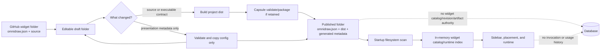
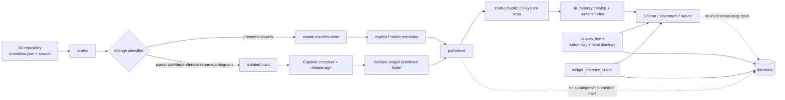
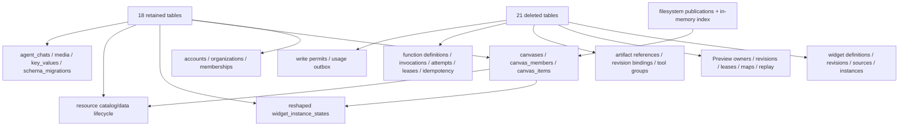

# E41 - widgets: filesystem-first publication and database hard cut
[Overview](../BASED.md)

Design the intentional breaking cut from database-backed widget definitions,
revisions, artifacts, Preview authority, function invocation history, and usage
accounting to a filesystem-first widget model. A widget repository must be
portable by itself: authored code plus `omnidraw.json` is the complete source
of truth, publication copies the built `dist/` plus minimal generated metadata
into a published filesystem tree, and application startup reconstructs the
widget catalog and runtime entirely from those folders.

This is an exploration and implementation-plan task. Do not implement the cut
while answering it. Produce a final deletion inventory, filesystem contract,
manifest contract, migration policy, and ordered follow-up tasks before code is
changed.

## New requirements

These requirements are fixed unless the user explicitly changes them:

1. Widget repositories will be shared through GitHub and must be downloadable
   and runnable without exporting an Omnidraw database.
2. `omnidraw.json` alone owns widget-authored identity, description, icon,
   tool label, tool group, priority, runtime requests, resources, and all other
   portable widget metadata.
3. The database must not be a second widget source of truth. Database copies,
   projections, active revision pointers, artifact references, and publication
   records must be removed rather than retained as an authoritative cache.
4. Editable widgets live as ordinary filesystem folders containing their
   manifest and code.
5. Publishing code builds the widget and copies the released `dist/` plus only
   required generated runtime metadata into a separate published folder.
6. A source-code or executable-contract change requires a new build/publish.
7. A presentation-only metadata change must update configuration without
   rebuilding `dist/` or reconstructing a Capsule artifact.
8. Application startup must discover and validate drafts and publications from
   the filesystem. Empty database widget tables must not make widgets vanish.
9. Perform a hard database prune. Do not keep compatibility readers, dual
   writes, migration-era tables, or unused generic infrastructure merely to
   preserve the current model.
10. Remove durable function invocation and usage data. The exact remaining
    synchronous function capability, if any, is an explicit question below.

## Why the current model conflicts

The current architecture deliberately chose the opposite authority:

- [`S106`](../s/S106.md) removed published source folders and made database
  revisions plus content-addressed source/UI/server artifacts authoritative.
- [`llm.widget-system.md`](../../docs/internal/llm.widget-system.md) describes
  published definitions, immutable revisions, source artifacts, Preview
  revisions, artifact references, function invocations, resource bindings,
  instance state, idempotency, and usage records as durable database-backed
  authorities.
- [`packages/widget-contract/src/local/WidgetArtifactConstructionCache.ts`](../../packages/widget-contract/src/local/WidgetArtifactConstructionCache.ts)
  keys executable construction from the complete source digest and complete
  canonical manifest. Consequently an icon edit currently invalidates the
  executable construction even though Capsule does not use the icon.
- [`packages/capsule-omnidraw/src/build/WidgetArtifactBuilderCapsule.ts`](../../packages/capsule-omnidraw/src/build/WidgetArtifactBuilderCapsule.ts)
  passes that complete source digest into the external distribution provenance
  and binds source, manifest, UI, server output, and build identity into one
  construction contract.
- [`packages/service-agent/src/widget-management/WidgetManagement.ts`](../../packages/service-agent/src/widget-management/WidgetManagement.ts)
  retains icon/group patch APIs but rejects them because manifest v3 no longer
  exposes tool metadata.
- [`packages/service-agent/src/widget-management/fn.widget-management.ts`](../../packages/service-agent/src/widget-management/fn.widget-management.ts)
  therefore projects every widget icon and group as `null`.

Capsule requires a closed compiled distribution and exact artifact bytes for
safe browser execution. Capsule does **not** require database definitions,
database revision pointers, database artifact metadata, a full-source cache
key, durable Preview rows, invocation history, usage accounting, or a
database-backed publication catalog. The exploration must preserve only the
smallest Capsule boundary that is still required to run untrusted widget UI.

## Direction to evaluate

The intended hard-cut flow is:



A directional layout to validate is:

```text
<data-root>/widgets/
  drafts/
    <widget-key>/
      omnidraw.json
      package.json
      lockfile
      ui/
      server/                 # only if server functions survive the cut
      shared/
      dist/                   # generated and replaceable

  published/
    <widget-key>/
      omnidraw.json           # exact published authored configuration
      dist/                   # exact released browser distribution
      server-dist/            # only if server functions survive the cut
      release.json            # generated checksums/format; never author data
      capsule.artifact        # only if Capsule needs a packaged envelope
```

The final exploration may change names and nesting, but it must keep authored
configuration in `omnidraw.json`, generated output visibly separate, and all
restart authority on the filesystem.

## Plan

### 1. Freeze the product and portability contract

- Define exactly what “download and run a widget from GitHub” means: clone,
  import/copy, dependency installation, build, validation, publication, and
  first mount.
- Define the complete `omnidraw.json` schema for portable presentation and
  runtime metadata. At minimum cover name, slug/key, description, icon, tool
  label, tool-group reference, priority, UI entry, Capsule API requests,
  budgets, state mode, optional server entry, and resource requirements.
- Reuse `TOmnidrawToolIcon` and the existing Lucide picker/renderer, while
  bounding custom icon size and preserving render-time SVG sanitization.
- Decide missing tool-group behavior for a downloaded repository. A portable
  manifest cannot contain a local database group ID.
- State that generated `release.json`, checksums, Capsule metadata, and build
  identities are derived output and may be deleted/recreated; they never add
  authored semantics absent from `omnidraw.json`.

### 2. Specify the draft and published filesystem authorities

- Choose the exact data-root layout, safe widget key, directory naming,
  collision rules, case sensitivity, and path-confinement rules.
- Define whether draft folders are the imported Git repositories themselves or
  application-owned copies of them.
- Define the published folder atomically: required files, optional files,
  checksums, manifest copy, dist shape, version marker, and completion marker.
- Define how a release is staged in a temporary sibling, validated completely,
  and renamed into place so startup never observes a partial publication.
- Define deletion, archive, rename, duplicate slug, corrupt folder, incomplete
  release, and interrupted filesystem operation behavior.
- Define whether startup scans once, watches the folders, or combines a scan
  with explicit in-process invalidation after edits and publication.
- Build one pure scanner/projection contract that turns filesystem entries into
  the catalog/detail/placement DTOs without consulting widget database rows.

### 3. Split authored-source changes from executable changes

- Define an explicit change classifier with at least:
  `presentation-only`, `executable`, `dependency`, `resource-contract`,
  `identity`, `invalid`, and `ambiguous`.
- Define a canonical build-relevant manifest projection. Presentation-only
  fields must not enter the executable-input digest.
- Define the executable-input digest from build-relevant manifest fields and
  every file that the build is allowed to read.
- Prevent widget code and project build scripts from treating the original
  presentation-bearing `omnidraw.json` as executable input. Either omit it from
  the build tree or replace it with a canonical build-only projection.
- Treat any unclassified or ambiguous change as executable and rebuild; never
  silently reuse output when equivalence is unproven.
- Add pure comparison tests proving icon, description, label, group, and
  priority changes preserve executable identity while code, lockfile, build
  config, API requests, budgets, server declarations, and resource contracts
  invalidate it as intended.

### 4. Define metadata-only editing and publication

- Add icon and tool-group editing to the widget Config screen using the
  existing picker and the scanned filesystem catalog.
- Save authored metadata to the draft `omnidraw.json` through a confined atomic
  write with optimistic file/digest fencing.
- Define when and how the published manifest copy is updated without touching
  `dist/`, server output, or Capsule bytes.
- Verify the existing published output still matches the new manifest's
  build-relevant projection before config-only promotion.
- Decide whether metadata-only changes are immediately reflected in the
  published folder or require an explicit lightweight **Publish metadata**
  confirmation.
- Dispatch an in-memory/filesystem catalog invalidation event after the write;
  no application rebuild or restart should be required.
- Keep downloaded repository behavior deterministic: copying the repository to
  another machine must yield the same icon/group/label before any database is
  created.

### 5. Reduce Capsule to the required execution boundary

- Document the minimum Capsule requirement: compile source into a closed
  external distribution, validate/package exact executable bytes, and verify
  them before mounting.
- Decide whether `published/<widget>/dist/` stores the Capsule-ready external
  distribution, a Capsule artifact file, or both.
- Remove full authored-source identity and presentation metadata from Capsule
  construction identity. Capsule provenance should identify the exact
  executable input, not unrelated repository metadata.
- Decide whether publication signing is required in the single-machine OSS
  product, whether published artifacts are signed once, and whether Preview
  uses unsigned local construction under an explicit policy.
- Eliminate Preview/publication artifact promotion machinery that exists only
  because bytes are database-addressed, while retaining any exact-byte review
  promise the product still wants.
- Make hardened builds the default for third-party GitHub widgets or explicitly
  document the trust boundary. Capsule isolates browser execution but does not
  make dependency installation and project-controlled build scripts safe.

### 6. Inventory and hard-prune the database

- Generate an authoritative table/column/index/trigger/foreign-key inventory
  from the current schema and map every row to a live product requirement and
  code owner.
- Classify every table as `keep`, `move to filesystem`, `replace with ephemeral
  memory`, or `delete`. “Maybe useful later” is not a keep reason.
- Start with the following deletion candidates and prove each remaining caller
  is removed or redirected:
  - `widget_definitions`;
  - `widget_definition_revisions`;
  - `widget_revision_sources`;
  - `artifact_references` and widget artifact retention/GC metadata;
  - Preview owner/revision/source-map/resource-binding/mount-lease tables;
  - widget publication replay/idempotency tables;
  - widget revision resource-binding tables;
  - `function_definitions`;
  - `function_invocations`;
  - `function_attempts`;
  - `invocation_leases`;
  - function invocation idempotency records;
  - `usage_outbox` and all widget/function usage receipts or billing records;
  - widget-instance definition/revision bookkeeping that duplicates the canvas
    item's filesystem-resolvable widget reference.
- Audit `widget_instances` and `widget_instance_states` separately. Determine
  whether “no widget data in the database” removes both, or only removes widget
  catalog/build/publication data while preserving user-authored instance state.
- Audit `tool_groups`: decide whether groups become filesystem configuration,
  implicit names derived from widget manifests, or remain non-widget global
  application preferences.
- Audit resource catalog/data tables independently. Removing widget bindings
  does not automatically authorize deleting user resources.
- Delete dead stores, services, APIs, events, contracts, migrations, schema
  expectations, recovery loops, test fixtures, scripts, package exports, and
  documentation together with their tables.
- Produce before/after table counts and a dependency graph proving there are no
  orphaned foreign keys or generic abstractions retained for deleted features.

### 7. Remove function invocation and usage persistence

- Remove invocation creation, queueing, attempts, leases, retries, cancellation
  records, log history, output history, idempotency rows, recovery sweeps, usage
  metering, usage outbox publication, and corresponding API inspection screens.
- Decide whether server functions are removed completely or reduced to a
  direct short-lived request/response execution path with no durable history.
- If direct execution remains, define its timeout, cancellation, resource
  access, error transport, concurrency, and process cleanup without recreating
  invocation persistence under another name.
- Remove UI tabs and statuses that promise durable function logs or invocation
  history when the backing records no longer exist.
- Remove packages/services that become empty after the cut rather than leaving
  compatibility shells.

### 8. Rebuild startup, catalog, placement, and runtime resolution

- On startup, scan and validate the published tree before serving catalog or
  placement requests.
- Build an in-memory index keyed by the chosen portable widget key and include
  manifest, paths, executable checksum, runtime metadata, health, and errors.
- Resolve sidebar rows, mentions, tool groups, detail pages, files, placement,
  and runtime loading from that index.
- Define how canvas items refer to published filesystem widgets without a
  database definition/revision foreign key.
- Decide whether existing canvas instances follow the current published folder
  or remain pinned to a versioned published subfolder/checksum.
- Ensure missing or corrupt published folders fail visibly and locally without
  corrupting unrelated canvas state.
- Rebuild the index after filesystem edits atomically and reject stale results
  with a lightweight generation/digest fence.

### 9. Choose the destructive cutover policy

- Determine whether this unreleased state permits deleting current local
  widget rows and artifact blobs with no migration.
- If any real user data exists, define one explicit export-to-filesystem command
  before schema removal. Do not add permanent dual reads or startup import.
- Decide whether old widget tables are dropped in edited baseline migrations or
  one destructive migration, based on the repository's actual release state.
- Define cleanup of existing content-addressed blob files after database
  references disappear, including an operator-visible dry run and exact roots.
- Preserve unrelated canvases/resources/accounts while deleting widget,
  invocation, and usage data.
- Provide a rollback boundary for the application release itself; do not
  promise rollback of data that the approved hard cut intentionally deletes.

### 10. Split implementation into deletion-first follow-up tasks

- Produce small follow-up Addition/Subtraction/Debt tasks with explicit
  dependency order.
- Prefer deleting database/runtime authority before rebuilding UI on top of a
  transitional dual model.
- Give every follow-up a negative-code target: tables, services, contracts,
  and recovery paths that must disappear.
- Add one end-to-end clean-home fixture containing only filesystem widgets and
  an empty/new database.
- Finish by rewriting `llm.widget-system.md`, `SCREENS.md`, package guidance,
  schema expectations, and `FILES.md` to describe the smaller model only.

## Exploration answer

### Final product decisions

The cut should use one current publication per portable widget key. It should
not retain revision directories, active pointers, rollback history, or artifact
GC. A canvas item stores the manifest `slug` as `widgetKey`, so every instance
of that key follows the current validated publication after a publish and
runtime-generation swap. This is the smallest model consistent with the fixed
requirements.

Drafts and publications are organization-scoped ordinary directories. A Git
checkout may live directly in the managed draft directory. Importing a checkout
from anywhere else copies it into that directory; Omnidraw does not retain an
external symlink or an unconfined linked-worktree mode. The repository remains
usable with normal Git tooling after import.

Presentation saves and executable publication remain separate actions:

- **Save config** atomically writes the draft `omnidraw.json` only.
- **Publish metadata** is an explicit lightweight confirmation that atomically
  replaces the published manifest after proving its executable projection still
  matches `release.json`. It never invokes npm, the project build, Capsule
  construction, or release signing, and it does not write any file under
  `dist/`, `server-dist/`, or `capsule.artifact`.
- **Publish code** captures the source, builds a closed distribution, constructs
  and signs Capsule bytes, validates the whole staged publication, and swaps the
  current folder.

Published-only widgets may use **Edit presentation**. That operation performs
the same lightweight manifest promotion against the existing release. It does
not manufacture an editable source draft. Source editing remains unavailable
until a repository is imported or a draft is reconstructed by the one-time
migration utility.

Preview remains a full UI/server confidence path but loses all durable control
records. An active process owns Preview builds, source maps, signing, live
diagnostics, selected resources, and mounted handles. A canvas Preview frame
persists only the draft `widgetKey` and presentation geometry. After restart it
shows **Preview stopped — build again**; it never claims to have remounted an
old exact revision.

Server functions survive only as bounded, direct request/response execution.
There is no durable invocation identity, queue, retry, attempt, lease, replay,
cancellation record, log record, result record, usage receipt, or recovery
sweep.

### Filesystem contract

The exact organization-local tree is:

```text
<home>/organizations/<org-id>/widgets/
  drafts/
    <slug>/
      omnidraw.json
      package.json
      package-lock.json          # or the one supported lockfile
      ui/
      server/                    # optional
      shared/                    # optional
      dist/                      # generated closed browser distribution
      server-dist/               # generated; optional

  published/
    <slug>/
      omnidraw.json              # exact authored published configuration
      dist/                      # exact closed browser distribution
      server-dist/               # optional exact server distribution
      functions.json             # generated; only with server-dist
      capsule.artifact           # exact release-signed Capsule bytes
      release.json               # generated integrity/completion envelope

  .staging/                      # ignored incomplete operations
  .trash/                        # recoverable explicit deletions/replaced dirs
  .quarantine/                   # explicit doctor/import quarantine results
  .preview/                      # process-owned, disposable Preview output
  .writer.lock                   # one writer for this organization widget root
```

Rules:

1. `slug` is the portable key and directory name. It is lowercase ASCII
   kebab-case, 1-100 bytes, and the manifest value must equal the folder name.
   This removes case-folding ambiguity on macOS and Windows.
2. Display names need not be unique. One draft and one publication may share a
   slug because they are the editable/published variants of the same portable
   widget. A second draft repository or second publication for that slug is a
   collision; import, create, or rename refuses it without overwrite.
3. Every resolved path must remain below a pinned organization widget root.
   Symlinks, junctions, special files, traversal, absolute manifest paths,
   case-colliding entries, and path replacement during an operation fail
   closed.
4. Draft-only slug rename is one fenced manifest-and-directory operation.
   Published slugs are immutable; changing one means importing/publishing a new
   widget key and deliberately rebinding or replacing canvas items.
5. Published folders are managed output. Direct user edits are treated as an
   external replacement and are not adopted by a running catalog. Adoption
   requires explicit **Refresh and validate** or import.
6. Draft deletion and publication deletion move the exact folder to `.trash/`
   before catalog invalidation. Publication deletion is blocked while canvas
   items reference the key unless the user confirms **Force delete**. Forced
   deletion preserves those canvas items as missing-widget frames.
7. Archive is a move out of the scanned tree into `.trash/archive/`; there is
   no durable archive status. Restore revalidates before moving it back.
8. A startup scan ignores dot-prefixed operation directories. A named corrupt
   draft/publication remains visible as an unhealthy catalog entry with its
   local error; it cannot be placed or mounted. `doctor --quarantine` performs
   the optional move to `.quarantine/`.
9. Startup scans once. Omnidraw saves, imports, deletes, and publishes issue an
   explicit generation invalidation. External editor/Git changes require the
   Refresh action or `omnidraw widget refresh`; no recursive watcher is part of
   the first cut.
10. The scanner is a pure projection over bounded filesystem observations. It
    returns valid entries, unhealthy entries, and a generation digest. Catalog,
    detail, Files, mentions, groups, placement, and runtime all consume that one
    projection and never query widget rows.

Full publication uses a unique same-filesystem `.staging/<slug>-<nonce>`
directory. It writes and syncs every output, writes `release.json` last,
reopens and verifies the complete stage, renames any current folder into
`.trash/replaced-<slug>-<nonce>`, and renames the stage to `published/<slug>`.
The two-directory rename has a possible *missing* interval on platforms that
cannot atomically replace a non-empty directory, but never a partial visible
release. The in-process catalog swaps only after the final rename. Startup can
restore the one validated replaced folder when it finds a crash in that
interval; ambiguous candidates require `doctor` rather than guessing.

`release.json` is the completion marker. No extra `COMPLETED` file or random
release ID is needed. Metadata promotion is a single atomic
write-sync-rename of `omnidraw.json`; `release.json` deliberately excludes a
full-manifest digest so presentation edits do not require a second coordinated
write.

### Authority table

| Concern | Durable authority after E41 | Derived/ephemeral data |
| --- | --- | --- |
| Widget identity and presentation | Draft/published `omnidraw.json` | In-memory catalog rows and implicit group buckets |
| Editable source and dependencies | `drafts/<slug>/` | Captured build staging and dependency cache |
| Current executable publication | `published/<slug>/dist/`, optional `server-dist/`, and `capsule.artifact` | Verified runtime handle |
| Release integrity/runtime projection | `release.json`, derived only | Startup validation result and health |
| Catalog, detail, files, mentions, placement | None | One filesystem scan/index |
| Preview | Draft source plus its canvas frame's `widgetKey` | `.preview/`, builds, source maps, diagnostics, signing, bindings, mounts |
| Canvas widget reference and concrete resource selection | `canvas_items.item_json` | Runtime provider objects |
| Collaborative widget-instance JSON state | Reshaped `widget_instance_states` | Subscriptions and sessions |
| Resource catalog and resource data | Existing resource tables and resource files | Direct-call permits and active-use coordination |
| Function definitions | `functions.json` beside `server-dist/` | Validated in-memory direct-call registry |
| Function calls, logs, results, usage | None | Live request, bounded response diagnostics, process stderr |
| AI chat history | Existing chat record/files | Draft association resolved by `widgetKey` and workspace mount |



### Strict portable `omnidraw.json` v4

Manifest v4 is a breaking schema. Unknown fields are rejected. Every scaffold
includes the stable versioned schema URL.

```json
{
  "$schema": "https://omnidraw.dev/schemas/widget/v4.json",
  "schemaVersion": 4,
  "name": "Counter",
  "slug": "counter",
  "description": "A collaborative counter.",
  "tool": {
    "label": "Counter",
    "icon": { "lucidIcon": "Gauge" },
    "group": "utilities",
    "priority": 0
  },
  "ui": {
    "runtime": "capsule",
    "entry": "ui/main.ts",
    "apis": ["DOM"],
    "budgets": {
      "cpuMs": 20,
      "memoryBytes": 33554432
    },
    "state": {
      "collaborative": true,
      "localStore": "none"
    },
    "parkability": { "enabled": false }
  },
  "server": {
    "entry": "server/main.ts",
    "runtimeAbi": "bun-v1"
  },
  "resources": [
    {
      "slot": "todos",
      "kind": "kv",
      "effect": "read_write",
      "required": true
    }
  ]
}
```

The exact contract is the current manifest-v3 runtime contract plus these
presentation decisions:

- `$schema` is the literal v4 URL and `schemaVersion` is `4`.
- `name` is 1-200 trimmed Unicode characters; `slug` follows the filesystem
  rule; `description` is required and 1-2,000 characters.
- `tool` is required. `label` is 1-120 characters, `group` is either a portable
  lowercase kebab-case string or `null`, and `priority` is an integer from
  -1,000 to 1,000. Priority orders widgets inside a group; group buckets sort
  by their derived display label.
- A group is only a string. There is no group ID, registry row, group icon, or
  separately authored group order. The scanner implicitly creates a display
  bucket and derives `utilities` as `Utilities`. This makes a repository
  portable without cross-repository group-definition conflicts.
- `tool.icon` is optional and reuses `TOmnidrawToolIcon`. `lucidIcon` uses the
  schema's pinned Lucide catalog. `svgIcon` supports sanitized SVG or one text
  grapheme and is capped at 16 KiB UTF-8. At least one member is required when
  `icon` is present. Render-time DOMPurify sanitization remains mandatory even
  after save-time validation.
- An unavailable Lucide key is an explicit `unsupported-icon-key` manifest
  error on an older host; it is never silently replaced. Authors needing wider
  compatibility use a bounded `svgIcon`. The versioned schema publishes its
  Lucide catalog compatibility.
- `ui`, Capsule API requests, all budget fields, state, parkability, optional
  `server`, and `resources` keep the current strict v3 shapes and limits.
  Resource declarations contain portable slot requirements and effect ceilings,
  never local resource IDs.
- Widgets are always placement tools. The old `mode | action | modal` behavior
  vocabulary is deleted rather than added to v4.
- Server function descriptors remain generated from the built server exports
  and are stored in `functions.json`; they are not a second authored manifest.

`$schema`, `name`, `description`, and the whole `tool` object are presentation
fields. `slug` is identity. `ui`, `server`, `resources`, and `schemaVersion` are
executable-contract fields.

### Change classifier and executable identity

The classifier returns exactly one of these results:

| Class | Examples | Required action |
| --- | --- | --- |
| `presentation-only` | `$schema`, name, description, tool label/icon/group/priority | Atomic config save; optional lightweight metadata promotion |
| `identity` | `slug` or folder name | Draft-only atomic rename; published identity requires new publication/rebinding |
| `executable` | UI/server/shared source, UI entry, APIs, budgets, state, runtime request | Rebuild and publish |
| `dependency` | lockfile, dependency/package metadata, build script/config/plugin | Reinstall, rebuild, and publish |
| `resource-contract` | slot, kind, required/effect/operation ceiling | Rebuild, reselect bindings, and publish |
| `invalid` | Schema/path/size/symlink violation | Refuse save/build/publish |
| `ambiguous` | Any changed build-visible file or environment input not proven equivalent | Rebuild and publish |

The canonical build-relevant manifest projection is:

```json
{
  "schemaVersion": 4,
  "ui": "<canonical ui object>",
  "server": "<canonical server object or null>",
  "resources": "<canonical slot-sorted array>"
}
```

Its SHA-256 is `executableManifestDigestSha256`. The executable-input digest is
SHA-256 over a versioned binary framing of:

1. the canonical build-relevant manifest bytes;
2. normalized POSIX relative path, byte length, and exact bytes for every
   regular file visible in the build staging tree; and
3. the canonical builder environment identity: package-manager/lock format,
   SDK/import map, host-controlled transforms, runner image or host toolchain,
   platform/architecture, Capsule build identity, build policy, and server ABI.

The build snapshot copies all regular draft files except fixed generated or
control roots (`.git/`, `.omnidraw/`, `dist/`, `server-dist/`, package caches,
and OS noise). It rejects symlinks. `omnidraw.json` is not copied. Instead the
builder receives a generated `.omnidraw/build-manifest.json` containing only
the canonical build-relevant projection. The build always runs in that staged
tree, not the mutable repository. Therefore guest code and build scripts cannot
make presentation fields executable inputs by reading the original manifest.

A full-source digest is still useful for stale-write fences, but it is not the
Capsule construction identity. Pure tests must prove every presentation field
keeps executable identity while source, lockfile, build config, APIs, budgets,
state, resources, server declarations, toolchain, Capsule policy, and platform
changes invalidate it. Signing-key rotation is a release-policy change and
requires a fresh code publication in the first cut; no unsigned release cache
is retained just to support re-signing.

Metadata promotion may reuse existing output only when the new executable
manifest digest equals `release.json` and the current host accepts that
release's inspected Capsule/runtime compatibility. A newer but compatible host
does not force a rebuild. An incompatible Capsule ABI, SDK contract, build
policy, platform target, or signature policy blocks metadata promotion and
requires code publication.

### Minimal Capsule, dist, and release contract

Capsule remains mandatory for every third-party/downloaded widget UI. `dist/`
means the project's exact closed ES-module/assets distribution. Capsule consumes
that directory and produces the separate `capsule.artifact` required by the
browser runtime. `server-dist/` and `functions.json` exist only when `server`
exists. Published source maps are not retained.

Release signatures remain required because the existing Capsule mount verifies
signed exact bytes. The release key is installation-local and signs once during
code publication. Preview uses the existing distinct local Preview signing
policy over the exact unsigned construction, but its signed bytes and key use
are ephemeral and never enter the database. Publish reuses the exact validated
closed `dist/`, server output, descriptors, and unsigned Capsule construction
when their executable-input digest still matches; release signing may change
the signature envelope but does not rerun guest code.

`release.json` is strict and contains only:

```json
{
  "format": "omnidraw.widget-release.v1",
  "complete": true,
  "executableManifestDigestSha256": "<64 lowercase hex>",
  "files": [
    { "path": "dist/main.js", "byteSize": 123, "sha256": "<64 hex>" },
    { "path": "capsule.artifact", "byteSize": 456, "sha256": "<64 hex>" }
  ],
  "capsule": {
    "path": "capsule.artifact",
    "artifactHash": "sha256:<64 hex>",
    "runtime": "<strict current runtime descriptor>"
  },
  "server": null
}
```

When present, `server` contains only the `server-dist/` entry, runtime ABI,
`functions.json` path, and their digests. `files` lists every regular file below
`dist/` and `server-dist/` plus `functions.json` and `capsule.artifact`, sorted
by path. There is no timestamp, revision number, database ID, source artifact
ID, active pointer, retention state, random release ID, or authored field.
Every field is recomputable from the published manifest, exact published bytes,
the Capsule inspector, and deterministic host runtime constants.

Startup permits only `omnidraw.json`, `release.json`, the listed runtime files,
and explicitly recognized OS noise such as `.DS_Store`; any other entry,
symlink, or special file makes that publication unhealthy. It verifies the
strict manifest, folder key, executable projection, complete file set and
checksums, Capsule artifact hash/signature/runtime descriptor, server/function
contract, and current host policy before indexing the widget.

Downloaded repositories may still contain lifecycle and project build scripts.
Remote GitHub imports are marked untrusted and default to the implemented
Docker/isolated runner; host execution requires an explicit operator trust
decision stored as local security configuration, never in `omnidraw.json` or
release metadata. A clean installation without an available isolated runner
may import and inspect the repository but must ask for explicit trust before a
host build. Capsule protects browser execution only; it does not make install,
build scripts, or server code safe.

### Database disposition and deletion inventory

The current expected schema contains 39 tables, 510 columns, 101 foreign keys,
and 79 indexes. The approved target deletes 21 tables, 361 columns, 68 foreign
keys, and 54 indexes before the two retained widget-adjacent tables are
reshaped. The final schema has exactly 18 tables and no more than 25 indexes: a 54%
table reduction, 71% column reduction, 67% foreign-key reduction, and 68% index
reduction. The final migration tests must assert the exact new counts rather
than treating these estimates as documentation only.

| Current table | Decision | Owner/dependency action |
| --- | --- | --- |
| `accounts` | Keep | Account/authentication authority; outside widget cut |
| `agent_chats` | Keep, simplify references | `AgentAuthoringStoreTurso` retains chat/session records; widget association resolves a filesystem key |
| `agent_drafts` | Delete | Draft folders and scanner replace DB draft identity, digest, status, and publication links |
| `agent_previews` | Delete | Process map plus canvas Preview frame replace durable owner/pointer/diagnostics state |
| `agent_preview_mount_leases` | Delete | Browser handle lifetime is process-local |
| `agent_preview_resource_bindings` | Delete | Live Preview selection is process-local; placed bindings live on canvas items |
| `agent_preview_revisions` | Delete | `.preview/` and current process hold disposable construction output |
| `agent_preview_source_maps` | Delete | Preview source maps are bounded temporary files |
| `artifact_references` | Delete | Published files own exact bytes; remove artifact store, retention, reconciliation, and GC |
| `canvas_items` | Keep, reshape | `CanvasItemStoreTurso` stores `widgetKey`, `instanceId`, and local resource selections; remove definition/revision projections/checks |
| `canvas_members` | Keep | Canvas authorization; outside widget cut |
| `canvases` | Keep | Canvas authority; broader persistence is out of scope |
| `db_resource_apply_runs` | Keep | User database-resource lifecycle; outside widget cut |
| `db_resource_backups` | Keep | User resource recovery; outside widget cut |
| `db_resource_draft_changes` | Keep | User resource schema work; outside widget cut |
| `db_resource_drafts` | Keep | User resource schema work; outside widget cut |
| `function_attempts` | Delete | Remove attempts, metrics, results, failure ownership, and retry state |
| `function_definitions` | Delete | Generated `functions.json` plus in-memory validation replace registration rows |
| `function_invocations` | Delete | Direct request/response has no durable call record |
| `idempotency_records` | Delete | Direct calls do not promise durable replay |
| `invocation_leases` | Delete | No queue/worker claim or recovery ownership remains |
| `key_values` | Keep | General application KV; not widget publication or widget usage |
| `media_files` | Keep | Canvas media authority; outside widget cut |
| `organization_memberships` | Keep | Authorization; outside widget cut |
| `organizations` | Keep | Tenant ownership and filesystem namespace; outside widget cut |
| `resource_bindings` | Delete/move | Concrete per-instance selection moves to `canvas_items`; manifest keeps only portable requirements |
| `resource_catalog` | Keep | User resources remain durable |
| `resource_encryption_keys` | Keep | Resource secret encryption; outside widget cut |
| `resource_placements` | Keep | Resource file placement; outside widget cut |
| `resource_write_permits` | Delete/replace ephemeral | Direct-call effect token is single-use memory scoped to the live child process |
| `schema_migrations` | Keep | Database upgrade authority |
| `tool_groups` | Delete | Manifest group strings create implicit in-memory buckets; remove group CRUD APIs/dialogs |
| `usage_outbox` | Delete | Remove widget/function/resource-permit usage receipts and billing import |
| `widget_definition_revisions` | Delete/move | Current published folder plus `release.json` replaces immutable revisions |
| `widget_definitions` | Delete/move | Folder key plus manifest replaces definition/active-pointer catalog |
| `widget_instances` | Delete/move | Canvas item is the one durable instance/placement identity |
| `widget_instance_states` | Keep, reshape | Preserve `WidgetStateService`; rekey by org/canvas/element/instance and FK to the canvas item instead of `widget_instances` |
| `widget_preview_publication_idempotency` | Delete | Filesystem publication lock/digest fence replaces durable replay |
| `widget_revision_sources` | Delete/move | Draft repository owns source; publications intentionally contain no source authority |

The retained `widget_instance_states` table is user-authored collaborative
instance data, not widget catalog/build/publication data. Its target key is
`(org_id, canvas_id, element_id)` with the stable `instance_id` recorded and a
foreign key to the exact canvas item. `WidgetStateService` first authorizes and
verifies the canvas item's current `instanceId`; a missing published folder
does not delete state.

Concrete resource selections are local user data and cannot be portable
manifest fields. A placed canvas item owns a bounded mapping from manifest slot
to `{ resourceId, allowRead, allowWrite }`. The runtime intersects it with the
current manifest requirement and generated function effect. Resource catalog,
data, encryption, placement, DbResource drafts/applies/backups, and active-use
coordination remain.

The generated canvas columns/checks for `definitionId` and `revisionId`, every
revision FK, `WidgetControlStoreTurso`, `FunctionControlStoreTurso`, Preview
methods in `AgentAuthoringStoreTurso`, artifact-read capabilities, blob store,
artifact GC/reconciliation, publication/Preview services, recovery loops,
expected-schema entries, migrations fixtures, package exports, tests, and API
contracts must be removed with their tables. `AgentAuthoringStoreTurso` should
shrink into a chat store rather than retain dead draft/Preview methods.

`artifact_references` and `<organization>/artifacts/blobs/` are widget-only in
the current code: `LocalWidgetArtifactStore` and `WidgetService` are their live
owners. The cut deletes the store and only the exact `artifacts/blobs/` subtree,
never the broader organization artifacts directory.



### Direct server-function contract

The public function surface becomes one awaited `invoke` operation. It resolves
the caller's current canvas item, current published widget folder,
`functions.json`, exact `server-dist/` checksum, and local canvas resource
selections before spawning the child. It then:

- validates input and output schemas and the `fn | fx | tx` effect ceiling;
- applies the descriptor timeout with a hard product maximum of 30 seconds;
- admits only a bounded number of live children and returns
  `RESOURCE_EXHAUSTED` instead of creating a durable queue;
- forwards the live request's abort signal, sends termination, waits at most two
  seconds, then force-kills and reaps the child;
- performs no automatic retry, including for `fn` and `fx`;
- gives `fx`/`tx` only captured resource gateways, with single-use in-memory
  write tokens for `tx` and the existing manifest/function effect intersection;
- returns bounded result/error data and at most 64 KiB of diagnostic stdout/
  stderr with that response; operator stderr may also receive redacted logs;
  and
- forgets the call immediately after settlement.

There is no durable idempotency for writes. The UI/SDK must not retry a write
after an ambiguous transport failure. If the product later needs durable
exactly-once effects, that is a new explicit system rather than a hidden return
of `idempotency_records`.

The `function.get`, `function.cancel`, invocation status polling, attempts,
retry/backoff, Runs, Logs, usage, and billing APIs disappear. The widget
**Runs** and **Logs** tabs disappear. **Functions** may remain only as a
read-only view of the currently validated generated descriptors; **Resources**
shows manifest requirements and selections on concrete canvas instances, not
revision bindings.

`packages/function-runtime` remains because it is a published boundary and is
still useful for the direct request/response sandbox, schema, cancellation, and
resource-gateway contracts. Its queue, lease, receipt, retry, and persistence
types are deleted as a breaking `src/` change with the required semantic
version bump. `FunctionControlStoreTurso` is deleted. `FunctionService` and the
sandbox driver shrink to direct execution. No whole remaining package is kept
as an empty compatibility shell.

Removing usage means removing all widget/function execution metering and every
resource-permit usage receipt. Capsule runtime budgets, resource storage limits,
and unrelated account/organization policies are safety limits, not usage
accounting, and remain.

### Canvas/runtime behavior

A committed widget canvas extension becomes conceptually:

```json
{
  "type": "widget-instance",
  "widgetKey": "counter",
  "instanceId": "<stable instance id>",
  "resourceBindings": {
    "todos": {
      "resourceId": "<local resource id>",
      "allowRead": true,
      "allowWrite": true
    }
  }
}
```

It stores no definition ID, revision ID, artifact ID, published path, or release
checksum. Runtime lookup captures the current in-memory catalog generation and
publication checksums, opens and verifies exact files, then rechecks the canvas
item and catalog generation before mounting. Publication invalidation destroys
and remounts handles for that key. Missing/corrupt folders render a local
repairable placeholder without changing geometry, resource selections, or
instance state.

One process may read a widget root while another process owns it, but only one
Omnidraw writer is supported per organization root. The writer takes
`.writer.lock` with exclusive creation, records a nonce and verifiable process
identity, and uses expected manifest/release digests for every write. A live or
ambiguous lock refuses mutation. Stale-lock removal is an explicit `doctor`
operation after proving the recorded process is gone; PID guessing never steals
the lock.

The Config screen compares the scanned draft and published manifests directly.
It labels presentation differences separately from executable differences and
offers **Publish metadata** only when the executable projection matches the
validated release. Metadata-only changes never need Preview.

### Destructive migration and blob cleanup policy

The repository cannot prove that every 0.5-era local installation is empty, so
the cut must assume real widget and instance data exists. There is one explicit
pre-upgrade command:

```text
omnidraw migrate widgets-to-filesystem --dry-run
omnidraw migrate widgets-to-filesystem --apply
```

The dry run inventories definitions, active revisions, source/artifact health,
draft folders, canvas references, state, bindings, invocation/usage row counts,
target paths, collisions, required rebuilds, and exact blob cleanup bytes. The
apply form:

1. takes the application/widget writer locks and a full control-database
   backup;
2. decodes each active published source artifact, materializes or verifies one
   draft folder, and rebuilds it through the new filesystem publisher because
   the old database did not retain the closed project `dist/` separately;
3. writes and verifies the current publication for each slug;
4. rewrites canvas items from definition/revision identity to `widgetKey` and
   local resource bindings, and rekeys instance state;
5. records a filesystem migration receipt containing only old database
   fingerprint, per-widget success/digests, and operator-approved losses; and
6. exits without dropping tables. Invocation/usage history is counted and then
   deliberately discarded, not imported into another store.

Any corrupt/missing source, collision, unresolved current publication, or
unmappable canvas reference blocks apply. The only bypass is a slug-specific
`--accept-widget-loss` acknowledgement recorded in the receipt; there is no
global silent force.

The application release adds one destructive upgrade migration after current
migration 006. Applied historical migrations are not rewritten because doing
so would invalidate existing checksums. Startup permits the destructive
migration only when widget rows are empty or the verified filesystem receipt
matches the pre-migration database fingerprint. The migration recreates
`canvas_items` and `widget_instance_states` in their smaller shapes, drops all
21 approved tables in foreign-key-safe order, and installs the exact final
schema contract. It never reads filesystem widgets into the database.

After filesystem publications and the schema migration verify, the migration
command owns a separate `--cleanup-blobs --dry-run/--apply` pass over only
`<organization>/artifacts/blobs/`. It validates the pinned root and migration
receipt, lists exact files/bytes, moves the subtree to the widget `.trash/`, and
deletes it only after a later explicit confirmation. No broad artifact,
organization, home, resource, media, or cache root is deleted.

Rollback means restore the pre-cut application binary, database backup, and
filesystem snapshot together. The new release does not promise application
rollback after the approved destructive migration and does not reconstruct
deleted invocation or usage history.

### Ordered follow-up tasks

These are proposed task IDs; create their leaf files only after E41 is approved.
They form one hard-cut release train and must not expose a production dual-read
state between tasks.

> **Later decision (2026-08-04):** This proposed list is superseded by the
> `[R]` entries in [BASED.md](../BASED.md) and their linked task files. The
> current group targets a 14-table single-user baseline, rewrites migrations in
> place, and does not build an exporter or migration 007. The
> [design report](../../docs/internal/widget-filesystem-design.md) is
> authoritative.

1. **A108 — widgets: manifest v4 and pure filesystem release contracts.** Add
   the strict schema, canonical executable projection, change classifier,
   bounded scanner, release validator, atomic writer primitives, and pure tests.
   Gate: no database dependency is permitted in these contracts; all metadata-
   only/executable classification tests pass.
2. **D6 — widgets: one-time filesystem export and destructive-upgrade
   preflight.** Build the dry-run/apply exporter, receipt, full-backup checks,
   canvas/state/binding rewrite plan, and exact blob cleanup inventory. Gate:
   a populated current-schema fixture exports or fails before mutation with an
   actionable reason; rerun is idempotent.
3. **A109 — widgets: atomic dist/Capsule filesystem publisher and ephemeral
   Preview.** Produce `dist/`, optional `server-dist/`, `functions.json`, signed
   `capsule.artifact`, and minimal `release.json`; replace durable Preview with
   process/temp ownership. Gate: exact construction reuse works without
   database artifacts, interrupted publication never exposes a partial folder,
   and untrusted imports default to the isolated runner.
4. **S135 — widgets: switch catalog/runtime/canvas authority and delete database
   widget/Preview/artifact/group infrastructure.** In one coordinated change,
   wire startup/catalog/placement/runtime to the filesystem index, reshape
   canvas item/state identity, move bindings to canvas items, add migration 007,
   and delete the 14 widget/Preview/artifact/group tables plus their stores,
   services, APIs, events, GC, fixtures, and exports. Gate: final schema has no
   forbidden tables or FKs and clean-home filesystem widgets mount with an empty
   widget-free database.
5. **S136 — functions: delete durable invocation and usage, retain direct
   execution.** Delete the remaining seven invocation/usage/permit tables,
   `FunctionControlStoreTurso`, queue/worker/recovery/idempotency/receipt code,
   and status/cancel/log APIs; slim `function-runtime` and `FunctionService`.
   Gate: direct read/write calls enforce timeout/cancellation/effects, write no
   durable rows, and leave no inspectable history after restart.
6. **A110 — widget inspector: filesystem Config, lightweight metadata publish,
   and implicit groups.** Use the scanned catalog, add bounded icon/group
   editing and digest-fenced manifest writes, show draft/published differences,
   and implement published-only presentation editing. Gate: a metadata publish
   invokes no package manager/build/Capsule operation and leaves every
   executable file byte-for-byte unchanged.
7. **S137 — widget UI/API cleanup.** Remove revision/pinning/rollback/artifact/
   persisted-Preview language, group CRUD, Runs/Logs/usage screens, and obsolete
   contracts/tests. Gate: repository search finds no public promise of durable
   revision, invocation, usage, or artifact authority.
8. **D7 — widgets: clean-home qualification and architecture rewrite.** Add the
   complete end-to-end/fault matrix, rewrite `llm.widget-system.md`,
   `SCREENS.md`, package guidance and schema expectations, update `FILES.md`,
   and remove the one-release migration utility when its support window ends.
   Gate: docs show one filesystem authority and the release qualification suite
   passes on Linux, macOS, and Windows filesystem semantics.

Negative-code targets are mandatory: A108-A110 may add the replacement, but the
release is not complete until S135-S137 remove all superseded stores, tables,
contracts, screens, and recovery paths. The feature branch may temporarily
contain both implementations for compilation, but no merged/deployed build may
select between database and filesystem widget authority.

### Superseded decisions

E41 explicitly reverses [`S106`](../s/S106.md) and the database artifact/
revision/publication parts of [`E34`](./E34.md). It supersedes durable Preview,
exact-revision pinning, publication replay, lease, and artifact-promotion
decisions in [`E40`](./E40.md), [`A96`](../a/A96.md),
[`A103`](../a/A103.md), [`S133`](../s/S133.md), [`B48`](../b/B48.md), and the
open readiness direction in [`B70`](../b/B70.md). It also supersedes the durable
queue, scale-to-zero invocation, usage, and billing portions of
[`E36`](./E36.md) and [`D1`](../d/D1.md) for the OSS product.

It does **not** reverse Capsule browser isolation from [`A87`](../a/A87.md),
centralized instance state from [`A91`](../a/A91.md), CanvasService authority,
or the resource catalog/data services. Sidebar grouping remains a product
feature, but its authority moves from `tool_groups` to portable manifest
strings. `llm.widget-system.md` sections 3-10 and 15-18 and the widget portions
of `SCREENS.md` must be rewritten rather than amended with compatibility notes.

## Resolved question ledger

All original Q01-Q66 are resolved below. The detailed contracts above are
authoritative when this compact ledger is abbreviated.

### Product and folder semantics

- [x] **Q01:** One current `published/<slug>` folder; no retained releases.
- [x] **Q02:** Yes. Every canvas instance follows the current publication.
- [x] **Q03:** Not applicable; no pinned release key or release GC exists.
- [x] **Q04:** Managed draft folder; a Git checkout may live there, while
  external imports are copied. No external linked mode.
- [x] **Q05:** Duplicate names are allowed; duplicate/case-colliding slugs are
  rejected without overwrite.
- [x] **Q06:** Published folders change only through atomic Omnidraw operations.
- [x] **Q07:** “Skip published” means skip heavyweight build/Capsule Publish,
  not skip the lightweight published-manifest write when the user confirms it.
- [x] **Q08:** Save draft first; require explicit **Publish metadata**.
- [x] **Q09:** Allow a lightweight published presentation edit, but no source
  editing until a draft repository exists.
- [x] **Q10:** Startup scan plus explicit invalidation/Refresh; no watcher in the
  first cut.

### Manifest and metadata authority

- [x] **Q11:** Strict top-level `tool` object.
- [x] **Q12:** Keep label and integer priority.
- [x] **Q13:** Yes. Widgets use placement; delete legacy behavior fields.
- [x] **Q14:** Group is only a portable string; no group icon/order metadata.
- [x] **Q15:** Create an implicit in-memory display bucket; no warning or row.
- [x] **Q16:** Keep Lucide plus bounded sanitized SVG/one-grapheme custom icons.
- [x] **Q17:** Unknown pinned-catalog Lucide keys fail explicitly on older hosts.
- [x] **Q18:** Yes; publish a stable versioned schema URL in every scaffold.

### Build and Capsule boundary

- [x] **Q19:** Yes, Capsule remains required for third-party browser UI.
- [x] **Q20:** `dist/` is the closed project distribution; the final Capsule
  artifact is the separate `capsule.artifact`.
- [x] **Q21:** `release.json`, exact file digests, strict runtime descriptor,
  optional server/function descriptor paths, and the signed artifact.
- [x] **Q22:** Keep installation-local release signatures because current
  Capsule verification requires them.
- [x] **Q23:** Keep distinct Preview signing, but only in process/temp storage.
- [x] **Q24:** Reuse the exact validated dist/server/unsigned construction when
  unchanged, then apply release signing; do not rebuild merely to publish.
- [x] **Q25:** The draft build owns generated `dist/`; publication owns its exact
  managed copy.
- [x] **Q26:** Build from a staged tree that omits authored `omnidraw.json` and
  exposes only a generated build projection.
- [x] **Q27:** Yes, scripts remain supported inside the selected trusted or
  isolated runner.
- [x] **Q28:** Remote imports default to isolated Docker; host build needs
  explicit operator trust.
- [x] **Q29:** Reuse only if executable digest and current compatibility policy
  both pass; otherwise block and rebuild.
- [x] **Q30:** All listed inputs force rebuild except a host update explicitly
  declared compatible; signing-policy change also requires code publication in
  the first cut.

### Published integrity and recovery

- [x] **Q31:** Yes. Keep only completion, executable-manifest digest, exact file
  checksums, Capsule runtime projection, and optional server/function projection.
- [x] **Q32:** No non-recomputable/random ID is needed.
- [x] **Q33:** Reject unlisted entries except explicitly recognized OS noise.
- [x] **Q34:** Represent corruption in scanner health; move only through an
  explicit doctor/import quarantine action.
- [x] **Q35:** Same-filesystem staged directory, sync, two directory renames,
  and `release.json` written last as completion marker.
- [x] **Q36:** Product rollback is removed; transient replaced folders are crash
  recovery/trash, not a release history.
- [x] **Q37:** Back up/export the organization `widgets/` tree; restore into
  staging and validate before adoption. Draft Git repositories remain the
  preferred source backup.
- [x] **Q38:** Require explicit rescan/import and full validation for an external
  published replacement.

### Database hard cut

- [x] **Q39:** Delete `widget_instances`; retain and reshape
  `widget_instance_states` because it is user-authored instance data.
- [x] **Q40:** Shared durable state remains in `widget_instance_states` under
  `WidgetStateService`, keyed to the canvas item.
- [x] **Q41:** Canvas items remain in the database; broader canvas persistence is
  out of scope.
- [x] **Q42:** Remove `artifact_references` and its blob subsystem entirely.
- [x] **Q43:** Remove every Preview table. The canvas frame retains only enough
  identity to show a stopped Preview and build again.
- [x] **Q44:** Requirements stay in the manifest; concrete local selections move
  to canvas instance configuration.
- [x] **Q45:** Delete `tool_groups`; manifest strings create implicit groups.
- [x] **Q46:** Preserve account/organization/membership, canvas/member/item,
  resource catalog/data lifecycle, resource encryption/placement, media,
  general KV, chat, schema migration, and reshaped widget state tables.
- [x] **Q47:** Assume real data; require the explicit pre-upgrade export unless
  all relevant rows are proven empty.
- [x] **Q48:** Add a destructive upgrade migration after 006; do not rewrite
  applied historical migration checksums.
- [x] **Q49:** The migration command owns exact `artifacts/blobs/` dry-run,
  trash, and later deletion.
- [x] **Q50:** Target exactly 18 tables and no more than 25 indexes, deleting 21 tables,
  361 columns, 68 FKs, and 54 indexes; final tests pin exact counts.

### Function invocation and usage removal

- [x] **Q51:** Keep server functions, remove all durable invocation machinery.
- [x] **Q52:** Yes: one synchronous call, no retry/replay/history/result store.
- [x] **Q53:** Return bounded response diagnostics and write redacted operator
  stderr; retain nothing after settlement.
- [x] **Q54:** No durable idempotency and no automatic write retry.
- [x] **Q55:** Keep effect validation and use ephemeral single-use permits.
- [x] **Q56:** Delete widget/function metering and receipts; retain unrelated
  safety budgets and resource limits.
- [x] **Q57:** Delete get/status/cancel/log/attempt/usage APIs and Runs/Logs UI;
  retain only direct invoke and optional descriptor view.
- [x] **Q58:** Delete function control-store and queue subsystems; slim, do not
  delete, the still-public `function-runtime` package.

### Runtime identity, UX, and testing

- [x] **Q59:** Store portable manifest slug as `widgetKey`.
- [x] **Q60:** Render a missing-widget placeholder and preserve the canvas item,
  bindings, and instance state until the folder appears and validates.
- [x] **Q61:** Only one writer per organization widget root; exclusive root lock
  plus expected-digest fences replace DB CAS.
- [x] **Q62:** Compare scanned manifests and classify differences in Config.
- [x] **Q63:** No. Metadata-only edits never need Preview.
- [x] **Q64:** Delete immutable revision/pinning/rollback, artifact, durable
  Preview owner/revision/lease, invocation status/attempt/retry/log, usage, and
  group-registry language.
- [x] **Q65:** Start from a new 18-table database and a preseeded valid
  `published/<slug>` tree, then prove catalog, placement, mount, state, and
  direct function execution without creating a forbidden table.
- [x] **Q66:** Require clean/restart, missing/corrupt/extra-file/symlink,
  concurrent/stale edit, interrupted publish at every rename, metadata-only
  no-build, source/dependency rebuild, exact Preview reuse, GitHub import/trust,
  current-publication remount, direct-function cancellation/effects/no-history,
  state preservation, export rerun, destructive migration, blob dry-run, and
  cross-platform path/case tests.

## Required exploration outputs

The readable programmer-facing report is
[`widget-filesystem-design.md`](../../docs/internal/widget-filesystem-design.md).

- A final filesystem tree and authority table.
- A complete strict `omnidraw.json` proposal, including icon and grouping.
- A canonical change classifier and executable-input digest specification.
- A minimal Capsule/dist/release metadata contract.
- A table-by-table keep/move/delete decision with code-owner dependencies.
- A specific answer on whether server functions survive without durable
  invocations.
- A destructive migration/export policy.
- An ordered set of follow-up implementation tasks with acceptance gates.
- Updated architecture diagrams showing no widget database authority.

## TODOS

- [x] Answer Q01-Q66 and record explicit decisions.
- [x] Define the portable manifest and filesystem layouts.
- [x] Define presentation-only versus executable change detection.
- [x] Reduce the Capsule boundary to the minimum required files and metadata.
- [x] Inventory every database table and approve the hard deletion set.
- [x] Decide the remaining server-function execution model.
- [x] Decide destructive migration/export and blob cleanup policy.
- [x] Produce deletion-first implementation tasks and verification gates.
- [x] Identify which older tasks and architecture decisions E41 supersedes.

## Acceptance criteria

- The plan makes `omnidraw.json` plus widget code sufficient to move a widget
  through GitHub to a clean Omnidraw installation.
- Startup reconstructs every widget catalog/runtime fact from the filesystem
  without widget definition, revision, artifact, invocation, or usage rows.
- Metadata-only changes have a proven path that does not run npm, rebuild
  `dist/`, reconstruct Capsule output, or rewrite executable bytes.
- Source/executable changes produce and atomically install a new published
  `dist/` according to one documented rule.
- Every current database table has an explicit disposition and justification.
- Function invocation history, attempts, leases, retries, usage accounting, and
  their UI/API/recovery code have an explicit deletion plan.
- The remaining Capsule complexity is tied to an actual browser security
  requirement rather than database publication machinery.
- No compatibility database reader, database/filesystem dual authority, or
  indefinite migration bridge is proposed.
- All destructive consequences and unanswered product choices are visible
  before implementation begins.

## Non-goals

- Implementing the filesystem cut in this exploration.
- Preserving the current database artifact/revision model behind a feature
  flag.
- Designing a cloud marketplace, billing system, or managed multi-region
  deployment.
- Keeping invocation/usage infrastructure for hypothetical future use.
- Changing Capsule internals; this task may only reduce how Omnidraw consumes
  Capsule.

## NOTES

- This task intentionally reopens and is expected to supersede the
  artifact-authoritative direction in [`E34`](./E34.md), [`S106`](../s/S106.md),
  relevant parts of [`E40`](./E40.md), and the current widget-system document.
- A database may still persist unrelated application data. “Filesystem-first”
  applies specifically to widget source, publication, executable output,
  catalog, and the invocation/usage systems selected for deletion.
- A database index rebuilt from the filesystem at every start would still add
  complexity and is not the default proposal. Prefer an in-memory index unless
  measured startup scale proves it insufficient.
- No raster UI mockup is needed for this exploration. The important visual is
  the authority/data-flow diagram above; the existing Config screen already
  establishes the UI shell.

### LOGS

- 2026-08-04: Created the exploration plan from the widget icon/group
  investigation and the new filesystem-only authority, published-dist,
  metadata-only update, database hard-pruning, and invocation/usage removal
  requirements. No implementation exploration or code changes were performed.
- 2026-08-04: Completed the exploration. Resolved Q01-Q66; fixed one-current-
  publication and follow-current canvas semantics; specified manifest v4,
  filesystem/release/change-digest contracts, ephemeral Preview and direct
  functions; classified all 39 tables into an 18-table target; defined the
  destructive export/migration/blob policy; and ordered eight gated follow-up
  tasks. No implementation code was changed.
- 2026-08-04: Added the readable programmer report
  [`widget-filesystem-design.md`](../../docs/internal/widget-filesystem-design.md)
  with the target flow, authority rules, filesystem and manifest contracts,
  rendered 18-table schema, reshaped table SQL, essential complexity, failure
  behavior, migration, and acceptance checks.

---
