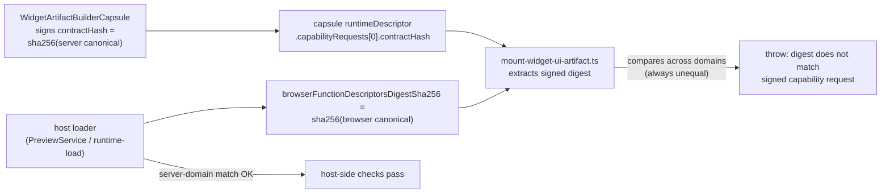

# E42 - widgets: server-function widget mount rejects builder-signed capability digest (a04fb57b regression)
[Overview](../BASED.md)

Every widget with ≥1 server function fails to mount in the SPA with
`Widget browser function descriptor digest does not match the signed capability request.`
The client mount compares the signed `contractHash` (server-descriptor digest,
new convention) against the browser-projection digest (old convention). The two
digests can never be equal, so server-function widgets are unmountable.
Browser-only widgets skip the check and render fine. Discovered 2026-08-05 via
an AI-authored draft (`PW KV Manager`); the widget code itself is healthy.
Next step for the assignee: reproduce this in a regression test first, then fix.

## Context

Observed symptom (draft Preview frame on canvas, see  in Plan):
the frame renders only the mount error text. The agent chat that produced the
widget is `.omnidraw/agent/pi/agent/chats/2026-08-05/2026-08-05T16-26-19-622Z--e480499b-03a0-48b9-8285-e9b732f54f30/`
(history `2026-08-05T16-26-19-642Z_019fd2bf-4a79-7b13-b611-fd731bcdd1b6.jsonl`,
widget workspace `workspace/widgets/PW KV Manager`). The agent validated
successfully (`od_widget_validate` → `previewExecution: passed`); the failure
only appears when the SPA mounts the artifact.

Two digest domains exist for the same `contractHash` field of the widget
server-function capability request:

- Server domain: `sha256(fnCanonicalizeWidgetServerFunctionDescriptors(...))`
  — format tag `omnidraw.server-functions.v1`, includes `modulePath` per
  descriptor. This is what the Capsule builder signs and what host-side
  verifiers check.
- Browser domain: `sha256(fnCanonicalizeWidgetBrowserFunctionDescriptors(...))`
  — format tag `omnidraw.browser-server-functions.v1`, `modulePath` stripped.
  This is what the client mount expects `contractHash` to equal.

The canonical strings differ by construction (different format tag and
modulePath presence), so the digests are always different whenever a function
request exists.

Relevant files:

- [packages/ui-ai-chat/src/widget-runtime/mount-widget-ui-artifact.ts](../../packages/ui-ai-chat/src/widget-runtime/mount-widget-ui-artifact.ts)
  — throws the observed error (~lines 158–166): extracts the digest from
  `request.contractHash` and compares it to
  `args.browserFunctionDescriptorsDigestSha256` (cross-domain equality).
  `verifyBrowserFunctionDescriptors` (~lines 100–117) is fine: same-domain
  check of received descriptors vs received browser digest.
- [packages/capsule-omnidraw/src/build/WidgetArtifactBuilderCapsule.ts](../../packages/capsule-omnidraw/src/build/WidgetArtifactBuilderCapsule.ts)
  (~lines 296–310) — signs the request with
  `descriptorDigestSha256: functionDescriptorsDigestSha256` (server domain),
  with an explicit intent comment: "The capability binds the exact generated
  functions.json contract. The browser receives the safe projection, but its
  selector must still identify the full descriptor file verified by the host."
- [packages/capsule-omnidraw/src/capabilities/fn.capability.ts](../../packages/capsule-omnidraw/src/capabilities/fn.capability.ts)
  (line 32) — embeds the passed digest verbatim:
  `contractHash: sha256:${descriptorDigestSha256}` and
  `id: omnidraw.widget.functions.h${descriptorDigestSha256}`.
- [packages/widget-contract/src/core/fn.function-descriptor.ts](../../packages/widget-contract/src/core/fn.function-descriptor.ts)
  — both canonicalizations and
  `fnWidgetServerFunctionCapabilityRequestMatches` (server-domain matcher,
  checks `request.contractHash === sha256:${descriptorDigestSha256}`).
- [apps/cli/src/services/WidgetPreviewService.ts](../../apps/cli/src/services/WidgetPreviewService.ts)
  `#assembleArtifact` (~lines 405–440) — host-side preview verifier; passes
  the server digest as `capabilityDigest`; consistent with the builder.
- [packages/api/src/widget/api.runtime-load-widget.ts](../../packages/api/src/widget/api.runtime-load-widget.ts)
  `runtimeBrowserFunctionContract` — host-side published verifier; same
  server-domain convention; returns the browser digest separately as
  `browserFunctionDescriptorsDigestSha256`.
- [packages/ui-ai-chat/tests/widget-runtime/mount-widget-ui-artifact.test.ts](../../packages/ui-ai-chat/tests/widget-runtime/mount-widget-ui-artifact.test.ts)
  — fabricates signed requests with the browser digest
  (`HASH_A = sha256:${browserFunctionDigest(functionMetadata)}`), i.e. encodes
  the old convention; that is why CI stays green while real builds fail.

Regression origin: `git show a04fb57b` ("wip: filesystem-first widget redesign
handoff") changed the builder from
`descriptorDigestSha256: browserFunctionDescriptorsDigestSha256` to
`descriptorDigestSha256: functionDescriptorsDigestSha256` and updated the
host-side verifiers, but left the client mount comparison and its unit tests
on the old convention.

## Plan

The immediate contract of this task is a red regression test that reproduces
the mount failure using the builder's real signing convention. The fix lands
only after the reproduction is green-on-red and reviewed.

### Step 1 — regression reproduction (next dev does this first)

1. Unit-level red test in
   [mount-widget-ui-artifact.test.ts](../../packages/ui-ai-chat/tests/widget-runtime/mount-widget-ui-artifact.test.ts):
   build the signed request exactly like the builder does —
   `descriptorDigestSha256 = sha256(fnCanonicalizeWidgetServerFunctionDescriptors(serverDescriptors))`
   via `createOmnidrawServerFunctionCapabilityContract` from
   `@omnidraw/capsule-omnidraw/capabilities` — then mount with the browser
   projection (`fnProjectWidgetBrowserFunctionDescriptors`) and its browser
   digest. Assert the current code rejects with the exact error string; after
   the fix, assert mount succeeds and bindings are created.
2. Integration-level red test: run the real pipeline
   `WidgetFilesystemBuildService.construct` + `sign('preview')` over a fixture
   widget with ≥1 server function (mirror `WidgetPreviewService.#assembleArtifact`
   mount view), feed the result into `createWidgetUiArtifactMountPort`, and
   assert the same failure. This pins builder and mount to one convention so
   they cannot drift silently again. Cover both `mode: 'preview'` and
   `mode: 'published'` (WidgetUiRuntime passes the same fields).

### Step 2 — fix the mount check (after reproduction is committed red/green)

Done 2026-08-05. `createMountCatalog` now validates the signed server-function
request with `fnWidgetBrowserFunctionCapabilityRequestMatches` (new
widget-contract client-domain matcher): selector id/contractHash
self-consistency, operations equal to the browser descriptor export names,
`versionRange`, `required`. `verifyBrowserFunctionDescriptors` unchanged.
No capability format change (open question 2 resolved with the
no-format-change option).

### Step 3 — convention audit

Done 2026-08-05. Audited every `contractHash` /
`browserFunctionDescriptorsDigestSha256` consumer:

- Host-side verifiers all use the server domain and stay correct:
  `WidgetPreviewService.#assembleArtifact`, `api.runtime-load-widget.ts`
  (`runtimeBrowserFunctionContract`), `fnValidateWidgetRelease`
  (`fn.filesystem-release.ts`, `functionsDigestSha256` = server canonical).
- Pass-through consumers never compare digests: `preview-owner.ts`,
  `WidgetUiRuntime.ts` (both mount call sites, preview + published).
- `apps/capsule-browser-acceptance` needs no change: `generate.ts` stores the
  browser digest only as the mount arg; `main.ts:903` asserts
  `authority.contractHash === request.contractHash` (same-domain
  self-consistency). Its server-function fixtures (`published`,
  `previewFunctions`) now mount through the fixed port and act as the
  end-to-end pin.
- No remaining cross-domain comparisons anywhere (grep verified).

Compatibility policy (open question 1): the fixed mount accepts any
self-consistent signed selector, so old-convention artifacts (contractHash =
browser digest) still mount client-side. Host-side loading stays strict
server-domain (already since a04fb57b), so pre-redesign published artifacts
must be republished; accepted — the filesystem-first redesign is unreleased
(0.5.0 published, 0.10.x local-only), so no install can hold an
old-convention artifact that ever passed the current host verifiers.

Acceptance criteria:

- [x] Red regression tests as described exist and fail with the exact error
  string on current code.
- [x] After fix: preview and published mounts of server-function widgets
  succeed; browser-only widgets unchanged.
- [x] Mount test fixtures sign requests the same way as
  `WidgetArtifactBuilderCapsule`.
- [ ] `od_widget_validate` + live Preview of a server-function draft renders
  (re-run the PW KV Manager chat workspace if still available). — needs a
  live SPA session; code path is covered by the regression tests.

## TODOS

- [x] Write unit regression test (builder-convention signed request vs browser descriptors) — expect red.
- [x] Write integration regression test through the real builder sign path, preview + published modes — expect red.
- [x] Fix `mount-widget-ui-artifact.ts` cross-domain comparison per Step 2.
- [x] Migrate mount test fixtures to builder signing convention.
- [x] Audit `apps/capsule-browser-acceptance` and other `contractHash` consumers; update or file follow-ups.
- [x] Resolve open questions 1–3 (compat policy, client check shape, shared matcher location).
- [x] Evaluate headless mount dry-run inside `od_widget_validate` (open question 5); filed follow-up D8.
- [x] Close task and update overview when acceptance criteria pass.

## NOTES

- Evidence chain (why the diagnosis is certain):
  1. Error string exists only at `mount-widget-ui-artifact.ts:165`.
  2. Builder signs server-domain digest (intent comment in
     `WidgetArtifactBuilderCapsule.ts`); `git show a04fb57b` shows the switch
     from browser-domain to server-domain signing.
  3. Host verifiers (`WidgetPreviewService.#assembleArtifact`,
     `api.runtime-load-widget.ts`) use server domain and pass — so preview
     open/sign succeeds and the SPA receives a self-inconsistent pair.
  4. Client compares server-domain `contractHash` digest to browser-domain
     digest → always unequal when `functionRequests.length === 1`.
  5. Browser-only widgets skip the branch (`functionRequests.length === 0`),
     which is why `Default App` renders and only server widgets die.
  6. `od_widget_validate`/`buildCheck` only runs `builder.construct`; the
     failing comparison never executes headlessly, so the agent got
     "Preview build passed" while the canvas frame could not mount.
- Canonicalization difference is structural: format tags
  `omnidraw.server-functions.v1` vs `omnidraw.browser-server-functions.v1`
  plus `modulePath` presence — digests can never collide, no timing or
  caching involved.
- The client cannot recompute the server digest (modulePath is stripped from
  the browser projection by design), so the old equality was never satisfiable
  under the new convention; any fix must not ask the browser to re-derive the
  server digest.
- `assertDerivedRequest` after `createOmnidrawServerFunctionCapabilityContract`
  in the mount re-embeds the signed digest, so it only validates
  operations/schemas shape; it is unaffected by the convention choice.
- Repro artifact: chat folder
  `.omnidraw/agent/pi/agent/chats/2026-08-05/2026-08-05T16-26-19-622Z--e480499b-03a0-48b9-8285-e9b732f54f30/`
  (history jsonl + `workspace/widgets/PW KV Manager`), screenshot copied to
  `E42.png`.

### Open questions (resolved)

1. Old-convention artifacts: RESOLVED — accept-both-domains at the mount. The
   fixed client check only requires a self-consistent signed selector, so
   old-convention artifacts still mount. Host loading stays strict
   server-domain (since a04fb57b). No install can hold an old-convention
   artifact that still passes today's host verifiers, so no force-republish
   shim is needed.
2. Client check shape: RESOLVED — no-format-change option. The client checks
   id/contractHash self-consistency + operations/versionRange/required only.
   The server-digest binding stays host-side. No capability format change.
3. Shared matcher: RESOLVED — widget-contract gained
   `fnWidgetBrowserFunctionCapabilityRequestMatches` as the client-domain twin
   of `fnWidgetServerFunctionCapabilityRequestMatches`; the mount port uses it.
4. capsule-browser-acceptance: RESOLVED — no change needed. It already stores
   the browser digest only as a mount arg and asserts same-domain
   self-consistency. Its server-function fixtures now exercise the fixed
   mount path end-to-end.
5. Headless mount dry-run in od_widget_validate: ACCEPTED as follow-up — see
   D8. This bug validated clean and only died at mount, so a dry-run would
   have caught it.
6. Published mode: CONFIRMED — unit regression test covers preview + published
   mounts; integration convention test covers preview + release signing.

### LOGS

- 2026-08-05: investigated user report (screenshot of PW KV Manager frame with
  the digest error). Traced error to `mount-widget-ui-artifact.ts:165`;
  mapped both digest conventions; identified a04fb57b as the convention switch
  that updated builder + host verifiers but not the client mount or its unit
  tests. Verified `Default App` is browser-only (skips the check). Copied
  screenshot to `E42.png`. Filed this task; reproduction deferred to next dev.
- 2026-08-05: implemented. (1) Added red unit regression test
  `mounts builder-signed server-function capabilities in preview and published
  modes`; confirmed it failed with the exact error string before the fix.
  (2) Fixed `mount-widget-ui-artifact.ts` to use the new client-domain matcher
  `fnWidgetBrowserFunctionCapabilityRequestMatches` (added to widget-contract,
  exported from the root barrel) instead of the impossible cross-domain digest
  equality. (3) Migrated all mount test fixtures to the builder signing
  convention (server-domain contractHash/id) and reworked the signed-mismatch
  case to client-checkable inconsistencies (tampered operations, contractHash
  contradicting the signed id, wrong version). (4) Added integration
  convention test `packages/capsule-omnidraw/tests/widget-mount-convention
  .test.ts` driving the real `WidgetArtifactBuilderCapsule` construct +
  signConstruction for both preview and release. Bumped `@omnidraw/widget-
  contract` 0.10.0 → 0.11.0 (new public export) and matched the
  external-composition fixture; `bun install --frozen-lockfile` passes.
  Filed headless mount dry-run as D8.

---
