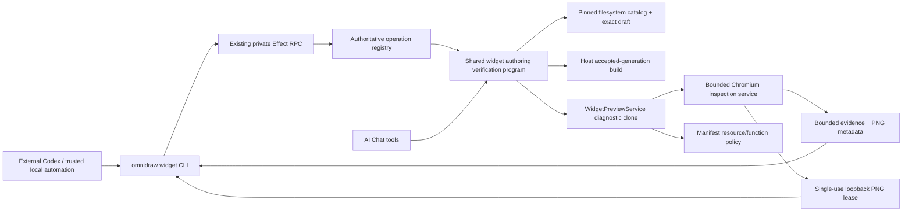

# E43 - widgets: headless host-authoritative repair, build, and verification CLI

[Overview](../BASED.md)

Add one supported local automation boundary for repairing an existing widget
draft without opening AI Chat or clicking the Canvas UI. The first user-facing
surface is a source-run `omnidraw widget ...` CLI over the running backend's
existing private typed RPC. It must reuse the same accepted-generation build
authority and bounded Preview inspection implementation as AI Chat; it must not
construct another live runtime or duplicate widget services.

This is an implementation task. The design is fixed below so the assignee can
begin with causal tests and then implement the smallest shared boundary.

## Context

### Missing supported loop

Canvas AI Chat already has a complete internal repair loop:

1. `od_widget_load` resolves one exact editable draft into the chat workspace.
2. File tools or trusted Bash edit it.
3. `od_widget_validate` runs source checks and the host-owned accepted build.
4. `od_widget_preview_inspect` mounts the exact accepted artifact or a
   manifest-bound Preview diagnostic clone, performs bounded actions, and
   returns diagnostics plus a widget-only screenshot.

An external Codex task can edit the same filesystem draft and run the portable
SDK `check` or `build` scripts, but it has no supported CLI, MCP, or private-RPC
operation for the host-owned acceptance and inspection steps. Calling
`npm run check` or `npm run build` directly is useful local evidence, not proof
that the running host accepted the generation or that the real Capsule/runtime,
function, resource, action, diagnostic, and screenshot boundaries work.

The existing browser operation
[`widget.preview.rebuildDraft`](../../apps/frontend/src/core/app/private-operation-contract.ts)
does reach the accepted-generation build, but no source-run widget CLI exposes
it. Preview inspection is not a registered private operation at all. It is
wired directly into the fixed AI Chat
[`ToolRegistry`](../../apps/backend/src/shell/agent/tools/ToolRegistry.ts), and
Preview mode first requires a chat-mounted draft plus verified chat, Canvas,
AI Chat element, widget, and accepted-generation scope.

The original **Little Pomodoro** repair attempt is motivating evidence: the
external task could locate and modify source and run ordinary package scripts,
but could not invoke the host-accepted build and diagnostic-clone verification
path needed to establish runtime correctness. Do not encode that widget's
name, identifiers, manifest, resources, assertions, or layout in the new
contract or tests. Use generic fixtures and process-owned current identities.

### Existing authority to preserve

- [`WidgetBuildGenerationService`](../../apps/backend/src/shell/widget/WidgetBuildGenerationService.ts)
  owns current-source capture, portable build execution, host acceptance,
  accepted generations, build identities, cancellation, and source-drift
  rejection.
- [`WidgetPreviewService`](../../apps/backend/src/shell/widget/WidgetPreviewService.ts)
  owns exact accepted-artifact assembly, Preview resource/function policy,
  generation fencing, diagnostic-clone inspection, cancellation, and cleanup.
- [`PreviewInspectionBrowserService`](../../apps/backend/src/shell/preview/PreviewInspectionBrowserService.ts)
  owns the pinned Chromium process, bounded queue, actions, evidence, runtime
  diagnostics, and widget-only PNG.
- [`fn.widget-preview-inspection.ts`](../../apps/backend/src/shell/widget/fn.widget-preview-inspection.ts)
  owns bounded/redacted result projection.
- [`tool.widget-workspace.ts`](../../apps/backend/src/shell/agent/tools/tool.widget-workspace.ts)
  and
  [`tool.widget-preview-inspect.ts`](../../apps/backend/src/shell/agent/tools/tool.widget-preview-inspect.ts)
  adapt those capabilities to model tools; they must become consumers of the
  shared application boundary rather than remain its only entrance.
- The private operation registry in
  [`operation-contract.ts`](../../apps/backend/src/shell/transport/operation-contract.ts)
  is the sole dispatch, codec, error, idempotency, and transport-metadata
  authority. The existing Canvas CLI proves that a short-lived source-run CLI
  client can connect to the running server through Effect RPC without opening
  the database or creating the backend runtime again.

Relevant architectural authorities are
[`llm.app-architecture.md`](../../docs/internal/llm.app-architecture.md),
[`llm.widget-system.md`](../../docs/internal/llm.widget-system.md), and the
[`PRD`](../../docs/PRD.md). Prior failure and inspection work is documented by
[`B90`](../b/B90.md), [`B98`](../b/B98.md),
[`A116`](../a/A116.md), [`A117`](../a/A117.md), and
[`A119`](../a/A119.md).

### Development prerequisite defect

The frontend production build creates and verifies
`apps/frontend/dist/inspection/index.html`, but normal `bun run dev` starts the
Vite development server without first producing that private inspection
distribution. The backend can therefore start with no inspection shell.

[`PreviewInspectionBrowserService.preflight`](../../apps/backend/src/shell/preview/PreviewInspectionBrowserService.ts)
currently memoizes its first preflight promise, including an
`INSPECTION_SHELL_MISSING` result. Building the shell after that failure does
not recover inspection until the backend restarts. B98 corrected the built
layout, token-relative assets, QuickJS loader shape, backend resolver, and
fractional viewport projection; this task must preserve those fixes while
making the supported development startup and retry lifecycle correct.

## Fixed decisions

1. **CLI first, future MCP wrapper.** Add `omnidraw widget` commands as the
   supported local automation surface. A future MCP server may wrap the same
   typed operations and DTOs, but this task does not add MCP, a plugin, or a
   second protocol.
2. **Running server required.** Commands connect to
   `ws://127.0.0.1:<port>/rpc`, use the authoritative private operation
   registry, and close their short-lived client runtime. They do not read the
   database, instantiate `WidgetPreviewService`, launch a separate backend, or
   create another application `ManagedRuntime`.
3. **One shared host capability.** Extract the smallest transport-neutral
   application-private authoring request/result contract and orchestration seam
   used by both AI Chat adapters and the new RPC operations. Do not copy the
   implementation of `od_widget_validate` or `od_widget_preview_inspect` into
   the CLI or an RPC handler.
4. **Existing drafts only.** The first boundary locates and repairs an existing
   healthy draft. It does not scaffold, rename, publish, delete, or implicitly
   materialize a published-only widget. A published-only match returns an
   actionable `DRAFT_REQUIRED` result.
5. **Exact selectors only.** `widgetKey` is the canonical automation selector.
   An exact display name may be accepted for discovery, but the backend must
   resolve it against one pinned catalog generation and reject zero, multiple,
   unhealthy, replaced, or case-colliding matches. No fuzzy, newest, first, or
   global fallback is allowed.
6. **Accepted build is explicit.** `validate` performs the bounded source check
   and joins the existing host-owned rebuild/acceptance operation. Its result
   states separately whether source validation passed, whether an artifact was
   accepted, and that live Preview/runtime/resources were not exercised.
7. **Inspection never builds implicitly.** `inspect` requires the exact draft
   digest and accepted generation/build identity returned by `validate`. Dirty,
   pending, failed, superseded, or restarted process state fails before mount.
8. **Keep two evidence modes.** `artifact` remains isolated with narrowed
   policy and no resources. `preview` remains a manifest-bound diagnostic clone
   using the accepted manifest's exact resource/function policy. Results must
   retain the existing fidelity and never claim visible-frame pixel parity.
9. **Canvas is optional, never ambient.** Manifest-bound Preview inspection is
   usable without creating or mutating Canvas layout. An optional exact Canvas
   selector may correlate an already-existing unique Preview frame and instance
   state. The backend resolves and fences that Canvas/frame identity; the CLI
   input is only a selector, never authority. Without one, the result explicitly
   reports that visible frame and durable instance state were not selected.
10. **No Preview creation in this task.** The CLI does not add, move, open,
    rebuild, or remove a visible Preview frame. Diagnostic-clone verification
    must remain sufficient for the autonomous repair loop. If later evidence
    requires visible-frame creation, file a separate Canvas mutation task.
11. **Writes fail closed.** Manifest-bound reads may execute under existing
    Preview policy. A `tx`, protected, or unclear operation has no CLI approval
    coordinator and therefore returns `blocked_write_approval`; `--yes`,
    `--force`, or automation mode must not grant a write permit.
12. **Screenshot bytes use bounded HTTP, metadata uses RPC.** The private RPC
    remains JSON-shaped. When `--screenshot <path>` is requested, the backend
    exposes the already-validated PNG through one short-lived, unguessable,
    single-use loopback lease. The CLI downloads it from the same server,
    verifies MIME, byte limit, dimensions, and SHA-256 against the RPC result,
    then writes atomically without overwriting unless explicitly requested.
    The lease/token is never printed in human or `--json` output and is revoked
    on success, failure, timeout, disconnect, or shutdown.
13. **Development startup establishes the shell first.** Every supported source
    development entrypoint that advertises widget inspection must complete the
    dedicated inspection build and existing emitted-output verifier before the
    backend becomes ready. Do not solve this by serving the Vite application or
    weakening the private tokenized shell.
14. **Recoverable preflight failures are not sticky.** Cache a successful
    pinned-browser/shell preflight if desired, but clear failed or rejected
    preflight operations so a later safe retry can observe an installed browser
    or newly built verified shell without restarting the backend. Concurrent
    retries still coalesce into one preflight.

## User-facing contract

The exact flag spelling may be refined during implementation, but the command
separation and semantics are required:

```text
omnidraw widget list [--json] [--port <number>]
omnidraw widget resolve (--widget-key <slug> | --name <exact-name>) [--json]
omnidraw widget validate --widget-key <slug> [--expected-draft-digest <sha256>] [--json]
omnidraw widget inspect --widget-key <slug> --mode artifact|preview \
  --expected-draft-digest <sha256> --expected-generation <positive-int> \
  --expected-build-identity <sha256> [--canvas <id>] \
  [--actions <json-or-@file>] [--viewport <WxH[@DPR]>] \
  [--screenshot <local-path>] [--json]
```

- `list` returns bounded catalog metadata only.
- `resolve` returns the exact `widgetKey`, display name, health, draft digest,
  and intentional local editable draft path. That path is a locator result for
  this trusted local CLI; host paths must still never appear in inspection
  diagnostics, browser evidence, screenshots, or future model-facing results.
- `validate` returns the selected catalog generation, captured draft digest,
  executable-input digest, accepted generation, build identity, structured
  bounded diagnostics, and truthful not-exercised fields.
- `inspect` accepts the same action, viewport, settle, continuation, and timeout
  vocabulary as `od_widget_preview_inspect`; one pure validator must enforce
  the shared bounds. It returns the same classified evidence, fidelity,
  diagnostics, action results, screenshot metadata, and generation identity.
- `--json` emits exactly one machine-readable object and no progress chatter.
  Functional failure, validation failure, stale authority, timeout,
  cancellation, and transport failure use stable non-zero exits and stable
  error codes. A screenshot lease or other capability secret is never included.
- Ctrl+C and RPC disconnect cancel the server operation. A build or inspection
  may not continue detached after the CLI has gone away.

Do not add a combined command that silently rebuilds and then inspects. The
two-step result is intentional: automation must carry the accepted-generation
fence from `validate` into `inspect`. A later convenience command may compose
the two typed operations while preserving that fence visibly.

## Plan



### 1. Freeze the shared DTO and pure policy

- Define application-private selectors, validation requests/results,
  inspection requests/results, and errors independent of Pi tool definitions,
  TypeBox, CLI parsing, browser objects, and transport implementation.
- Move or share the current inspection normalization, action limits, result
  validation, fidelity classification, redaction, and output budgets so AI Chat
  and CLI cannot drift. Preserve the existing maximum 16 actions, viewport/DPR
  limits, whole-call timeout, evidence budgets, PNG limit, and verified
  `widget://` source locations.
- Model an explicit automation subject separate from an AI Chat subject. Both
  resolve to the same exact widget key, accepted generation, manifest, and
  browser job. Only the AI Chat subject carries chat/AI-element authority.
- For optional Canvas correlation, pin the authoritative Canvas snapshot or
  revision, require at most one exact `widget-preview` frame for the key, and
  revalidate the frame, instance, accepted generation, and process-owned
  session before and after every await/dispatch.
- Keep pure decisions in backend core `fn.*` files. If a semantic orchestration
  service/program is introduced, follow the repository Effect v4 core/shell
  rules; no Effect-owned type crosses the private CLI DTO.

### 2. Share validation and accepted-build orchestration

- Extract the reusable host validation capability currently embedded in
  `od_widget_validate`: exact draft resolution, bounded source validation,
  manifest-name/identity validation, and `WidgetBuildGenerationService`
  rebuild/acceptance.
- Keep the portable SDK check useful but non-authoritative. The server operation
  must independently capture current source and run the host-owned accepted
  build path even if the caller reports an offline success.
- Serialize competing authoring operations per draft using the existing draft
  mutation/build admission. Join compatible in-flight builds rather than
  racing two installs or accepted generations.
- Recheck catalog generation, draft identity, source digest, executable-input
  digest, receipt, and accepted generation after all asynchronous work.
- Adapt `od_widget_validate` to the shared capability and retain its current
  model-facing copy and result shape unless a compatibility-free cleanup is
  explicitly justified by tests.

### 3. Generalize inspection scope without weakening AI Chat

- Keep the AI Chat path's verified chat/canvas/AI-element checks unchanged.
- Add the automation scope to the existing `WidgetPreviewService.inspect`
  composition or a narrow shared facade over it; do not add another browser
  runner, artifact assembler, resource resolver, or function bridge.
- Artifact mode must use exact accepted bytes and state
  `resources: not_available`, `bindings: unavailable`, and no Canvas parity.
- Preview mode without a Canvas must use the accepted manifest and exact
  manifest-owned resource references in a diagnostic clone. Use only an
  ephemeral process-owned invocation/instance subject, report durable instance
  state and visible-frame evidence as not selected/not claimed, and clean it up.
- Preview mode with a Canvas selector may reuse the existing exact frame/session
  subject only after authoritative unique resolution. Absent or failed frames
  may still use the clone and report their state; mounting, retired, ambiguous,
  or generation-mismatched frames fail closed as today.
- Preserve source/build/frame generation listeners, polling fence, cancellation,
  timeout, browser queue ownership, native guarded actions, deny-by-default
  guest network, function schema/policy checks, and cleanup in `finally`.
- Retain the current protected-write behavior. The CLI adapter supplies no
  approval permit and cannot turn a diagnostic clone into a mutation channel.

### 4. Register typed operations and add the CLI adapter

- Add only the required authoring operations to the existing backend handler
  tree so `operation-contract.ts` derives paths, codecs, errors, and the
  generated frontend manifest normally. Do not hand-edit the generated path
  list or add a parallel dispatcher.
- Reuse `widget.catalog.get` where its bounded public catalog DTO is sufficient;
  add narrow exact-draft resolve, validate, and inspect operations only for
  missing semantics.
- Keep these operations non-replayable. A lost acknowledgement must surface as
  unknown/failed; the CLI may query current build state but must not
  automatically repeat a build, inspection action sequence, or resource call.
- Generalize the Canvas CLI's short-lived RPC connection mechanics into a
  private CLI client without creating a broad service locator. The Canvas
  command behavior and reconnect semantics must remain unchanged.
- Add strict widget argv parsing, command-specific help, bounded `@file` action
  loading, JSON output, exit-code mapping, cancellation, and connection cleanup.
- Make local screenshot writing a CLI-shell concern. Validate the destination,
  create a sibling temporary file, verify downloaded bytes/digest, rename
  atomically, and refuse an existing target unless the user explicitly chose an
  overwrite flag. Never pass the destination path to the backend.

### 5. Add a private screenshot lease

- Keep screenshot bytes in memory only long enough for bounded delivery. Do not
  store them in the media database, Canvas, chat transcript, widget folder, or
  inspection URL.
- Issue a random, job-bound, short-TTL, single-use lease only after the caller
  requests screenshot bytes and the projected metadata has passed validation.
- Serve it on a dedicated internal loopback HTTP path with `GET` only,
  `Content-Type: image/png`, `Cache-Control: no-store`, exact content length,
  and no SPA fallback. Unknown, expired, consumed, cross-job, and traversal
  requests return 404 without revealing state.
- Bind the lease to the originating RPC operation/connection where practical,
  cap outstanding lease count and total bytes, zero/drop retained buffers after
  release, and revoke all leases during runtime disposal.
- The CLI must verify the downloaded bytes against the RPC metadata before the
  local atomic write. Digest mismatch is a hard protocol failure.

### 6. Repair inspection-shell development lifecycle

- Add one dedicated source command that builds
  `apps/frontend/dist/inspection` and runs the existing
  `verify-inspection-dist.ts` checks without requiring the main SPA production
  build.
- Make root `dev` complete that command before spawning the backend. Apply the
  same prerequisite to supported backend-only development entrypoints that
  claim Preview inspection. Preserve the normal frontend Vite dev server for
  the product UI.
- Decide whether inspection-source changes need a watch rebuild; if enabled,
  publish only complete verified output so a live job never observes a
  half-cleaned directory. The initial verified build remains mandatory.
- Change browser preflight memoization so concurrent callers coalesce, success
  may cache, and every unsuccessful result or thrown operation clears the cache
  after settling. A retry after the shell is built or Chromium is installed
  must re-run the full identity and shell checks without a backend restart.
- Preserve B98's isolated output root, token-relative assets, QuickJS
  single-default-export check, loopback lease, source-run resolver, and built
  Chromium smoke.

### 7. Document the autonomous repair loop

Document this generic sequence in CLI help and the widget-system authority:

```text
widget list/resolve exact draft
  -> edit the returned draft
  -> omnidraw-widget check .                 # useful offline evidence
  -> omnidraw widget validate                # host accepted generation
  -> omnidraw widget inspect --mode artifact # isolated construction/UI
  -> omnidraw widget inspect --mode preview  # manifest-bound runtime policy
  -> consume bounded diagnostics/screenshot
  -> repair and repeat
```

State clearly that OSS build/function execution is trusted local host
execution, artifact inspection is not resource evidence, a diagnostic clone is
not the visible Canvas frame, screenshots are evidence rather than the success
criterion, and protected writes were not approved.

## Causal tests

1. A CLI `resolve` by exact key pins one healthy draft and returns its current
   digest; missing, published-only, unhealthy, replaced, duplicate-name, and
   case-collision cases fail without fallback.
2. A returned draft path corresponds to the running server's pinned widget
   root even when the server uses a non-default `--data-dir`; no local CLI
   guess chooses a different home.
3. `validate` invokes the real accepted-generation builder, not only
   `omnidraw-widget check` or a raw project `npm run build`.
4. Source validation success plus host build failure reports those phases
   separately and never claims runtime verification.
5. Source mutation during validation rejects the candidate and cannot replace
   the previous accepted generation.
6. Cancellation, disconnect, timeout, or backend shutdown during install/build
   cleans private work and cannot publish a late accepted generation.
7. Two compatible validation requests join the existing build; competing
   source generations cannot cross-return identities.
8. `inspect` rejects a missing or mismatched draft digest, accepted generation,
   or build identity before launching Chromium.
9. Artifact mode mounts exactly the accepted bytes and reports resources and
   bindings unavailable even for a resource-backed widget.
10. Preview mode without any Canvas Preview mounts a diagnostic clone using the
    exact accepted manifest resource/function policy, reports visible frame and
    durable instance state as unselected/not claimed, and does not mutate
    Canvas layout.
11. Optional Canvas correlation resolves exactly one authoritative Preview
    frame by canvas and widget key; zero, duplicate, stale, mounting, retired,
    replaced, and generation-mismatched states remain distinct and fail or
    clone exactly as specified.
12. Browser-provided or CLI-provided canvas, frame, instance, resource,
    function, session, artifact, or generation identifiers never override
    backend resolution.
13. A manifest-bound read executes through the existing function/resource
    policy; a protected or unclear write returns `blocked_write_approval` and
    produces no resource mutation.
14. Click, input, wait-frame, and text assertion requests use the existing
    native guarded action path and preserve its target, focus, occlusion,
    sensitive-input, and action-count bounds.
15. Build, Capsule, guest, function, resource, output-schema, action, and
    screenshot failures remain blocking evidence with the same classification
    in AI Chat and CLI projections.
16. Raw stacks, host paths, tokens, secrets, resource IDs, provider details,
    SQL values, arbitrary console data, and cross-generation events remain
    redacted, bounded, or suppressed.
17. A CLI-requested PNG is served once, only under its active lease, matches
    declared MIME/dimensions/size/digest, and is atomically written locally;
    replay, expiry, wrong token, mismatch, cancellation, and abandoned client
    revoke it and leave no partial target file.
18. `--json` returns one bounded object, never a screenshot lease/token or
    base64 payload, and uses stable non-zero exit behavior for every failure
    class.
19. AI Chat validate and inspect tests continue to pass through the shared
    capability with their exact chat/canvas/widget/generation scope unchanged.
20. The private operation registry, backend dispatcher, generated frontend
    manifest, frontend client paths, and CLI client stay in exact parity.
21. A clean normal `bun run dev` produces and verifies
    `dist/inspection/index.html` before backend readiness, then a real accepted
    fixture completes browser inspection.
22. If preflight first returns `INSPECTION_SHELL_MISSING`, building the verified
    shell and retrying in the same backend process succeeds; concurrent retries
    perform one preflight, and a successful cached preflight still observes
    per-job shell lease validation.
23. B98's tokenized built-shell smoke, relative asset containment, QuickJS
    export-shape check, and fractional viewport tests remain green.
24. The CLI path creates no second backend runtime, database handle, widget
    catalog, build-generation service, browser service, or Preview authority.

## Security and authority constraints

- This is a trusted-local OSS automation boundary, not a sandbox. Help and
  documentation must say that host builds and widget server functions execute
  trusted local code.
- The server owns widget root, catalog generation, exact draft identity,
  manifest, resources, build capture, accepted generation, signing, browser
  runtime, Canvas/frame resolution, action execution, and result projection.
- CLI values are selectors and fences. They never become capabilities merely
  because the connection is loopback.
- Guest code receives no RPC token, screenshot lease, filesystem path,
  browser object, inspection controller, resource ID, write permit, or general
  network capability.
- Preserve deny-by-default guest network, manifest-only resource binding,
  operation/effect/schema checks, generation revalidation, bounded output,
  verified source mapping, and structured cleanup.
- Do not expose a generic browser evaluator, DOM/ShadowRoot handle, arbitrary
  event dispatch, console stream, network trace, SQL executor, file reader, or
  raw screenshot endpoint.
- Do not replay validate or inspect automatically after a lost acknowledgement.
  An operator or automation loop must re-resolve state and choose the next
  action from the authoritative result.

## Affected ownership boundaries

| Owner | Required change |
| --- | --- |
| Backend core | Pure selector/fence/result policy and, if needed, the semantic authoring verification program/service contract. |
| Backend widget shell | One shared live adapter over the existing catalog, build generation, Preview, resources, and browser services. |
| Backend agent shell | Adapt `od_widget_validate` and `od_widget_preview_inspect` to the shared boundary without weakening chat scope. |
| Backend private API/transport | Register strict resolve/validate/inspect procedures and screenshot-lease metadata through the existing operation registry. |
| Backend CLI shell | Add `widget` parsing, help, short-lived RPC calls, cancellation, JSON/exit projection, screenshot download, and atomic local write. |
| Backend HTTP shell | Add only the bounded single-use PNG lease route and cleanup ownership. |
| Frontend | No product UI change; keep the private inspection entry buildable and verifiable before supported dev startup. Regenerate only the normal private-operation mirror. |
| Public packages | No runtime/API change and no version bump expected. Reuse SDK contracts; do not expose this OSS-private host boundary publicly. |
| Repository scripts/docs | Add the inspection-only build prerequisite, safe retry qualification, CLI help, and widget-system workflow documentation. |

## Explicit non-goals

- Implementing an MCP server, Codex plugin, HTTP JSON automation API, or remote
  automation authentication scheme.
- Editing source files, applying patches, generating prompts, or running an
  autonomous repair agent inside Omnidraw.
- Creating, moving, focusing, resizing, publishing, republishing, deleting, or
  otherwise mutating visible Canvas Preview frames.
- Scaffolding a widget, materializing published-only source, renaming a widget,
  publishing, rollback, migration, or compatibility support.
- Treating `npm run check`, `npm run build`, a screenshot, or a successful
  action as sufficient host/runtime/resource verification by itself.
- Relaxing AI Chat scope, accepting browser authority, selecting the newest
  generation, or falling back to the first matching widget/Canvas/frame.
- Approving resource writes from a non-interactive CLI flag.
- Persisting screenshots, inspection jobs, function history, logs, artifacts,
  or Preview sessions.
- Exposing application-private automation through any public package or adding
  a sixth workspace package/application.
- Replacing Effect RPC, revising physical reconnect ownership, or adding a
  second WebSocket/reconnect library.
- Reopening B98's built-shell layout, QuickJS loader, tokenized serving, or
  viewport decisions.

## Acceptance criteria

- A trusted external Codex task can discover one exact existing draft, edit it,
  ask the running host to validate and accept the current generation, inspect
  that exact generation in artifact or manifest-bound Preview mode with
  targeted actions, consume bounded diagnostics and an optional verified PNG,
  and repeat without UI clicks.
- The CLI and AI Chat use one host-owned accepted-build and inspection
  implementation. Tests prove there is no duplicate authority or second live
  runtime.
- Every result distinguishes source check, accepted artifact build, artifact
  inspection, manifest-bound Preview policy, visible-frame evidence, resource
  exercise, durable instance state, and protected writes truthfully.
- Preview diagnostic-clone verification works when no visible Preview frame
  exists and leaves the Canvas document and layout byte-for-byte unchanged.
- Exact widget, optional Canvas/frame, manifest/resource, artifact, and
  generation authority remains server-owned and revalidated across awaits.
- Existing bounds, redaction, native action guards, screenshot validation,
  cancellation, timeouts, cleanup, network denial, and write approval policy
  remain fail-closed.
- A clean supported dev startup has a verified inspection shell before backend
  readiness, and a recoverable preflight failure can be retried successfully in
  the same backend process after its prerequisite is repaired.
- No production implementation lands outside the two applications and five
  public packages, no public package API/version changes are introduced, and
  no legacy or compatibility surface is added.
- Focused unit/integration tests, private-operation generation/parity,
  backend/frontend typechecks, architecture boundaries, source-run import
  stability, built inspection-shell verification, Playwright smoke, and one
  end-to-end CLI accepted-build/inspection fixture all pass.

## TODOS

- [x] Add red causal tests for missing CLI/RPC host validation and inspection.
- [x] Freeze the shared application-private authoring DTO, limits, errors, and generation fences.
- [x] Extract one shared validation/accepted-build capability and adapt AI Chat to it.
- [x] Add the automation inspection subject without weakening the existing AI Chat subject.
- [x] Register exact resolve, validate, and inspect private operations through the authoritative registry.
- [x] Add the `omnidraw widget` CLI group, strict help/argv/JSON/exit/cancellation behavior, and short-lived RPC client reuse.
- [x] Add the bounded single-use screenshot lease and atomic verified CLI file output.
- [x] Build and verify the inspection shell before supported dev backend readiness.
- [x] Make failed Preview browser preflight safely retryable without restart.
- [x] Add authority, drift, cancellation, write-denial, redaction, screenshot, and no-Canvas-mutation tests.
- [x] Run the full acceptance matrix and update widget-system/CLI documentation.
- [x] Close E43 and update the overview only after the end-to-end external repair loop passes.

## NOTES

- No mockup is useful. This is a host authority, protocol, lifecycle, and
  developer-startup task; state-transition and end-to-end CLI evidence are the
  useful artifacts.
- The optional Canvas selector exists only to correlate an already-present
  Preview. It must not become a hidden requirement for resource-backed
  diagnostic clones.
- A future MCP wrapper should consume the same private DTOs through a small
  client adapter or invoke the CLI. It must not call agent tool factories,
  import shell services, or start its own Omnidraw runtime.

### LOGS

- 2026-08-15: Filed from the Little Pomodoro external-repair gap. Chose a
  CLI-first boundary over the existing running-server Effect RPC, with a future
  MCP wrapper explicitly deferred. Kept visible Preview mutation out of scope
  and required manifest-bound diagnostic-clone inspection to work without
  Canvas layout changes.
- 2026-08-15: Confirmed normal development starts Vite without first building
  `apps/frontend/dist/inspection/index.html`, while browser preflight caches an
  `INSPECTION_SHELL_MISSING` result for the backend lifetime. Added both the
  build-before-readiness prerequisite and non-sticky failed-preflight retry to
  the implementation contract.
- 2026-08-15: Implemented the shared exact-draft resolve/validate/inspect host
  facade, automation inspection subject, three private RPC procedures,
  source-run `omnidraw widget` CLI, single-use loopback PNG lease, verified
  atomic screenshot output, inspection-only build prerequisite, and retryable
  preflight. AI Chat validation now uses the same host accepted-build facade;
  AI Chat and automation inspection retain one `WidgetPreviewService`, browser
  runner, normalizer, and result projection.
- 2026-08-15: Completed an isolated external CLI loop against a running server:
  exact resolve, accepted-generation validation, artifact inspection with a
  guarded text assertion and a digest-matched 512x384 PNG, then no-Canvas
  manifest-bound Preview inspection with a guarded click and state assertion.
  Little Pomodoro's existing Capsule mount failure remained truthful blocking
  evidence while the generic healthy fixture completed both modes. The full
  backend suite (741 tests), frontend suite/build (129 tests), focused E43 suite
  (117 tests), inspection distribution verifier, and tokenized Chromium shell
  smoke passed. The repository architecture command still reports two
  pre-existing environment/surface conditions outside E43: the local ignored
  `scripts/eslint-tooling` directory and sandboxed npm log permissions. Its
  other 61 checks passed. The source-run stability harness completed its public
  build but hung while cleaning up an existing detached TypeScript watcher and
  was interrupted without an E43 import failure.
- 2026-08-15: Closed the two post-implementation review gaps. Caller
  cancellation now reaches the initial exact-draft filesystem capture for
  `resolve`, `validate`, and `inspect`, before any accepted build or browser
  work can begin. Screenshot leases now require a second, operation-bound
  credential carried in a private HTTP header; missing and cross-operation
  credentials fail uniformly without consuming the single-use token. The CLI
  validation response also uses the exact shared DTO. Added causal coverage for
  all three cancellation entrances and for missing, cross-operation, replayed,
  expired, and wrong-method lease requests. The focused tests passed 5/5,
  backend typecheck passed, and the full backend suite passed 742/742.
- 2026-08-15: Re-ran the complete source CLI manually after the review fixes
  against a real backend with an isolated Omnidraw home and a copied generic
  Game of Life draft. `widget list`, key and exact-name `widget resolve`, and
  digest-fenced `widget validate` all succeeded; validation accepted generation
  1 with a current build identity. Artifact inspection passed a guarded title
  assertion and downloaded a mode-0600 512x384 PNG whose 14,647-byte size and
  `09d146c815e1cc7559319492c15f423ba2fed5295a27ac4bd6aaec0b270e5701`
  digest matched the RPC metadata. No lease URL or operation credential appeared
  in JSON output. No-Canvas Preview inspection then completed a native `Clear`
  click and asserted `Auto: off`, with exact manifest/runtime policy, no
  diagnostics, and truthful absent-frame correlation. Every CLI process exited
  zero.

---
