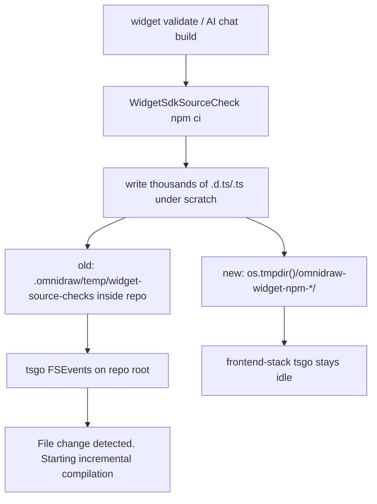

# E44 - spurious frontend tsgo rebuilds during widget validate (dev mode)
[Overview](../BASED.md)

Widget builds in `bun run dev` print bursts of tsgo
`File change detected. Starting incremental compilation...` under
`[frontend-stack]`. Cause: host `npm ci` for widget source-check/build ran
inside repo `.omnidraw/temp`, and tsgo's watch root is the repo. Implementation
task: [B108](../b/B108.md).

## Context

Handoff already proved the lines are **tsgo 7.0.2** from
[`scripts/dev-frontend.ts`](../../scripts/dev-frontend.ts), not Vite, and that
a lone write under `.omnidraw` is not enough. `widget validate` still
recompiled with no `packages/*` / `apps/*` source edits.

Widget path: backend
[`WidgetFilesystemBuildService`](../../apps/backend/src/shell/agent/widget-filesystem/build/WidgetFilesystemBuildService.ts)
→ [`WidgetNpmDistributionBuild`](../../apps/backend/src/shell/widget/WidgetNpmDistributionBuild.ts)
and [`WidgetSdkSourceCheck`](../../apps/backend/src/shell/widget-authoring/WidgetSdkSourceCheck.ts)
(`npm ci` + `omnidraw-widget check` / `build`). Capsule `inspect` in live
mechanics is a signed-bytes map lookup, not a workspace scan.

## Plan

1. Bisect which file event tsgo treats as a change.
2. Record the exact actor during `widget validate`.
3. Move widget npm scratch off the workspace tree; add tsgo `watchOptions`.
4. Verify validate produces no `[frontend-stack]` incremental compilation
   lines and leaves `packages/canvas/dist/tsconfig.dev.tsbuildinfo` untouched.

## TODOS
- [x] Create this exploration leaf and record the inherited handoff.
- [x] Prove the tsgo input (not `.vite-temp`; `.omnidraw` npm `.d.ts` storm).
- [x] Name the process: `WidgetSdkSourceCheck` `npm ci` under repo `.omnidraw/temp`.
- [x] Isolate widget npm scratch to `os.tmpdir()`; add `watchOptions`.
- [x] Verify with `widget validate --widget-key cyber-snake`.

## NOTES

### What prints the lines

`[frontend-stack]` merges stdout from four tsgo watches: canvas-contract,
theme, canvas-types (`tsc -b`), ai-chat-types.

### What file event retriggers them

Not `node_modules/.vite-temp` (mtime-only write there does not fire tsgo).
Not a single `.omnidraw/*.txt` or `.ts` probe. tsgo **does** fire on
`package.json` / `tsconfig` / program `src` mtime.

During validate, a recursive watch of the repo showed **only**
`.omnidraw/temp/widget-source-checks/source-check-*/{project,toolchain}/node_modules/**`
(and a small preview staging dir). At the same timestamp tsgo printed
`File change detected` (e.g. `14:08:21` vs `project/ui/main.ts` and
`typescript/lib/*.d.ts` under that scratch).

tsgo's watch root is the **repo**: program files resolve through
`node_modules/.bun` at repo root (`types: ["vite/client"]` etc.), so FSEvents
covers `.omnidraw` as well. A source-check `npm ci` writes thousands of
`.d.ts`/`.ts` files there; tsgo treats that as a type-definition change and
incrementally recompiles (0 errors, nothing to emit).

### Who does that, and why it is coupled to a widget build

Every `od_widget_validate` / chat accepted build runs
`createWidgetSdkSourceCheck`, which `npm ci`s a captured draft under
`home.tempRoot/widget-source-checks` (previously
`<repo>/.omnidraw/temp/widget-source-checks`). Dev
[`scripts/dev.ts`](../../scripts/dev.ts) sets `OMNIDRAW_HOME` to
`<repo>/.omnidraw`, so that scratch sat inside the tsgo watch tree.

The vitest `.vite-temp` probes (frontend/canvas/ai-chat) correlate with
loading `vitest.config.ts` but are **not** the tsgo trigger. Isolated
`npm run build` in a warm widget workspace wrote only the widget's own
`portable.vite.config.mjs` temp file and did not wake tsgo.

### Remediation

1. **Build isolation (causal):**
   [`layer.live-mechanics.ts`](../../apps/backend/src/shell/runtime/layer.live-mechanics.ts)
   puts widget-builds, function-descriptor temp, and widget-source-checks under
   `os.tmpdir()/omnidraw-widget-npm-<home-hash>/`. Drafts/db stay in
   `.omnidraw`.
2. **Watch ignore (defense):** `watchOptions.excludeDirectories` on
   canvas, canvas-contract, theme, and component-ai-chat `tsconfig.json`
   (`**/node_modules`, `**/.git`, `../../.omnidraw`). Enough for a fresh
   `tsc -p`; `tsc -b` still saw in-repo scratch until (1).

### Verification

Reproducer: `widget validate --widget-key cyber-snake` against a running
backend with frontend-stack up.

- Before isolation: burst of `[frontend-stack]` incremental compilation around
  the source-check `npm ci`.
- After: VALIDATE6 (2026-08-17T14:13:32Z) produced **zero** new
  `File change detected` lines; `packages/canvas/dist/tsconfig.dev.tsbuildinfo`
  stayed at 16:09:29 (tsconfig-edit reload, not validate).

### LOGS

- 2026-08-17: opened E44. Ruled out Capsule inspect and repeated registry
  publish. Isolated `npm run build` in a warm widget workspace does not probe
  workspace vitest configs or wake tsgo.
- 2026-08-17: tsgo bisect: `.omnidraw` txt no; `.vite-temp` no; `package.json`
  / `tsconfig` / `src` yes. Path-mapped `packages/canvas/package.json` wakes
  ai-chat tsgo; root `package.json` does not.
- 2026-08-17: validate without frontend-stack did not write workspace
  `.vite-temp`. Validate with frontend-stack woke tsgo. Recursive repo watch
  during validate3: events are source-check `npm ci` under `.omnidraw/temp`.
- 2026-08-17: `watchOptions` alone quiets a fresh `tsc -p`; frontend-stack
  `tsc -b` still fired until widget npm scratch moved to `os.tmpdir()`.
- 2026-08-17: VALIDATE6 after isolation: no incremental compilation lines.
- 2026-08-17: Handed landing to [B108](../b/B108.md).

---
