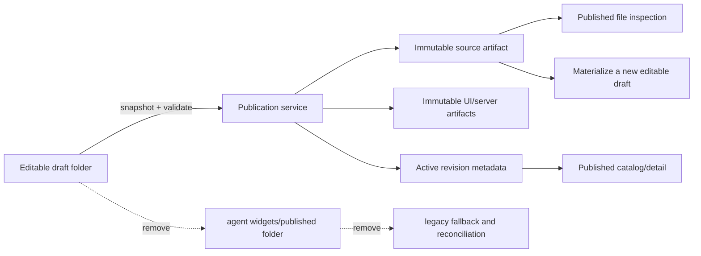

# S106 - widgets: remove published source folders and use source artifacts only
[Overview](../BASED.md)

Remove `agent/<account>/pi/agent/widgets/published/` and make the database-backed active widget revision plus its immutable source artifact the only published-source authority. The application has not shipped this storage model, so perform a clean cutover with no compatibility reader, import, or on-disk migration.

## Context

The current widget system stores the same published source in two forms:

- [`WidgetWorkspace.ts`](../../packages/service-agent/src/workspace/WidgetWorkspace.ts) owns a mutable filesystem copy at `widgets/published/<name>` and retains reconciliation, copy-from-published, rollback, deletion, and legacy placement behavior around it.
- [`WidgetPublicationService.ts`](../../packages/widget-contract/src/local/WidgetPublicationService.ts) already commits an immutable `source` artifact together with the UI/server build artifacts and the active revision metadata.

The v2 path in [`AgentService.ts`](../../packages/service-agent/src/AgentService.ts) already reads published file listings/previews from the active revision's source artifact and materializes editable drafts from that artifact. It still merges those records with the directory-backed legacy catalog and falls back to [`WidgetManagement.ts`](../../packages/service-agent/src/widget-management/WidgetManagement.ts) when no v2 match exists. That fallback keeps `publishedRoot`, `reconcilePublishedWidgets`, `published-legacy` placement descriptors, installed-folder reconciliation, and a large duplicate test surface alive.

There is no released data to preserve. Do not scan or import old `widgets/published` directories, do not silently reconstruct published revisions from installed folders, and do not retain feature flags or dual-read behavior. Existing local development homes may be deleted manually.

## Plan

### 1. Establish one published authority

- Make active widget definitions/revisions from the widget control store the only source for published catalog entries, detail, placement identity, deletion, and revision relationships.
- Read published manifests, functions, files, and source previews from the revision metadata and verified `source` artifact only.
- Preserve integrity checks: artifact tenant, kind, byte size, digest, snapshot identity, and active-revision identity must be verified before published source is returned or materialized.
- Keep draft folders as the only mutable widget source. Creating or editing a published widget must materialize a draft from the selected immutable source artifact and then operate on that draft.

### 2. Remove the published filesystem tree

- Remove `publishedRoot` and `installedWidgetsRoot` from `WidgetWorkspace` wherever they exist only to support published-folder compatibility.
- Delete `reconcilePublishedWidgets`, directory-backed published discovery/read/copy/delete helpers, canonical publication backups, installed publication backups, and `beginDraftPublish` if no artifact-authoritative caller remains.
- Simplify chat mount validation and rename/delete collision checks to consider shared drafts and chat-owned mounts only; published source artifacts are never mounted into AI Chat.
- Stop creating `widgets/published/`, `.publication-backups`, and other roots that become unused. Do not add startup cleanup or migration code for old directories.

### 3. Delete legacy catalog and placement branches

- Replace the legacy-catalog-plus-v2 merge in `AgentService` with one catalog composition over durable published revisions plus current drafts.
- Simplify `WidgetManagement` to manage editable draft folders only. Published detail, file inspection, deletion, and placement must go through the durable revision/artifact services.
- Remove `published-legacy` placement descriptors and their validation/rendering branches from service-agent, API/widget contracts, UI AI Chat placement, frontend routing consumers, and tests.
- Remove v2/legacy naming where v2 becomes the only model; names should describe published revisions rather than a migration generation.
- Keep `source: 'published' | 'draft'` as the product-level variant distinction, but do not use it to imply two filesystem roots.

### 4. Remove unreleased compatibility code and fixtures

- Delete installed-folder-to-published reconciliation and every fixture that seeds `widgets/published` or expects fallback discovery.
- Remove legacy manifest parsing and legacy definition deletion hooks from the widget management composition when they become unused.
- Audit `artifacts/widgets/` separately: remove it if its remaining consumers are only the deleted compatibility path; otherwise document the current runtime owner and ensure it is never treated as published source authority.
- Update [`packages/service-agent/AGENTS.md`](../../packages/service-agent/AGENTS.md), [`docs/internal/llm.widget-system.md`](../../docs/internal/llm.widget-system.md), relevant task-era comments, and [`FILES.md`](../../FILES.md) to describe artifact-authoritative published source and draft-only agent storage.

### 5. Verify clean publication and recovery

- Cover first publication, republish conflict, active revision selection, published catalog/detail/files, draft materialization, draft divergence, archive/delete, placement, and artifact corruption/missing-byte failures without a published directory.
- Prove restart behavior comes entirely from database metadata and artifacts: starting with durable revisions and no agent `widgets/published/` tree must retain the complete published catalog and allow editing through draft materialization.
- Prove an arbitrary old `widgets/published/` folder is ignored rather than imported.
- Update service-agent, widget-contract, API, UI AI Chat, frontend, and CLI/widget-service tests affected by the removed legacy descriptor and directory fixtures.
- Run focused tests, package typechecks, functional-core lint, and the production frontend build.

## TODOS

- [ ] Make durable active revisions and source artifacts the sole published authority.
- [ ] Materialize editable drafts exclusively from verified source artifacts.
- [ ] Remove `WidgetWorkspace.publishedRoot` and directory-backed published operations.
- [ ] Remove installed-folder reconciliation and obsolete publication backup roots.
- [ ] Replace legacy/v2 catalog merging with one revision-backed catalog.
- [ ] Reduce `WidgetManagement` to draft-folder management.
- [ ] Remove `published-legacy` placement descriptors and consumers.
- [ ] Remove compatibility parsing, fallbacks, fixtures, and tests.
- [ ] Audit and remove `artifacts/widgets/` if it has no non-compatibility runtime owner.
- [ ] Update architecture docs, package guidance, comments, and `FILES.md`.
- [ ] Add restart, corruption, draft-materialization, catalog, deletion, and placement coverage.
- [ ] Run relevant tests, typechecks, functional-core lint, and frontend build.

## Acceptance criteria

- `agent/<account>/pi/agent/widgets/` contains editable `drafts/` only; the application never creates or reads `published/`.
- Every published catalog/detail/file/placement response is derived from an active durable revision and verified artifacts.
- Editing a published widget creates or refreshes a draft from its immutable source artifact.
- Restarting with valid database state and artifacts but no published source folders preserves all published behavior.
- Old published folders and installed-folder fixtures are neither discovered nor imported.
- No `publishedRoot`, `reconcilePublishedWidgets`, legacy published fallback, dual-read branch, or `published-legacy` descriptor remains.
- Missing, corrupt, cross-tenant, or identity-mismatched source artifacts fail explicitly and never fall back to mutable folders.
- Draft publication, republishing, rollback/conflict handling, Preview, placement, archive/delete, and existing canvas instances continue to use the committed revision correctly.
- Documentation shows one authority: database revision metadata plus immutable artifacts for published widgets, filesystem folders for editable drafts.

## NOTES

- No UI mockup is needed; this task removes a storage authority without changing the intended widget catalog/detail interaction.
- “Published” remains a product lifecycle state and API variant. This task removes only the duplicate published filesystem representation.
- Do not add compatibility migration code. The application has not released this layout, and stale local development homes may be discarded.
- Blob garbage collection must continue to retain every artifact referenced by an active or retained revision.

### LOGS

- 2026-07-22: Created the clean-cutover plan after confirming that v2 publication already stores immutable source/UI/server artifacts and published reads can be served from active revision metadata plus the source artifact.

---
