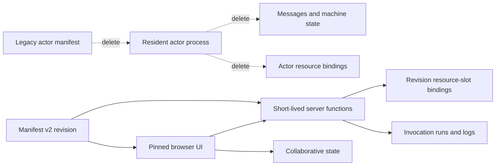

# S107 - widgets: remove the actor system completely
[Overview](../BASED.md)

Delete the legacy actor compatibility vertical and make manifest-v2 widgets, collaborative state, and short-lived server functions the only widget runtime model. This is a clean cutover: do not retain an actor runtime, compatibility flag, legacy manifest reader, or actor-era data adoption path.

## Context

The managed rewrite already established the replacement architecture:

- [`types.ts`](../../packages/widget-contract/src/types.ts) defines strict widget manifest v2 without actor fields.
- [`contract.ts`](../../packages/api/src/function/contract.ts) exposes bounded, short-lived server-function invocation and run control.
- [`WidgetUiRuntime.ts`](../../packages/ui-ai-chat/src/widget-runtime/WidgetUiRuntime.ts) mounts pinned UI artifacts with collaborative-state and function bridges.
- [`canvas-doc.zod.ts`](../../packages/service-automerge/src/types/canvas-doc.zod.ts) defines the durable `widget-instance` element identity using definition, revision, and instance IDs.
- completed task [`D1`](../d/D1.md) proved the actor-free product path and retained actors only as optional compatibility.

The actor system is therefore no longer a product prerequisite. Its remaining code forms a cross-cutting compatibility vertical:

| Area | Actor-era remainder | Replacement authority |
|---|---|---|
| Runtime | [`packages/service-actor`](../../packages/service-actor), CLI actor plugin, child-process supervision, IPC client | One-shot function runtime and durable invocation records |
| Authoring | Legacy manifest unions, actor draft methods, state-machine lint and prompts in [`service-agent`](../../packages/service-agent/src) | Manifest v2 draft, Preview, validation, publication, and source artifacts |
| Browser host | [`packages/ui-actor-legacy`](../../packages/ui-actor-legacy), legacy adapter, actor tabs and canvas `type: "widget"` | `widget-instance`, `WidgetUiRuntime`, collaborative state, functions, runs, logs |
| SDK | `@vibecanvas/sdk/actor` and the widget-side actor proxy | Collaborative-state client and server-function client |
| API/events | [`packages/api/src/actor`](../../packages/api/src/actor), actor event bus and actor-shaped resource routes | Widget/function APIs and revision-scoped resource references |
| Resources | Actor-named catalog models, definition-name bindings, actor stop/restart apply coordination | Neutral resource records, revision slot bindings, invocation drain/fencing |
| Database | Five `legacy_actor_*` tables and actor repositories/models | Widget revisions/instances, function invocations, resource catalog/bindings |

This task owns the complete actor subtraction. S103 and S104 independently remove PTY and filesystem surfaces; coordinate edits to `000-initial.sql`, but do not pull either feature into this task. There is no released actor-era storage to preserve. Old development homes may be discarded instead of imported or migrated.

## Plan

No UI mockup is useful because the intended v2 widget UI already exists. The important visual is the authority cutover and deletion order.

### 1. Establish the clean-cutover contract

- Treat manifest v2 as the only accepted authoring, Preview, publication, catalog, placement, and runtime manifest.
- Treat collaborative state as the replacement for persistent actor context/state and typed server functions as the replacement for actor messages and transition functions.
- Remove compatibility discovery rather than translating legacy `vibecanvas.json` actor manifests.
- Remove the legacy `type: "widget"` Automerge element schema and keep `type: "widget-instance"` plus browser-only `type: "ui-widget"`.
- Do not import, decode, start, or migrate actor-era definitions, instances, bindings, or canvas elements. Fail old local development homes/documents clearly if they reach a strict decoder; users may discard them.

### 2. Make authoring and SDK v2-only

- Remove the `TVibecanvasJson` union and legacy capability from [`AgentService.ts`](../../packages/service-agent/src/AgentService.ts), [`WidgetManagement.ts`](../../packages/service-agent/src/widget-management/WidgetManagement.ts), [`WidgetWorkspace.ts`](../../packages/service-agent/src/workspace/WidgetWorkspace.ts), agent API types, resource-binding tools, and validation.
- Delete [`packages/service-agent/src/legacy`](../../packages/service-agent/src/legacy), draft-actor lifecycle methods, legacy manifest patching, actor registry/state/message/transition lint helpers, actor scaffolds, prompts, tests, and fixtures.
- Preserve v2 metadata editing by replacing any still-needed call to the legacy draft-manifest patch helper with a manifest-v2-specific function.
- Delete [`packages/sdk/src/actor.ts`](../../packages/sdk/src/actor.ts), the `./actor` package export, actor-only shared types, the reactive actor proxy/setters in [`widget.ts`](../../packages/sdk/src/widget.ts), and generated actor declarations under [`widget-typescript-declarations`](../../apps/cli/src/services/widget-typescript-declarations).
- Keep and test the collaborative-state and function-client SDK surfaces.

### 3. Neutralize resource ownership and database apply

- Convert actor-named resource catalog types, row parsers, service methods, provider aliases, tests, and documentation to neutral resource terminology. Resource catalog records themselves remain.
- Make [`ResourceService.ts`](../../apps/cli/src/services/ResourceService.ts) use the neutral resource control store and revision bindings directly; remove actor consumer resolution, definition-name binding, legacy call adapters, actor start admission, and completion hooks.
- Delete [`TenantResourceService.ts`](../../apps/cli/src/services/TenantResourceService.ts) and the `IActorResourceService` compatibility implementation.
- Remove actor-definition resource routes such as `definitionStatus`, `bind`, and `unbind` from [`packages/api/src/resource/contract.ts`](../../packages/api/src/resource/contract.ts).
- Preserve resource deletion-safety references by returning v2 references keyed by widget definition ID, revision ID, slot name, and effect from the current `resource_bindings` table.
- Simplify [`DbResourceCoordinator.ts`](../../packages/resource-runtime/src/local/DbResourceCoordinator.ts): drain or reject bounded function invocations while applying a schema, but remove resident-actor stop/restart intent, per-instance recovery, and actor result persistence.
- Reduce database-apply lifecycle to preparation/apply/terminal recovery states where possible. Preserve drafts, backups, restore, resource leases, write fencing, failure recovery, and durable audit metadata.
- Rename remaining domain-specific helpers such as `boundedActorSql`; do not rename Automerge's own actor-ID terminology or terminology owned by external libraries.

### 4. Remove legacy canvas and frontend behavior

- Remove the `TWidgetData`/legacy `type: "widget"` branch from Automerge schemas, canvas widget creation/normalization/cloning, and neutral widget-host tests.
- Remove actor instance IDs, actor definition names, `legacy-actor` source variants, and adapter callbacks from [`packages/canvas/src/widget-host`](../../packages/canvas/src/widget-host) and [`packages/ui-ai-chat/src/widget`](../../packages/ui-ai-chat/src/widget).
- Delete [`packages/ui-actor-legacy`](../../packages/ui-actor-legacy) and [`legacy-actor-ui-startup.ts`](../../apps/frontend/src/legacy-actor-ui-startup.ts), including dynamic imports, health checks, runtime capability injection, styles, screenshots, and tests.
- Simplify [`WidgetManagerService.ts`](../../packages/ui-ai-chat/src/widget/WidgetManagerService.ts), [`attach-dom-portal.ts`](../../packages/ui-ai-chat/src/widget/attach-dom-portal.ts), and host drawing/mounting to the committed v2 runtime only.
- Remove legacy Messages and States tabs, actor-manifest detection, state-machine views, and actor language from [`WidgetDetailPage.tsx`](../../packages/ui-ai-chat/src/sidebar/widgets/WidgetDetailPage.tsx). Keep Overview, Configuration, Functions, Collaborative State, Runs, and Logs.

### 5. Remove actor API, events, runtime composition, and packages

- Delete [`packages/api/src/actor`](../../packages/api/src/actor), the top-level `actors` router, actor database capability/context, handlers, route tests, and generated client exposure.
- Remove actor status/event types and the actor event bus from [`service-event-publisher`](../../packages/service-event-publisher/src). Remove draft-actor agent event variants while retaining widget/function/agent events that still have consumers.
- Delete [`LegacyActorPlugin.ts`](../../apps/cli/src/plugins/legacy-actor/LegacyActorPlugin.ts), actor pool/context wiring in [`OrpcPlugin.ts`](../../apps/cli/src/plugins/orpc/OrpcPlugin.ts), actor service construction, and the optional capability from CLI composition.
- Remove `VIBECANVAS_LEGACY_ACTOR_ENABLED`, `legacyActorEnabled`, `--icp-client`, actor child-process diagnostics, actor health fields, and enabled/disabled compatibility matrix branches.
- Delete [`packages/service-actor`](../../packages/service-actor) and remove all workspace dependencies, exports, build inputs, trusted imports, lockfile entries, and root test filters.

### 6. Remove actor persistence

- Delete `legacy_actor_definitions`, `legacy_actor_instances`, `legacy_actor_connections`, `legacy_actor_resource_bindings`, and `legacy_actor_apply_results` from [`000-initial.sql`](../../packages/service-db/src/migrations/000-initial.sql). Do not add a new migration because this storage model has not shipped.
- Delete actor definition/instance/connection/apply models, row parsers, repositories, the `DbServiceTurso.actor` namespace, and actor-specific tests.
- Replace generic resource types currently named `TActorResource`/`TActorResourceBinding` with neutral equivalents; do not delete active `resource_catalog`, revision-based `resource_bindings`, or `agent_preview_resource_bindings`.
- Update embedded migration bytes/identity, expected schema, constraints, recovery fixtures, schema counts, database documentation, and compiled-binary expectations.
- Coordinate the obsolete `file_system_id` foreign-key removal with S104 if both tasks touch the initial schema.

### 7. Delete compatibility tests and make actor removal permanent

- Delete the legacy actor matrix, actor fixtures, actor UI screenshots, IPC tests, runtime baselines that instantiate resident actors, and binary scenarios that enable actor compatibility.
- Preserve useful resource isolation, function cleanup, widget placement, and recovery assertions by rewriting them against manifest-v2 functions rather than dropping the behavior coverage.
- Update active architecture docs, widget authoring docs, public web docs, [`llm.widget-system.md`](../../docs/internal/llm.widget-system.md), [`SCREENS.md`](../../docs/internal/screens/SCREENS.md), package guidance, and [`FILES.md`](../../FILES.md). Historical task logs may keep historical actor terminology.
- Add architecture guards proving active source/config/package metadata contains no Vibecanvas actor runtime imports, route, flag, SDK export, database table, legacy canvas element, or resident widget process.
- Run focused package tests, schema/recovery/isolation gates, root tests, functional-core lint, package typechecks, production builds, and the compiled-binary suite.

## TODOS

- [x] Make service-agent manifests, tools, validation, Preview, publication, and catalog strictly v2-only.
- [x] Delete service-agent legacy actor capability, methods, prompts, lints, fixtures, and tests.
- [x] Remove the SDK actor subpath, proxy, types, generated declarations, and examples.
- [x] Rename actor-shaped generic resource models and move catalog access to neutral stores.
- [x] Remove actor-definition binding/status APIs while preserving revision resource references.
- [x] Simplify database-resource apply to invocation drain/fencing without actor stop/restart recovery.
- [x] Remove legacy actor canvas elements, metadata, cloning, adapters, and host branches.
- [x] Delete ui-actor-legacy and frontend legacy capability startup.
- [x] Remove actor-only widget detail tabs and state-machine UI.
- [x] Delete the actor API domain and actor/draft-actor event streams.
- [x] Remove CLI actor configuration, IPC mode, plugin, pool, health diagnostics, and composition.
- [x] Delete service-actor and all package/dependency/build/test references.
- [x] Drop all five legacy_actor tables and actor DB repositories/models/tests from the initial schema.
- [x] Update embedded migrations, expected schema, recovery, constraints, and binary fixtures.
- [x] Delete compatibility matrices/baselines and rewrite retained behavioral coverage against v2 functions.
- [x] Update active docs, package guidance, SCREENS.md, FILES.md, and architecture guards.
- [x] Run the complete relevant verification matrix and record results below.

## Acceptance criteria

- Manifest v2 is the only widget manifest accepted by authoring, Preview, publication, catalog, placement, and runtime code.
- The only persisted canvas widget variants are `widget-instance` and intentional browser-only `ui-widget`; no legacy actor widget can be created or started.
- Widget persistence uses collaborative state; widget backend work uses bounded server-function invocations with zero retained guest processes.
- No `@vibecanvas/service-actor`, `@vibecanvas/ui-actor-legacy`, `@vibecanvas/sdk/actor`, top-level `actors` API, actor event bus, actor IPC mode, or legacy actor feature flag remains.
- Resource catalog, providers, revision bindings, deletion safety, function resource access, schema drafts/applies, backups, and recovery work without actor-shaped consumers or resident-process restart coordination.
- None of the five `legacy_actor_*` tables, their models, repositories, constraints, expected-schema entries, or fixtures remains.
- Active source, config, package metadata, generated declarations, tests, and product documentation contain no Vibecanvas-domain actor compatibility concept. Explicit exclusions are historical task logs and external/Automerge actor-ID terminology.
- Actor-era local homes, manifests, rows, and canvas elements are neither imported nor silently adopted; unsupported stale data fails explicitly and can be discarded.
- Existing manifest-v2 publication, Preview, placement, collaborative state, function invocation/cancellation/recovery, resource isolation, and tenant isolation remain covered and pass.
- The complete repository test, schema/recovery/isolation, functional-core, build, and compiled-binary gates pass with no compatibility mode.

## NOTES

- This is a deliberate clean subtraction, not a deprecation cycle. Do not leave disabled actor code, feature flags, dual-read branches, adapters, or compatibility packages.
- Actor removal does not mean removing `ui-widget`; it remains the browser-only built-in widget variant.
- Actor removal does not mean removing the resource catalog or resource providers. It removes actor-shaped ownership and replaces it with widget-revision/function authority.
- Do not blindly rename Automerge actor IDs or third-party/library terminology; the target is the Vibecanvas domain model.
- Coordinate SQL edits with S103/S104. S107 owns legacy actor tables; S103 owns PTY metadata; S104 owns filesystems and its actor-era foreign-key edge.

### LOGS

- 2026-07-22: Created the complete actor-system subtraction plan after tracing the remaining compatibility vertical across runtime composition, APIs/events, service-agent, SDK, canvas/frontend, resources, database schema, tests, and docs. Confirmed manifest-v2 widgets plus collaborative state and short-lived server functions already provide the active replacement architecture.
- 2026-07-22: Removed the complete Vibecanvas actor vertical: runtime/plugin/IPC composition, API and events, service-agent compatibility code, SDK subpath and proxies, legacy canvas/UI/frontend branches, both actor packages, generated declarations, five SQL tables, repositories, fixtures, matrices, and active documentation. Resources now use neutral catalog/binding terminology and schema apply drains bounded function uses without resident-process recovery.
- 2026-07-22: Verified resource-runtime (40), CLI resource/ownership and joined-flow coverage within 122 passing tests, function-runtime (48), SDK (9), widget-contract (59), API (49), UI AI Chat (286), frontend (36), canvas (214), Automerge (107), and database/schema/recovery (129). Changed-package typechecks, functional-core lint, production builds, and the compiled-binary validator passed; only unrelated Bun tests that bind port `0` remain unavailable in this environment.

---
