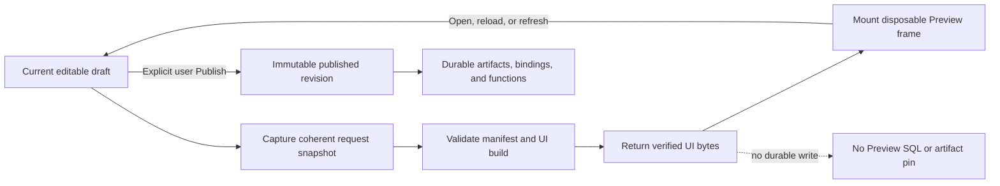

# S108 - widgets: remove durable Preview revisions and make draft Preview UI-only
[Overview](../BASED.md)

Remove the durable, revision-pinned Preview authority and make draft Preview a disposable UI build of the current draft. Delete the three Preview SQL tables, Preview-specific function-runtime subjects, artifact pinning, resource grants, CAS lifecycle, and persisted Preview revision identities while preserving the visible Preview frame and user-owned Publish flow.

## Context

The current Preview implementation is a second immutable runtime model beside published widget revisions. Building one Preview currently:

1. captures and validates a draft snapshot;
2. builds source, UI, and optional server artifacts;
3. pins all artifacts in the shared artifact store;
4. commits an immutable `agent_preview_revisions` row and resource bindings;
5. swaps the `agent_previews.active_revision_id` pointer with CAS semantics;
6. issues Preview-specific artifact capabilities;
7. optionally dispatches durable server-function invocations using the Preview revision as authority;
8. persists `previewId`, `previewRevisionId`, and the draft digest in the canvas Preview element;
9. retains old revisions until expiry so queued/retried work can still execute them.

This machinery exists because Preview promises to keep running exactly one accepted draft revision after the draft changes. That product requirement is removed by this task. A Preview becomes a disposable rendering of the current editable draft: opening, reloading, or explicitly refreshing it builds the current draft again, and no backend promise keeps an older build addressable.

The trace confirmed that the SQL tables are not isolated metadata. They currently authorize four downstream systems:

| Authority | Current dependency |
|---|---|
| UI artifact reads | `WidgetArtifactService` resolves Preview artifact capabilities through `IWidgetPreviewStore`. |
| Draft server functions | Function dispatch resolves `agent_preview` subjects and resource grants through Preview rows. |
| Artifact retention | `WidgetControlStoreTurso` treats active/retained Preview artifacts as durable GC roots. |
| Canvas Draft placement | Preview elements persist owner/revision IDs and close the backend owner on deletion. |

The replacement is intentionally narrower: visual Preview remains; durable Preview execution does not.

## Fixed decisions

- Draft Preview is UI-only. Server functions and resource-backed behavior are available only after publication.
- Preview build still captures one coherent source snapshot during the request so a single bundle cannot mix files from different moments. That transient build input is not a durable Preview revision and is discarded after the response.
- A successful response returns the verified UI artifact bytes directly, as it already does today through `bytesBase64`. It does not write source/UI/server artifacts or `artifact_references` rows.
- Preview has no backend owner ID, revision ID, active pointer, expiry window, close operation, artifact capability, or resource-binding record.
- A persisted canvas Preview element stores only durable draft identity and presentation/origin data. On mount or reload it builds the current draft. Deleting the frame requires no server cleanup.
- The UI may show the digest from which the currently mounted bytes were built as informational stale/refresh state, but that digest is not authority and cannot be used to fetch or execute an old build.
- Publish remains revision-checked and immutable. This task changes Preview semantics only; it does not weaken publication, published artifacts, published resource bindings, or widget-instance function execution.
- Do not replace the removed SQL model with another durable Preview table, hidden widget revision, artifact pin, or compatibility cache.
- There is no released Preview data to adopt. Edit the existing migration set directly and do not add compatibility readers or a new migration.

## Plan

### 1. Define a stateless UI Preview contract

- Replace revision-owner-oriented Preview types with a current-draft render request and result.
- Keep only the draft ID as durable identity. The build endpoint resolves the account-owned active draft and captures its current source itself.
- Remove `previewId`, `previewRevisionId`, `expectedActivePreviewRevisionId`, retention/expiry fields, CAS conflicts, close results, and Preview artifact descriptors/capabilities from the public and internal contracts.
- Return the validated manifest, verified UI artifact digest/size/base64 bytes, build digest for display/debugging, and diagnostics.
- Preserve strict byte limits, base64 validation, source-envelope integrity, builder identity checks, manifest validation, and account/tenant authorization.
- Replace stale-request errors tied to caller-supplied revision pins with ordinary build results or coherent retry/failure if the draft disappears during capture.

### 2. Make the builder transient and UI-only

- Refactor or replace `WidgetPreviewService` so it builds from the captured snapshot and returns UI bytes without calling `IWidgetArtifactStore.putArtifact` or a Preview store.
- Preserve the workspace fence/snapshot logic required to avoid a torn bundle, but release all temporary source/build material when the request finishes.
- Do not encode/store a source artifact for Preview.
- Do not persist the UI artifact in the durable artifact store.
- Do not persist or expose a Preview server artifact.
- Keep manifest-v2 server declarations valid for publication, but make the Preview host expose a deterministic `PREVIEW_FUNCTIONS_UNAVAILABLE` result if draft UI attempts a server call. The UI must explain that server functions and resources become runnable after Publish.
- Remove Preview resource-binding resolution from build. Publication remains responsible for validating and committing durable bindings.

### 3. Delete the durable Preview stores and artifact authority

- Remove `IWidgetPreviewStore`, immutable Preview revision/store types, Preview artifact resolution types, and `AgentAuthoringStoreTurso`'s Preview implementation.
- Remove Preview reads/writes and lifecycle helpers from `AgentAuthoringStoreTurso`.
- Remove active/retained Preview references from `WidgetControlStoreTurso` artifact retention, deletion, activation, and garbage-collection SQL.
- Remove Preview artifact purposes/capability issuance and verification from `WidgetArtifactService` and artifact-read policy.
- Simplify `WidgetArtifactGarbageCollector`: only published/retained widget revisions and revision sources may root widget artifacts.
- Delete obsolete Preview TTL, retention, cleanup retry, mutation-lane, and activation configuration where no non-Preview caller remains.

### 4. Remove Preview execution from the function runtime

- Delete the `agent_preview` subject from function-runtime request, subject, resolver, scheduler, execution, authorization, and view types.
- Remove Preview-definition resolution and ownership queries from `FunctionControlStoreTurso` and CLI function composition.
- Remove `preview_id` and `preview_revision_id` from `function_invocations` and its Preview index; reduce `subject_kind` to the remaining widget-instance model or remove the discriminator if it becomes constant.
- Remove `agent_preview` idempotency scope, Preview columns, foreign key, and unique index from `idempotency_records`.
- Remove Preview invocation create/get/cancel API handlers, schemas, service methods, browser bridge, tests, and event/result variants.
- Preserve published/widget-instance invocation durability, leases, retry/idempotency fencing, artifacts, resource permits, usage receipts, cancellation, and recovery.

### 5. Simplify agent API and controller lifecycle

- Keep one stateless `widgetPreview.build`/`render` operation. Delete `widgetPreview.get`, `widgetPreview.close`, `widgetPreview.invoke`, and the nested invocation get/cancel routes.
- Remove Preview ownership maps, CAS adoption, ambiguous-commit reconciliation, stop retries, expiry cleanup, remembered revisions, and shutdown cleanup from `WidgetDraftController`.
- Build directly from the current active draft and return the transient UI result.
- Simplify catalog readiness: a valid draft is Preview-capable; it does not require an active persisted Preview row.
- Keep publication confirmation and current-draft revision checking independent from the mounted Preview bytes.

### 6. Simplify canvas Preview and Draft placement

- Reduce the Draft Preview canvas payload to draft ID, draft name, optional origin chat element ID, and presentation state. Remove draft revision, Preview owner, and Preview revision fields.
- On mount, reload, reset, or explicit refresh, call the stateless build operation for the current draft and replace the mounted sandbox bytes.
- Remove backend get-before-build reconciliation, close scheduling, delayed releases, owner assertions, revision authority checks, and release-on-delete behavior.
- Replace the Preview function host bridge with a deterministic unsupported bridge or remove it when the runtime can mount UI artifacts without one.
- Keep ephemeral collaborative state local to each mounted Preview frame.
- Direct Draft placement may create multiple frames for one draft; every frame resolves the current draft independently and has no backend owner identity.
- If a draft is missing/discarded, render a clear unavailable state. Never fall back to old persisted Preview bytes.
- Preserve the Preview title-bar Publish/Republish action, but resolve and publish the current authoritative draft rather than the mounted render result.

### 7. Remove Preview schema and migration rewrites

- Delete `agent_previews` from `000-initial.sql`.
- Remove `agent_previews.active_revision_id`, `agent_preview_revisions`, `agent_preview_resource_bindings`, their indexes, and Preview-related function/idempotency table rebuild additions from `004-agent-authoring.sql`.
- Update migration constants/checksums/embedded assets as required by the repository's unreleased-schema workflow.
- Remove all three tables, their columns, indexes, and foreign keys from `expected-schema.ts`, baseline constraints, schema counts, migration tests, recovery fixtures, and managed-schema evidence.
- Remove Preview rows from artifact-GC crash fixtures and function-runtime database fixtures instead of preserving dead compatibility data.

### 8. Verify the reduced boundary

- Prove Preview build writes no control-database row and no durable artifact/blob.
- Prove opening/reloading/resetting a persisted Draft Preview frame builds the current draft, not an earlier digest.
- Prove changing the draft and refreshing replaces the mounted UI while preserving frame identity/layout.
- Prove frame deletion and application shutdown require no Preview cleanup call.
- Prove malformed, oversized, corrupt, cross-account, discarded, or torn draft inputs fail closed.
- Prove server-function calls from Draft Preview fail with the intentional user-facing unsupported result and create no function invocation.
- Prove publication still builds and commits immutable source/UI/server artifacts, bindings, function definitions, and revision metadata.
- Prove published/widget-instance server functions, resource access, retries, idempotency, cancellation, artifact retention, and GC remain intact.
- Run service-agent, widget-contract, service-db, function-runtime, API, UI AI Chat, frontend, CLI, schema/recovery/isolation, functional-core, build, and compiled-binary gates affected by the subtraction.

## TODOS

- [x] Replace revision-owned Preview contracts with one stateless current-draft UI build contract.
- [x] Make Preview build return verified UI bytes without durable artifact writes.
- [x] Make Draft Preview server functions/resources explicitly unavailable before Publish.
- [x] Delete `IWidgetPreviewStore` and Preview persistence from `AgentAuthoringStoreTurso`.
- [x] Remove Preview roots and activation logic from artifact retention and GC.
- [x] Remove Preview artifact read capabilities and policy branches.
- [x] Delete the `agent_preview` function subject and Preview invocation API/service/UI paths.
- [x] Remove Preview fields/scopes/indexes/FKs from function invocations and idempotency records.
- [x] Remove get/close/CAS/expiry/cleanup lifecycle from `WidgetDraftController` and agent API.
- [x] Simplify Draft Preview canvas payload, mounting, refresh, placement, and deletion.
- [x] Preserve current-draft Publish/Republish confirmation independently from Preview bytes.
- [x] Delete all three Preview SQL tables and update schema expectations/fixtures.
- [x] Remove obsolete Preview retention/configuration/tests and add stateless-build coverage.
- [x] Update widget architecture docs, SCREENS.md wording, package guidance, and FILES.md where product/source files change.
- [x] Run the complete affected verification matrix.

## Acceptance criteria

- The database contains no `agent_previews`, `agent_preview_revisions`, or `agent_preview_resource_bindings` table.
- No active source contains `IWidgetPreviewStore`, Preview artifact capabilities, active Preview revision pointers, Preview CAS, Preview expiry/retention, or durable Preview cleanup.
- `function_invocations` and `idempotency_records` contain no Preview subject/scope, ID columns, foreign key, or Preview index.
- Draft Preview build performs no durable database or artifact-store write and returns bounded, integrity-checked UI bytes directly.
- Persisted Draft Preview canvas elements contain no Preview owner/revision identity and rebuild from the current draft whenever mounted or refreshed.
- Draft Preview cannot invoke server functions or access resources; the limitation is explicit and user-facing.
- Published widgets retain immutable revision pinning, UI/server/source artifacts, resource bindings, artifact capabilities, function execution, and recovery.
- Publish/Republish remains an explicit user-confirmed operation against the current authoritative draft revision.
- Deleting a Preview frame, discarding a draft, restarting the app, or shutting down requires no Preview-specific backend cleanup.
- No compatibility reader, hidden replacement table, or migration path preserves unreleased durable Preview records.

## Coordination

- S106 removes the duplicate published source folder; this task must preserve source artifacts for published revisions while eliminating source artifacts created only for Preview.
- S107 removes legacy actors; this task must preserve the manifest-v2 published function runtime that replaces them.
- If these tasks run concurrently, coordinate edits to `000-initial.sql`, `004-agent-authoring.sql`, expected schema contracts, service-agent widget types, and UI AI Chat placement/runtime code.

## NOTES

- No UI mockup is needed. The visible Preview frame and Publish action remain; the change removes hidden persistence/runtime authority and simplifies stale/refresh behavior.
- “UI-only Preview” means browser rendering and ephemeral collaborative state remain available. It deliberately does not promise pre-publication testing of server functions or resources.
- Coherent request-time snapshotting remains necessary for build integrity. What is removed is durable addressability and retention of that snapshot after the response.
- The Preview response already carries verified UI bytes as bounded base64, so the stateless transport does not require a new binary delivery mechanism.

### LOGS

- 2026-07-22: Created after tracing Preview ownership through agent authoring, widget artifacts/GC, resource bindings, function dispatch/idempotency, API contracts, canvas frame persistence, Draft placement, publication, and restart behavior. Confirmed that durable Preview tables can be removed if Draft Preview becomes a stateless UI-only current-draft render while publication remains the immutable server/resource boundary.
- 2026-07-22: Replaced durable Preview revisions with one current-draft UI build. Preview captures and disposes a coherent request snapshot, returns verified bytes directly, persists only draft identity in the canvas frame, rebuilds on mount/refresh, exposes local ephemeral collaborative state, and returns `PREVIEW_FUNCTIONS_UNAVAILABLE` for server/resource calls.
- 2026-07-22: Removed Preview stores, artifact capabilities/GC roots, function subjects/routes, lifecycle cleanup/CAS/retention code, three Preview tables, invocation/idempotency Preview columns, and schema fixtures. Verified stateless no-write behavior through widget-contract, service-agent, API, UI, database, function-runtime, CLI, typecheck, lint, and production-build gates recorded above.

---
