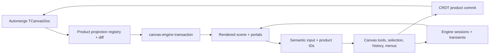

# S111 - canvas: replace Konva with canvas-engine
[Overview](../BASED.md)

Replace the Konva-backed renderer in `packages/canvas` with the deterministic
`@omnidraw/cangine` projection architecture specified by
[`llm.canvas-migration.md`](../../docs/internal/llm.canvas-migration.md).

## Context

Automerge remains the sole durable canvas authority. The migration introduces a
renderer-neutral product boundary, projects existing `TCanvasDoc` data into
canvas-engine, moves interaction previews to engine sessions/transients, and
deletes Konva from the canvas package without changing persisted schemas,
backend APIs, or widget data.

The durable implementation ledger is
[`CANVAS-MIGRATION-PROGRESS.md`](../../CANVAS-MIGRATION-PROGRESS.md).
Existing visual behavior is protected by
[`SCREENS.md`](../../docs/internal/screens/SCREENS.md); a new UI mockup would not
add useful information for this architectural cutover.

## Plan

### 1. Freeze contracts and build the engine boundary

- Pin and verify the exact engine artifact.
- Freeze schema/behavior/performance baselines.
- Add semantic product contracts, deterministic identifiers, conversions, and
  engine import-boundary enforcement.
- Implement lifecycle, projection, ownership, diagnostics, and placeholders.

### 2. Cut product behavior over to authoritative projection

- Project every built-in element, group, resource, and widget frame.
- Apply local and remote CRDT changes through one incremental path.
- Move camera, grid, semantic input, selection, menus, and creation tools to
  the engine-backed boundary.
- Move transforms, grouping, ordering, clone, text, image, and active-session
  conflict policy to product data and engine previews.

### 3. Migrate widgets and remove Konva

- Publish renderer-neutral widget/extension contracts.
- Coordinate the matching widget consumer update.
- Delete all canvas Konva nodes, serializers, listeners, transformers, test
  setup, and dependency entries.
- Update canvas architecture and performance documentation.

### 4. Qualify

- Run package and monorepo tests/typechecks/builds.
- Run browser, collaboration, performance, failure, and lifecycle gates.
- Record exact evidence and remaining external gates in the progress ledger.

## TODOS

- [x] Phase 0 — Freeze artifact, schema, behavior, screenshots, and performance baselines.
- [x] Phase 1 — Introduce semantic product and projection contracts.
- [x] Phase 2 — Build and lifecycle-test the canvas-engine boundary.
- [x] Phase 3 — Implement complete static projection and placeholders.
- [x] Phase 4 — Cut hydration over to one incremental local/remote projection path.
- [x] Phase 5 — Migrate camera, grid, input, selection, and menus.
- [x] Phase 6 — Migrate element creation tools and cancellation.
- [x] Phase 7 — Migrate transforms, groups, order, point editing, clone, and conflict policy.
- [x] Phase 8 — Migrate text editing and image resources.
- [x] Phase 9 — Migrate real widgets and renderer-neutral extensions.
- [x] Phase 10 — Delete Konva and update package documentation.
- [~] Phase 11 — Pass browser, collaboration, performance, lifecycle, and repository gates.
- [ ] Mark this task complete only when every migration Definition of Done gate passes.

## NOTES

- Preserve every `TCanvasDoc` field and current string `zIndex` value.
- Persist rotation in degrees and convert only at the projection edge.
- Projection failures render visible derived placeholders and never delete
  collaborative data.
- No dual production renderer and no Konva-shaped compatibility layer.
- The exact absolute engine tarball is intentional for local qualification, but
  portable artifact provenance remains a release gate.

### LOGS

- 2026-07-24: Created branch `codex/canvas-engine-migration`.
- 2026-07-24: Verified canvas-engine artifact SHA-256
  `f917220e3199a2939c8e5dc7cde4a59009e10123160f795dacf108a39ecf0486`.
- 2026-07-24: Captured green package baseline: 51 test files / 223 tests.
- 2026-07-24: Started Phase 0 and created the durable migration progress ledger.
- 2026-07-24: Removed the obsolete engine externalization override; added exact
  artifact and complete persisted-schema contract tests.
- 2026-07-24: Captured the five-scenario legacy performance baseline.
- 2026-07-24: Added revisioned, field-aware CRDT summaries and a
  renderer-neutral active-session conflict policy with focused tests.
- 2026-07-24: Added renderer-neutral target, semantic hit, input, modifier,
  selection-mode, and transform proposal contracts with pure tests.
- 2026-07-24: Serialized page runtime replacement/teardown and added engine
  import-boundary enforcement plus lifecycle failure/coalescing tests.
- 2026-07-24: Implemented deterministic full-document projection for every
  built-in discriminator, nested groups, resources/portals, semantic
  index/diff, and visible failure placeholders; full package suite stayed
  green.
- 2026-07-24: Hardened the projection boundary against all non-plain/non-JSON
  runtime values and added the renderer-neutral semantic selection owner.
- 2026-07-24: Completed the tested engine boundary: forced capabilities,
  stable layers, incremental commands, last-good/fatal behavior, metrics,
  resource/portal/transient ownership, and leak-free teardown.
- 2026-07-24: Added the serialized authoritative projection coordinator for
  local/remote revisions, incremental diffs, bounded reload, failure recovery,
  ownership rollback, and selection pruning.
- 2026-07-24: Cut production scene composition to canvas-engine camera, input,
  projection, portal, product-runtime, diagnostics, resize, and teardown
  ownership; remote CRDT changes cancel active product gestures.
- 2026-07-24: Migrated selection, context menu, render order, grouping,
  ElementService, and ToolService to semantic product data and exact CRDT
  history without renderer nodes.
- 2026-07-24: Replaced the widget drop Konva ghost with a portal-free
  widget-frame transient using engine camera conversion and async durable
  handoff behavior.
- 2026-07-24: Started the atomic renderer-neutral canvas widget-host and
  `ui-ai-chat` external consumer cutover.
- 2026-07-24: Completed the hard renderer cutover, renderer-neutral widget
  consumer migration, and repository source/manifests/lockfile Konva
  subtraction without a compatibility layer.
- 2026-07-24: Completed changed-element incremental projection, engine marquee,
  dependency-aware remote cancellation, group/mixed transforms, product-first
  clone policy, connector bindings, lifecycle-aware deletion, per-generation
  placeholder diagnostics, coalesced style history, and widget chrome/focus.
- 2026-07-24: Recorded partial Chromium and performance evidence. Phase 11
  remains open for the full browser/DPR/input matrix, real two-client matrix,
  complete performance/leak/soak and human atlas acceptance, repository/release
  gates, and portable artifact provenance.
- 2026-07-24: Verified isolated one-element projection at a 5,000-element scene
  over 40 samples (p50 1.580 ms / p95 2.434 ms / p99 2.490 ms), while the
  combined remote path and a timed-out full perf run keep performance
  qualification open.
- 2026-07-24: Latest post-widget package handoff was green: canvas
  72 files / 346 tests, ui-ai-chat 38 files / 262 tests, TypeScript, and
  functional-core lint.
- 2026-07-24: Final local repository gates passed: root monorepo tests,
  widget-host suites, four-target release build, compiled-binary help smoke,
  regenerated `FILES.md`, engine-import boundary, whitespace check, and
  source/dependency/generated-`dist` Konva scans. Phase 11 remains open for
  the browser, two-client, complete performance/leak/soak, human atlas, and
  portable artifact provenance gates.

---
