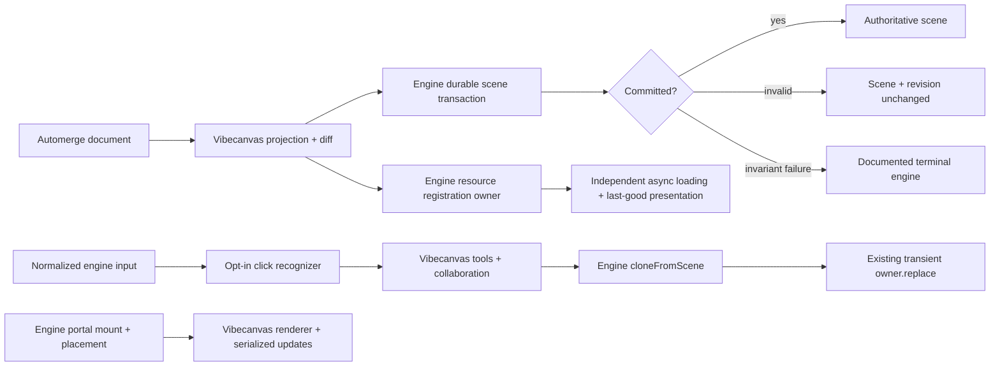

# S112 - canvas: adopt engine resource, publication, transient-clone, and click primitives
[Overview](../BASED.md)

Adopt the updated `canvas-engine` resource-registration ownership, durable
publication guarantees, transient subtree cloning, and normalized click
recognition, then remove only the Vibecanvas infrastructure those public
contracts make redundant.

## Context

This task begins after an immutable engine release provides and documents:

1. owner-scoped reconciliation of complete resource registration sets;
2. audited durable scene publication and terminal-state guarantees;
3. durable-scene to ordinary transient-projection subtree cloning;
4. opt-in normalized click and double-click recognition;
5. an explicit portal responsibility boundary; and
6. focused consumer-adoption guidance and deterministic lifecycle tests.

The engine deliberately does **not** provide:

- a transaction spanning asynchronous resource loading or portal work;
- durable scene rollback after a resource or portal presentation failure;
- public runtime snapshots;
- a second portal rendering or content-update model; or
- product selection, tools, persistence, or cloning policy.

Vibecanvas currently contains candidate duplicate infrastructure around:

- `packages/canvas/src/engine/resources/ResourceOwnership.ts`;
- ownership staging in
  `packages/canvas/src/engine/projection-runtime/ProjectionRuntimePort.ts`;
- last-good scene restoration in
  `packages/canvas/src/engine/CanvasEngineAdapter.ts`;
- durable-to-preview reconstruction in
  `packages/canvas/src/engine/product-runtime/fn.transient.ts`; and
- click synthesis in the event-listener plugin.

`PortalOwnership.ts` and the widget content bridge require a gap analysis
against the documented engine portal boundary. Application rendering and
asynchronous content-update ordering remain Vibecanvas-owned; B58 is not
transferred to the engine by this task.

Automerge projection, persisted-schema mapping, product history, backend image
retention, selection/focus policy, tools, snapping, binding persistence,
widgets, renderer registration, notifications, theme tokens, and collaborative
conflict policy also remain application-owned.

No mockup is needed: this responsibility transfer must preserve the current UI.

## Engine prerequisite contract

Pin the updated artifact and prove these public guarantees before deleting
consumer code.

| Capability | Required engine guarantee | Vibecanvas responsibility |
|---|---|---|
| Resource registration | Complete owner-set reconciliation; distinct registration ownership and usage retains; shared registration protection; incompatible descriptor/source rejection; generation guards; release only after owners and runtime consumers are gone | Produce product descriptors/sources and choose stable resource IDs |
| Durable publication | Invalid operations preserve scene/revision; committed scenes remain authoritative; recoverable presentation failures retain last-good output; invariant failures reliably terminalize; consumers never restore a snapshot into the same engine | Submit product projection commands and handle recoverable/fatal diagnostics |
| Transient cloning | Caller IDs; hierarchy/order/style/geometry/resource preservation; root rebasing; internal connector remapping; strict external-reference/unsupported-node policy; no portals; returned ID map | Choose preview/product IDs, gesture semantics, durable writes, binding/widget/backend clone policy |
| Click recognition | Normalized pointer/button pairing; viewport thresholds; cancellation/capture loss; exact hit identity; application and engine-session suppression; explicit touch policy; two valid clicks for double-click | Configure thresholds and decide selection, focus, text editing, and tool behavior |
| Portals | Engine owns registration, mount, placement, input surfaces, generation guards, and cleanup; application owns rendering and asynchronous content updates inside the host | Widget renderer host/registry, descriptor interpretation, and serialized content updates |

The engine release must include the resource source-transfer/replacement ADR,
publication failure-injection evidence, public API documentation, and migration
guidance. Do not rely on engine-private exports or inferred implementation
behavior.

## Target architecture



The scene transaction and resource/portal readiness are deliberately separate
consistency boundaries.

## Plan

### 1. Pin and verify the engine release

- Replace the current artifact with the immutable engine release containing all
  accepted features.
- Record version, commit, artifact path, and SHA-256.
- Read and record the resource source-transfer/replacement ADR.
- Add an import-boundary test proving Vibecanvas consumes public exports only.
- Port the engine adoption examples into focused consumer contract tests.
- Inject invalid operations, recoverable presentation failures, and terminal
  invariant failures to verify the documented publication contract.
- Stop if the public behavior differs from the promised contract; do not
  recreate missing guarantees in a permanent compatibility layer.

### 2. Adopt resource registration ownership

- Create one appropriately scoped engine registration owner for authoritative
  projection resources.
- Reconcile complete `{ descriptor, source }` registration sets after each
  authoritative projection change.
- Keep resource loading asynchronous and independent from durable scene commit.
- Preserve stable resource IDs and product-controlled URL/version generation.
- Verify shared registrations remain alive while either another registration
  owner or an engine runtime consumer retains them.
- Verify incompatible descriptor/source claims fail without disturbing the
  previous registration generation.
- Verify replacement, projection removal, runtime destruction, and delayed
  completion release registrations exactly once.
- Delete `ResourceOwnership.ts` and its staging protocol when the public engine
  owner covers all of its generic behavior; retain only thin product descriptor
  conversion if needed.

### 3. Simplify publication and remove consumer rollback

- Keep durable nodes authoritative through the existing engine scene
  transaction.
- Remove resource preload/readiness and portal content work from the durable
  scene success condition.
- Treat a returned engine commit as authoritative even if a resource later
  fails to load or a portal later fails to mount.
- Remove `CanvasEngineAdapter` last-good snapshot capture and restoration.
- Remove projection ownership staging whose only purpose was cross-system
  prepare/commit/rollback.
- Map recoverable presentation diagnostics to current placeholders and
  notifications without rewriting the durable scene.
- Map documented terminal engine state to runtime replacement/recovery policy;
  never restore an old snapshot into the same failed engine.
- Retain product projection retry only where the product projection itself
  failed before submitting a valid engine transaction.

### 4. Audit, but do not redesign, portal integration

- Compare `PortalOwnership.ts`, `PortalContentBridge`, and
  `CanvasPortalService` against the engine's documented portal guarantees.
- Remove duplicate registration, mount-generation, placement, input-surface,
  or cleanup bookkeeping already guaranteed by the public engine manager.
- Keep a thin application adapter where product portal IDs and mount callbacks
  must be registered with the engine.
- Keep widget rendering, renderer lookup, descriptor interpretation, and
  asynchronous content-update serialization in Vibecanvas.
- Complete B58 in the application renderer bridge; do not wait for or add an
  engine content-update API.
- Preserve contained/fullscreen widget behavior and live DOM identity.

### 5. Adopt transient subtree cloning

- Replace only durable-engine-node to transient-preview reconstruction with
  `engine.transients.cloneFromScene(options)`.
- Supply deterministic IDs matching the product session and intended durable
  handoff.
- Publish the returned ordinary projection explicitly through the existing
  transient owner:

```ts
const clone = engine.transients.cloneFromScene(options);
owner.replace(clone.projection);
```

- Use the returned durable-to-transient ID map for preview bookkeeping.
- Verify selected-root rebasing preserves world appearance.
- Verify hierarchy, ordering, styling, geometry, and resource references.
- Exercise internal connector remapping and every declared external-reference
  policy.
- Verify unsupported nodes and portal-bearing widget frames follow the strict
  reject/omit contract without partial publication.
- Keep product-transient to engine-transient conversion in Vibecanvas.
- Keep durable product ID allocation, binding remapping, widget clone policy,
  Automerge writes, history, and backend side effects in Vibecanvas.
- Delete only the generic durable-to-preview functions from `fn.transient.ts`.

### 6. Adopt normalized click recognition

- Replace pointer-up-only application click synthesis with the opt-in engine
  recognizer.
- Configure explicit viewport movement, click timing, double-click timing,
  exact hit-identity, and touch double-tap policies.
- Connect application gesture/session activation to the engine suppression or
  claim protocol.
- Subscribe Vibecanvas selection, focus, text editing, and tool behavior to the
  normalized click result.
- Keep keyboard and accessibility activation on the separate semantic
  activation path.
- Test mouse, touch, pen, mismatched pointer/button, movement, drag,
  application suppression, engine-session suppression, cancellation, capture
  loss, hit changes, and two-click timing.
- Close B56 only after all of its acceptance criteria pass through the
  engine-backed path.

### 7. Subtract duplicates and qualify

- Delete obsolete resource ownership, cross-system staging, scene restoration,
  durable-preview reconstruction, and raw click bookkeeping.
- Delete obsolete tests, types, error classes, metrics, and diagnostics that
  protect removed consumer implementations.
- Retain focused integration tests at each application/engine boundary.
- Confirm no application import reaches an engine-private module.
- Run canvas, widget-host, `ui-ai-chat`, monorepo, browser/input,
  collaboration, lifecycle, failure-injection, and performance verification.
- Update canvas architecture, performance, compatibility, and migration
  documents with the final responsibility boundary and exact engine evidence.

## TODOS

- [x] Pin and hash the immutable engine release containing the accepted APIs.
- [x] Verify the resource ADR, publication contract, portal boundary, and migration guidance.
- [x] Add public-boundary consumer contract tests for all adopted guarantees.
- [x] Replace application resource ownership with the engine registration owner.
- [x] Remove resource readiness from durable scene commit success.
- [x] Remove application last-good snapshot capture and restoration.
- [x] Remove obsolete adapter-owned cross-system projection staging.
- [x] Audit portal integration and remove only behavior duplicated by the engine manager.
- [x] Keep and serialize application-owned widget content updates; complete B58.
- [x] Replace durable-to-preview reconstruction with `cloneFromScene`.
- [x] Preserve product-to-transient conversion and product clone policy.
- [x] Replace raw click bookkeeping with the opt-in recognizer; complete B56.
- [x] Remove obsolete compatibility types, errors, tests, metrics, and exports.
- [x] Update architecture, compatibility, and migration documentation.
- [ ] Pass package, monorepo, browser, collaboration, lifecycle, failure, and performance gates.

## Acceptance criteria

- Authoritative projection resources are reconciled through an engine
  registration owner; `ResourceOwnership.ts` is deleted unless the gap analysis
  proves a documented product-specific responsibility remains.
- Resource decoding and portal mounting do not determine durable scene commit
  success.
- Invalid scene operations leave scene and revision unchanged without consumer
  restoration.
- A successful scene commit remains authoritative through later recoverable
  resource or portal failures.
- `CanvasEngineAdapter` does not capture or restore a last-good engine scene.
- Unexpected invariant failure follows the documented terminal-state recovery
  path and never triggers snapshot restoration into the same engine.
- `ProjectionRuntimePort` contains no generic cross-system transaction or
  readiness staging.
- Portal placement/mount lifecycle is not reimplemented in Vibecanvas, while
  widget rendering and asynchronous content-update ordering remain
  application-owned.
- Generic durable-to-preview reconstruction uses `cloneFromScene`; product
  transient conversion and durable clone policy remain application-owned.
- Click and double-click come from the engine recognizer after valid normalized
  sequences, and Vibecanvas contains no second pointer recognizer.
- B56 and B58 are closed only through their respective engine-click and
  application-content-update implementations.
- No private engine import, dual lifecycle path, cross-async transaction, public
  runtime snapshot dependency, or second portal rendering model remains.
- Existing Automerge data, persisted schemas, history, selection/focus, tools,
  bindings, widgets, collaboration, image retention, visual behavior, and
  zero-idle-work expectations remain unchanged.

## NOTES

- The goal is subtraction based on documented guarantees, not moving product
  semantics into the engine.
- Engine scene transactions, resource loading, and portal content rendering
  remain separate consistency boundaries.
- Registration ownership and runtime usage retention are distinct; deletion
  must respect both.
- Engine rollback is internal to a failed operation. Product history and
  backend compensation remain Vibecanvas concerns.
- Product-generated transient descriptions are not durable-scene clones and
  stay in the application conversion layer.
- D3 still owns product projector scale cliffs.

### LOGS

- 2026-07-24: Created from the initial request to move generic canvas lifecycle
  infrastructure into `canvas-engine`.
- 2026-07-24: Revised after engine-team review. Removed the rejected
  cross-resource/portal transaction, public snapshot, and second portal-model
  requirements. Added the accepted resource registration-owner contract,
  durable publication audit guarantees, caller-ID transient cloning, normalized
  click suppression, explicit portal boundary, and adoption-evidence gates.
- 2026-07-24: Consumer adoption implemented on `codex/S112`. Renamed the
  dependency to `@omnidraw/cangine`, pinned
  `omnidraw-cangine-0.1.0.tgz` at SHA-256
  `f917220e3199a2939c8e5dc7cde4a59009e10123160f795dacf108a39ecf0486`,
  adopted ADR-0010 descriptor owners, `cloneFromScene`, the click recognizer
  and `suppressClick`, and removed consumer scene restoration.
- 2026-07-24: Provenance discrepancy recorded: the artifact manifest and
  packed-consumer report identify the installed `f917…` bytes, while the
  current library guide and engine progress ledger still print `7ec906…`.
  Vibecanvas verifies the actual pinned bytes; upstream documentation should
  be corrected or the intended immutable artifact republished before release.
- 2026-07-24: Verification passed: canvas 73 files / 359 tests, performance
  11/11, focused adoption 57/57, functional-core lint, canvas TypeScript,
  architecture 10/10, frontend 36/36, ui-ai-chat 262/262, and the four-target
  production build. The first sandboxed build failed only because npm network
  access was unavailable; the approved network retry completed.
- 2026-07-24: The full canvas suite exposed a new scheduler invariant:
  calling `renderNow()` during the already scheduled startup frame can
  terminalize the engine with `frame scheduler attempted overlapping frame
  execution`. Removed the redundant startup `renderNow()` and rely on the
  resize/projection-scheduled frame. The engine should still make concurrent
  public `renderNow()` calls honor its documented join/follow-up behavior.
- 2026-07-24: Review follow-up keeps recoverable errors emitted during durable
  publication successful and makes post-commit portal/content settlement
  diagnostic-only so neither path desynchronizes the engine scene from the
  authoritative projection. Terminal runtime recreation was split into the
  deliberately open, later-validation task E38.
- 2026-07-24: Review follow-up verification passed 16 focused tests, canvas
  TypeScript, functional-core lint, and diff validation. The full canvas suite
  passed 360/361 tests; only the artifact identity guard failed because the
  external tarball was rebuilt at 13:11 to SHA-256 `884c93…`. The audited
  `f91722…` pin remains unchanged pending a separate provenance decision.

---
