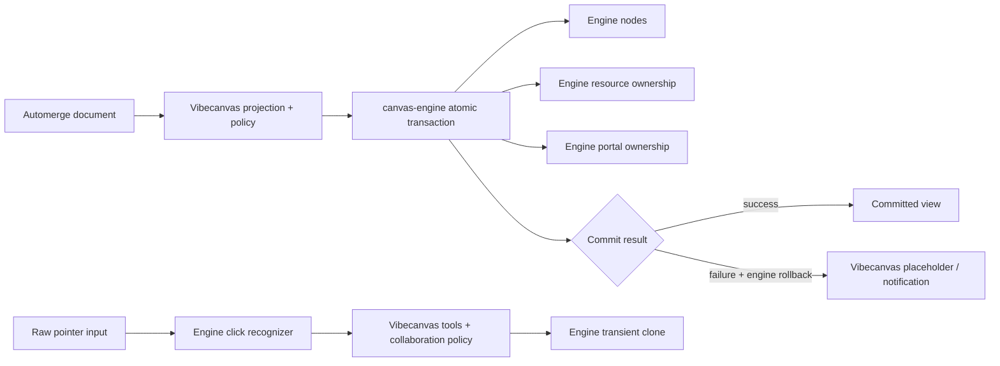

# S112 - canvas: adopt engine-owned lifecycle primitives and remove product duplicates
[Overview](../BASED.md)

Adopt the updated `canvas-engine` ownership, atomic transaction, rollback,
transient-cloning, and click-recognition APIs, then delete the corresponding
generic infrastructure from `packages/canvas`.

## Context

This task assumes a released and provenance-verifiable engine artifact provides:

1. owner-scoped resource reconciliation and cleanup;
2. owner-scoped portal lifecycle with serialized asynchronous updates;
3. one atomic transaction across nodes, resources, portals, and transients;
4. automatic last-good rollback with structured diagnostics;
5. durable-scene to owner-scoped transient subtree cloning; and
6. pointer-sequence-based click and double-click recognition.

Vibecanvas currently implements those generic responsibilities around:

- `packages/canvas/src/engine/resources/ResourceOwnership.ts`;
- `packages/canvas/src/engine/portals/PortalOwnership.ts`;
- `packages/canvas/src/engine/projection-runtime/ProjectionRuntimePort.ts`;
- rollback and snapshot logic in
  `packages/canvas/src/engine/CanvasEngineAdapter.ts`;
- `packages/canvas/src/engine/product-runtime/fn.transient.ts`; and
- click synthesis in the event-listener plugin.

The application must continue to own Automerge projection, persisted-schema
mapping, product history, image retention, selection/focus policy, tools,
snapping, binding persistence, widgets, renderer registration, notifications,
theme tokens, and collaborative conflict policy.

No mockup is needed: this is an internal responsibility transfer with no
intended visual change.

## Engine prerequisite contract

Before changing product code, pin an immutable engine artifact and verify its
public API and semantics with contract tests.

| Capability | Required engine guarantee | Vibecanvas responsibility |
|---|---|---|
| Resources | Declarative owner reconciliation, shared lifetime, stale-load protection, exact cleanup | Produce resource descriptors and product URLs |
| Portals | Owner reconciliation, serialized/coalesced updates, stale-work cancellation, exact unmount | Provide portal descriptions and renderer host/registry |
| Transactions | Validate and atomically publish node/resource/portal/transient changes | Compute product projection diff |
| Rollback | Preserve or restore the last committed scene and compensate staged ownership | Choose product placeholder/retry/notification policy |
| Transients | Clone scene subtrees with transient IDs, ownership, transforms, and explicit resource/portal policy | Decide gesture semantics and durable product commit |
| Clicks | Match down/up, pointer, button, movement, cancellation, drag, target, and double-click thresholds | Decide selection, editing, focus, and tool actions |

Do not begin the subtraction if any required behavior is private, undocumented,
or available only through engine-internal types. Do not retain a permanent
Vibecanvas compatibility implementation for a missing engine guarantee.

## Target architecture

## Plan

### 1. Pin and prove the updated engine

- Replace the current engine artifact with the immutable updated release.
- Record version, commit, artifact path, and SHA-256.
- Add boundary tests proving only public engine exports are consumed.
- Add focused contract tests for atomicity, rollback, ownership replacement,
  asynchronous invalidation, transient cloning, and click recognition.
- Compare the engine behavior with the product invariants currently protected
  by the application implementations.

### 2. Move projection publication to the engine transaction

- Keep product projection and diff computation in Vibecanvas.
- Translate one authoritative projection result into one engine transaction.
- Reconcile nodes, resource owners, portal owners, and transient changes within
  the same commit boundary.
- Consume structured engine failures and map them to the existing
  product-local placeholder, retry, diagnostic, and notification policy.
- Remove application-side staging and publication-order coordination from
  `ProjectionRuntimePort`.

### 3. Replace resource and portal ownership

- Replace `ResourceOwnership` with engine owner reconciliation.
- Preserve product resource descriptor creation and image URL/version policy.
- Replace `PortalOwnership` with engine owner reconciliation while retaining
  the Vibecanvas widget portal renderer host and renderer registry.
- Route portal mount/update/unmount through the engine lifecycle contract.
- Prove delayed resource and portal promises cannot mutate replaced, removed,
  or destroyed owners.
- Delete the product ownership classes and tests that duplicate engine
  behavior; retain product-boundary integration tests.

### 4. Remove application rollback mechanics

- Remove scene snapshot reconstruction and compensating rollback from
  `CanvasEngineAdapter`.
- Treat a successful engine transaction as the only publication point.
- On a rejected transaction, consume the engine's restored revision and
  structured diagnostics without replaying application-owned engine state.
- Keep projection retry and visible product-placeholder decisions outside the
  engine.

### 5. Adopt engine transient cloning

- Replace product-runtime node-copy helpers with the engine subtree-clone API.
- Use returned durable-to-transient ID mappings for preview bookkeeping.
- Declare resource sharing and portal omission/cloning explicitly for each
  preview type.
- Migrate transform, Alt-drag clone, widget placement, line editing, and other
  preview sessions that currently reproduce engine node descriptions.
- Keep allocation of durable product IDs, binding remapping, widget clone
  policy, Automerge writes, history, and backend side effects in Vibecanvas.
- Delete `fn.transient.ts` once no product code reconstructs generic engine
  transients.

### 6. Adopt engine click and double-click events

- Remove pointer-up-only click synthesis from the event-listener plugin.
- Subscribe product behavior to the engine's semantic click stream.
- Configure explicit movement, timing, target, and double-click thresholds.
- Preserve Vibecanvas selection, focus, text-edit entry, and tool policy.
- Verify mouse, touch, pen, drag, cancellation, capture loss, and target-change
  sequences.
- Close B56 only after its acceptance criteria pass through the engine-backed
  path.

### 7. Delete compatibility code and qualify

- Remove obsolete ownership, staging, rollback, transient-copy, and click-state
  code instead of leaving parallel paths.
- Remove obsolete exports, tests, types, error classes, and diagnostics.
- Confirm no application import reaches an engine-private module.
- Run canvas, widget-host, `ui-ai-chat`, monorepo, browser/input,
  collaboration, lifecycle, and performance verification.
- Update canvas architecture, performance, compatibility, and migration
  documents with the final responsibility boundary.

## TODOS

- [ ] Pin and verify the immutable engine artifact containing all prerequisite APIs.
- [ ] Add public-boundary contract tests for the six engine capabilities.
- [ ] Publish nodes, resources, portals, and transients through one engine transaction.
- [ ] Replace and delete application resource ownership.
- [ ] Replace and delete application portal ownership.
- [ ] Verify serialized portal updates and reconcile B58.
- [ ] Remove application scene snapshot/rollback mechanics.
- [ ] Replace generic transient-copy helpers with engine subtree cloning.
- [ ] Replace application click synthesis and satisfy B56.
- [ ] Remove obsolete compatibility types, errors, tests, and exports.
- [ ] Update architecture, performance, compatibility, and migration documentation.
- [ ] Pass package, monorepo, browser, collaboration, lifecycle, and performance gates.

## Acceptance criteria

- `ResourceOwnership.ts` and `PortalOwnership.ts` are deleted, with only
  product descriptor/renderer integration remaining.
- `ProjectionRuntimePort` no longer implements generic ownership staging or
  publication ordering.
- `CanvasEngineAdapter` does not reconstruct engine snapshots or implement its
  own scene rollback.
- Generic durable-to-transient node copying is removed from `fn.transient.ts`;
  product preview policy uses the public engine cloning API.
- Click and double-click are emitted by the engine only after valid pointer
  sequences, and Vibecanvas contains no second recognizer.
- A projection transaction cannot expose mismatched nodes, resources, or
  portals.
- Delayed resource/portal work cannot mutate a replaced, removed, or destroyed
  owner.
- Failed transactions leave the last committed scene usable and produce
  structured diagnostics for product placeholders and notifications.
- Automerge data, persisted schemas, history semantics, selection/focus policy,
  tools, bindings, widgets, collaboration policy, and backend image retention
  remain application-owned and behaviorally unchanged.
- No dual lifecycle implementation, private engine import, or permanent
  compatibility layer remains.
- Existing visual behavior and zero-idle-work expectations remain unchanged.

## NOTES

- The goal is subtraction. Thin conversion code at the product boundary is
  expected; duplicate lifecycle state machines are not.
- Engine transaction success must not imply Automerge success. Product writes
  remain authoritative and continue through the existing serialized
  collaboration path.
- Engine rollback covers engine-visible state. It does not replace product
  history or compensate backend image operations.
- The portal renderer registry remains in Vibecanvas because it constructs
  product widget content; only ownership and lifecycle ordering move.
- D3 still owns product projector scale cliffs. An engine transaction API does
  not remove collection-sized work in product projection.

### LOGS

- 2026-07-24: Created from the engine feature request for generic resource and
  portal ownership, atomic projection, rollback, transient cloning, and click
  recognition. Task assumes those public engine APIs have been released before
  implementation begins.

---
