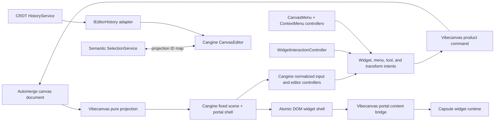

# S113 - canvas: adopt Cangine 0.2 editor and fixed widget frames
[Overview](../BASED.md)

Upgrade Vibecanvas to `@omnidraw/cangine` 0.2.0, adopt the optional `/editor`
controllers and fixed widget-frame contract, and delete application-owned
chrome, menu presentation, widget hit routing, fullscreen projection, and
transform policy that Cangine now owns. Preserve Automerge as the only durable
canvas authority and Capsule as the untrusted widget-content runtime.

## Context

Cangine 0.2.0 adds the optional
`@omnidraw/cangine/editor` entrypoint and expands the public ownership boundary
for widget frames, selection transforms, pointer cancellation, menus, and DOM
portals. The relevant consumer guide is:

- `/Users/omarezzat/Workspace/vibecanvas/canvas-engine/library-guide.md`
- sections 1-2: optional `/editor` entrypoint;
- section 9: fixed widget frames;
- section 14: normalized pointer-cancel reconciliation;
- section 15: selection and transform policy;
- section 19: atomic DOM portal-backed widget projection; and
- sections 30-31: application ownership and recommended editor integration.

The Cangine package manifest is authoritative and reports version `0.2.0`.
The guide's installation paragraph still mentions 0.1.0; do not copy that
stale version or tarball name. Vibecanvas currently pins an absolute 0.1.2
artifact in `packages/canvas/package.json`.

The current Vibecanvas projection emits pre-1.0 widget-frame fields that
Cangine 0.2.0 rejects:

- `controls`;
- `style`;
- `active`;
- `subtitle`; and
- caller-owned title-bar dimensions, radius, border, body, and active outline.

These fields and their surrounding behavior are spread across:

- `packages/canvas/src/engine/projection/projectors/fn.widget.ts`;
- `packages/canvas/src/engine/projection/projectors/fn.widget-chrome.ts`;
- `packages/canvas/src/engine/product-runtime/typed.ts`;
- `packages/canvas/src/engine/product-runtime/fn.transient.ts`;
- `packages/canvas/src/services/widget-placement/fn.widget-placement.ts`;
- `packages/canvas/src/services/element/ElementService.ts`;
- `packages/canvas/src/services/element/types.ts`; and
- `packages/ui-ai-chat/src/widget/WidgetManagerService.ts`.

Vibecanvas also duplicates editor behavior now offered by Cangine:

- widget traffic-light and header-action hit parsing;
- content/frame focus and canvas-maximized presentation;
- DOM context-menu mounting, positioning, focus, dismissal, and cleanup;
- undo/redo keyboard routing;
- standard transform/aspect-ratio policy;
- transform hover cursor acquisition; and
- some generic tool/selection input routing.

The ownership transfer is not a license to make Cangine's scene the product
document. Vibecanvas currently uses:

```text
Automerge document -> pure projection -> Cangine scene
```

That remains the only durable direction. Cangine editor tools, commands, and
controllers must emit or be adapted into product intents that commit through
the existing CRDT services. A direct standard-editor scene mutation would be
overwritten by the next projection and could diverge across collaborators.

No UI mockup is needed. The task standardizes existing widget chrome and
interaction behavior instead of introducing a new product screen.

## Fixed decisions

- Import editor APIs only from `@omnidraw/cangine/editor`. The root package does
  not re-export them, and core-only consumers must not evaluate editor code.
- Automerge remains the authoritative document, collaboration, persistence,
  and product-history model.
- Use `createCanvasEditor()` as the replaceable editor/controller kernel.
  Do not install standard tools or commands that directly mutate the projected
  scene unless they are replaced with CRDT-backed implementations.
- Do not use Cangine `LinearEditorHistory`. Adapt Vibecanvas history to
  `IEditorHistory` so undo/redo applies authoritative CRDT operations.
- Keep `SelectionService` as the semantic owner of product element/group
  selection. Synchronize it with editor node-ID selection through the
  projection index; do not replace product targets with renderer node IDs.
- Keep `ToolService` for asynchronous product tool sessions in this task.
  Cangine's tool registry does not currently replace its commit/cancel session
  contract. A later task may remove it after a public session adapter exists.
- Use `WidgetInteractionController` for frame/content modes, fixed chrome
  activation, local canvas-maximized presentation, hover state, and the shared
  widget menu.
- Canvas maximize is ephemeral presentation state, not collaborative document
  state and not browser fullscreen.
- Minimize/collapse remains a product-owned durable decision projected through
  the Cangine `collapsed` field.
- Cangine owns portal host placement, transform, clip, opacity, visibility,
  scene z-index, and input gating. Vibecanvas owns Capsule content mounting,
  asynchronous update ordering, lifecycle channels, business services, and
  internal HTML focus targets.
- Keep `PortalContentBridge` and the product-specific transactional projection
  boundary. Delete only visual/placement behavior proven redundant with the
  Cangine portal manager.
- Product permissions, confirmations, deletion, definition management, header
  actions, backend effects, and resource access remain Vibecanvas-owned.

## Target architecture



## Plan

### 1. Pin and qualify Cangine 0.2.0

- Replace the absolute 0.1.2 dependency with the approved immutable 0.2.0
  package artifact at its canonical local absolute path.
- Update the lockfile and artifact identity/audit tests.
- Record the package version, artifact location, SHA-256, and engine commit in
  this task's logs.
- Add a package-boundary test proving `/editor` is imported only through the
  public subpath.
- Add a Node import smoke test proving the `/editor` entrypoint does not touch
  `window` or `document` merely by being imported.
- Establish a green pre-migration baseline for canvas and `ui-ai-chat`; record
  unrelated failures rather than weakening gates.

### 2. Convert all widget projections to the fixed frame schema

- Rewrite `fn.widget.ts` to emit only supported fixed-frame properties:
  `size`, optional `title`, optional `titleBarColor`, optional `headerItems`,
  optional `portal`, `collapsed`, `resizable`, and size constraints.
- Remove custom traffic-light descriptors. Cangine always owns close,
  minimize, and maximize traffic lights.
- Convert product title-bar actions into bounded `headerItems` descriptors:
  button actions for immediate product intents and dropdown descriptors for
  bounded flat menus.
- Keep callbacks and product authority outside scene data. Scene descriptors
  contain only IDs, labels, text/image content, disabled state, and menu items.
- Use registered image resource IDs for header icons. Never insert raw SVG/XML
  into scene data.
- Remove custom title-bar height, radius, border, shadow, body paint, padding,
  typography, control spacing, and active outline.
- Reconcile minimum size with Cangine's fixed bounds. Application content may
  raise the minimum but may not lower the engine minimum.
- Delete `fn.widget-chrome.ts`.
- Delete `TElementWidgetChrome`, `TElementWidgetChromeAction`,
  `getWidgetChrome`, and the widget-chrome projection extension in
  `ElementService`.
- Remove the deprecated widget-frame fields from product-runtime transient
  types and conversions.
- Replace the styled widget-frame drop ghost with ordinary transient
  `group`/`rect`/`text` nodes, or a plain fixed frame if standard chrome is
  intentionally desired. A placement preview must not depend on rejected
  styling fields.
- Update fixtures, snapshots, validators, tests, and debug tooling. Do not add
  a compatibility mapper that silently accepts deprecated fields indefinitely.

### 3. Remove the persisted fullscreen/window state machine

- Audit the persisted widget `expanded` and `window` fields and all creation,
  clone, preview, publication, context-menu, lifecycle, and projection callers.
- Define one durable collapse representation. Prefer the existing `expanded`
  boolean projected as `collapsed: !expanded`, then remove the redundant
  `window: "minimized"` state.
- Add an explicit deterministic Automerge document migration:
  - legacy minimized -> `expanded: false`;
  - legacy fullscreen -> contained, `expanded: true`;
  - contained -> preserve current expanded value.
- Remove `window` from new widget element creation and all new writes after the
  migration.
- Delete fullscreen overlay reparenting in full and incremental projection.
- Delete viewport-sized widget geometry, identity-transform, `screen-fixed`
  portal scaling, fullscreen-specific resize disabling, and fullscreen menu
  actions from application code.
- Replace the old persisted fullscreen action with Cangine controller
  `maximize()`/`restore()` or its maximize activation. This state must not
  write Automerge or product history.
- Feed current local canvas-maximized state into the Capsule lifecycle channel.
  Rename the lifecycle property to `canvasMaximized` if the public contract can
  be changed in the same release; otherwise deprecate the old `fullscreen`
  name with one bounded compatibility translation and document its exact
  removal point.
- Browser fullscreen, if introduced later, remains a distinct application
  feature and must not reuse canvas-maximized state.

### 4. Introduce the editor kernel without creating a second authority

- Construct one `CanvasEditor` beside the engine with:
  - no linear history;
  - no direct standard scene-mutating commands;
  - no duplicate standard selection tool;
  - custom error reporting through existing diagnostics; and
  - an application-owned history adapter.
- Implement a thin `IEditorHistory` adapter over `HistoryService`, including
  subscriptions, attach/detach lifecycle, coalescing behavior, undo, redo,
  clear, and destruction ownership.
- Register CRDT-backed editor commands for the product effects consumed by
  menus and keyboard shortcuts. Commands may close over product services but
  must never persist by mutating `engine.scene`.
- Synchronize `SelectionService` targets to projected engine node IDs after
  selection and projection changes.
- Synchronize editor-originated widget frame selection back to semantic
  product targets using the projection index and a feedback-loop guard.
- Preserve ordered group/element selection, nested drill-down, focus rules,
  pruning after remote changes, and content focus without ordinary selection.
- Attach controllers before generic product tool routing so widget/menu input
  can stop propagation.
- Tear down controllers, editor adapters, subscriptions, and engine in strict
  reverse ownership order.

### 5. Adopt `WidgetInteractionController`

- Create one controller per canvas runtime using the editor kernel, shared menu
  controller, canvas/portal focus root, and a product activation callback.
- Map activation widget node IDs through the projection index to semantic
  widget element IDs. Reject stale or non-widget mappings.
- Handle typed activations:
  - close -> existing product instance-removal command and confirmation policy;
  - minimize -> authoritative `expanded: false` CRDT command;
  - maximize -> controller-owned local canvas-maximized state only;
  - header button -> current widget title action;
  - dropdown item -> current product menu action.
- Use controller frame/content modes for title-bar selection, portal focus,
  input/IME preservation, shortcut suppression, cursor state, and ambient
  content focus.
- Remove `isWidgetFrameControl` and old `control:*`/`widget-*` parsing from
  `EventListener.plugin.ts`, `Select.plugin.ts`, semantic hit mapping, and
  `WidgetManagerService`.
- Remove duplicate direct re-hit tests that exist only to find legacy frame
  controls.
- Stop invalidating the entire widget projection merely to draw an application
  active outline. Cangine controller focus presentation is ephemeral.
- Preserve Capsule focus/lifecycle synchronization from the controller's
  current content mode.
- Test close, minimize/restore, maximize/restore, header buttons, dropdowns,
  title-bar drag, content focus, nested editable content, IME, wheel, keyboard,
  teardown, remote deletion, and stale activation.

### 6. Replace custom context-menu presentation

- Construct one `CanvasMenuController` with the canvas overlay host and share it
  between context menus and widget dropdowns.
- Construct `CanvasContextMenuController` for secondary pointer activation,
  Context Menu key, and Shift+F10.
- Do not adopt `standardCanvasContextMenuItems` unchanged. Convert the existing
  product provider result into bounded Cangine menu descriptors whose
  activations execute CRDT-backed commands.
- Preserve semantic context: canvas/item/selection/connection scope, nested
  group selection, resolved product entities, authorization, confirmations,
  and disabled/hidden decisions.
- Keep native browser context menus inside interactive Capsule widget content.
- Delete the Solid/Kobalte `CanvasContextMenu` component and its CSS after the
  Cangine presenter reaches visual and accessibility parity.
- Delete menu mount nodes, synthetic contextmenu dispatch, coordinate state,
  request IDs, focus restoration, dismissal listeners, collision logic, and
  DOM cleanup from `ContextMenu.plugin.ts` and `ContextMenuService`.
- Reduce `ContextMenuService` to product action-provider policy, or replace it
  with pure provider functions if no stateful responsibility remains.
- Verify one visible top-layer `role="menu"`, keyboard navigation, focus
  restoration, host-edge clamping, Escape/outside dismissal, widget dropdown
  sharing, and complete teardown.

### 7. Adopt Cangine transform policy and hover state

- Replace application `keepAspectRatio` with Cangine `aspectRatioMode`:
  `free`, `locked`, `shift-lock`, or `shift-invert`.
- Use Cangine `resolveStandardTransformPolicy()` as the baseline for ordinary
  projected kinds.
- Overlay only product-specific constraints from element definitions,
  permissions, locks, semantic groups, and collaboration state.
- Preserve the Cangine image default (`shift-invert`), ordinary shape/group
  default (`shift-lock`), widget no-rotation intrinsic resize behavior, text
  width reflow, and conservative constrained multi-selection behavior.
- Remove duplicate aspect-ratio aggregation and common-handle policy once the
  public resolver covers it.
- Keep CRDT proposal persistence, group descendant transforms, clone-drag asset
  handling, authoritative projection handoff, product history, and remote
  conflict cancellation in `Transform.plugin.ts`.
- Ensure `proposal.nextSize` is persisted correctly for widget, image, shape,
  and text width-reflow proposals; never persist widget resize as transform
  scale.
- Subscribe to `engine.transforms.subscribeHover()` and derive the canvas
  mouse/pen cursor from it, falling back to the active product tool cursor.
- Delete application handle acquisition enlargement or cursor geometry if any
  is found. Cangine owns at least 24x24 mouse/pen and 44x44 touch acquisition.
- Use `stacking: "front"` only through canvas-maximized widget presentation;
  ordinary transforms preserve durable order.

### 8. Confirm pointer-cancel reconciliation

- Do not add a second lost-pointer-capture timer.
- Audit native `lostpointercapture`, pointer-cancel timers, and gesture cleanup
  across canvas, widget placement, tools, transforms, recorder, and portals.
- Keep listeners that react to normalized `pointer-cancel` by cancelling
  product sessions.
- Add focused tests for:
  - normal pointer cancel;
  - transient lost capture followed by recovery inside 50 ms;
  - unreconciled lost capture producing one normalized cancel;
  - no duplicate cancel;
  - tool/widget placement/transform cleanup; and
  - teardown during the reconciliation window.

### 9. Qualify atomic portal-backed widget projection

- Verify a portal-backed widget produces one Cangine DOM shell containing real
  fixed chrome and the application portal host.
- Verify WebGL2 does not paint duplicate retained chrome for that widget.
- Test overlapping widgets so lower widget HTML cannot cover higher widget
  chrome.
- Test world transforms, resize, zoom, clipping, opacity, visibility,
  occlusion, scene z-index, collapsed content, and canvas-maximized mode.
- Remove any application DOM transform, clip, z-index, visibility, or
  pointer-gating writes that duplicate Cangine.
- Retain `PortalContentBridge` responsibilities for Capsule descriptor
  interpretation, stable content identity, serialized asynchronous updates,
  generation rejection, viewport/lifecycle publication, and cleanup.
- Retain product transactional ownership staging unless Cangine exposes an
  equivalent public atomic reconciliation contract that preserves projection
  rollback.
- Preserve renderer registration, Capsule population priority, functions,
  resources, collaborative state, props, theme, output, errors, and terminal
  cleanup.

### 10. Delete obsolete code and update documentation

- Delete:
  - `fn.widget-chrome.ts`;
  - deprecated widget-frame product types and converters;
  - custom widget control aliases and re-hit routing;
  - persisted fullscreen projection branches and writes;
  - custom context-menu component/presenter state;
  - `HistoryControl.plugin.ts` after editor history commands are active;
  - duplicate transform policy/cursor/acquisition code; and
  - obsolete tests, fixtures, metrics, and diagnostics tied only to removed
    implementations.
- Keep `ToolService`, semantic `SelectionService`, CRDT history authority,
  durable transform persistence, Capsule mounting, and product action policy.
- Update `docs/internal/llm.widget-system.md` to identify:
  - Cangine ownership of fixed chrome, widget frame/content mode,
    canvas-maximized presentation, portal shell placement, transform
    affordances, and shared menu presentation;
  - Vibecanvas ownership of Automerge, collapse, deletion, product commands,
    permissions, business effects, browser fullscreen, and Capsule lifecycle;
  - Capsule ownership of untrusted widget execution and internal content.
- Update Cangine migration/integration documentation references, tests, and
  `FILES.md` for changed production files.
- Run dead-code and dependency scans proving Kobalte context-menu code and old
  widget-frame fields are absent where no other feature uses them.

## TODOS

- [x] Pin and record the immutable Cangine 0.2.0 package and update the lockfile.
- [x] Add `/editor` public import and Node import-safety contract tests.
- [x] Convert authoritative widget projection to the fixed frame schema.
- [x] Delete custom widget chrome types, projection extension, styles, and controls.
- [x] Replace the styled widget drop ghost with supported transient nodes.
- [x] Migrate legacy minimized/fullscreen documents to one durable collapse state.
- [x] Remove persisted fullscreen/window writes and projection branches.
- [x] Add the lower-level editor kernel without standard scene mutation.
- [x] Adapt CRDT `HistoryService` to `IEditorHistory`.
- [x] Synchronize semantic product selection with editor node-ID selection.
- [x] Adopt `WidgetInteractionController` and typed product activation mapping.
- [x] Remove legacy widget control hit aliases, re-hit routing, and active-outline invalidation.
- [x] Adopt the shared Cangine menu and context-menu controllers.
- [x] Delete the Solid/Kobalte canvas context-menu presenter and state.
- [x] Replace `keepAspectRatio` with `aspectRatioMode`.
- [x] Use standard transform policy and hover cursor where product policy permits.
- [x] Verify pointer-cancel reconciliation without an application timer.
- [x] Qualify the atomic DOM widget shell and remove duplicate DOM presentation writes.
- [x] Preserve Capsule content, CRDT, product commands, permissions, and collaboration ownership.
- [x] Update widget-system and migration documentation.
- [x] Remove obsolete files, exports, tests, fixtures, dependencies, and `FILES.md` entries.
- [x] Pass the complete package, browser, collaboration, lifecycle, and release gates.

## Acceptance criteria

- Vibecanvas consumes the approved immutable `@omnidraw/cangine` 0.2.0 package
  without an absolute developer path.
- `/editor` is imported only through its public subpath and is safe to import in
  Node without evaluating browser globals.
- No active Vibecanvas projection or transient emits rejected widget-frame
  `style`, `subtitle`, `iconResourceId`, `controls`, or `active` fields.
- Fixed traffic lights, 36-unit title bar, chrome metrics, hit regions, minimum
  size enforcement, and portal shell presentation come from Cangine.
- Product header actions are bounded declarative `headerItems`; callbacks and
  authority never enter scene data.
- `fn.widget-chrome.ts`, `getWidgetChrome`, custom widget control aliases, and
  the application active-outline projection are deleted.
- New and migrated widget documents have one durable collapse representation
  and no persisted canvas-fullscreen/window state machine.
- Canvas maximize is local, reversible, non-historical, non-collaborative, and
  restores exact durable geometry.
- Cangine editor/controllers never become a second durable scene authority.
  Every durable product effect commits through Automerge and returns through
  the normal projection pipeline.
- Cangine `LinearEditorHistory` is not used. Undo/redo executes authoritative
  Vibecanvas history through a custom adapter.
- Semantic group/element selection, nested drill-down, focus, pruning, and
  collaboration behavior remain correct while editor node-ID selection stays
  synchronized.
- Widget frame/content focus, close, minimize, maximize, header buttons, and
  dropdowns are routed through typed `WidgetInteractionController` state and
  activations.
- One Cangine menu presenter serves canvas context menus and widget dropdowns;
  the custom Solid/Kobalte canvas menu presenter and duplicate DOM lifecycle
  are deleted.
- Product permissions, confirmations, menu effects, deletion, definition
  management, and CRDT command semantics remain application-owned.
- Transform policy uses `aspectRatioMode`, Cangine handle acquisition, hover
  cursor state, intrinsic resize proposals, and conservative multi-selection
  resolution without losing product locks or collaboration cancellation.
- Vibecanvas contains no lost-capture reconciliation timer and receives exactly
  one normalized pointer cancel for an unreconciled capture loss.
- A portal-backed widget is one atomic DOM shell with no duplicate WebGL chrome
  and correct transform, clip, opacity, visibility, z-index, and input gating.
- Capsule content mounting, serialized asynchronous updates, lifecycle
  channels, backend services, resources, collaborative state, and cleanup
  remain correct.
- `ToolService` remains the owner of asynchronous product tool sessions unless
  a separately documented public Cangine replacement is adopted.
- Canvas, `ui-ai-chat`, widget-host, SDK lifecycle, collaboration, migration,
  browser input, accessibility, visual, leak, build, and release gates pass.

## Verification matrix

### Static and package gates

- Canvas and `ui-ai-chat` TypeScript.
- Functional-core lint and import-boundary checks.
- Cangine artifact identity/audit test.
- Deprecated widget-frame field scan.
- Legacy widget control/fullscreen state scan.
- Dead export, unused dependency, and `FILES.md` validation.

### Unit and integration gates

- Fixed widget projection and header descriptor fixtures.
- Legacy widget document migration.
- CRDT editor-history adapter and coalescing.
- Semantic target <-> engine node selection synchronization.
- Product activation mapping and stale-node rejection.
- Context-menu provider conversion and command authorization.
- Aspect-ratio, widget/image/shape/text resize, and multi-selection policy.
- Pointer-cancel reconciliation and session cleanup.
- Portal mount generation and serialized Capsule update behavior.

### Browser and accessibility gates

- Mouse, pen, touch, keyboard, Context Menu key, and Shift+F10.
- Widget close/minimize/maximize/restore and header menus.
- Widget title-bar drag and eight-edge intrinsic resize.
- Portal focus, tab navigation, editable content, IME, wheel, and shortcuts.
- Transform hover cursors at multiple camera rotations and DPRs.
- Menu focus restoration, collision, dismissal, and top-layer behavior.
- Overlapping portal widgets with correct atomic z-order and clipping.
- Light/dark themes and Cangine's fixed chrome/title-bar color input.

### Collaboration and lifecycle gates

- Two clients observing authoritative collapse, resize, deletion, and history.
- Canvas-maximized state remains local to one client.
- Remote deletion/transform cancels active local gestures safely.
- Projection replacement, runtime recreation, and teardown leave no menu,
  editor, portal, listener, timer, or Capsule handle leaks.
- Reload after document migration produces contained, non-maximized widgets.

## Coordination

- S111 remains the parent hard renderer migration and owns its still-open
  browser/performance/release qualification.
- S112 owns resource registration, publication, transient cloning, normalized
  click adoption, and the established portal-content responsibility boundary.
  Do not restore staging or click infrastructure removed there.
- B56 and B58 remain historical evidence for engine click recognition and
  application-owned serialized portal content updates.
- Coordinate changes to `WidgetManagerService`, projection/runtime adapters,
  widget lifecycle contracts, `docs/internal/llm.widget-system.md`, lockfile,
  artifact audit tests, and `FILES.md` with any concurrent S111/S112 work.

## NOTES

- The highest-value subtraction is fixed widget chrome plus
  `WidgetInteractionController`; it removes custom schema, hit routing, focus,
  maximize, active-outline, and menu behavior together.
- The standard editor preset is intentionally not the integration boundary.
  Its direct engine mutations and local history are correct for standalone
  editors but not for Vibecanvas's CRDT-authoritative projection model.
- The existing portal wrappers are not automatically dead code. Their content
  lifecycle and projection rollback behavior remain product responsibilities
  until a public Cangine contract proves otherwise.
- `resolveStandardTransformPolicy()` is a baseline, not permission policy.
  Product locks, semantic groups, and authorization may narrow its result.
- The 50 ms pointer reconciliation window belongs to Cangine. Product code
  reacts to the resulting normalized cancel and does not reproduce the timer.

### LOGS

- 2026-07-25: Created from a read-only Cangine 0.2.0 adoption audit. Confirmed
  that Vibecanvas still pins 0.1.2 and emits rejected pre-1.0 widget-frame
  fields. Identified fixed chrome, widget interaction, shared menu
  presentation, history shortcut routing, fullscreen projection, transform
  policy, and hover cursor as subtraction candidates. Preserved Automerge,
  semantic selection, product tool sessions, transform persistence,
  transactional projection, PortalContentBridge, Capsule content, and product
  business effects as application-owned boundaries.
- 2026-07-25: Bound `@omnidraw/cangine@0.2.0` to engine commit
  `07fef171dc110a8ae1aa54820ee1a13b5c2f29a1` through the absolute local
  artifact at
  `/Users/omarezzat/Workspace/vibecanvas/canvas-engine/artifacts/omnidraw-cangine-0.2.0.tgz`
  from `packages/canvas`. The initially prepared vendored tarball was removed
  in favor of the requested workspace dependency.
- 2026-07-25: Replaced application widget chrome, control-hit aliases,
  persisted fullscreen projection, context-menu DOM presentation,
  history-shortcut plugin, and duplicate transform policy with the Cangine
  fixed-frame, editor, widget-interaction, shared-menu, standard-transform,
  hover, and pointer-reconciliation contracts. Added deterministic legacy
  `window` migration and retained Automerge/Capsule/product policy authority.
- 2026-07-25: Regenerated `FILES.md` and updated widget-system, Cangine,
  Capsule, migration, compatibility, and screen documentation. Removed the
  obsolete title-action `kind` hint after fixed header descriptors made it
  inert.
- 2026-07-25: Verification passed: canvas, UI, and Automerge TypeScript;
  functional-core lint; artifact/import-boundary scans; the complete monorepo
  `bun run test`; canvas 79 files/373 tests; UI 42 files/216 tests;
  Automerge 110 tests; architecture/external-composition gates; widget-host
  gates; and `bun run build:single` for `vibecanvas-darwin-arm64`.
- 2026-07-25: Browser smoke passed against the development server. A real
  canvas rendered; the shared context menu opened and dismissed with Escape;
  a real AI widget used Cangine traffic lights and atomic portal content;
  local maximize filled the canvas and restored the exact
  `480x320 @ (410,160)` geometry; durable collapse reduced the frame to the
  fixed 36-unit title bar and restored it; and the temporary widget was
  removed after qualification.
- 2026-07-25: The browser console contained no migration errors. The existing
  local canvas separately surfaced its established server-side widget metadata
  projection quarantine (`Object.entries` on a missing persisted projection
  root) during durable writes; S113 does not change that service projection
  boundary.

---
