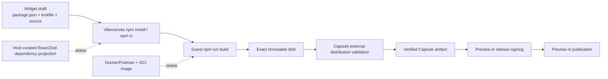

# S114 - widgets: replace OCI builds with application-owned npm distributions

[Overview](../BASED.md)

Replace Vibecanvas's Docker/Podman Capsule build boundary with an
application-owned npm project build followed by Capsule 0.9.3 external
distribution validation. Make each guest widget's `package.json`, lockfile,
build script, source, and emitted `dist/` authoritative, then delete the
OCI-specific runtime, configuration, prerequisite, and test infrastructure.

## Status

Implemented against Capsule 0.9.3.

Capsule source commit `e302a6cbd00fd7932417c9b377597878db0afe25`
ships the public `capsule-external-distribution-v1` input through
`@omnidraw/capsule/build`. Capsule no longer exports `build-runner` and no
longer installs dependencies, compiles source, or owns an OCI runner.

Vibecanvas explicitly accepts that dependency installation, package lifecycle
hooks, guest-controlled `npm run build` scripts, build plugins, and transitive
tooling execute with the build-server account's host authority. This is not an
OS hostile-code isolation boundary. The accepted risk is documented in
[`llm.widget-system.md`](../../docs/internal/llm.widget-system.md).

## Context

Before S114, Vibecanvas built widget UI source through
[`WidgetCapsuleOciBuild.ts`](../../apps/cli/src/services/WidgetCapsuleOciBuild.ts).
The service requires a pinned Docker or Podman executable, a running daemon,
and an exact OCI image. Startup probes those prerequisites, while
`WidgetArtifactBuilderCapsule` constructs a host-curated Capsule dependency
projection and sends source to the networkless OCI worker.

Capsule's production boundary has changed:

- applications own dependency selection, installation, source compilation,
  bundling, build scripts, credentials, cancellation, cleanup, and any desired
  hostile-build isolation;
- Capsule accepts only an exact external distribution;
- Capsule defensively captures and validates a closed ES2022 `.js`/`.mjs`
  graph, exact CSS/resource roots, capabilities, channels, budgets, and target;
- Capsule constructs and independently verifies the immutable artifact;
- artifact provenance records the external producer and exact distribution,
  lock, source-revision, and build-configuration identities;
- Capsule claims deterministic ingestion only, not deterministic reproduction
  or isolation of the application-owned build.

Docker, Podman, an OCI image, and a container daemon must not be prerequisites
for widget creation, validation, Preview, or publication. Node and npm are host
prerequisites.

## External prerequisite contract

Capsule 0.9.3 publicly provides and documents:

1. `buildCapsuleGuest()` accepting only
   `input.kind: 'external-distribution'`.
2. Exact copied distribution files, one entry, optional ordered CSS roots, and
   exact external resource bindings.
3. A closed ES2022 relative import graph plus the reserved `capsule:bridge`
   intrinsic.
4. Rejection of source maps, `sourceMappingURL`, HTML, bare package imports,
   runtime `require`, dynamic import, `import.meta`, top-level await, workers,
   Wasm, native modules, unresolved output, and loose files.
5. Scoped CSS and exact PNG/SVG/WOFF resource closure, plus WAVE/WebM with the
   required resource profile.
6. External producer, source revision, dependency-lock digest,
   build-configuration digest, and complete distribution digest provenance.
7. Independently verified artifact bytes through the existing signing and host
   verification contract.
8. Stable bounded build diagnostics through the public `build` entry.
9. Explicit documentation that the application owns installation, scripts,
   plugins, network, credentials, isolation, cancellation, and cleanup.

Only public Capsule package entries may be consumed. No removed `build-runner`,
private workspace path, source compiler, or OCI compatibility shim may remain.

## Target architecture

## Plan

### 1. Pin and prove Capsule 0.9.3

- Refresh the local/package lock to Capsule 0.9.3 and record source commit and
  package identity.
- Update package-boundary tests for the eight supported public entries and
  prove `@omnidraw/capsule/build-runner` is unavailable.
- Port Capsule's external-distribution example into a focused Vibecanvas
  integration test before deleting the existing OCI builder.

### 2. Make widget npm projects authoritative

- Require `package.json`, package-lock format 3, and a `build` script in every
  captured widget project.
- Scaffold a runnable build script and generate the initial lockfile.
- Run draft dependency changes through host npm and persist the resulting
  manifest and lockfile in the same serialized authoring mutation.
- Use `npm ci` for validation, Preview, and publication from one exact captured
  snapshot; never update its manifest or lockfile.
- Run the guest-owned `npm run build` after the frozen install.
- Keep `node_modules`, npm caches, temporary configuration, and build scratch
  state outside immutable source artifacts.

### 3. Add the Vibecanvas distribution build service

- Materialize the exact source snapshot into a private temporary project.
- Verify actionable Node/npm prerequisites.
- Execute bounded `npm ci` followed by `npm run build`.
- Capture only a bounded regular-file `dist/` tree with no symlinks, escapes,
  special files, case collisions, or mutation during capture.
- Require a deterministic distribution contract: one fixed ES module entry,
  optional ordered CSS roots, and explicit resource bindings.
- Compute source, package-lock, build-configuration, producer, and complete
  distribution identities.
- Bound stdout/stderr, wall time, files, bytes, and paths; cancel the owned
  process tree and remove temporary projects on every normal terminal path.
- Map install/build/capture failures into bounded widget validation diagnostics.

### 4. Replace the Capsule compiler port

- Replace `createWidgetCapsuleOciBuild` with an application-owned distribution
  builder plus `buildCapsuleGuest()` ingestion.
- Pass exact distribution bytes, entry, CSS roots/resource bindings, producer,
  source revision, dependency-lock digest, build-configuration digest, target,
  capabilities, channels, budgets, and policy.
- Preserve exact-revision validation, Preview signing, release signing,
  publication atomicity, artifact verification, rollback, and runtime
  descriptors.
- Remove the fixed Capsule/SDK/React/Zod dependency lock/content projection.

### 5. Delete OCI-specific infrastructure

- Delete `WidgetCapsuleOciBuild.ts`, OCI authority, engine-selection helpers,
  hashes, image IDs, environment variables, scratch-home logic, and limits.
- Replace Docker/Podman daemon/image startup probes with actionable Node/npm
  prerequisite checks.
- Delete OCI runner composition, engine/image identity tests, and
  `scripts/verify-widget-capsule-oci-build.ts`.
- Remove OCI acceptance commands and final-acceptance references.
- Remove `build-runner` exports/imports and packages used only by the retired
  source/OCI compiler path.
- Remove Docker/Podman widget-building instructions and troubleshooting.

### 6. Add distribution regressions

- Build and ingest a plain DOM npm project.
- Build and ingest the React/theme/CSS Hello World project.
- Exercise a guest-selected direct dependency, transitive dependency, duplicate
  versions, peer/optional behavior, CSS, and supported static assets.
- Cover missing/stale lockfile, npm install failure, arbitrary build-script
  failure, missing/invalid `dist/`, symlink/escape, source map, bare import,
  dynamic import, runtime require, top-level await, loose file, unsupported
  resource, timeout, cancellation, output overflow, and cleanup.
- Prove validation, Preview, and publication use identical source/lock/build
  configuration/producer/distribution/Capsule identities.
- Prove the normal workflow never invokes Docker or Podman.

### 7. Update the product contract

- Update widget-system, Capsule integration, authoring prompts, public widget
  documentation, and troubleshooting for application-owned npm builds.
- State explicitly that install/build scripts execute with the build-server
  account's host authority and that this risk is accepted.
- Distinguish Capsule runtime/artifact security from build-server security.
- Document Node/npm, package-lock, build-script, and `dist/` recovery actions.
- Regenerate repository indexes and run the complete widget, authoring,
  publication, browser-host, package-boundary, and release gates.

## TODOS

- [x] Pin and verify Capsule 0.9.3 external-distribution API.
- [x] Add a public-API external-distribution integration proof.
- [x] Make guest manifest, lockfile, and build script authoritative.
- [x] Generate and atomically persist draft lockfile changes.
- [x] Add frozen npm install and guest build orchestration.
- [x] Capture and identity-bind the exact `dist/` tree.
- [x] Replace the OCI compiler port with Capsule distribution ingestion.
- [x] Preserve exact-revision validation, Preview, publication, and signing.
- [x] Remove fixed guest dependency projections.
- [x] Add actionable Node/npm/install/build/distribution diagnostics.
- [x] Delete Docker/Podman/OCI configuration, probes, builders, and tests.
- [x] Delete the OCI acceptance script and documentation.
- [x] Remove the retired Capsule `build-runner` boundary.
- [x] Add accepted distribution positive and negative regressions.
- [x] Prove no normal widget build invokes Docker or Podman.
- [x] Update documentation, indexes, final acceptance, and release evidence.

## Acceptance criteria

- Widget validation, Preview, and publication require Node/npm but not Docker,
  Podman, an OCI image, or a container daemon.
- A guest widget selects dependencies and build tooling through its own
  `package.json`, package-lock format 3, and build script.
- Validation, Preview, and publication use frozen `npm ci` followed by the
  guest-owned `npm run build`.
- Vibecanvas does not construct a general allowlist/projection for guest npm
  dependencies.
- Capsule receives only exact external distribution bytes and returns the same
  verified self-contained artifact contract used by the browser runtime.
- Preview and publication remain pinned to one exact source, lockfile,
  Node/npm, build configuration, producer, distribution, Capsule, and signing
  identity.
- Every obsolete OCI code path, configuration key, prerequisite warning, test,
  script, dependency, and documentation reference is removed.
- Tests prove Docker and Podman are never invoked by the normal widget workflow.
- Documentation accurately states that arbitrary guest build code executes
  with the build-server account's host authority and that Vibecanvas accepts
  this risk.

## NOTES

- This task replaces the former Capsule-owned npm-project plan. Capsule does not
  install packages or compile widget source.
- No mockup image is useful. The change transfers build responsibility between
  server components without changing the intended UI.
- Defense-in-depth isolation remains deployable but is not a normal product
  prerequisite and is not part of the accepted security claim.

### LOGS

- 2026-07-26: Created from the decision to remove the Docker/OCI dependency and
  let guest widgets own ordinary npm projects.
- 2026-07-26: Capsule 0.9.2's frozen npm API did not provide draft lockfile
  generation, so implementation remained blocked.
- 2026-07-27: Capsule 0.9.3 replaced every source/npm/OCI build input with
  `capsule-external-distribution-v1`. Replanned S114 so Vibecanvas owns npm,
  arbitrary guest build scripts, `dist/` capture, cleanup, and provenance while
  Capsule owns closed-distribution validation and artifact construction.
- 2026-07-27: Implemented the application-owned npm distribution builder,
  lockfile-v3 authoring flow, Capsule ingestion seam, Node/npm prerequisite,
  provenance and capture limits, and removed the OCI runner, projection,
  configuration, tests, script, and documentation.

---
