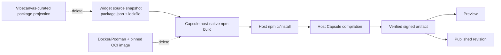

# S114 - widgets: remove OCI builds after Capsule host-native npm release

[Overview](../BASED.md)

Replace Vibecanvas's Docker/Podman Capsule build boundary with Capsule's next
host-native npm-project build API, make each guest widget's `package.json` and
lockfile authoritative for its dependencies, and delete the OCI-specific
runtime, configuration, prerequisite, and test infrastructure.

## Status

Blocked on the next Capsule release implementing:

- `/Users/omarezzat/Workspace/vibecanvas/capsule/tasks/s/S5.md`
  (`build: remove OCI as a prerequisite for npm-project builds`).

Do not implement a private Vibecanvas substitute while that public Capsule
contract is unavailable.

## Context

Vibecanvas currently builds widget UI source through
[`WidgetCapsuleOciBuild.ts`](../../apps/cli/src/services/WidgetCapsuleOciBuild.ts).
The service requires a pinned Docker or Podman executable, a running daemon, and
an exact OCI image. Startup probes those prerequisites, the production adapter
constructs a host-curated dependency projection, and the final acceptance suite
verifies the networkless OCI worker.

This is no longer the desired product model:

- Docker, Podman, and OCI must not be required for widget creation, validation,
  Preview, or publication.
- npm is assumed to be installed on the host server.
- each guest widget owns its `package.json`, lockfile, source, CSS, assets, and
  ordinary npm dependency selection;
- Capsule installs and builds the npm project directly on the host server;
- the published result remains a verified, immutable, self-contained Capsule
  artifact.

The Capsule host-native workflow is intentionally not an OS hostile-input
sandbox. Vibecanvas must document that trust-model change rather than retaining
OCI language or implying equivalent isolation.

## External prerequisite contract

Pin a Capsule version only after its public package provides and documents all
of the following:

1. One host-native npm-project build API accepting normalized source,
   `package.json`, lockfile, entry, target, capability/channel declarations,
   budgets, and build policy.
2. Host execution of installed npm with explicit `npm ci` and draft
   `npm install` behavior.
3. Resolution of the installed `node_modules` graph, including ordinary package
   metadata, duplicate transitive versions, CSS, and supported static assets.
4. A returned final lockfile for draft installs and frozen-lock behavior for
   Preview/release builds.
5. Stable install, lock, resolution, unsupported-package, native-addon,
   lifecycle-script, compiler, timeout, cancellation, and cleanup diagnostics.
6. Build identity binding source, lockfile, npm identity/policy, installed
   dependency bytes, Capsule toolchain, and build policy.
7. Verified self-contained artifact output through the existing Capsule
   artifact/signing contract.
8. Private temporary project ownership, process-tree cancellation, bounded
   output, and deterministic cleanup on every terminal path.
9. Explicit documentation that host-native npm execution is not a hostile-code
   isolation boundary and OCI is optional.

Stop and keep this task blocked if the released public API omits any required
behavior. Do not import Capsule-private paths or infer guarantees from its
implementation.

## Target architecture

## Plan

### 1. Pin and verify the Capsule release

- Upgrade `@omnidraw/capsule` to the first immutable release satisfying the
  prerequisite contract.
- Record version, source commit, package artifact, and integrity.
- Read the public guide and host-native build contract.
- Add a package-boundary test proving Vibecanvas consumes only public Capsule
  exports.
- Port Capsule's host-native npm example into a focused Vibecanvas integration
  test before deleting the existing builder.

### 2. Make widget npm projects authoritative

- Require guest `package.json` and a supported lockfile in the captured source
  contract.
- Let draft dependency edits run through Capsule's host-native draft install and
  persist the returned lockfile atomically with the source mutation.
- Use frozen-lock host builds for validation, Preview, and publication.
- Pass the exact captured source revision, package manifest, lockfile, target,
  capabilities, channels, budgets, and policy to Capsule.
- Keep the Vibecanvas SDK/intrinsic package boundary required by Capsule without
  maintaining a general allowlist of guest npm packages.
- Remove the fixed React/Zod/package metadata projection once the Capsule API
  resolves the guest-owned installed graph.

### 3. Replace the production compiler port

- Replace `createWidgetCapsuleOciBuild` in CLI composition with Capsule's
  host-native npm-project builder.
- Preserve exact-revision validation, Preview signing, release signing,
  publication atomicity, artifact verification, and rollback.
- Map Capsule's install/resolution/build diagnostics into the existing bounded
  widget validation result.
- Assume npm is installed, but add a direct actionable npm prerequisite error
  if the executable is missing or unusable.
- Ensure cancellation, timeout, child-process termination, and temporary-project
  cleanup survive service shutdown and failed builds.

### 4. Delete OCI-specific infrastructure

- Delete `WidgetCapsuleOciBuild.ts` and its OCI authority/engine-selection
  helpers.
- Delete Docker/Podman executable hashes, image IDs, engine environment
  variables, daemon/image probes, and startup warnings.
- Delete OCI scratch-home, limits, runner-composition, and image-identity tests.
- Delete or replace `scripts/verify-widget-capsule-oci-build.ts`.
- Remove OCI acceptance commands from package scripts, final acceptance, and
  documentation.
- Remove Docker/Podman widget-building instructions and troubleshooting.
- Remove dependencies and exports used only by the OCI build runner when no
  other consumer remains.

### 5. Add host-native npm regressions

- Build a plain DOM project with a guest-selected npm dependency.
- Build the React/theme/CSS Hello World project with its own manifest and frozen
  lockfile.
- Exercise a transitive dependency, duplicate installed versions, peer/optional
  dependency behavior, package CSS, and supported static assets.
- Cover lock mismatch, install failure, lifecycle-script failure, native addon,
  unsupported Node import, compiler failure, timeout, cancellation, and cleanup.
- Prove Preview and publish use identical source/lock/npm/Capsule identities.
- Prove the normal workflow never invokes Docker or Podman.

### 6. Update the product contract

- Update widget-system and Capsule integration documentation to describe
  host-native npm builds.
- State explicitly that dependency installation and compilation execute with
  the build-server account's host authority.
- Document npm/lockfile prerequisites and recovery actions.
- Regenerate repository indexes and run the complete widget, authoring,
  publication, browser-host, package-boundary, and release gates.

## TODOS

- [ ] Capsule S5 is implemented, released, and publicly documented.
- [ ] Pin and verify the qualifying Capsule release.
- [ ] Add a public-API host-native npm integration proof.
- [ ] Make guest `package.json` and lockfile authoritative build inputs.
- [ ] Persist draft install lockfile changes atomically.
- [ ] Replace the OCI compiler port with Capsule's host-native npm builder.
- [ ] Preserve exact-revision validation, Preview, publication, and signing.
- [ ] Replace fixed guest dependency projections with installed npm resolution.
- [ ] Add actionable npm prerequisite and build diagnostics.
- [ ] Delete Docker/Podman/OCI configuration, probes, builders, and tests.
- [ ] Delete the OCI acceptance script and documentation.
- [ ] Remove now-unused OCI runner dependencies and exports.
- [ ] Add accepted host-native npm project regressions.
- [ ] Add install, lock, compatibility, timeout, cancellation, and cleanup tests.
- [ ] Prove no normal widget build invokes Docker or Podman.
- [ ] Update documentation, indexes, final acceptance, and release evidence.

## Acceptance criteria

- Widget validation, Preview, and publication require npm but not Docker,
  Podman, an OCI image, or a container daemon.
- A guest widget selects ordinary npm dependencies through its own
  `package.json` and frozen lockfile.
- Vibecanvas does not construct a general host-curated allowlist/projection for
  guest dependencies.
- Capsule installs and compiles the project on the host and returns the same
  verified self-contained artifact contract used by the browser runtime.
- Preview and publication remain pinned to one exact source, lockfile,
  dependency, npm, Capsule, and build-policy identity.
- Every obsolete OCI code path, configuration key, prerequisite warning, test,
  script, dependency, and documentation reference is removed.
- Tests prove Docker/Podman are never invoked by the normal widget workflow.
- Documentation accurately states that host-native npm execution is not an OS
  hostile-input sandbox.

## NOTES

- This task replaces E39 and E40 with one implementation task.
- It is blocked on a released Capsule API, not merely an uncommitted adjacent
  repository change.
- No mockup image is useful. The change removes a build dependency and transfers
  responsibility between server components without changing the intended UI.

### LOGS

- 2026-07-26: Created from the decision to remove the Docker/OCI dependency,
  assume host npm, and let guest widgets build their own package projects after
  Capsule S5 is released.

---
